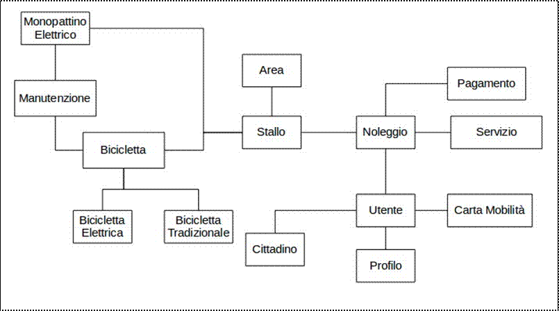
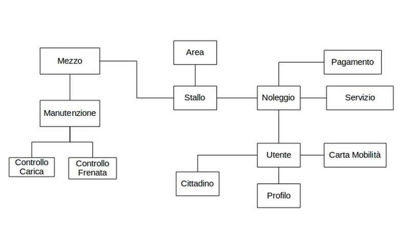
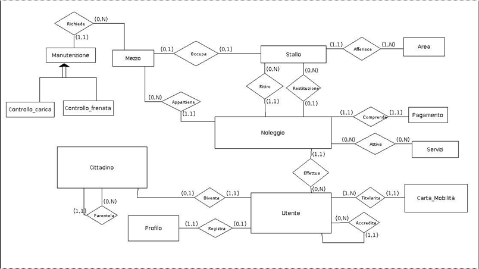
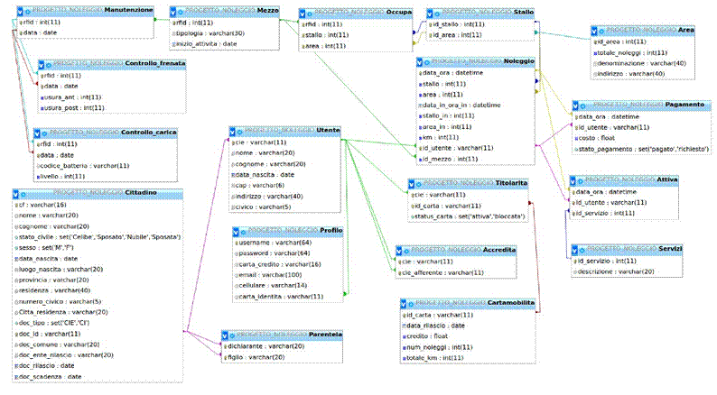
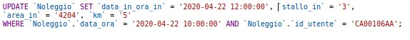
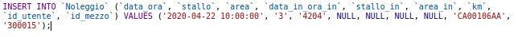
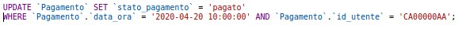

<html xmlns:v="urn:schemas-microsoft-com:vml"
xmlns:o="urn:schemas-microsoft-com:office:office"
xmlns:w="urn:schemas-microsoft-com:office:word"
xmlns:m="http://schemas.microsoft.com/office/2004/12/omml"
xmlns="http://www.w3.org/TR/REC-html40">

<head>
<meta http-equiv=Content-Type content="text/html; charset=windows-1252">
<meta name=ProgId content=Word.Document>
<meta name=Generator content="Microsoft Word 15">
<meta name=Originator content="Microsoft Word 15">
<link rel=File-List href="Progetto_Database_file/filelist.xml">
<link rel=Edit-Time-Data href="Progetto_Database_file/editdata.mso">
<!--[if !mso]>

<![endif]--><!--[if gte mso 9]><xml>
 <o:DocumentProperties>
  <o:Author>salvatore allegra</o:Author>
  <o:LastAuthor>salvatore allegra</o:LastAuthor>
  <o:Revision>2</o:Revision>
  <o:TotalTime>3</o:TotalTime>
  <o:Created>2025-02-19T12:57:00Z</o:Created>
  <o:LastSaved>2025-02-19T12:57:00Z</o:LastSaved>
  <o:Pages>1</o:Pages>
  <o:Words>4740</o:Words>
  <o:Characters>27022</o:Characters>
  <o:Lines>225</o:Lines>
  <o:Paragraphs>63</o:Paragraphs>
  <o:CharactersWithSpaces>31699</o:CharactersWithSpaces>
  <o:Version>16.00</o:Version>
 </o:DocumentProperties>
</xml><![endif]-->
<link rel=themeData href="Progetto_Database_file/themedata.thmx">
<link rel=colorSchemeMapping
href="Progetto_Database_file/colorschememapping.xml">
<!--[if gte mso 9]><xml>
 <w:WordDocument>
  <w:SpellingState>Clean</w:SpellingState>
  <w:GrammarState>Clean</w:GrammarState>
  <w:TrackMoves>false</w:TrackMoves>
  <w:TrackFormatting/>
  <w:HyphenationZone>14</w:HyphenationZone>
  <w:PunctuationKerning/>
  <w:ValidateAgainstSchemas/>
  <w:SaveIfXMLInvalid>false</w:SaveIfXMLInvalid>
  <w:IgnoreMixedContent>false</w:IgnoreMixedContent>
  <w:AlwaysShowPlaceholderText>false</w:AlwaysShowPlaceholderText>
  <w:DoNotPromoteQF/>
  <w:LidThemeOther>IT</w:LidThemeOther>
  <w:LidThemeAsian>X-NONE</w:LidThemeAsian>
  <w:LidThemeComplexScript>X-NONE</w:LidThemeComplexScript>
  <w:Compatibility>
   <w:BreakWrappedTables/>
   <w:SnapToGridInCell/>
   <w:WrapTextWithPunct/>
   <w:UseAsianBreakRules/>
   <w:DontGrowAutofit/>
   <w:SplitPgBreakAndParaMark/>
   <w:EnableOpenTypeKerning/>
   <w:DontFlipMirrorIndents/>
   <w:OverrideTableStyleHps/>
   <w:UseFELayout/>
  </w:Compatibility>
  <w:DoNotOptimizeForBrowser/>
  <m:mathPr>
   <m:mathFont m:val="Cambria Math"/>
   <m:brkBin m:val="before"/>
   <m:brkBinSub m:val="&#45;-"/>
   <m:smallFrac m:val="off"/>
   <m:dispDef/>
   <m:lMargin m:val="0"/>
   <m:rMargin m:val="0"/>
   <m:defJc m:val="centerGroup"/>
   <m:wrapIndent m:val="1440"/>
   <m:intLim m:val="subSup"/>
   <m:naryLim m:val="undOvr"/>
  </m:mathPr></w:WordDocument>
</xml><![endif]--><!--[if gte mso 9]><xml>
 <w:LatentStyles DefLockedState="false" DefUnhideWhenUsed="false"
  DefSemiHidden="false" DefQFormat="false" DefPriority="99"
  LatentStyleCount="376">
  <w:LsdException Locked="false" Priority="0" QFormat="true" Name="Normal"/>
  <w:LsdException Locked="false" Priority="9" QFormat="true" Name="heading 1"/>
  <w:LsdException Locked="false" Priority="9" SemiHidden="true"
   UnhideWhenUsed="true" QFormat="true" Name="heading 2"/>
  <w:LsdException Locked="false" Priority="9" SemiHidden="true"
   UnhideWhenUsed="true" QFormat="true" Name="heading 3"/>
  <w:LsdException Locked="false" Priority="9" SemiHidden="true"
   UnhideWhenUsed="true" QFormat="true" Name="heading 4"/>
  <w:LsdException Locked="false" Priority="9" SemiHidden="true"
   UnhideWhenUsed="true" QFormat="true" Name="heading 5"/>
  <w:LsdException Locked="false" Priority="9" SemiHidden="true"
   UnhideWhenUsed="true" QFormat="true" Name="heading 6"/>
  <w:LsdException Locked="false" Priority="9" SemiHidden="true"
   UnhideWhenUsed="true" QFormat="true" Name="heading 7"/>
  <w:LsdException Locked="false" Priority="9" SemiHidden="true"
   UnhideWhenUsed="true" QFormat="true" Name="heading 8"/>
  <w:LsdException Locked="false" Priority="9" SemiHidden="true"
   UnhideWhenUsed="true" QFormat="true" Name="heading 9"/>
  <w:LsdException Locked="false" SemiHidden="true" UnhideWhenUsed="true"
   Name="index 1"/>
  <w:LsdException Locked="false" SemiHidden="true" UnhideWhenUsed="true"
   Name="index 2"/>
  <w:LsdException Locked="false" SemiHidden="true" UnhideWhenUsed="true"
   Name="index 3"/>
  <w:LsdException Locked="false" SemiHidden="true" UnhideWhenUsed="true"
   Name="index 4"/>
  <w:LsdException Locked="false" SemiHidden="true" UnhideWhenUsed="true"
   Name="index 5"/>
  <w:LsdException Locked="false" SemiHidden="true" UnhideWhenUsed="true"
   Name="index 6"/>
  <w:LsdException Locked="false" SemiHidden="true" UnhideWhenUsed="true"
   Name="index 7"/>
  <w:LsdException Locked="false" SemiHidden="true" UnhideWhenUsed="true"
   Name="index 8"/>
  <w:LsdException Locked="false" SemiHidden="true" UnhideWhenUsed="true"
   Name="index 9"/>
  <w:LsdException Locked="false" Priority="39" SemiHidden="true"
   UnhideWhenUsed="true" Name="toc 1"/>
  <w:LsdException Locked="false" Priority="39" SemiHidden="true"
   UnhideWhenUsed="true" Name="toc 2"/>
  <w:LsdException Locked="false" Priority="39" SemiHidden="true"
   UnhideWhenUsed="true" Name="toc 3"/>
  <w:LsdException Locked="false" Priority="39" SemiHidden="true"
   UnhideWhenUsed="true" Name="toc 4"/>
  <w:LsdException Locked="false" Priority="39" SemiHidden="true"
   UnhideWhenUsed="true" Name="toc 5"/>
  <w:LsdException Locked="false" Priority="39" SemiHidden="true"
   UnhideWhenUsed="true" Name="toc 6"/>
  <w:LsdException Locked="false" Priority="39" SemiHidden="true"
   UnhideWhenUsed="true" Name="toc 7"/>
  <w:LsdException Locked="false" Priority="39" SemiHidden="true"
   UnhideWhenUsed="true" Name="toc 8"/>
  <w:LsdException Locked="false" Priority="39" SemiHidden="true"
   UnhideWhenUsed="true" Name="toc 9"/>
  <w:LsdException Locked="false" SemiHidden="true" UnhideWhenUsed="true"
   Name="Normal Indent"/>
  <w:LsdException Locked="false" SemiHidden="true" UnhideWhenUsed="true"
   Name="footnote text"/>
  <w:LsdException Locked="false" SemiHidden="true" UnhideWhenUsed="true"
   Name="annotation text"/>
  <w:LsdException Locked="false" SemiHidden="true" UnhideWhenUsed="true"
   Name="header"/>
  <w:LsdException Locked="false" SemiHidden="true" UnhideWhenUsed="true"
   Name="footer"/>
  <w:LsdException Locked="false" SemiHidden="true" UnhideWhenUsed="true"
   Name="index heading"/>
  <w:LsdException Locked="false" Priority="35" SemiHidden="true"
   UnhideWhenUsed="true" QFormat="true" Name="caption"/>
  <w:LsdException Locked="false" SemiHidden="true" UnhideWhenUsed="true"
   Name="table of figures"/>
  <w:LsdException Locked="false" SemiHidden="true" UnhideWhenUsed="true"
   Name="envelope address"/>
  <w:LsdException Locked="false" SemiHidden="true" UnhideWhenUsed="true"
   Name="envelope return"/>
  <w:LsdException Locked="false" SemiHidden="true" UnhideWhenUsed="true"
   Name="footnote reference"/>
  <w:LsdException Locked="false" SemiHidden="true" UnhideWhenUsed="true"
   Name="annotation reference"/>
  <w:LsdException Locked="false" SemiHidden="true" UnhideWhenUsed="true"
   Name="line number"/>
  <w:LsdException Locked="false" SemiHidden="true" UnhideWhenUsed="true"
   Name="page number"/>
  <w:LsdException Locked="false" SemiHidden="true" UnhideWhenUsed="true"
   Name="endnote reference"/>
  <w:LsdException Locked="false" SemiHidden="true" UnhideWhenUsed="true"
   Name="endnote text"/>
  <w:LsdException Locked="false" SemiHidden="true" UnhideWhenUsed="true"
   Name="table of authorities"/>
  <w:LsdException Locked="false" SemiHidden="true" UnhideWhenUsed="true"
   Name="macro"/>
  <w:LsdException Locked="false" SemiHidden="true" UnhideWhenUsed="true"
   Name="toa heading"/>
  <w:LsdException Locked="false" SemiHidden="true" UnhideWhenUsed="true"
   Name="List"/>
  <w:LsdException Locked="false" SemiHidden="true" UnhideWhenUsed="true"
   Name="List Bullet"/>
  <w:LsdException Locked="false" SemiHidden="true" UnhideWhenUsed="true"
   Name="List Number"/>
  <w:LsdException Locked="false" SemiHidden="true" UnhideWhenUsed="true"
   Name="List 2"/>
  <w:LsdException Locked="false" SemiHidden="true" UnhideWhenUsed="true"
   Name="List 3"/>
  <w:LsdException Locked="false" SemiHidden="true" UnhideWhenUsed="true"
   Name="List 4"/>
  <w:LsdException Locked="false" SemiHidden="true" UnhideWhenUsed="true"
   Name="List 5"/>
  <w:LsdException Locked="false" SemiHidden="true" UnhideWhenUsed="true"
   Name="List Bullet 2"/>
  <w:LsdException Locked="false" SemiHidden="true" UnhideWhenUsed="true"
   Name="List Bullet 3"/>
  <w:LsdException Locked="false" SemiHidden="true" UnhideWhenUsed="true"
   Name="List Bullet 4"/>
  <w:LsdException Locked="false" SemiHidden="true" UnhideWhenUsed="true"
   Name="List Bullet 5"/>
  <w:LsdException Locked="false" SemiHidden="true" UnhideWhenUsed="true"
   Name="List Number 2"/>
  <w:LsdException Locked="false" SemiHidden="true" UnhideWhenUsed="true"
   Name="List Number 3"/>
  <w:LsdException Locked="false" SemiHidden="true" UnhideWhenUsed="true"
   Name="List Number 4"/>
  <w:LsdException Locked="false" SemiHidden="true" UnhideWhenUsed="true"
   Name="List Number 5"/>
  <w:LsdException Locked="false" Priority="10" QFormat="true" Name="Title"/>
  <w:LsdException Locked="false" SemiHidden="true" UnhideWhenUsed="true"
   Name="Closing"/>
  <w:LsdException Locked="false" SemiHidden="true" UnhideWhenUsed="true"
   Name="Signature"/>
  <w:LsdException Locked="false" Priority="1" SemiHidden="true"
   UnhideWhenUsed="true" Name="Default Paragraph Font"/>
  <w:LsdException Locked="false" SemiHidden="true" UnhideWhenUsed="true"
   Name="Body Text"/>
  <w:LsdException Locked="false" SemiHidden="true" UnhideWhenUsed="true"
   Name="Body Text Indent"/>
  <w:LsdException Locked="false" SemiHidden="true" UnhideWhenUsed="true"
   Name="List Continue"/>
  <w:LsdException Locked="false" SemiHidden="true" UnhideWhenUsed="true"
   Name="List Continue 2"/>
  <w:LsdException Locked="false" SemiHidden="true" UnhideWhenUsed="true"
   Name="List Continue 3"/>
  <w:LsdException Locked="false" SemiHidden="true" UnhideWhenUsed="true"
   Name="List Continue 4"/>
  <w:LsdException Locked="false" SemiHidden="true" UnhideWhenUsed="true"
   Name="List Continue 5"/>
  <w:LsdException Locked="false" SemiHidden="true" UnhideWhenUsed="true"
   Name="Message Header"/>
  <w:LsdException Locked="false" Priority="11" QFormat="true" Name="Subtitle"/>
  <w:LsdException Locked="false" SemiHidden="true" UnhideWhenUsed="true"
   Name="Salutation"/>
  <w:LsdException Locked="false" SemiHidden="true" UnhideWhenUsed="true"
   Name="Date"/>
  <w:LsdException Locked="false" SemiHidden="true" UnhideWhenUsed="true"
   Name="Body Text First Indent"/>
  <w:LsdException Locked="false" SemiHidden="true" UnhideWhenUsed="true"
   Name="Body Text First Indent 2"/>
  <w:LsdException Locked="false" SemiHidden="true" UnhideWhenUsed="true"
   Name="Note Heading"/>
  <w:LsdException Locked="false" SemiHidden="true" UnhideWhenUsed="true"
   Name="Body Text 2"/>
  <w:LsdException Locked="false" SemiHidden="true" UnhideWhenUsed="true"
   Name="Body Text 3"/>
  <w:LsdException Locked="false" SemiHidden="true" UnhideWhenUsed="true"
   Name="Body Text Indent 2"/>
  <w:LsdException Locked="false" SemiHidden="true" UnhideWhenUsed="true"
   Name="Body Text Indent 3"/>
  <w:LsdException Locked="false" SemiHidden="true" UnhideWhenUsed="true"
   Name="Block Text"/>
  <w:LsdException Locked="false" SemiHidden="true" UnhideWhenUsed="true"
   Name="Hyperlink"/>
  <w:LsdException Locked="false" SemiHidden="true" UnhideWhenUsed="true"
   Name="FollowedHyperlink"/>
  <w:LsdException Locked="false" Priority="22" QFormat="true" Name="Strong"/>
  <w:LsdException Locked="false" Priority="20" QFormat="true" Name="Emphasis"/>
  <w:LsdException Locked="false" SemiHidden="true" UnhideWhenUsed="true"
   Name="Document Map"/>
  <w:LsdException Locked="false" SemiHidden="true" UnhideWhenUsed="true"
   Name="Plain Text"/>
  <w:LsdException Locked="false" SemiHidden="true" UnhideWhenUsed="true"
   Name="E-mail Signature"/>
  <w:LsdException Locked="false" SemiHidden="true" UnhideWhenUsed="true"
   Name="HTML Top of Form"/>
  <w:LsdException Locked="false" SemiHidden="true" UnhideWhenUsed="true"
   Name="HTML Bottom of Form"/>
  <w:LsdException Locked="false" SemiHidden="true" UnhideWhenUsed="true"
   Name="Normal (Web)"/>
  <w:LsdException Locked="false" SemiHidden="true" UnhideWhenUsed="true"
   Name="HTML Acronym"/>
  <w:LsdException Locked="false" SemiHidden="true" UnhideWhenUsed="true"
   Name="HTML Address"/>
  <w:LsdException Locked="false" SemiHidden="true" UnhideWhenUsed="true"
   Name="HTML Cite"/>
  <w:LsdException Locked="false" SemiHidden="true" UnhideWhenUsed="true"
   Name="HTML Code"/>
  <w:LsdException Locked="false" SemiHidden="true" UnhideWhenUsed="true"
   Name="HTML Definition"/>
  <w:LsdException Locked="false" SemiHidden="true" UnhideWhenUsed="true"
   Name="HTML Keyboard"/>
  <w:LsdException Locked="false" SemiHidden="true" UnhideWhenUsed="true"
   Name="HTML Preformatted"/>
  <w:LsdException Locked="false" SemiHidden="true" UnhideWhenUsed="true"
   Name="HTML Sample"/>
  <w:LsdException Locked="false" SemiHidden="true" UnhideWhenUsed="true"
   Name="HTML Typewriter"/>
  <w:LsdException Locked="false" SemiHidden="true" UnhideWhenUsed="true"
   Name="HTML Variable"/>
  <w:LsdException Locked="false" SemiHidden="true" UnhideWhenUsed="true"
   Name="Normal Table"/>
  <w:LsdException Locked="false" SemiHidden="true" UnhideWhenUsed="true"
   Name="annotation subject"/>
  <w:LsdException Locked="false" SemiHidden="true" UnhideWhenUsed="true"
   Name="No List"/>
  <w:LsdException Locked="false" SemiHidden="true" UnhideWhenUsed="true"
   Name="Outline List 1"/>
  <w:LsdException Locked="false" SemiHidden="true" UnhideWhenUsed="true"
   Name="Outline List 2"/>
  <w:LsdException Locked="false" SemiHidden="true" UnhideWhenUsed="true"
   Name="Outline List 3"/>
  <w:LsdException Locked="false" SemiHidden="true" UnhideWhenUsed="true"
   Name="Table Simple 1"/>
  <w:LsdException Locked="false" SemiHidden="true" UnhideWhenUsed="true"
   Name="Table Simple 2"/>
  <w:LsdException Locked="false" SemiHidden="true" UnhideWhenUsed="true"
   Name="Table Simple 3"/>
  <w:LsdException Locked="false" SemiHidden="true" UnhideWhenUsed="true"
   Name="Table Classic 1"/>
  <w:LsdException Locked="false" SemiHidden="true" UnhideWhenUsed="true"
   Name="Table Classic 2"/>
  <w:LsdException Locked="false" SemiHidden="true" UnhideWhenUsed="true"
   Name="Table Classic 3"/>
  <w:LsdException Locked="false" SemiHidden="true" UnhideWhenUsed="true"
   Name="Table Classic 4"/>
  <w:LsdException Locked="false" SemiHidden="true" UnhideWhenUsed="true"
   Name="Table Colorful 1"/>
  <w:LsdException Locked="false" SemiHidden="true" UnhideWhenUsed="true"
   Name="Table Colorful 2"/>
  <w:LsdException Locked="false" SemiHidden="true" UnhideWhenUsed="true"
   Name="Table Colorful 3"/>
  <w:LsdException Locked="false" SemiHidden="true" UnhideWhenUsed="true"
   Name="Table Columns 1"/>
  <w:LsdException Locked="false" SemiHidden="true" UnhideWhenUsed="true"
   Name="Table Columns 2"/>
  <w:LsdException Locked="false" SemiHidden="true" UnhideWhenUsed="true"
   Name="Table Columns 3"/>
  <w:LsdException Locked="false" SemiHidden="true" UnhideWhenUsed="true"
   Name="Table Columns 4"/>
  <w:LsdException Locked="false" SemiHidden="true" UnhideWhenUsed="true"
   Name="Table Columns 5"/>
  <w:LsdException Locked="false" SemiHidden="true" UnhideWhenUsed="true"
   Name="Table Grid 1"/>
  <w:LsdException Locked="false" SemiHidden="true" UnhideWhenUsed="true"
   Name="Table Grid 2"/>
  <w:LsdException Locked="false" SemiHidden="true" UnhideWhenUsed="true"
   Name="Table Grid 3"/>
  <w:LsdException Locked="false" SemiHidden="true" UnhideWhenUsed="true"
   Name="Table Grid 4"/>
  <w:LsdException Locked="false" SemiHidden="true" UnhideWhenUsed="true"
   Name="Table Grid 5"/>
  <w:LsdException Locked="false" SemiHidden="true" UnhideWhenUsed="true"
   Name="Table Grid 6"/>
  <w:LsdException Locked="false" SemiHidden="true" UnhideWhenUsed="true"
   Name="Table Grid 7"/>
  <w:LsdException Locked="false" SemiHidden="true" UnhideWhenUsed="true"
   Name="Table Grid 8"/>
  <w:LsdException Locked="false" SemiHidden="true" UnhideWhenUsed="true"
   Name="Table List 1"/>
  <w:LsdException Locked="false" SemiHidden="true" UnhideWhenUsed="true"
   Name="Table List 2"/>
  <w:LsdException Locked="false" SemiHidden="true" UnhideWhenUsed="true"
   Name="Table List 3"/>
  <w:LsdException Locked="false" SemiHidden="true" UnhideWhenUsed="true"
   Name="Table List 4"/>
  <w:LsdException Locked="false" SemiHidden="true" UnhideWhenUsed="true"
   Name="Table List 5"/>
  <w:LsdException Locked="false" SemiHidden="true" UnhideWhenUsed="true"
   Name="Table List 6"/>
  <w:LsdException Locked="false" SemiHidden="true" UnhideWhenUsed="true"
   Name="Table List 7"/>
  <w:LsdException Locked="false" SemiHidden="true" UnhideWhenUsed="true"
   Name="Table List 8"/>
  <w:LsdException Locked="false" SemiHidden="true" UnhideWhenUsed="true"
   Name="Table 3D effects 1"/>
  <w:LsdException Locked="false" SemiHidden="true" UnhideWhenUsed="true"
   Name="Table 3D effects 2"/>
  <w:LsdException Locked="false" SemiHidden="true" UnhideWhenUsed="true"
   Name="Table 3D effects 3"/>
  <w:LsdException Locked="false" SemiHidden="true" UnhideWhenUsed="true"
   Name="Table Contemporary"/>
  <w:LsdException Locked="false" SemiHidden="true" UnhideWhenUsed="true"
   Name="Table Elegant"/>
  <w:LsdException Locked="false" SemiHidden="true" UnhideWhenUsed="true"
   Name="Table Professional"/>
  <w:LsdException Locked="false" SemiHidden="true" UnhideWhenUsed="true"
   Name="Table Subtle 1"/>
  <w:LsdException Locked="false" SemiHidden="true" UnhideWhenUsed="true"
   Name="Table Subtle 2"/>
  <w:LsdException Locked="false" SemiHidden="true" UnhideWhenUsed="true"
   Name="Table Web 1"/>
  <w:LsdException Locked="false" SemiHidden="true" UnhideWhenUsed="true"
   Name="Table Web 2"/>
  <w:LsdException Locked="false" SemiHidden="true" UnhideWhenUsed="true"
   Name="Table Web 3"/>
  <w:LsdException Locked="false" SemiHidden="true" UnhideWhenUsed="true"
   Name="Balloon Text"/>
  <w:LsdException Locked="false" Priority="39" Name="Table Grid"/>
  <w:LsdException Locked="false" SemiHidden="true" UnhideWhenUsed="true"
   Name="Table Theme"/>
  <w:LsdException Locked="false" SemiHidden="true" Name="Placeholder Text"/>
  <w:LsdException Locked="false" Priority="1" QFormat="true" Name="No Spacing"/>
  <w:LsdException Locked="false" Priority="60" Name="Light Shading"/>
  <w:LsdException Locked="false" Priority="61" Name="Light List"/>
  <w:LsdException Locked="false" Priority="62" Name="Light Grid"/>
  <w:LsdException Locked="false" Priority="63" Name="Medium Shading 1"/>
  <w:LsdException Locked="false" Priority="64" Name="Medium Shading 2"/>
  <w:LsdException Locked="false" Priority="65" Name="Medium List 1"/>
  <w:LsdException Locked="false" Priority="66" Name="Medium List 2"/>
  <w:LsdException Locked="false" Priority="67" Name="Medium Grid 1"/>
  <w:LsdException Locked="false" Priority="68" Name="Medium Grid 2"/>
  <w:LsdException Locked="false" Priority="69" Name="Medium Grid 3"/>
  <w:LsdException Locked="false" Priority="70" Name="Dark List"/>
  <w:LsdException Locked="false" Priority="71" Name="Colorful Shading"/>
  <w:LsdException Locked="false" Priority="72" Name="Colorful List"/>
  <w:LsdException Locked="false" Priority="73" Name="Colorful Grid"/>
  <w:LsdException Locked="false" Priority="60" Name="Light Shading Accent 1"/>
  <w:LsdException Locked="false" Priority="61" Name="Light List Accent 1"/>
  <w:LsdException Locked="false" Priority="62" Name="Light Grid Accent 1"/>
  <w:LsdException Locked="false" Priority="63" Name="Medium Shading 1 Accent 1"/>
  <w:LsdException Locked="false" Priority="64" Name="Medium Shading 2 Accent 1"/>
  <w:LsdException Locked="false" Priority="65" Name="Medium List 1 Accent 1"/>
  <w:LsdException Locked="false" SemiHidden="true" Name="Revision"/>
  <w:LsdException Locked="false" Priority="34" QFormat="true"
   Name="List Paragraph"/>
  <w:LsdException Locked="false" Priority="29" QFormat="true" Name="Quote"/>
  <w:LsdException Locked="false" Priority="30" QFormat="true"
   Name="Intense Quote"/>
  <w:LsdException Locked="false" Priority="66" Name="Medium List 2 Accent 1"/>
  <w:LsdException Locked="false" Priority="67" Name="Medium Grid 1 Accent 1"/>
  <w:LsdException Locked="false" Priority="68" Name="Medium Grid 2 Accent 1"/>
  <w:LsdException Locked="false" Priority="69" Name="Medium Grid 3 Accent 1"/>
  <w:LsdException Locked="false" Priority="70" Name="Dark List Accent 1"/>
  <w:LsdException Locked="false" Priority="71" Name="Colorful Shading Accent 1"/>
  <w:LsdException Locked="false" Priority="72" Name="Colorful List Accent 1"/>
  <w:LsdException Locked="false" Priority="73" Name="Colorful Grid Accent 1"/>
  <w:LsdException Locked="false" Priority="60" Name="Light Shading Accent 2"/>
  <w:LsdException Locked="false" Priority="61" Name="Light List Accent 2"/>
  <w:LsdException Locked="false" Priority="62" Name="Light Grid Accent 2"/>
  <w:LsdException Locked="false" Priority="63" Name="Medium Shading 1 Accent 2"/>
  <w:LsdException Locked="false" Priority="64" Name="Medium Shading 2 Accent 2"/>
  <w:LsdException Locked="false" Priority="65" Name="Medium List 1 Accent 2"/>
  <w:LsdException Locked="false" Priority="66" Name="Medium List 2 Accent 2"/>
  <w:LsdException Locked="false" Priority="67" Name="Medium Grid 1 Accent 2"/>
  <w:LsdException Locked="false" Priority="68" Name="Medium Grid 2 Accent 2"/>
  <w:LsdException Locked="false" Priority="69" Name="Medium Grid 3 Accent 2"/>
  <w:LsdException Locked="false" Priority="70" Name="Dark List Accent 2"/>
  <w:LsdException Locked="false" Priority="71" Name="Colorful Shading Accent 2"/>
  <w:LsdException Locked="false" Priority="72" Name="Colorful List Accent 2"/>
  <w:LsdException Locked="false" Priority="73" Name="Colorful Grid Accent 2"/>
  <w:LsdException Locked="false" Priority="60" Name="Light Shading Accent 3"/>
  <w:LsdException Locked="false" Priority="61" Name="Light List Accent 3"/>
  <w:LsdException Locked="false" Priority="62" Name="Light Grid Accent 3"/>
  <w:LsdException Locked="false" Priority="63" Name="Medium Shading 1 Accent 3"/>
  <w:LsdException Locked="false" Priority="64" Name="Medium Shading 2 Accent 3"/>
  <w:LsdException Locked="false" Priority="65" Name="Medium List 1 Accent 3"/>
  <w:LsdException Locked="false" Priority="66" Name="Medium List 2 Accent 3"/>
  <w:LsdException Locked="false" Priority="67" Name="Medium Grid 1 Accent 3"/>
  <w:LsdException Locked="false" Priority="68" Name="Medium Grid 2 Accent 3"/>
  <w:LsdException Locked="false" Priority="69" Name="Medium Grid 3 Accent 3"/>
  <w:LsdException Locked="false" Priority="70" Name="Dark List Accent 3"/>
  <w:LsdException Locked="false" Priority="71" Name="Colorful Shading Accent 3"/>
  <w:LsdException Locked="false" Priority="72" Name="Colorful List Accent 3"/>
  <w:LsdException Locked="false" Priority="73" Name="Colorful Grid Accent 3"/>
  <w:LsdException Locked="false" Priority="60" Name="Light Shading Accent 4"/>
  <w:LsdException Locked="false" Priority="61" Name="Light List Accent 4"/>
  <w:LsdException Locked="false" Priority="62" Name="Light Grid Accent 4"/>
  <w:LsdException Locked="false" Priority="63" Name="Medium Shading 1 Accent 4"/>
  <w:LsdException Locked="false" Priority="64" Name="Medium Shading 2 Accent 4"/>
  <w:LsdException Locked="false" Priority="65" Name="Medium List 1 Accent 4"/>
  <w:LsdException Locked="false" Priority="66" Name="Medium List 2 Accent 4"/>
  <w:LsdException Locked="false" Priority="67" Name="Medium Grid 1 Accent 4"/>
  <w:LsdException Locked="false" Priority="68" Name="Medium Grid 2 Accent 4"/>
  <w:LsdException Locked="false" Priority="69" Name="Medium Grid 3 Accent 4"/>
  <w:LsdException Locked="false" Priority="70" Name="Dark List Accent 4"/>
  <w:LsdException Locked="false" Priority="71" Name="Colorful Shading Accent 4"/>
  <w:LsdException Locked="false" Priority="72" Name="Colorful List Accent 4"/>
  <w:LsdException Locked="false" Priority="73" Name="Colorful Grid Accent 4"/>
  <w:LsdException Locked="false" Priority="60" Name="Light Shading Accent 5"/>
  <w:LsdException Locked="false" Priority="61" Name="Light List Accent 5"/>
  <w:LsdException Locked="false" Priority="62" Name="Light Grid Accent 5"/>
  <w:LsdException Locked="false" Priority="63" Name="Medium Shading 1 Accent 5"/>
  <w:LsdException Locked="false" Priority="64" Name="Medium Shading 2 Accent 5"/>
  <w:LsdException Locked="false" Priority="65" Name="Medium List 1 Accent 5"/>
  <w:LsdException Locked="false" Priority="66" Name="Medium List 2 Accent 5"/>
  <w:LsdException Locked="false" Priority="67" Name="Medium Grid 1 Accent 5"/>
  <w:LsdException Locked="false" Priority="68" Name="Medium Grid 2 Accent 5"/>
  <w:LsdException Locked="false" Priority="69" Name="Medium Grid 3 Accent 5"/>
  <w:LsdException Locked="false" Priority="70" Name="Dark List Accent 5"/>
  <w:LsdException Locked="false" Priority="71" Name="Colorful Shading Accent 5"/>
  <w:LsdException Locked="false" Priority="72" Name="Colorful List Accent 5"/>
  <w:LsdException Locked="false" Priority="73" Name="Colorful Grid Accent 5"/>
  <w:LsdException Locked="false" Priority="60" Name="Light Shading Accent 6"/>
  <w:LsdException Locked="false" Priority="61" Name="Light List Accent 6"/>
  <w:LsdException Locked="false" Priority="62" Name="Light Grid Accent 6"/>
  <w:LsdException Locked="false" Priority="63" Name="Medium Shading 1 Accent 6"/>
  <w:LsdException Locked="false" Priority="64" Name="Medium Shading 2 Accent 6"/>
  <w:LsdException Locked="false" Priority="65" Name="Medium List 1 Accent 6"/>
  <w:LsdException Locked="false" Priority="66" Name="Medium List 2 Accent 6"/>
  <w:LsdException Locked="false" Priority="67" Name="Medium Grid 1 Accent 6"/>
  <w:LsdException Locked="false" Priority="68" Name="Medium Grid 2 Accent 6"/>
  <w:LsdException Locked="false" Priority="69" Name="Medium Grid 3 Accent 6"/>
  <w:LsdException Locked="false" Priority="70" Name="Dark List Accent 6"/>
  <w:LsdException Locked="false" Priority="71" Name="Colorful Shading Accent 6"/>
  <w:LsdException Locked="false" Priority="72" Name="Colorful List Accent 6"/>
  <w:LsdException Locked="false" Priority="73" Name="Colorful Grid Accent 6"/>
  <w:LsdException Locked="false" Priority="19" QFormat="true"
   Name="Subtle Emphasis"/>
  <w:LsdException Locked="false" Priority="21" QFormat="true"
   Name="Intense Emphasis"/>
  <w:LsdException Locked="false" Priority="31" QFormat="true"
   Name="Subtle Reference"/>
  <w:LsdException Locked="false" Priority="32" QFormat="true"
   Name="Intense Reference"/>
  <w:LsdException Locked="false" Priority="33" QFormat="true" Name="Book Title"/>
  <w:LsdException Locked="false" Priority="37" SemiHidden="true"
   UnhideWhenUsed="true" Name="Bibliography"/>
  <w:LsdException Locked="false" Priority="39" SemiHidden="true"
   UnhideWhenUsed="true" QFormat="true" Name="TOC Heading"/>
  <w:LsdException Locked="false" Priority="41" Name="Plain Table 1"/>
  <w:LsdException Locked="false" Priority="42" Name="Plain Table 2"/>
  <w:LsdException Locked="false" Priority="43" Name="Plain Table 3"/>
  <w:LsdException Locked="false" Priority="44" Name="Plain Table 4"/>
  <w:LsdException Locked="false" Priority="45" Name="Plain Table 5"/>
  <w:LsdException Locked="false" Priority="40" Name="Grid Table Light"/>
  <w:LsdException Locked="false" Priority="46" Name="Grid Table 1 Light"/>
  <w:LsdException Locked="false" Priority="47" Name="Grid Table 2"/>
  <w:LsdException Locked="false" Priority="48" Name="Grid Table 3"/>
  <w:LsdException Locked="false" Priority="49" Name="Grid Table 4"/>
  <w:LsdException Locked="false" Priority="50" Name="Grid Table 5 Dark"/>
  <w:LsdException Locked="false" Priority="51" Name="Grid Table 6 Colorful"/>
  <w:LsdException Locked="false" Priority="52" Name="Grid Table 7 Colorful"/>
  <w:LsdException Locked="false" Priority="46"
   Name="Grid Table 1 Light Accent 1"/>
  <w:LsdException Locked="false" Priority="47" Name="Grid Table 2 Accent 1"/>
  <w:LsdException Locked="false" Priority="48" Name="Grid Table 3 Accent 1"/>
  <w:LsdException Locked="false" Priority="49" Name="Grid Table 4 Accent 1"/>
  <w:LsdException Locked="false" Priority="50" Name="Grid Table 5 Dark Accent 1"/>
  <w:LsdException Locked="false" Priority="51"
   Name="Grid Table 6 Colorful Accent 1"/>
  <w:LsdException Locked="false" Priority="52"
   Name="Grid Table 7 Colorful Accent 1"/>
  <w:LsdException Locked="false" Priority="46"
   Name="Grid Table 1 Light Accent 2"/>
  <w:LsdException Locked="false" Priority="47" Name="Grid Table 2 Accent 2"/>
  <w:LsdException Locked="false" Priority="48" Name="Grid Table 3 Accent 2"/>
  <w:LsdException Locked="false" Priority="49" Name="Grid Table 4 Accent 2"/>
  <w:LsdException Locked="false" Priority="50" Name="Grid Table 5 Dark Accent 2"/>
  <w:LsdException Locked="false" Priority="51"
   Name="Grid Table 6 Colorful Accent 2"/>
  <w:LsdException Locked="false" Priority="52"
   Name="Grid Table 7 Colorful Accent 2"/>
  <w:LsdException Locked="false" Priority="46"
   Name="Grid Table 1 Light Accent 3"/>
  <w:LsdException Locked="false" Priority="47" Name="Grid Table 2 Accent 3"/>
  <w:LsdException Locked="false" Priority="48" Name="Grid Table 3 Accent 3"/>
  <w:LsdException Locked="false" Priority="49" Name="Grid Table 4 Accent 3"/>
  <w:LsdException Locked="false" Priority="50" Name="Grid Table 5 Dark Accent 3"/>
  <w:LsdException Locked="false" Priority="51"
   Name="Grid Table 6 Colorful Accent 3"/>
  <w:LsdException Locked="false" Priority="52"
   Name="Grid Table 7 Colorful Accent 3"/>
  <w:LsdException Locked="false" Priority="46"
   Name="Grid Table 1 Light Accent 4"/>
  <w:LsdException Locked="false" Priority="47" Name="Grid Table 2 Accent 4"/>
  <w:LsdException Locked="false" Priority="48" Name="Grid Table 3 Accent 4"/>
  <w:LsdException Locked="false" Priority="49" Name="Grid Table 4 Accent 4"/>
  <w:LsdException Locked="false" Priority="50" Name="Grid Table 5 Dark Accent 4"/>
  <w:LsdException Locked="false" Priority="51"
   Name="Grid Table 6 Colorful Accent 4"/>
  <w:LsdException Locked="false" Priority="52"
   Name="Grid Table 7 Colorful Accent 4"/>
  <w:LsdException Locked="false" Priority="46"
   Name="Grid Table 1 Light Accent 5"/>
  <w:LsdException Locked="false" Priority="47" Name="Grid Table 2 Accent 5"/>
  <w:LsdException Locked="false" Priority="48" Name="Grid Table 3 Accent 5"/>
  <w:LsdException Locked="false" Priority="49" Name="Grid Table 4 Accent 5"/>
  <w:LsdException Locked="false" Priority="50" Name="Grid Table 5 Dark Accent 5"/>
  <w:LsdException Locked="false" Priority="51"
   Name="Grid Table 6 Colorful Accent 5"/>
  <w:LsdException Locked="false" Priority="52"
   Name="Grid Table 7 Colorful Accent 5"/>
  <w:LsdException Locked="false" Priority="46"
   Name="Grid Table 1 Light Accent 6"/>
  <w:LsdException Locked="false" Priority="47" Name="Grid Table 2 Accent 6"/>
  <w:LsdException Locked="false" Priority="48" Name="Grid Table 3 Accent 6"/>
  <w:LsdException Locked="false" Priority="49" Name="Grid Table 4 Accent 6"/>
  <w:LsdException Locked="false" Priority="50" Name="Grid Table 5 Dark Accent 6"/>
  <w:LsdException Locked="false" Priority="51"
   Name="Grid Table 6 Colorful Accent 6"/>
  <w:LsdException Locked="false" Priority="52"
   Name="Grid Table 7 Colorful Accent 6"/>
  <w:LsdException Locked="false" Priority="46" Name="List Table 1 Light"/>
  <w:LsdException Locked="false" Priority="47" Name="List Table 2"/>
  <w:LsdException Locked="false" Priority="48" Name="List Table 3"/>
  <w:LsdException Locked="false" Priority="49" Name="List Table 4"/>
  <w:LsdException Locked="false" Priority="50" Name="List Table 5 Dark"/>
  <w:LsdException Locked="false" Priority="51" Name="List Table 6 Colorful"/>
  <w:LsdException Locked="false" Priority="52" Name="List Table 7 Colorful"/>
  <w:LsdException Locked="false" Priority="46"
   Name="List Table 1 Light Accent 1"/>
  <w:LsdException Locked="false" Priority="47" Name="List Table 2 Accent 1"/>
  <w:LsdException Locked="false" Priority="48" Name="List Table 3 Accent 1"/>
  <w:LsdException Locked="false" Priority="49" Name="List Table 4 Accent 1"/>
  <w:LsdException Locked="false" Priority="50" Name="List Table 5 Dark Accent 1"/>
  <w:LsdException Locked="false" Priority="51"
   Name="List Table 6 Colorful Accent 1"/>
  <w:LsdException Locked="false" Priority="52"
   Name="List Table 7 Colorful Accent 1"/>
  <w:LsdException Locked="false" Priority="46"
   Name="List Table 1 Light Accent 2"/>
  <w:LsdException Locked="false" Priority="47" Name="List Table 2 Accent 2"/>
  <w:LsdException Locked="false" Priority="48" Name="List Table 3 Accent 2"/>
  <w:LsdException Locked="false" Priority="49" Name="List Table 4 Accent 2"/>
  <w:LsdException Locked="false" Priority="50" Name="List Table 5 Dark Accent 2"/>
  <w:LsdException Locked="false" Priority="51"
   Name="List Table 6 Colorful Accent 2"/>
  <w:LsdException Locked="false" Priority="52"
   Name="List Table 7 Colorful Accent 2"/>
  <w:LsdException Locked="false" Priority="46"
   Name="List Table 1 Light Accent 3"/>
  <w:LsdException Locked="false" Priority="47" Name="List Table 2 Accent 3"/>
  <w:LsdException Locked="false" Priority="48" Name="List Table 3 Accent 3"/>
  <w:LsdException Locked="false" Priority="49" Name="List Table 4 Accent 3"/>
  <w:LsdException Locked="false" Priority="50" Name="List Table 5 Dark Accent 3"/>
  <w:LsdException Locked="false" Priority="51"
   Name="List Table 6 Colorful Accent 3"/>
  <w:LsdException Locked="false" Priority="52"
   Name="List Table 7 Colorful Accent 3"/>
  <w:LsdException Locked="false" Priority="46"
   Name="List Table 1 Light Accent 4"/>
  <w:LsdException Locked="false" Priority="47" Name="List Table 2 Accent 4"/>
  <w:LsdException Locked="false" Priority="48" Name="List Table 3 Accent 4"/>
  <w:LsdException Locked="false" Priority="49" Name="List Table 4 Accent 4"/>
  <w:LsdException Locked="false" Priority="50" Name="List Table 5 Dark Accent 4"/>
  <w:LsdException Locked="false" Priority="51"
   Name="List Table 6 Colorful Accent 4"/>
  <w:LsdException Locked="false" Priority="52"
   Name="List Table 7 Colorful Accent 4"/>
  <w:LsdException Locked="false" Priority="46"
   Name="List Table 1 Light Accent 5"/>
  <w:LsdException Locked="false" Priority="47" Name="List Table 2 Accent 5"/>
  <w:LsdException Locked="false" Priority="48" Name="List Table 3 Accent 5"/>
  <w:LsdException Locked="false" Priority="49" Name="List Table 4 Accent 5"/>
  <w:LsdException Locked="false" Priority="50" Name="List Table 5 Dark Accent 5"/>
  <w:LsdException Locked="false" Priority="51"
   Name="List Table 6 Colorful Accent 5"/>
  <w:LsdException Locked="false" Priority="52"
   Name="List Table 7 Colorful Accent 5"/>
  <w:LsdException Locked="false" Priority="46"
   Name="List Table 1 Light Accent 6"/>
  <w:LsdException Locked="false" Priority="47" Name="List Table 2 Accent 6"/>
  <w:LsdException Locked="false" Priority="48" Name="List Table 3 Accent 6"/>
  <w:LsdException Locked="false" Priority="49" Name="List Table 4 Accent 6"/>
  <w:LsdException Locked="false" Priority="50" Name="List Table 5 Dark Accent 6"/>
  <w:LsdException Locked="false" Priority="51"
   Name="List Table 6 Colorful Accent 6"/>
  <w:LsdException Locked="false" Priority="52"
   Name="List Table 7 Colorful Accent 6"/>
  <w:LsdException Locked="false" SemiHidden="true" UnhideWhenUsed="true"
   Name="Mention"/>
  <w:LsdException Locked="false" SemiHidden="true" UnhideWhenUsed="true"
   Name="Smart Hyperlink"/>
  <w:LsdException Locked="false" SemiHidden="true" UnhideWhenUsed="true"
   Name="Hashtag"/>
  <w:LsdException Locked="false" SemiHidden="true" UnhideWhenUsed="true"
   Name="Unresolved Mention"/>
  <w:LsdException Locked="false" SemiHidden="true" UnhideWhenUsed="true"
   Name="Smart Link"/>
 </w:LatentStyles>
</xml><![endif]-->

<!--[if gte mso 10]>

<![endif]--><!--[if gte mso 9]><xml>
 <o:shapedefaults v:ext="edit" spidmax="1038"/>
</xml><![endif]--><!--[if gte mso 9]><xml>
 <o:shapelayout v:ext="edit">
  <o:idmap v:ext="edit" data="1"/>
 </o:shapelayout></xml><![endif]-->
</head>

<body lang=IT style='tab-interval:35.4pt;word-wrap:break-word'>

<b
style='mso-bidi-font-weight:normal'>Progetto di Base di Dati</b>

<b
style='mso-bidi-font-weight:normal'>Salvatore Allegra</b>

<b
style='mso-bidi-font-weight:normal'>Studio analitico per la creazione di una Base di Dati</b>

<b
style='mso-bidi-font-weight:normal'>�per il noleggio urbano distribuito
di veicoli a basso impatto ambientale.</b>

<b
style='mso-bidi-font-weight:normal'>Descrizione e specifiche</b>

Si vuole realizzare il progetto
di una base di dati per la gestione di un sistema di noleggio di biciclette e
monopattini in una citt� finalizzato alla riduzione dell�impatto ambientale dei
mezzi privati sull�inquinamento atmosferico nei centri urbani, mettendo in atto
strategie per scoraggiare l�utilizzo da parte dei minori di minicar, di scooter
o altri mezzi a combustione interna sviluppando una sensibilit� verso la
mobilit� sostenibile.

Le biciclette possono essere
tradizionali oppure a pedalata assistita, i monopattini sono tutti elettrici.

I mezzi (circa 2500 biciclette di
cui 500 tradizionali e 500 monopattini) sono distribuiti in diverse aree della
citt� (circa 200). 

In ogni area ci sono diversi
stalli (in media 30) dove i mezzi possono essere noleggiati e riconsegnati.

I cittadini (circa 2000000)
possono creare un profilo presso un portale contestualmente otteranno
una Carta Mobilit� oltre ad avere una serie di agevolazioni.

I Cittadini� che non intendono effettuare una
registrazione possono noleggiare un mezzo presso le aree di noleggio, tutti gli
utenti debbono essere in possesso di Carta di Identit� elettronica (circa
200000), in modo da potere riconoscere chi ha usufruito del servizio e
addebitargliene il costo in caso di mancato pagamento.

I pagamenti in caso di utente non
registrato sul portale possono essere effettuati tramite contante o carta di
credito presso gli appositi box attigui all�area di noleggio.

I cittadini che scelgono di
iscriversi al servizio di noleggio online oltre ad avere uno sconto variabile
sui noleggi, in funzione dei chilometri percorsi e possono ritirare una Carta
Mobilit� prepagata dietro un pagamento una tantum, pi� il costo della ricarica.

L�utente con profilo potr�� accedere
tramite nome utente e password al suo profilo.

L�utente con profilo potr�
tramite la Carta Mobilit� di avere sotto controllo i propri noleggi effettuati
e il numero dei chilometri percorsi e il credito residuo.

Si vuole dare all�utente che
registra un profilo la possibilit� di richiedere una ulteriore Carta Mobilit�
connessa a quella principale per ogni figlio all�interno del nucleo familiare,
in questo caso l�utente dovr� inserire gli estremi della carta di identit�
elettronica di ogni altro componente previsto, quindi il sistema terr�� traccia anche
delle generalit� degli eventuali utenti connessi a tutte le Carte Mobilit�
acquistate dal Titolare del profilo.

Solo l�utente Titolare di un
profilo potr� verificare i dati delle Carte Mobilit� attivate.

Si vuole tenere traccia di uno
storico di tutte le Carte acquistate dal Titolare comprese quelle disattivate.

Il prezzo del noleggio � orario.

Un mezzo pu� essere noleggiato in
un�area e restituito in un'altra.

Per ogni area si vuole conoscere
il numero noleggi che effettua giornalmente.

Ogni mezzo va in manutenzione
dopo un periodo di operativit� di 3 mesi, se il mezzo � elettrico va in
manutenzione ogni 2 mesi di operativit� per constatare lo stato di
deterioramento della batteria se questo � elettrico in questo caso deve essere
memorizzato il livello di deterioramento della batteria, se il mezzo non �
elettrico deve essere memorizzato lo stato di deterioramento dei freni.

<b style='mso-bidi-font-weight:normal'>Analisi dei requisiti.
Glossario dei termini</b>

<table class=TableGrid border=0 cellspacing=0 cellpadding=0 width=639
 style='width:479.3pt;margin-left:2.5pt;border-collapse:collapse;mso-yfti-tbllook:
 1184;mso-padding-alt:3.1pt 2.9pt 0cm 2.9pt'>
 <tr style='mso-yfti-irow:0;mso-yfti-firstrow:yes;height:17.1pt'>
  <td width=91 valign=top style='width:68.2pt;border:solid black 1.0pt;
  mso-border-alt:solid black .25pt;padding:3.1pt 2.9pt 0cm 2.9pt;height:17.1pt'>
  
Termini

  </td>
  <td width=332 valign=top style='width:249.3pt;border:solid black 1.0pt;
  border-left:none;mso-border-left-alt:solid black .25pt;mso-border-alt:solid black .25pt;
  padding:3.1pt 2.9pt 0cm 2.9pt;height:17.1pt'>
  
Descrizione

  </td>
  <td width=79 valign=top style='width:59.4pt;border:solid black 1.0pt;
  border-left:none;mso-border-left-alt:solid black .25pt;mso-border-alt:solid black .25pt;
  padding:3.1pt 2.9pt 0cm 2.9pt;height:17.1pt'>
  
Sinonimi

  </td>
  <td width=137 valign=top style='width:102.4pt;border:solid black 1.0pt;
  border-left:none;mso-border-left-alt:solid black .25pt;mso-border-alt:solid black .25pt;
  padding:3.1pt 2.9pt 0cm 2.9pt;height:17.1pt'>
  
Altri termini collegati

  </td>
 </tr>
 <tr style='mso-yfti-irow:1;height:40.2pt'>
  <td width=91 valign=top style='width:68.2pt;border:solid black 1.0pt;
  border-top:none;mso-border-top-alt:solid black .25pt;mso-border-alt:solid black .25pt;
  padding:3.1pt 2.9pt 0cm 2.9pt;height:40.2pt'>
  
Bicicletta a pedalata assistita

  </td>
  <td width=332 valign=top style='width:249.3pt;border-top:none;border-left:
  none;border-bottom:solid black 1.0pt;border-right:solid black 1.0pt;
  mso-border-top-alt:solid black .25pt;mso-border-left-alt:solid black .25pt;
  mso-border-alt:solid black .25pt;padding:3.1pt 2.9pt 0cm 2.9pt;height:40.2pt'>
  
Le biciclette elettriche possono essere noleggiate e
  riconsegnati presso gli stalli. 

  </td>
  <td width=79 valign=top style='width:59.4pt;border-top:none;border-left:none;
  border-bottom:solid black 1.0pt;border-right:solid black 1.0pt;mso-border-top-alt:
  solid black .25pt;mso-border-left-alt:solid black .25pt;mso-border-alt:solid black .25pt;
  padding:3.1pt 2.9pt 0cm 2.9pt;height:40.2pt'>
  
Mezzo

  
Bici elettrica

  </td>
  <td width=137 valign=top style='width:102.4pt;border-top:none;border-left:
  none;border-bottom:solid black 1.0pt;border-right:solid black 1.0pt;
  mso-border-top-alt:solid black .25pt;mso-border-left-alt:solid black .25pt;
  mso-border-alt:solid black .25pt;padding:3.1pt 2.9pt 0cm 2.9pt;height:40.2pt'>
  
Noleggio

  </td>
 </tr>
 <tr style='mso-yfti-irow:2;height:28.6pt'>
  <td width=91 valign=top style='width:68.2pt;border:solid black 1.0pt;
  border-top:none;mso-border-top-alt:solid black .25pt;mso-border-alt:solid black .25pt;
  padding:3.1pt 2.9pt 0cm 2.9pt;height:28.6pt'>
  
Bicicletta tradizionale

  </td>
  <td width=332 valign=top style='width:249.3pt;border-top:none;border-left:
  none;border-bottom:solid black 1.0pt;border-right:solid black 1.0pt;
  mso-border-top-alt:solid black .25pt;mso-border-left-alt:solid black .25pt;
  mso-border-alt:solid black .25pt;padding:3.1pt 2.9pt 0cm 2.9pt;height:28.6pt'>
  
Le biciclette tradizionali possono
  essere noleggiati e riconsegnati presso gli stalli. 

  </td>
  <td width=79 valign=top style='width:59.4pt;border-top:none;border-left:none;
  border-bottom:solid black 1.0pt;border-right:solid black 1.0pt;mso-border-top-alt:
  solid black .25pt;mso-border-left-alt:solid black .25pt;mso-border-alt:solid black .25pt;
  padding:3.1pt 2.9pt 0cm 2.9pt;height:28.6pt'>
  
mezzo

  </td>
  <td width=137 valign=top style='width:102.4pt;border-top:none;border-left:
  none;border-bottom:solid black 1.0pt;border-right:solid black 1.0pt;
  mso-border-top-alt:solid black .25pt;mso-border-left-alt:solid black .25pt;
  mso-border-alt:solid black .25pt;padding:3.1pt 2.9pt 0cm 2.9pt;height:28.6pt'>
  
Noleggio

  </td>
 </tr>
 <tr style='mso-yfti-irow:3;height:40.2pt'>
  <td width=91 valign=top style='width:68.2pt;border:solid black 1.0pt;
  border-top:none;mso-border-top-alt:solid black .25pt;mso-border-alt:solid black .25pt;
  padding:3.1pt 2.9pt 0cm 2.9pt;height:40.2pt'>
  
Monopattino

  
elettrico

  </td>
  <td width=332 valign=top style='width:249.3pt;border-top:none;border-left:
  none;border-bottom:solid black 1.0pt;border-right:solid black 1.0pt;
  mso-border-top-alt:solid black .25pt;mso-border-left-alt:solid black .25pt;
  mso-border-alt:solid black .25pt;padding:3.1pt 2.9pt 0cm 2.9pt;height:40.2pt'>
  
I monopattino possono essere
  noleggiati e riconsegnati presso gli stalli. 

  </td>
  <td width=79 valign=top style='width:59.4pt;border-top:none;border-left:none;
  border-bottom:solid black 1.0pt;border-right:solid black 1.0pt;mso-border-top-alt:
  solid black .25pt;mso-border-left-alt:solid black .25pt;mso-border-alt:solid black .25pt;
  padding:3.1pt 2.9pt 0cm 2.9pt;height:40.2pt'>
  
mezzo

  </td>
  <td width=137 valign=top style='width:102.4pt;border-top:none;border-left:
  none;border-bottom:solid black 1.0pt;border-right:solid black 1.0pt;
  mso-border-top-alt:solid black .25pt;mso-border-left-alt:solid black .25pt;
  mso-border-alt:solid black .25pt;padding:3.1pt 2.9pt 0cm 2.9pt;height:40.2pt'>
  
Noleggio

  
Stallo

  
Manutenzione

  </td>
 </tr>
 <tr style='mso-yfti-irow:4;height:28.7pt'>
  <td width=91 valign=top style='width:68.2pt;border:solid black 1.0pt;
  border-top:none;mso-border-top-alt:solid black .25pt;mso-border-alt:solid black .25pt;
  padding:3.1pt 2.9pt 0cm 2.9pt;height:28.7pt'>
  
Mezzo

  </td>
  <td width=332 valign=top style='width:249.3pt;border-top:none;border-left:
  none;border-bottom:solid black 1.0pt;border-right:solid black 1.0pt;
  mso-border-top-alt:solid black .25pt;mso-border-left-alt:solid black .25pt;
  mso-border-alt:solid black .25pt;padding:3.1pt 2.9pt 0cm 2.9pt;height:28.7pt'>
  
Ovvero biciclette elettriche, biciclette tradizionali,
  monopattini elettrici

  </td>
  <td width=79 valign=top style='width:59.4pt;border-top:none;border-left:none;
  border-bottom:solid black 1.0pt;border-right:solid black 1.0pt;mso-border-top-alt:
  solid black .25pt;mso-border-left-alt:solid black .25pt;mso-border-alt:solid black .25pt;
  padding:3.1pt 2.9pt 0cm 2.9pt;height:28.7pt'>
  
Bicicletta

  
Monopattino

  </td>
  <td width=137 valign=top style='width:102.4pt;border-top:none;border-left:
  none;border-bottom:solid black 1.0pt;border-right:solid black 1.0pt;
  mso-border-top-alt:solid black .25pt;mso-border-left-alt:solid black .25pt;
  mso-border-alt:solid black .25pt;padding:3.1pt 2.9pt 0cm 2.9pt;height:28.7pt'>
  
Stallo

  
Noleggio

  </td>
 </tr>
 <tr style='mso-yfti-irow:5;height:28.6pt'>
  <td width=91 valign=top style='width:68.2pt;border:solid black 1.0pt;
  border-top:none;mso-border-top-alt:solid black .25pt;mso-border-alt:solid black .25pt;
  padding:3.1pt 2.9pt 0cm 2.9pt;height:28.6pt'>
  
Area

  </td>
  <td width=332 valign=top style='width:249.3pt;border-top:none;border-left:
  none;border-bottom:solid black 1.0pt;border-right:solid black 1.0pt;
  mso-border-top-alt:solid black .25pt;mso-border-left-alt:solid black .25pt;
  mso-border-alt:solid black .25pt;padding:3.1pt 2.9pt 0cm 2.9pt;height:28.6pt'>
  
L�area � la zona in cui ci sono diversi stalli.

  </td>
  <td width=79 valign=top style='width:59.4pt;border-top:none;border-left:none;
  border-bottom:solid black 1.0pt;border-right:solid black 1.0pt;mso-border-top-alt:
  solid black .25pt;mso-border-left-alt:solid black .25pt;mso-border-alt:solid black .25pt;
  padding:3.1pt 2.9pt 0cm 2.9pt;height:28.6pt'>
  
zona

  </td>
  <td width=137 valign=top style='width:102.4pt;border-top:none;border-left:
  none;border-bottom:solid black 1.0pt;border-right:solid black 1.0pt;
  mso-border-top-alt:solid black .25pt;mso-border-left-alt:solid black .25pt;
  mso-border-alt:solid black .25pt;padding:3.1pt 2.9pt 0cm 2.9pt;height:28.6pt'>
  
Stallo

  </td>
 </tr>
 <tr style='mso-yfti-irow:6;height:63.3pt'>
  <td width=91 valign=top style='width:68.2pt;border:solid black 1.0pt;
  border-top:none;mso-border-top-alt:solid black .25pt;mso-border-alt:solid black .25pt;
  padding:3.1pt 2.9pt 0cm 2.9pt;height:63.3pt'>
  
Stallo

  </td>
  <td width=332 valign=top style='width:249.3pt;border-top:none;border-left:
  none;border-bottom:solid black 1.0pt;border-right:solid black 1.0pt;
  mso-border-top-alt:solid black .25pt;mso-border-left-alt:solid black .25pt;
  mso-border-alt:solid black .25pt;padding:3.1pt 2.9pt 0cm 2.9pt;height:63.3pt'>
  
Gli stalli sono le varie postazioni all�interno della
  singola area dalla quale � possibile prelevare e consegnare una singola
  bicicletta o un monopattino

  </td>
  <td width=79 valign=top style='width:59.4pt;border-top:none;border-left:none;
  border-bottom:solid black 1.0pt;border-right:solid black 1.0pt;mso-border-top-alt:
  solid black .25pt;mso-border-left-alt:solid black .25pt;mso-border-alt:solid black .25pt;
  padding:3.1pt 2.9pt 0cm 2.9pt;height:63.3pt'>
  
posizione

  </td>
  <td width=137 valign=top style='width:102.4pt;border-top:none;border-left:
  none;border-bottom:solid black 1.0pt;border-right:solid black 1.0pt;
  mso-border-top-alt:solid black .25pt;mso-border-left-alt:solid black .25pt;
  mso-border-alt:solid black .25pt;padding:3.1pt 2.9pt 0cm 2.9pt;height:63.3pt'>
  
Area,

  
Bicicletta tradizionale,

  
Bicicletta elettricam

  
Monopattino,

  
Mezzo

  </td>
 </tr>
 <tr style='mso-yfti-irow:7;height:40.2pt'>
  <td width=91 valign=top style='width:68.2pt;border:solid black 1.0pt;
  border-top:none;mso-border-top-alt:solid black .25pt;mso-border-alt:solid black .25pt;
  padding:3.1pt 2.9pt 0cm 2.9pt;height:40.2pt'>
  
Cittadino

  </td>
  <td width=332 valign=top style='width:249.3pt;border-top:none;border-left:
  none;border-bottom:solid black 1.0pt;border-right:solid black 1.0pt;
  mso-border-top-alt:solid black .25pt;mso-border-left-alt:solid black .25pt;
  mso-border-alt:solid black .25pt;padding:3.1pt 2.9pt 0cm 2.9pt;height:40.2pt'>
  
I cittadini possono noleggiare biciclette o
  monopattini.

  </td>
  <td width=79 valign=top style='width:59.4pt;border-top:none;border-left:none;
  border-bottom:solid black 1.0pt;border-right:solid black 1.0pt;mso-border-top-alt:
  solid black .25pt;mso-border-left-alt:solid black .25pt;mso-border-alt:solid black .25pt;
  padding:3.1pt 2.9pt 0cm 2.9pt;height:40.2pt'>
  
persona

  </td>
  <td width=137 valign=top style='width:102.4pt;border-top:none;border-left:
  none;border-bottom:solid black 1.0pt;border-right:solid black 1.0pt;
  mso-border-top-alt:solid black .25pt;mso-border-left-alt:solid black .25pt;
  mso-border-alt:solid black .25pt;padding:3.1pt 2.9pt 0cm 2.9pt;height:40.2pt'>
  
Noleggio, Utente,

  </td>
 </tr>
 <tr style='mso-yfti-irow:8;height:40.2pt'>
  <td width=91 valign=top style='width:68.2pt;border:solid black 1.0pt;
  border-top:none;mso-border-top-alt:solid black .25pt;mso-border-alt:solid black .25pt;
  padding:3.1pt 2.9pt 0cm 2.9pt;height:40.2pt'>
  
Profilo

  </td>
  <td width=332 valign=top style='width:249.3pt;border-top:none;border-left:
  none;border-bottom:solid black 1.0pt;border-right:solid black 1.0pt;
  mso-border-top-alt:solid black .25pt;mso-border-left-alt:solid black .25pt;
  mso-border-alt:solid black .25pt;padding:3.1pt 2.9pt 0cm 2.9pt;height:40.2pt'>
  
Il profilo contiene la username e la password e il
  numero di carta di credito, il profilo � posseduto solo da chi si �
  registrato dal portale.

  </td>
  <td width=79 valign=top style='width:59.4pt;border-top:none;border-left:none;
  border-bottom:solid black 1.0pt;border-right:solid black 1.0pt;mso-border-top-alt:
  solid black .25pt;mso-border-left-alt:solid black .25pt;mso-border-alt:solid black .25pt;
  padding:3.1pt 2.9pt 0cm 2.9pt;height:40.2pt'>
  
<o:p>&nbsp;</o:p>

  </td>
  <td width=137 valign=top style='width:102.4pt;border-top:none;border-left:
  none;border-bottom:solid black 1.0pt;border-right:solid black 1.0pt;
  mso-border-top-alt:solid black .25pt;mso-border-left-alt:solid black .25pt;
  mso-border-alt:solid black .25pt;padding:3.1pt 2.9pt 0cm 2.9pt;height:40.2pt'>
  
Utente

  </td>
 </tr>
 <tr style='mso-yfti-irow:9;height:28.7pt'>
  <td width=91 valign=top style='width:68.2pt;border:solid black 1.0pt;
  border-top:none;mso-border-top-alt:solid black .25pt;mso-border-alt:solid black .25pt;
  padding:3.1pt 2.9pt 0cm 2.9pt;height:28.7pt'>
  
Titolare

  </td>
  <td width=332 valign=top style='width:249.3pt;border-top:none;border-left:
  none;border-bottom:solid black 1.0pt;border-right:solid black 1.0pt;
  mso-border-top-alt:solid black .25pt;mso-border-left-alt:solid black .25pt;
  mso-border-alt:solid black .25pt;padding:3.1pt 2.9pt 0cm 2.9pt;height:28.7pt'>
  
Un
  titolare � un utente registrato possessore di una singola Carta Mobilit�.

  </td>
  <td width=79 valign=top style='width:59.4pt;border-top:none;border-left:none;
  border-bottom:solid black 1.0pt;border-right:solid black 1.0pt;mso-border-top-alt:
  solid black .25pt;mso-border-left-alt:solid black .25pt;mso-border-alt:solid black .25pt;
  padding:3.1pt 2.9pt 0cm 2.9pt;height:28.7pt'>
  
Utente

  </td>
  <td width=137 valign=top style='width:102.4pt;border-top:none;border-left:
  none;border-bottom:solid black 1.0pt;border-right:solid black 1.0pt;
  mso-border-top-alt:solid black .25pt;mso-border-left-alt:solid black .25pt;
  mso-border-alt:solid black .25pt;padding:3.1pt 2.9pt 0cm 2.9pt;height:28.7pt'>
  
Carta Mobilit�

  </td>
 </tr>
 <tr style='mso-yfti-irow:10;height:51.7pt'>
  <td width=91 valign=top style='width:68.2pt;border:solid black 1.0pt;
  border-top:none;mso-border-top-alt:solid black .25pt;mso-border-alt:solid black .25pt;
  padding:3.1pt 2.9pt 0cm 2.9pt;height:51.7pt'>
  
Utente 

  </td>
  <td width=332 valign=top style='width:249.3pt;border-top:none;border-left:
  none;border-bottom:solid black 1.0pt;border-right:solid black 1.0pt;
  mso-border-top-alt:solid black .25pt;mso-border-left-alt:solid black .25pt;
  mso-border-alt:solid black .25pt;padding:3.1pt 2.9pt 0cm 2.9pt;height:51.7pt'>
  
L�utente � un utente registrato con un profilo oppure
  che � stato accreditato da un utente registrcon
  profilo, oppure pu� essere anche un cittadino che si accredita presso l�area
  di noleggio tramite carta di identit� elettronica.

  </td>
  <td width=79 valign=top style='width:59.4pt;border-top:none;border-left:none;
  border-bottom:solid black 1.0pt;border-right:solid black 1.0pt;mso-border-top-alt:
  solid black .25pt;mso-border-left-alt:solid black .25pt;mso-border-alt:solid black .25pt;
  padding:3.1pt 2.9pt 0cm 2.9pt;height:51.7pt'>
  
Titolare

  </td>
  <td width=137 valign=top style='width:102.4pt;border-top:none;border-left:
  none;border-bottom:solid black 1.0pt;border-right:solid black 1.0pt;
  mso-border-top-alt:solid black .25pt;mso-border-left-alt:solid black .25pt;
  mso-border-alt:solid black .25pt;padding:3.1pt 2.9pt 0cm 2.9pt;height:51.7pt'>
  
Cittadino,

  
Profilo,

  
Carta Mobilit�

  </td>
 </tr>
 <tr style='mso-yfti-irow:11;height:63.3pt'>
  <td width=91 valign=top style='width:68.2pt;border:solid black 1.0pt;
  border-top:none;mso-border-top-alt:solid black .25pt;mso-border-alt:solid black .25pt;
  padding:3.1pt 2.9pt 0cm 2.9pt;height:63.3pt'>
  
Carta Mobilit�

  </td>
  <td width=332 valign=top style='width:249.3pt;border-top:none;border-left:
  none;border-bottom:solid black 1.0pt;border-right:solid black 1.0pt;
  mso-border-top-alt:solid black .25pt;mso-border-left-alt:solid black .25pt;
  mso-border-alt:solid black .25pt;padding:3.1pt 2.9pt 0cm 2.9pt;height:63.3pt'>
  
La
  Carta Mobilit� permette di avere sotto controllo i noleggi effettuati, il
  numero dei chilometri percorsi e il credito residuo.

  
Solo
  un utente con profilo o un utente accreditato da un utente con profilo
  possiede una Carta Mobilit�.

  </td>
  <td width=79 valign=top style='width:59.4pt;border-top:none;border-left:none;
  border-bottom:solid black 1.0pt;border-right:solid black 1.0pt;mso-border-top-alt:
  solid black .25pt;mso-border-left-alt:solid black .25pt;mso-border-alt:solid black .25pt;
  padding:3.1pt 2.9pt 0cm 2.9pt;height:63.3pt'>
  
Carta

  </td>
  <td width=137 valign=top style='width:102.4pt;border-top:none;border-left:
  none;border-bottom:solid black 1.0pt;border-right:solid black 1.0pt;
  mso-border-top-alt:solid black .25pt;mso-border-left-alt:solid black .25pt;
  mso-border-alt:solid black .25pt;padding:3.1pt 2.9pt 0cm 2.9pt;height:63.3pt'>
  
Titolare Utente

  </td>
 </tr>
 <tr style='mso-yfti-irow:12;height:40.2pt'>
  <td width=91 valign=top style='width:68.2pt;border:solid black 1.0pt;
  border-top:none;mso-border-top-alt:solid black .25pt;mso-border-alt:solid black .25pt;
  padding:3.1pt 2.9pt 0cm 2.9pt;height:40.2pt'>
  
Registrazione

  </td>
  <td width=332 valign=top style='width:249.3pt;border-top:none;border-left:
  none;border-bottom:solid black 1.0pt;border-right:solid black 1.0pt;
  mso-border-top-alt:solid black .25pt;mso-border-left-alt:solid black .25pt;
  mso-border-alt:solid black .25pt;padding:3.1pt 2.9pt 0cm 2.9pt;height:40.2pt'>
  
La registrazione �
  l�atto che compiono�
  i cittadini quando accedono al sistema di noleggio i propri
  dati sul sistema di noleggio tramite portale.

  </td>
  <td width=79 valign=top style='width:59.4pt;border-top:none;border-left:none;
  border-bottom:solid black 1.0pt;border-right:solid black 1.0pt;mso-border-top-alt:
  solid black .25pt;mso-border-left-alt:solid black .25pt;mso-border-alt:solid black .25pt;
  padding:3.1pt 2.9pt 0cm 2.9pt;height:40.2pt'>
  
<o:p>&nbsp;</o:p>

  </td>
  <td width=137 valign=top style='width:102.4pt;border-top:none;border-left:
  none;border-bottom:solid black 1.0pt;border-right:solid black 1.0pt;
  mso-border-top-alt:solid black .25pt;mso-border-left-alt:solid black .25pt;
  mso-border-alt:solid black .25pt;padding:3.1pt 2.9pt 0cm 2.9pt;height:40.2pt'>
  
Utente

  </td>
 </tr>
 <tr style='mso-yfti-irow:13;height:28.7pt'>
  <td width=91 valign=top style='width:68.2pt;border:solid black 1.0pt;
  border-top:none;mso-border-top-alt:solid black .25pt;mso-border-alt:solid black .25pt;
  padding:3.1pt 2.9pt 0cm 2.9pt;height:28.7pt'>
  
Manutenzione

  </td>
  <td width=332 valign=top style='width:249.3pt;border-top:none;border-left:
  none;border-bottom:solid black 1.0pt;border-right:solid black 1.0pt;
  mso-border-top-alt:solid black .25pt;mso-border-left-alt:solid black .25pt;
  mso-border-alt:solid black .25pt;padding:3.1pt 2.9pt 0cm 2.9pt;height:28.7pt'>
  
La manutenzione ordinaria � un controllo che viene
  fatto sulla bicicletta periodicamente

  </td>
  <td width=79 valign=top style='width:59.4pt;border-top:none;border-left:none;
  border-bottom:solid black 1.0pt;border-right:solid black 1.0pt;mso-border-top-alt:
  solid black .25pt;mso-border-left-alt:solid black .25pt;mso-border-alt:solid black .25pt;
  padding:3.1pt 2.9pt 0cm 2.9pt;height:28.7pt'>
  
controllo

  </td>
  <td width=137 valign=top style='width:102.4pt;border-top:none;border-left:
  none;border-bottom:solid black 1.0pt;border-right:solid black 1.0pt;
  mso-border-top-alt:solid black .25pt;mso-border-left-alt:solid black .25pt;
  mso-border-alt:solid black .25pt;padding:3.1pt 2.9pt 0cm 2.9pt;height:28.7pt'>
  
Bicicletta Officina

  </td>
 </tr>
 <tr style='mso-yfti-irow:14;height:51.7pt'>
  <td width=91 valign=top style='width:68.2pt;border:solid black 1.0pt;
  border-top:none;mso-border-top-alt:solid black .25pt;mso-border-alt:solid black .25pt;
  padding:3.1pt 2.9pt 0cm 2.9pt;height:51.7pt'>
  
Noleggio

  </td>
  <td width=332 valign=top style='width:249.3pt;border-top:none;border-left:
  none;border-bottom:solid black 1.0pt;border-right:solid black 1.0pt;
  mso-border-top-alt:solid black .25pt;mso-border-left-alt:solid black .25pt;
  mso-border-alt:solid black .25pt;padding:3.1pt 2.9pt 0cm 2.9pt;height:51.7pt'>
  
Il noleggio presuppone che il sistema tenga traccia
  dell�utente e inizia con l�atto di sganciare il mezzo dallo stallo e finisce
  con la riconsegna del mezzo presso un altro stallo.

  </td>
  <td width=79 valign=top style='width:59.4pt;border-top:none;border-left:none;
  border-bottom:solid black 1.0pt;border-right:solid black 1.0pt;mso-border-top-alt:
  solid black .25pt;mso-border-left-alt:solid black .25pt;mso-border-alt:solid black .25pt;
  padding:3.1pt 2.9pt 0cm 2.9pt;height:51.7pt'>
  
operazione

  </td>
  <td width=137 valign=top style='width:102.4pt;border-top:none;border-left:
  none;border-bottom:solid black 1.0pt;border-right:solid black 1.0pt;
  mso-border-top-alt:solid black .25pt;mso-border-left-alt:solid black .25pt;
  mso-border-alt:solid black .25pt;padding:3.1pt 2.9pt 0cm 2.9pt;height:51.7pt'>
  
Bicicletta stallo

  </td>
 </tr>
 <tr style='mso-yfti-irow:15;height:28.7pt'>
  <td width=91 valign=top style='width:68.2pt;border:solid black 1.0pt;
  border-top:none;mso-border-top-alt:solid black .25pt;mso-border-alt:solid black .25pt;
  padding:3.1pt 2.9pt 0cm 2.9pt;height:28.7pt'>
  
Restituzione

  </td>
  <td width=332 valign=top style='width:249.3pt;border-top:none;border-left:
  none;border-bottom:solid black 1.0pt;border-right:solid black 1.0pt;
  mso-border-top-alt:solid black .25pt;mso-border-left-alt:solid black .25pt;
  mso-border-alt:solid black .25pt;padding:3.1pt 2.9pt 0cm 2.9pt;height:28.7pt'>
  
La restituzione consiste nell�agganciare la bicicletta
  nell�apposito stallo, il noleggio finisce con la restituzione.

  </td>
  <td width=79 valign=top style='width:59.4pt;border-top:none;border-left:none;
  border-bottom:solid black 1.0pt;border-right:solid black 1.0pt;mso-border-top-alt:
  solid black .25pt;mso-border-left-alt:solid black .25pt;mso-border-alt:solid black .25pt;
  padding:3.1pt 2.9pt 0cm 2.9pt;height:28.7pt'>
  
operazione

  </td>
  <td width=137 valign=top style='width:102.4pt;border-top:none;border-left:
  none;border-bottom:solid black 1.0pt;border-right:solid black 1.0pt;
  mso-border-top-alt:solid black .25pt;mso-border-left-alt:solid black .25pt;
  mso-border-alt:solid black .25pt;padding:3.1pt 2.9pt 0cm 2.9pt;height:28.7pt'>
  
Bicicletta Stallo

  </td>
 </tr>
 <tr style='mso-yfti-irow:16;height:17.1pt'>
  <td width=91 valign=top style='width:68.2pt;border:solid black 1.0pt;
  border-top:none;mso-border-top-alt:solid black .25pt;mso-border-alt:solid black .25pt;
  padding:3.1pt 2.9pt 0cm 2.9pt;height:17.1pt'>
  
Servizio

  </td>
  <td width=332 valign=top style='width:249.3pt;border-top:none;border-left:
  none;border-bottom:solid black 1.0pt;border-right:solid black 1.0pt;
  mso-border-top-alt:solid black .25pt;mso-border-left-alt:solid black .25pt;
  mso-border-alt:solid black .25pt;padding:3.1pt 2.9pt 0cm 2.9pt;height:17.1pt'>
  
Un servizio � una parte accessoria opzionale di un
  noleggio.

  </td>
  <td width=79 valign=top style='width:59.4pt;border-top:none;border-left:none;
  border-bottom:solid black 1.0pt;border-right:solid black 1.0pt;mso-border-top-alt:
  solid black .25pt;mso-border-left-alt:solid black .25pt;mso-border-alt:solid black .25pt;
  padding:3.1pt 2.9pt 0cm 2.9pt;height:17.1pt'>
  
<o:p>&nbsp;</o:p>

  </td>
  <td width=137 valign=top style='width:102.4pt;border-top:none;border-left:
  none;border-bottom:solid black 1.0pt;border-right:solid black 1.0pt;
  mso-border-top-alt:solid black .25pt;mso-border-left-alt:solid black .25pt;
  mso-border-alt:solid black .25pt;padding:3.1pt 2.9pt 0cm 2.9pt;height:17.1pt'>
  
Noleggio

  </td>
 </tr>
 <tr style='mso-yfti-irow:17;mso-yfti-lastrow:yes;height:40.2pt'>
  <td width=91 valign=top style='width:68.2pt;border:solid black 1.0pt;
  border-top:none;mso-border-top-alt:solid black .25pt;mso-border-alt:solid black .25pt;
  padding:3.1pt 2.9pt 0cm 2.9pt;height:40.2pt'>
  
Pagamento

  </td>
  <td width=332 valign=top style='width:249.3pt;border-top:none;border-left:
  none;border-bottom:solid black 1.0pt;border-right:solid black 1.0pt;
  mso-border-top-alt:solid black .25pt;mso-border-left-alt:solid black .25pt;
  mso-border-alt:solid black .25pt;padding:3.1pt 2.9pt 0cm 2.9pt;height:40.2pt'>
  
Il pagamento di un noleggio viene effettuato
  dall�Utente dopo la consegna del mezzo.

  </td>
  <td width=79 valign=top style='width:59.4pt;border-top:none;border-left:none;
  border-bottom:solid black 1.0pt;border-right:solid black 1.0pt;mso-border-top-alt:
  solid black .25pt;mso-border-left-alt:solid black .25pt;mso-border-alt:solid black .25pt;
  padding:3.1pt 2.9pt 0cm 2.9pt;height:40.2pt'>
  
tariffa

  </td>
  <td width=137 valign=top style='width:102.4pt;border-top:none;border-left:
  none;border-bottom:solid black 1.0pt;border-right:solid black 1.0pt;
  mso-border-top-alt:solid black .25pt;mso-border-left-alt:solid black .25pt;
  mso-border-alt:solid black .25pt;padding:3.1pt 2.9pt 0cm 2.9pt;height:40.2pt'>
  
Noleggio,

  
Cittadino

  
Utente

  </td>
 </tr>
</table>

<b
style='mso-bidi-font-weight:normal'>Raggruppiamo i requisiti in insiemi
omogenei</b>

<table class=TableGrid border=0 cellspacing=0 cellpadding=0 width=643
 style='width:481.9pt;margin-left:-.1pt;border-collapse:collapse;mso-yfti-tbllook:
 1184;mso-padding-alt:3.1pt 3.2pt 0cm 2.9pt'>
 <tr style='mso-yfti-irow:0;mso-yfti-firstrow:yes;height:17.1pt'>
  <td width=643 valign=top style='width:481.9pt;border:solid black 1.0pt;
  mso-border-alt:solid black .25pt;padding:3.1pt 3.2pt 0cm 2.9pt;height:17.1pt'>
  
Dati di carattere generale:

  </td>
 </tr>
 <tr style='mso-yfti-irow:1;height:63.3pt'>
  <td width=643 valign=top style='width:481.9pt;border:solid black 1.0pt;
  border-top:none;mso-border-top-alt:solid black .25pt;mso-border-alt:solid black .25pt;
  padding:3.1pt 3.2pt 0cm 2.9pt;height:63.3pt'>
  
Si
  vuole realizzare il progetto di una base di dati per la gestione di un
  sistema di noleggio di biciclette e monopattini in una citt� finalizzato alla
  riduzione dell�impatto ambientale dei mezzi privati sull�inquinamento
  atmosferico nei centri urbani, mettendo in atto strategie per scoraggiare
  l�utilizzo da parte dei minori di minicar, di scooter o altri mezzi a
  combustione interna sviluppando una sensibilit� verso la mobilit�
  sostenibile.

  </td>
 </tr>
 <tr style='mso-yfti-irow:2;height:17.1pt'>
  <td width=643 valign=top style='width:481.9pt;border:solid black 1.0pt;
  border-top:none;mso-border-top-alt:solid black .25pt;mso-border-alt:solid black .25pt;
  padding:3.1pt 3.2pt 0cm 2.9pt;height:17.1pt'>
  
Dati sulle biciclette.

  </td>
 </tr>
 <tr style='mso-yfti-irow:3;height:74.8pt'>
  <td width=643 valign=top style='width:481.9pt;border:solid black 1.0pt;
  border-top:none;mso-border-top-alt:solid black .25pt;mso-border-alt:solid black .25pt;
  padding:3.1pt 3.2pt 0cm 2.9pt;height:74.8pt'>
  
Le biciclette possono essere tradizionali oppure a
  pedalata assistita,

  
Le biciclette (circa 2500 biciclettei
  cui 500 tradizionali ) sono distribuite in diverse
  aree della citt� (circa 200). Ogni bicicletta ha un RFID che � letto in fase
  di noleggio o restituzione.

  
Ogni bicicletta va in manutenzione ogni 3 mesi.

  
Un mezzo pu� essere noleggiato in un�area e restituito
  in un'altra.

  </td>
 </tr>
 <tr style='mso-yfti-irow:4;height:17.1pt'>
  <td width=643 valign=top style='width:481.9pt;border:solid black 1.0pt;
  border-top:none;mso-border-top-alt:solid black .25pt;mso-border-alt:solid black .25pt;
  padding:3.1pt 3.2pt 0cm 2.9pt;height:17.1pt'>
  
Dati sui monopattini.

  </td>
 </tr>
 <tr style='mso-yfti-irow:5;height:63.3pt'>
  <td width=643 valign=top style='width:481.9pt;border:solid black 1.0pt;
  border-top:none;mso-border-top-alt:solid black .25pt;mso-border-alt:solid black .25pt;
  padding:3.1pt 3.2pt 0cm 2.9pt;height:63.3pt'>
  
I monopattini sono tutti elettrici (circa 500).

  
Ogni monopattino ha un RFID che � letto in fase di
  noleggio o restituzione.

  
Ogni bicicletta va in manutenzione ogni 2 mesi.

  
Un mezzo pu� essere noleggiato in un�area e restituito
  in un'altra.

  </td>
 </tr>
 <tr style='mso-yfti-irow:6;height:17.1pt'>
  <td width=643 valign=top style='width:481.9pt;border:solid black 1.0pt;
  border-top:none;mso-border-top-alt:solid black .25pt;mso-border-alt:solid black .25pt;
  padding:3.1pt 3.2pt 0cm 2.9pt;height:17.1pt'>
  
Dati sui mezzi

  </td>
 </tr>
 <tr style='mso-yfti-irow:7;height:51.8pt'>
  <td width=643 valign=top style='width:481.9pt;border:solid black 1.0pt;
  border-top:none;mso-border-top-alt:solid black .25pt;mso-border-alt:solid black .25pt;
  padding:3.1pt 3.2pt 0cm 2.9pt;height:51.8pt'>
  
I mezzi (circa 2500
  biciclette di cui 500 tradizionali e 500 monopattini) sono distribuiti in
  diverse aree della citt� (circa 200). 

  
Un mezzo pu� essere noleggiato in un�area e restituito
  in un'altra.

  </td>
 </tr>
 <tr style='mso-yfti-irow:8;height:17.1pt'>
  <td width=643 valign=top style='width:481.9pt;border:solid black 1.0pt;
  border-top:none;mso-border-top-alt:solid black .25pt;mso-border-alt:solid black .25pt;
  padding:3.1pt 3.2pt 0cm 2.9pt;height:17.1pt'>
  
Dati sulle aree

  </td>
 </tr>
 <tr style='mso-yfti-irow:9;height:28.7pt'>
  <td width=643 valign=top style='width:481.9pt;border:solid black 1.0pt;
  border-top:none;mso-border-top-alt:solid black .25pt;mso-border-alt:solid black .25pt;
  padding:3.1pt 3.2pt 0cm 2.9pt;height:28.7pt'>
  
In ogni area ci sono diversi stalli (in media 30) dove i mezzi possono
  essere noleggiati e riconsegnati. Per ogni area si vuole conoscere il numero
  noleggi che effettua giornalmente.

  </td>
 </tr>
 <tr style='mso-yfti-irow:10;height:17.1pt'>
  <td width=643 valign=top style='width:481.9pt;border:solid black 1.0pt;
  border-top:none;mso-border-top-alt:solid black .25pt;mso-border-alt:solid black .25pt;
  padding:3.1pt 3.2pt 0cm 2.9pt;height:17.1pt'>
  
Dati sugli stalli

  </td>
 </tr>
 <tr style='mso-yfti-irow:11;mso-yfti-lastrow:yes;height:17.1pt'>
  <td width=643 valign=top style='width:481.9pt;border:solid black 1.0pt;
  border-top:none;mso-border-top-alt:solid black .25pt;mso-border-alt:solid black .25pt;
  padding:3.1pt 3.2pt 0cm 2.9pt;height:17.1pt'>
  
Ci sono diversi stalli (circa 30) per ogni area� dove possono
  essere noleggiate e riconsegnate le biciclette.

  </td>
 </tr>
</table>

�

<table class=TableGrid border=0 cellspacing=0 cellpadding=0 width=639
 style='width:479.3pt;margin-left:2.5pt;border-collapse:collapse;mso-yfti-tbllook:
 1184;mso-padding-alt:3.1pt 3.15pt 0cm 2.9pt'>
 <tr style='mso-yfti-irow:0;mso-yfti-firstrow:yes;height:17.1pt'>
  <td width=639 valign=top style='width:479.3pt;border:solid black 1.0pt;
  mso-border-alt:solid black .25pt;padding:3.1pt 3.15pt 0cm 2.9pt;height:17.1pt'>
  
Dati sui cittadini

  </td>
 </tr>
 <tr style='mso-yfti-irow:1;mso-yfti-lastrow:yes;height:97.9pt'>
  <td width=639 valign=top style='width:479.3pt;border:solid black 1.0pt;
  border-top:none;mso-border-top-alt:solid black .25pt;mso-border-alt:solid black .25pt;
  padding:3.1pt 3.15pt 0cm 2.9pt;height:97.9pt'>
  
I cittadini (circa 2000000)
  possono creare un profilo presso un portale contestualmente otteranno una Carta Mobilit� oltre ad avere una serie di
  agevolazioni.

  
I cittadini� che non intendono effettuare una
  registrazione possono noleggiare un mezzo presso le aree di noleggio, tutti
  gli utenti debbono essere in possesso di Carta di Identit� elettronica (circa
  200000), in modo da potere riconoscere chi ha usufruito del servizio e
  addebitargliene il costo in caso di mancato pagamento.

  
I cittadini che scelgono di iscriversi al servizio di
  noleggio online oltre ad avere uno sconto variabile sui noleggi, in

  </td>
 </tr>
</table>

funzione dei chilometri percorsi e possono
ritirare una Carta Mobilit� prepagata dietro un pagamento una tantum, pi� il
costo della ricarica.

<table class=TableGrid border=0 cellspacing=0 cellpadding=0 width=643
 style='width:481.9pt;margin-left:-.1pt;border-collapse:collapse;mso-yfti-tbllook:
 1184;mso-padding-alt:3.1pt 3.35pt 0cm 2.9pt'>
 <tr style='mso-yfti-irow:0;mso-yfti-firstrow:yes;height:17.1pt'>
  <td width=643 valign=top style='width:481.9pt;border:solid black 1.0pt;
  mso-border-alt:solid black .25pt;padding:3.1pt 3.35pt 0cm 2.9pt;height:17.1pt'>
  
Dati sul Profilo

  </td>
 </tr>
 <tr style='mso-yfti-irow:1;height:17.1pt'>
  <td width=643 valign=top style='width:481.9pt;border:solid black 1.0pt;
  border-top:none;mso-border-top-alt:solid black .25pt;mso-border-alt:solid black .25pt;
  padding:3.1pt 3.35pt 0cm 2.9pt;height:17.1pt'>
  
L�utente registrato potr�� accedere tramite nome utente e
  password al suo profilo.

  </td>
 </tr>
 <tr style='mso-yfti-irow:2;height:17.1pt'>
  <td width=643 valign=top style='width:481.9pt;border:solid black 1.0pt;
  border-top:none;mso-border-top-alt:solid black .25pt;mso-border-alt:solid black .25pt;
  padding:3.1pt 3.35pt 0cm 2.9pt;height:17.1pt'>
  
Dati sui Pagamenti

  </td>
 </tr>
 <tr style='mso-yfti-irow:3;height:28.7pt'>
  <td width=643 valign=top style='width:481.9pt;border:solid black 1.0pt;
  border-top:none;mso-border-top-alt:solid black .25pt;mso-border-alt:solid black .25pt;
  padding:3.1pt 3.35pt 0cm 2.9pt;height:28.7pt'>
  
I
  pagamenti in caso di utente non registrato sul portale possono essere
  effettuati tramite contante o carta di credito presso gli appositi box
  attigui all�area di noleggio.

  </td>
 </tr>
 <tr style='mso-yfti-irow:4;height:17.1pt'>
  <td width=643 valign=top style='width:481.9pt;border:solid black 1.0pt;
  border-top:none;mso-border-top-alt:solid black .25pt;mso-border-alt:solid black .25pt;
  padding:3.1pt 3.35pt 0cm 2.9pt;height:17.1pt'>
  
Dati sull�Utente

  </td>
 </tr>
 <tr style='mso-yfti-irow:5;height:98.0pt'>
  <td width=643 valign=top style='width:481.9pt;border:solid black 1.0pt;
  border-top:none;mso-border-top-alt:solid black .25pt;mso-border-alt:solid black .25pt;
  padding:3.1pt 3.35pt 0cm 2.9pt;height:98.0pt'>
  
L�utente con profilo potr�� accedere tramite nome utente e
  password al suo profilo.

  
L�utente
  con profilo potr� tramite la Carta Mobilit� di avere sotto controllo i propri
  noleggi effettuati e il numero dei chilometri percorsi e il credito residuo.

  
Si
  vuole dare all�utente che registra un profilo la possibilit� di richiedere
  una ulteriore Carta Mobilit� connessa a quella principale per ogni figlio
  all�interno del nucleo familiare, in questo caso l�utente dovr� inserire gli
  estremi della carta di identit� elettronica di ogni altro componente
  previsto, quindi il sistema terr�� traccia anche delle generalit� degli
  eventuali utenti connessi a tutte le Carte Mobilit� acquistate dal Titolare
  del profilo.

  </td>
 </tr>
 <tr style='mso-yfti-irow:6;height:17.1pt'>
  <td width=643 valign=top style='width:481.9pt;border:solid black 1.0pt;
  border-top:none;mso-border-top-alt:solid black .25pt;mso-border-alt:solid black .25pt;
  padding:3.1pt 3.35pt 0cm 2.9pt;height:17.1pt'>
  
Dati sulla Carta Mobilit�

  </td>
 </tr>
 <tr style='mso-yfti-irow:7;height:28.7pt'>
  <td width=643 valign=top style='width:481.9pt;border:solid black 1.0pt;
  border-top:none;mso-border-top-alt:solid black .25pt;mso-border-alt:solid black .25pt;
  padding:3.1pt 3.35pt 0cm 2.9pt;height:28.7pt'>
  
Solo l�utente Titolare di un profilo potr� verificare i
  dati delle Carte Mobilit� attivate.

  
Si vuole tenere traccia di uno storico di tutte le
  Carte acquistate dal Titolare comprese quelle disattivate.

  </td>
 </tr>
 <tr style='mso-yfti-irow:8;height:17.1pt'>
  <td width=643 valign=top style='width:481.9pt;border:solid black 1.0pt;
  border-top:none;mso-border-top-alt:solid black .25pt;mso-border-alt:solid black .25pt;
  padding:3.1pt 3.35pt 0cm 2.9pt;height:17.1pt'>
  
Dati sul Noleggio

  </td>
 </tr>
 <tr style='mso-yfti-irow:9;height:17.1pt'>
  <td width=643 valign=top style='width:481.9pt;border:solid black 1.0pt;
  border-top:none;mso-border-top-alt:solid black .25pt;mso-border-alt:solid black .25pt;
  padding:3.1pt 3.35pt 0cm 2.9pt;height:17.1pt'>
  
Il prezzo del noleggio � orario.

  </td>
 </tr>
 <tr style='mso-yfti-irow:10;height:17.1pt'>
  <td width=643 valign=top style='width:481.9pt;border:solid black 1.0pt;
  border-top:none;mso-border-top-alt:solid black .25pt;mso-border-alt:solid black .25pt;
  padding:3.1pt 3.35pt 0cm 2.9pt;height:17.1pt'>
  
Dati sulla Manutenzione

  </td>
 </tr>
 <tr style='mso-yfti-irow:11;mso-yfti-lastrow:yes;height:51.7pt'>
  <td width=643 valign=top style='width:481.9pt;border:solid black 1.0pt;
  border-top:none;mso-border-top-alt:solid black .25pt;mso-border-alt:solid black .25pt;
  padding:3.1pt 3.35pt 0cm 2.9pt;height:51.7pt'>
  
Ogni
  mezzo va in manutenzione dopo un periodo di operativit� di 3 mesi, se il
  mezzo � elettrico va in manutenzione ogni 2 mesi di operativit� per
  constatare lo stato di deterioramento della batteria se questo � elettrico in
  questo caso deve essere memorizzato il livello di deterioramento della
  batteria, se il mezzo non � elettrico deve essere memorizzato lo stato di
  deterioramento dei freni.

  </td>
 </tr>
</table>

I<b
style='mso-bidi-font-weight:normal'>ndividuare i concetti pi� rilevanti e rappresentarli
in uno schema scheletro.</b>

SCHEMA SCHELETRO I

<!--[if mso & !supportInlineShapes & supportFields]>�SHAPE �\* MERGEFORMAT <![endif]--><!--[if gte vml 1]><v:group
 id="Group_x0020_20635" o:spid="_x0000_s1032" style='width:481.9pt;height:267.4pt;
 mso-position-horizontal-relative:char;mso-position-vertical-relative:line'
 coordsize="61201,33959" o:gfxdata="UEsDBBQABgAIAAAAIQDa9j37DQEAABQCAAATAAAAW0NvbnRlbnRfVHlwZXNdLnhtbJSRwU7DMAyG
70i8Q5QralN2QAi13YGOIyA0HiBK3DajcaI4lO3tSbtNgolN4pjY3+/PSbnc2oGNEMg4rPhtXnAG
qJw22FX8ff2U3XNGUaKWg0Oo+A6IL+vrq3K980As0UgV72P0D0KQ6sFKyp0HTJXWBStjOoZOeKk+
ZAdiURR3QjmMgDGLUwavywZa+TlEttqm673JxnecPe77plEVN3biNx46Lv5EAgx0wkjvB6NkTMuJ
EfWJWHaQyhM591BvPN0k8zMTpspvqZ8DDtxLes1gNLBXGeKztEld6EACFq5xKr+cMUlaylzbGgV5
E2g1U0enc9nafWGA8b/hTcLeYDymi/lP628AAAD//wMAUEsDBBQABgAIAAAAIQA4/SH/1gAAAJQB
AAALAAAAX3JlbHMvLnJlbHOkkMFqwzAMhu+DvYPRfXGawxijTi+j0GvpHsDYimMaW0Yy2fr2M4PB
MnrbUb/Q94l/f/hMi1qRJVI2sOt6UJgd+ZiDgffL8ekFlFSbvV0oo4EbChzGx4f9GRdb25HMsYhq
lCwG5lrLq9biZkxWOiqY22YiTra2kYMu1l1tQD30/bPm3wwYN0x18gb45AdQl1tp5j/sFB2T0FQ7
R0nTNEV3j6o9feQzro1iOWA14Fm+Q8a1a8+Bvu/d/dMb2JY5uiPbhG/ktn4cqGU/er3pcvwCAAD/
/wMAUEsDBBQABgAIAAAAIQATdjY8ngMAAB0RAAAOAAAAZHJzL2Uyb0RvYy54bWzsWNuO0zAQfUfi
H6K8s0nb7VKibXlgYYWEYMXlA1zHaSwc27Ld298zM7l1U5aFghASXWnbSTweHx97br1+uatUtBHO
S6Pn8egijSOhucmlXs3jL5/fPJvFkQ9M50wZLebxXvj45eLpk+utzcTYlEblwkVgRPtsa+dxGYLN
ksTzUlTMXxgrNAwWxlUswKNbJbljW7BeqWScplfJ1rjcOsOF9/D2ph6MF2S/KAQPH4rCixCpeQzY
An06+lziZ7K4ZtnKMVtK3sBgJ6ComNSwaGfqhgUWrZ08MlVJ7ow3RbjgpkpMUUguaA+wm1E62M2t
M2tLe1ll25XtaAJqBzydbJa/39w6+8neOWBia1fABT3hXnaFq/AbUEY7omzfUSZ2IeLw8moEuCfA
LIexyeTF9MWsIZWXwPzRPF6+fmRm0i6c3IOztXBBfM+B/z0OPpXMCqLWZ8DBnYtkPo+n6SiONKvg
opJChC+IGNLqaPKZB8ZO4ojY6fbIMr724VYYIppt3vlQ38i8lVjZSnynW9HBvf7hjbYs4DxEiGK0
7U8K31VmIz4bGg2DIwJo/ajSh1rdWbfXAHRrDRBwmcV1I9DSIB9uTmlEMRo/x8vCwNULxQL5TCUD
xAAlq3o4bSlSGgziuddkkxT2SiBupT+KAs4MruCIjHi3Wr5SLtow9HT6w5MjiKCKcwqpVDcrfXAW
qjJlS9bYasw0C5DJxhJqCgoyQ7O8QVNHGvBX2HQbbwBSN4lgGR26+RqiJC14sFsUlybfk48SIeAI
6K1/xSPGQ48Yn+AR9yLDd2NHe+ht0Dm8Ome/QLc5+wX68z/jF5OhX0xO8IsmV7YecZxHIVj8XY8o
+zSOwanPBfYgUxy4MwDsde7nC9jNOVPUOee/yBSXQ4+4/CWPOCovIE82teLZL/ACnSuopv34UxWU
lTyD/6avAumop3i8/4RZYe1E3BipfspGxdzXtX0GLSCUzXIplQx7amehKEVQenMnOTYY+HDQnoy7
9gTGcdloCq8gLbZ6OAuzJD7fM7JU0r6BWIT3COUGLtSng07yOzuuu9Qbw9eV0KFuu52A6h16fl9K
6+PIZaJaCuig3NucALHMBycCh56gLbw5tjZwdN0AoeyBIeYH2qrp7HJcZ5PJJAUJDPXB4SpNL6dX
bYgYPZ/NRsNi0rq6yYpQAJDQPlH53xaWgKpVacirgRBCwEV1B/XgtIPm9wJs8g+fSav/VWPxDQAA
//8DAFBLAwQKAAAAAAAAACEA/8JJVUaIAABGiAAAFAAAAGRycy9tZWRpYS9pbWFnZTEuanBn/9j/
4AAQSkZJRgABAQEAYABgAAD/2wBDAAMCAgMCAgMDAwMEAwMEBQgFBQQEBQoHBwYIDAoMDAsKCwsN
DhIQDQ4RDgsLEBYQERMUFRUVDA8XGBYUGBIUFRT/2wBDAQMEBAUEBQkFBQkUDQsNFBQUFBQUFBQU
FBQUFBQUFBQUFBQUFBQUFBQUFBQUFBQUFBQUFBQUFBQUFBQUFBQUFBT/wAARCAFyArsDASIAAhEB
AxEB/8QAHwAAAQUBAQEBAQEAAAAAAAAAAAECAwQFBgcICQoL/8QAtRAAAgEDAwIEAwUFBAQAAAF9
AQIDAAQRBRIhMUEGE1FhByJxFDKBkaEII0KxwRVS0fAkM2JyggkKFhcYGRolJicoKSo0NTY3ODk6
Q0RFRkdISUpTVFVWV1hZWmNkZWZnaGlqc3R1dnd4eXqDhIWGh4iJipKTlJWWl5iZmqKjpKWmp6ip
qrKztLW2t7i5usLDxMXGx8jJytLT1NXW19jZ2uHi4+Tl5ufo6erx8vP09fb3+Pn6/8QAHwEAAwEB
AQEBAQEBAQAAAAAAAAECAwQFBgcICQoL/8QAtREAAgECBAQDBAcFBAQAAQJ3AAECAxEEBSExBhJB
UQdhcRMiMoEIFEKRobHBCSMzUvAVYnLRChYkNOEl8RcYGRomJygpKjU2Nzg5OkNERUZHSElKU1RV
VldYWVpjZGVmZ2hpanN0dXZ3eHl6goOEhYaHiImKkpOUlZaXmJmaoqOkpaanqKmqsrO0tba3uLm6
wsPExcbHyMnK0tPU1dbX2Nna4uPk5ebn6Onq8vP09fb3+Pn6/9oADAMBAAIRAxEAPwD9U6KKKACi
vIvHGqeMte+MVp4Q8O+J4fC1jFoLatNP/Zkd5JNIbgRBTvbCqACeBnJOe2LH/Cu/id/0Vz/y2rX/
AOKoA9Voryr/AIV38Tv+iuf+W1a//FUf8K7+J3/RXP8Ay2rX/wCKoA9Voryr/hXfxO/6K5/5bVr/
APFUf8K7+J3/AEVz/wAtq1/+KoA9Voryr/hXfxO/6K5/5bVr/wDFUf8ACu/id/0Vz/y2rX/4qgD1
WivKv+Fd/E7/AKK5/wCW1a//ABVH/Cu/id/0Vz/y2rX/AOKoA9Voryr/AIV38Tv+iuf+W1a//FU3
4W634rt/iZ418H+Jdfh8Sx6TYaXqFrfLp6Wkg+0tdq8bKjFSB9mUg4z8zZzxgA9XooooAKKKKACi
iigAooooAKKKKACiiigAooooAKKKKACiiigAooooAKKKKACiiigAooooAKKKKACiiigAooooAKKK
KACiiigAooooAKKKKACiiigAooooAKKKKACiiigAooooAKKKKACiiigAooooAKKKKACiiigAoooo
AKKKKACiiigAooooAKKKKACiiigAooooAKKKKAPKv+bpv+5M/wDb6vD/ANmv9qrxJJ8EfHOs/Eu9
GseINBtW1yymjt4oGv7CYyLbIqRqqlxPDLBwMkhM8tXuH/N03/cmf+31cHpf7F+n2Nr8LIZ/E0s4
8Gl0vljshGmtwfaRdwwyL5h2CO5jikBy2drDA3nBa+jdr6N9k+q800vlcd7K9r219bdPmr/Oz6HG
/AP9pH4l33hbQvCWt6fZ+PPizfarrsVw11dR6RYWtrYXQhd5JIbeQgBpI41CxMzE5YjBNdho/wC1
xq/ijxN4b8KaN4Bjk8Wajd6zpuoWd9rXk22mXenGHzA0ywOZInWdWWRU3cplPmO25Yfsq6p4V161
8T+FfGtvpvi211bXL1LrUNGN1Zy2mp3IuJLWWBbiNm2OkZWRZUOUyVwcVe+Hv7LCeBfHXhrxbJ4n
k1TV7GfW77VZHsRGNSu9SaAvIoD4hSMW6qqfP8uMtkEmoNSs56e7r/i6fLv15vIzacb2195/+A3f
47WS0t5mXoX7WGreMrrRfDnh7wPb3fj+8vNXtLzSr3WzBp9iunTrBcStdrbu7ozyRBNsGW38hcGq
2k/teax4n8U+GfCWi/D+OXxZqV3rWm6jaX2t+TbaXdaaYfMDTLbuZInWdWWRUzygKfMdtvTf2UdU
8J+I08VeFfG1vpvi2LWNav0udQ0U3VnJaalOs8lpLAtxGzbHjjKyLKhyvK4OK4e6/Zz8WeB/jb8M
rjwzrtxLrMn/AAk+ta14qu9Fa40+S+uzZ/JNAkibI2VSscYmVv3I+ZtrZmnry8/VO/8AitfTy3v1
vtoOV1e382n+HXfz2t5b63PRv+GorhvhXqviQ+GtPsdb0bxBL4b1ex1bxFBY6dp9xE+15pL6VBmD
aUYMsRkO9R5ec488uv2z/E3jHTfDv/CD6L4VvtSbx1B4T1N4fEpvNNm32/2hGtbuK1bfG6nBcxqy
MpGxs5HZH9ke9tvDuhSWnjG2fxrp/i248aT6vqOi/aLC8vp45I3DWSzoVjVJAEAm3IUU7ic5zLr9
j/xRJrWp61H8TLaTV7rxRYeMIp73w75iRX8Fv9ndCiXSbrdo8BYwVdMDMj04W548+3u3/wDJOb5f
Ho9du+jntJQ7St/5Oo/P4Xdfprj+Fv2hvF/iDVdN/wCEy8P2lvH/AMLOufC2nN4e8R3MYQw290W+
0J9njE8S+VwrHDlwxVDGoPSeCP2vNW8QeHfhr4q13wJb+HvCXji5axtrtNcNzd2s4hmlUyQfZlUx
N9nkAcSbuVJQZIFuw/ZR1O18SxXcnjS3m0a28cy+OLaxGjFZ0mmgnjmgab7QQyFpwyt5YKhSDvzk
aGl/srRWPwv+EfgyfxF9qg8BalFfyXBsNv8AaKrDcRGPZ5p8rIuM5y+NvTnhK/skvte5/wCkxUn9
9/N+ZMr+1m18NpW9eabivucfIpeFf2qNX1iDwD4g1bwLHo3gHx1qEen6Jqy6z598GmV2tXubTyFW
JZQnGyaQqXXcBk47Hwf/AMnLfE3/ALF/w/8A+jdTrj/Cf7K+raNB4C8P6v45j1nwF4Ev49Q0PSE0
fyL0vCrrapdXXnssqwh+NkMZJRSxODnRt/iB4X8EftMfEVfEfiTSNAa58PaCYBql9FbGXbLqW7bv
YbsbhnHTI9at8ttO7+6ytfzve9tNitb/AC17Xu7262tbfU91orhP+F9/DL/oovhP/wAHlr/8co/4
X38Mv+ii+E//AAeWv/xyoGd3RXCf8L7+GX/RRfCf/g8tf/jlH/C+/hl/0UXwn/4PLX/45QB3dFcJ
/wAL7+GX/RRfCf8A4PLX/wCOUf8AC+/hl/0UXwn/AODy1/8AjlAHd0Vwn/C+/hl/0UXwn/4PLX/4
5R/wvv4Zf9FF8J/+Dy1/+OUAd3RXCf8AC+/hl/0UXwn/AODy1/8AjlH/AAvv4Zf9FF8J/wDg8tf/
AI5QB3dFcJ/wvv4Zf9FF8J/+Dy1/+OUf8L7+GX/RRfCf/g8tf/jlAHd0Vwn/AAvv4Zf9FF8J/wDg
8tf/AI5R/wAL7+GX/RRfCf8A4PLX/wCOUAd3RXCf8L7+GX/RRfCf/g8tf/jlH/C+/hl/0UXwn/4P
LX/45QB3dFcJ/wAL7+GX/RRfCf8A4PLX/wCOVq+G/id4O8ZXz2Xh/wAWaHrt4kZla303UobiRUBA
LFUYkDJAz7igDpqKKKACiiigAooooAKKKKACiiigAooooAKKKKACiiigAooooAKKKKACiiigAooo
oAKKKKACiiigAooooAKKKKACiiigAooooAKKKKACiiigAooooAKKKKACiiigAooooAKKKKACiiig
AooooAKKKKACiiigDyr/AJum/wC5M/8Ab6vVa8q/5um/7kz/ANvq9VoA8q/ak+Kmq/BP4E+KPGmi
Lp7anpaQGH+1kd7Ub5442aQI6MQFcnhh061xHwv+NWp+MvGNnpqfHT4NeMlaOWSTRvCdmw1GZVjY
5jP9qTY2kBiTG3APTqO5/ae+GGsfGX4G+JvB+gS2EOr6itv9nfU5Xjt8x3EcpDsiOwBCEcKeSKre
Gf8AhbJ1m1j1nwL8PdK0t8pcXmk+Jbu4uY1KkZSNtNjVjnHBdfrUO/LK2+v5aeW5Ttyr+ux578Ev
2pr/AFn4T+A1v9D8Q/Ebx5feHYtc1ePw7a2cZt4Xd0WaXzZYIlLtG4WOPLtsbCcVBr/7cAXUtUl8
LeA9Y8U+HbXwS3i+LVIJrSDKhpFw8c1wjqqtG6ONpkDq2EIwTxXhn9h3WPB9r4Uvbzwl8NfibqVr
4WtvD2oad4wR2traaCWV47m0ma0mYgiZleMxpu2KdwxXZap+y34rXUJ4tIi8F6bpOsfD248G6lBp
UEumQWFw7zSie0tUjkVozJMQUaRCOWyT8tXV15nH+/b7p8v48n379EUrJpS29384c34c33bdX2Pg
v9qaPxTrHhjw1P4E8UWvirV9BtfEFxbRLZSQWNpNJJH57yi5K7Q0e7aCXKyJhS29VyvBf7WOk3ng
fwu2laR42+JGq3Wgx69efZNPsUvrezZ3RZ7lFlihDsY5AIoNztsO1DV34M/Bjxp4Y8cW3iTxSNBt
5I/A9j4Va30e+nuQZ7aedvNDSQRfIySIemQ24cgBjxHwn/Zv+KnwF07RLrwnc+EdX1qXwnZ+HNXg
1a8uoLeCe1lneG6gkS3dpVxcOGiZY87RhxWlXl5nybXf3Xnb8offq1056fP9vol99oc33Xlb069f
Wtc/aS0m11aw0rw/4X8T+N9VudHj16Wx0S0hjls7KQkRyT/apoArMVcCIEyHY3ycV3fw98eaN8UP
BWj+KvD9y11o+q263FvI6FHweCrKeVZSCpU9CCK8juvhb8TfCPxHm8b+Gbrwz4o1jWfDlloutx65
cT6ZH9ptmlaO7h8mGfKkzyAwkL0XEg5rvfgH8LT8FfhH4c8GvfDU7jToXNxeKmxZp5JGllZVydql
5GwM8DFSrWfr+sv05fv+S01uvl+Sv+N1b/h36BXjeg6FputftLfEk6hp1rfGPw/4f2faYFk25l1P
ONwOM4H5V7JXlHg//k5b4nf9i/4f/wDRup1JR3f/AAg3hv8A6F/S/wDwCj/+Jo/4Qbw3/wBC/pf/
AIBR/wDxNblFAGH/AMIN4b/6F/S//AKP/wCJo/4Qbw3/ANC/pf8A4BR//E1uUUAYf/CDeG/+hf0v
/wAAo/8A4mj/AIQbw3/0L+l/+AUf/wATW5RQBh/8IN4b/wChf0v/AMAo/wD4mj/hBvDf/Qv6X/4B
R/8AxNblFAGH/wAIN4b/AOhf0v8A8Ao//iaP+EG8N/8AQv6X/wCAUf8A8TW5RQBh/wDCDeG/+hf0
v/wCj/8AiaP+EG8N/wDQv6X/AOAUf/xNblFAGH/wg3hv/oX9L/8AAKP/AOJo/wCEG8N/9C/pf/gF
H/8AE1uUUAYf/CDeG/8AoX9L/wDAKP8A+Jo/4Qbw3/0L+l/+AUf/AMTW5RQBh/8ACDeG/wDoX9L/
APAKP/4mvNfE3h/S9G/aN+Fz6fptnYu+l64Ga2gSMsMWfBwBmvZq8o8cf8nFfCv/ALBmu/ys6APV
6KKKACiiigAooooAKKKKACiiigAooooAKKKKACiiigAooooAKKKKACiiigAooooAKKKKACiiigAo
oooAKKKKACiiigAooooAKKKKACiiigAooooAKKKKACiiigAooooAKKKKACiiigAooooAKKKKACii
igDyXx14d8c6X8WrPxj4R0TRPEMD6G2k3Frqusy6c0TC4EqurJbT7wRkYO3GO+af/wAJZ8aP+ia+
D/8Awt7j/wCVder0UAeUf8JZ8aP+ia+D/wDwt7j/AOVdH/CWfGj/AKJr4P8A/C3uP/lXXq9FAHlH
/CWfGj/omvg//wALe4/+VdYnjn4tfFz4f+CfEHijUfhj4Vk0/RNPuNSuUt/Gs7SNFDE0jhAdMALY
U4BI5717lXmf7Tn/ACbX8Wf+xS1b/wBI5aAKFv4z+M91bxTL8NPB4WRQ4z43uM4Iz/0C6k/4Sz40
f9E18H/+Fvcf/KuvTNI/5BNl/wBcE/8AQRVugDyj/hLPjR/0TXwf/wCFvcf/ACro/wCEs+NH/RNf
B/8A4W9x/wDKuvV6KAPKP+Es+NH/AETXwf8A+Fvcf/Kun/C3wz4xX4i+M/F/i/StH0OTWLHTdPtr
DSdVk1ABbVrpmkeR7eHG43QAUKfuE55xXqlFABRRRQAUUUUAFFFFABRRRQAUUUUAFFFFABRRRQAU
UUUAFeUeOP8Ak4r4V/8AYM13+VnXq9eUeOP+TivhX/2DNd/lZ0Aer0UUUAFFFFABRRRQAUUUUAFF
FFABRRRQAUUUUAFFFFABRRRQAUUUUAFFFFABRRRQAUUUUAFFFFABRRRQAUUUUAFFFFABRRRQAUUU
UAFFFFABRRRQAUUUUAFFFFABRRRQAUUUUAFFFFABRRRQAUUUUAFFFFABRRRQAUUUUAFeZ/tOf8m1
/Fn/ALFLVv8A0jlr0yvM/wBpz/k2v4s/9ilq3/pHLQB6DpH/ACCbL/rgn/oIq3VTSP8AkE2X/XBP
/QRVugAooooAKKKKACiiigAooooAKKKKACiiigAooooAKKKKACiiigAooooAK8o8cf8AJxXwr/7B
mu/ys69Xryjxx/ycV8K/+wZrv8rOgD1eiiigAooooAK8o/agaRvg7dwJPPbpd6vo1nM1vM8LtDNq
tpFKm5CGAaN3U4PIYivV68p/ad/5JP8A9zB4f/8ATzZUAJ/wy38M/wDoX5//AAbXv/x6j/hlv4Z/
9C/P/wCDa9/+PV6vRQB5R/wy38M/+hfn/wDBte//AB6j/hlv4Z/9C/P/AODa9/8Aj1er0UAeUf8A
DLfwz/6F+f8A8G17/wDHqP8Ahlv4Z/8AQvz/APg2vf8A49Xq9FAHlH/DLfwz/wChfn/8G17/APHq
P+GW/hn/ANC/P/4Nr3/49Xq9FAHlH/DLfwz/AOhfn/8ABte//HqZ+zDEbX4Y31ks08tvYeKfEdhb
C4neZo4IdZvIoo97ksVREVRk8BQO1etV5R+zV/yIOvf9jp4q/wDT9fUAer0UUUAFFFFABRRRQAUU
UUAFFFFABRRRQAUUUUAFFFFABRRRQAUUUUAFFFFABRRRQAUUUUAFFFFABRRRQAUUUUAFFFFABRRR
QAUUUUAFFFFABRRRQAUUUUAFFFFABXmf7Tn/ACbX8Wf+xS1b/wBI5a9MrzP9pz/k2v4s/wDYpat/
6Ry0Aeg6R/yCbL/rgn/oIq3VTSP+QTZf9cE/9BFW6ACiiigAooooAKKKKACiiigAooooAKKKKACi
iigAooooAKKKKACiiigAryjxx/ycV8K/+wZrv8rOvV68o8cf8nFfCv8A7Bmu/wArOgD1eiiigAoo
ooAK8p/ad/5JP/3MGgf+nmyr1avKf2nf+ST/APcwaB/6ebKgD1aiiigDxr9rb4qXHwn+COsXmltN
/wAJJqzJoujJbW8lxN9ruDsV0ijVncxrvl2qpJEZwDXzd8KfiVZfBH4d/G7wD4Guta0+z0DwzceK
/CN1r2iXdjMmLUi6VYr2FDII7pRKTtZT9pxzgivtXX/AOg+KPEfhzXdUsftep+HZpbjTJGmkCW8s
kZid/LDBGbYzKCwJXccYyazPiB8G/B/xSuLafxPpH9ozW9le6dHIt1NA32a7i8q5iJjddyugHBzg
qGGGAIz5ZWnZ6yTXytp90tfTQ0Uo80LrSLT+d9fvjpr5nzj4i+JHxV0u++FnhC11vxN4i1fxXo91
4k1PUPDdjokV9CsaWwFrarfeVbLCGnLFpBLLjHOMlXyfE/4uS6d4U8Ja5L4p0TxtdXupyrY+HdN0
O51nUtLtzGIrqWWa4fT7QgzIsg+Ys33AgNfQ3i74J+DvHGmaDZappk4GggDSrvT9QubG8shsEZEV
1BIkygoArYf5gOc1hz/su/DWXT9EtItCudP/ALHNwbS603V72zu/9IYNcCW4hmWWYSsAziV2DkZb
JraTTk7bNv7r3XpZWT3urvd3XPBSjCKk9Ul99rP1u9eltOis6H7JvxK1/wCKnwei1XxOWk1q01XU
dKnlkjhjkk+zXcsKtIsLNEJCqDd5bFN2dvGK9krkfhz8J/CvwksdQsfCOlnRtPvrt76WyjuZnt0m
f75iidysIJ5KxhVJJOMnNddQ3e3ovvtr+JUU1e/d/dfT8Aryn9mv/kQte/7HTxT/AOn6+r1avKf2
a/8AkQte/wCx08U/+n6+qSj1aiiigAooooAKKKKACiiigAooooAKKKKACiiigAooooAKKKKACiii
gAooooA8Z+LOlz+MPjV8PvCs2t65pWi3Wja1qFxFoeqz6e800EunJEWkhdWIUXEvy5x82SOBi/8A
8M4aF/0NXxB/8LjVf/kijxZ/yc58Nf8AsWPEX/pRpFer0AeUf8M4aF/0NXxB/wDC41X/AOSKP+Gc
NC/6Gr4g/wDhcar/APJFer0UAeU/8M46F/0NXxA/8LfVf/kij/hnHQv+hq+IH/hb6r/8kV6tRQB5
T/wzjoX/AENXxA/8LfVf/kij/hnHQv8AoaviB/4W+q//ACRXq1FAHlP/AAzjoX/Q1fED/wALfVf/
AJIo/wCGcdC/6Gr4gf8Ahb6r/wDJFerUUAeU/wDDOOhf9DV8QP8Awt9V/wDkij/hnHQv+hq+IH/h
b6r/APJFerUUAeS3H7Oehx28rL4r+IAZVJB/4TfVfT/r4rX/AGddcv8AxP8As+/DHWNVu5L/AFTU
PC+l3d3dTHLzTSWkTu7HuSxJP1rvbv8A49Zv9xv5V5p+yv8A8mw/CD/sT9H/APSKGgD1GiiigAoo
ooAK8U8VWfiHxz8fNS8NWvjnX/Cej6b4ZsNRSDQlswZZ57q8jdpGnt5ScLbxgAEAc9c17XXlGk/8
nU+Kv+xL0f8A9LtToAX/AIUhrv8A0WX4gf8AfWlf/IFH/CkNd/6LL8QP++tK/wDkCvVqKAPKf+FI
a7/0WX4gf99aV/8AIFH/AApDXf8AosvxA/760r/5Ar1aigDyn/hSGu/9Fl+IH/fWlf8AyBWb4k/Z
vvfF3h3VdC1b4u/EC70rVLSWyu7cyaWolhkQo6ZFiCMqxGQc817RRQB5ND8C9bgiSNPjJ8QFRFCq
N2lcAdP+XCn/APCkNd/6LL8QP++tK/8AkCvVqKAPKf8AhSGu/wDRZfiD/wB9aV/8gUn/AApDXf8A
os3xB/760r/5Ar1eigDyj/hSGu/9Fm+IP/fWlf8AyBR/wpDXf+izfEH/AL60r/5Ar1eigDxz4aLr
3hj42eLfCOoeMNZ8W6Xb+HtK1W3bXFtfNhmmudQikCtBBECpW2i4IOCDzzXsdeUaL/ydT4z/AOxL
0P8A9LtWr1egAooooAKKKKACiiigAooooAKKKKACiiigAooooAK8o8cf8nFfCv8A7Bmu/wArOvV6
8o8cf8nFfCv/ALBmu/ys6APV6KKKACiiigAryn9p3/kk/wD3MGgf+nmyr1auW+JngG3+J3g278PX
N/eaUs01vcx31h5fnQTQTxzxOokR0OJIkOGUggEEUAdTRXlH/CofG/8A0XHxh/4K9D/+V9H/AAqH
xv8A9Fx8Yf8Agr0P/wCV9AHq9FeUf8Kh8b/9Fx8Yf+CvQ/8A5X0f8Kh8b/8ARcfGH/gr0P8A+V9A
Hq9FfOcvhj4iR/Gi18ID42eKv7Pl8PzasZv7K0XzfNS5jiC5+wY24cnpnIHNdr/wqHxv/wBFx8Yf
+CvQ/wD5X0Aer0V5R/wqHxv/ANFx8Yf+CvQ//lfR/wAKh8b/APRcfGH/AIK9D/8AlfQB6vXlP7Nf
/Iha9/2Onin/ANP19Sf8Kh8b/wDRcfGH/gr0P/5X11nwy+H8Hwy8JrokOpXmsO15eahcahqAiE1x
cXVzLczOwiREGZJnwFUADAxQB1dFFFABRRRQAUUUUAFFFFABRRRQAUUUUAcx4++JGhfDPTbK912W
9VL67WxtYNN0251C5uJyjybI4LaOSRzsikY4U4CEnAFcj/w0t4R/6BHxA/8ADceIf/kGm/Gz/kdP
gn/2Ojf+mbVK9XoA8q/4aW8I/wDQI+IH/huPEP8A8g0f8NLeEf8AoEfED/w3HiH/AOQa9VooA8q/
4aW8I/8AQI+IH/huPEP/AMg0f8NLeEf+gR8QP/DceIf/AJBr1WigDyr/AIaW8I/9Aj4gf+G48Q//
ACDR/wANLeEf+gR8QP8Aw3HiH/5Br1WigDyr/hpbwj/0CPiB/wCG48Q//INH/DS3hH/oEfED/wAN
x4h/+Qa9VooA+fbH4maR8RP2nvAI0qz8QWhs/DGvmT+3fDeo6Ru3XGlY8v7ZBF5n3TnZnbkZxuGf
oKvKPFn/ACc58Nf+xY8Rf+lGkV6vQB8U+LvE3h++/ai+L2k+NPEXxRS00+HR/wCyLHwVc+Imgt/M
sy0v7vTcxqzNtP7wDJyRnmtrw/8AFz4lfD/4UeANL1vVrfT/ABPrF3qRiPinQ7/W9dfTopWNqW03
Twsks3ktF5rs6eXkbgzMQPo3w18MdL8LfELxl4xtLi8k1PxV9j+2xTOhhj+zRGKPygFDDKkk7mbJ
6Y6Vk/ET4K2fj7xdoXim38Sa74T8RaRbXFjFqGhPbh5bWcxtLDItxDKpUtFGQyqHBXhhRLdJbf1+
N932vo9inq7/ANbW+7y721W54j8PP2pPHnxjk8E+HfDtnoOheJ9SXW5tV1HWNNu5LaKLTrtLU+VZ
mWGZHleRDslcGIbgwYiq2m/tVeOtV8L2Ed5P4T8O+J5vEutaNNbwaNqmvTGGxmMQa2sLQiafJxvl
LxqgIO07sCx4o/Zdm+E954e1D4dweOtYe11HUrj7RomuaWmo6bFebZJ4Y11CHyrmGWVQ7edKZEYB
kY9Ba+Cf7Id5onhXR9W1TXfEHgfxpBqGs3SyaPf211PHZ6hdCZrS4knhmSVsRxFpEAYOCVfuVG73
7a/4rpq3lbR9N3Z6J5yutu+n+G0t/O9n3216qp4B/ai+IPxUvPhtpGjWfh/R9R8QHxFbane6npt4
yQSaZPHEssdq0sMqiTccwysHUsMtlCGPDH7T3xDXwx4G8W+JbXwyND1fxRdeFL/T9NtLgXAeF7qI
3kUzTlVVpLUnyWjYhW/1hNelfDf9k/wt8LfFel63pWteILoaVPqk9jYahdQzQwHUGje5G7yhK4Lx
BgXkYgu2SRgDRtf2aPC1r4X8N6ALzVJbHQfEs3im3MksReS5kmnmaOT93gxbrmQbQA2AvzdSR3tH
l30v68yv/wCS32/O1mtp387elnb8eX+r38b+Fn7XPjvx9d+CNZ/4Rm4v/Dviq4VX02x8Ea5A+j20
qM0NzJqkq/ZLlAQgcosa4clWYLzY8E/tHfFLWvAfwg8XauPCMFn8Qb06SLCz0y6MljM9vcPDc+Y1
1iRN1uC0O1SA+BLkZPq3gb9mvTvh/daTBpnjPxgfDGjySSaZ4Vk1CJdPtN4YBAUhWeWNQ7bY5pZE
Xj5flGJ9J/Zr8MaP4J+G3heG+1Z9P8BX8eo6ZJJNEZZpEjmjAnIjAZcTvnaFOQOeuafLay7r5R6r
1t11fn2l82tuz/8AAtbP0vb7tt7+G/Aj45fFjxh4P+Fnhtda8O3/AIu8WadqWvT69qmkTvDZWNtP
HF5ZgS6UzytJMAGEkSqg+6SMn334A/FDVPid4b19detLO18Q+HNevPD2onTt4tZprdlxLEHJZVdH
RtrElSSMnGTymh/sg6H4W0nw/baJ408XaTfeHZrv+xNWgmsmudPtbkgzWah7Vo5YCyqwEySOCAQ/
Ar0v4X/DHSPhN4ZfRtIku7rz7ufULy/1CUS3N7dTOXlnlYAAuzHsAAAAAAAKpNat+f33Vvujo+71
13KfZd/ws7/e7Ndlpps+ou/+PWb/AHG/lXmn7K//ACbD8IP+xP0f/wBIoa9Lu/8Aj1m/3G/lXmn7
K/8AybD8IP8AsT9H/wDSKGoGeo0UUUAFFFFABXlOk/8AJ1Hir/sS9H/9LtTr1avKdJ/5Oo8Vf9iX
o/8A6XanQBm+H/2krfVv2nPEvwfutCewk02wjvLLWTdB0v3McUksPl7BsZFmQj5m3AMeMVj6R+2H
4cuPil8UfDmrWiaH4a8CW1vPN4nuLovHeO8jQyRpCI85SZGiGGYs4IAz15D4lfBXx83j74kePfCu
jRXHiay1jR9Z8LLLdwxrqPk2Rtru3Zi37sPHJKnz7RnaegzXL6r+zl8T/AqamPBkdxcXMnhTRLG9
1KxvoLa71K5XVbm61VYHkceVNIk8jLI21QZBhgRkKN7xv6fNptP0i/da3232bqaJuPl+DSkvVrVN
6b9tPoAftSfDOPw7rut3mv3GkWWhvapqcesaRe2FzafaZBHA7288KSiN2OBJs28E5wpImX9pj4dr
BqslxrN5pzaXJZx3VvqWjX1pOn2uYQWzrFLCrvHJIdokVSmQcsMGvlfxV+zz8RdY8QeNZtL8AeII
tI8SWPh5LVfEPi2PVry2ax1YTzrcyXF5KVLRszqkLyR4U8hmwfR/2kvgT438ffEbxdrfh/R0vrWT
w3oUdnvu4Yvtd1Zay17JbjcwKsYgMMwCZYfN1xcbNw5tm3fySW/z6eq3MpOVp8q1Vred7flfX0PV
vjV+054P+CFrqy6odQ1HV9NtrO8l0vTdPuJ5PJubhoIXLJGygF0ccnOVA6soNjXv2nvh14Xujb6n
q9/ayRWsN5ef8SO/ZdMilXdG18ywEWWRzi4MZA5IFeBfGj4U/E74va98R/EFp4AutIj1Dw1ollpe
n6hqdj9quZrPVXu5om8ud442KH5SXKnK5YHICa98D/Etx40+JGqah8NPF/iez8dPBqFtZ6d4/k0a
2s2azit5rPU4be/RGVTF/rIUudysV5wBURvyq++v4OyXzWt+lvNGmnM100/JNv5N2t/kz6N8WftA
+BvBfiRvD+oapeT62NOTV/7P0rSbzUZms3Z0E6rbQyFk3RsCR935c43LnL8R/tSfDzwv4et/EF5e
65ceHZ9OTVU1zTPC+qX+ni1ZSwka5gtniXAGSGYFe4FY/hH4Tan4X+P91rNto62fhaHwBp/h6zlW
7EwSaG5nZoAXbzWCo0fzsPm9c5x4X4J+HnxR0fwf8LvAvjD4T+INZ8D+E9MgurzT9E1PR3Gqaosj
NHHcCe+i/cQfK4UbhJJgnhAGqy6Pr+F5/pFPfVu3VMmLd3dbJfN2i/zbXlbyZ9B2f7SfhCz/AOEm
1HVfFNq+k2d5YWtpZ2+jXsd+kl1aRTxQNEVZ7maQSb1SGMFVO1l3Kxq437Unwzi0WDU5vEM1tFNq
w0IWtzpd5FeJfmJpVtpLVoRNHIyKSqug3ZUDJZQfDtV+DvxDuPi5qnxPtfBtw4tvGOneIrbw5c39
mt1eW39hixnRWEzQrNFI7YDyKrGM4fBDGSb4IePfF3xktfiPeeFn0SHUPHWk6nJol1e2slxY2Flp
t1bm4mMcrRmR5Jl+SJ5CFC8nnDjaUknp8PyvyX9bXl92uzJbcYN7tJv1a5rK3S9l99luj3Zf2kvh
5/wjeoa3JrdxbW9hqCaTcWd1pd5DqC3jqGS3Fk8QuGkZWVlVYyWU5GRzXSeAPib4c+J1heXXh6+l
uPsNwbS8tru0ms7q0mChvLmt50SWJtrKwDqMhgRwa+Wfip+zf418RfFjxX4wt9EvtQ02DxjpuuW2
n6Xrx0u81O0TR/sU/wBnuIpo2hlR3JAd4gwQjdtbn2z9nn4ep4Tk8V6y/grWPB15rV3DuHiLxTPr
upXcUMQWOS4d57hIiNzKFjmcbQuSOgUPeTcuy/KLf4tr5eTKldNW/rWX6JP5lzRf+TqfGf8A2Jeh
/wDpdq1er15Rov8AydT4z/7EvQ//AEu1avV6RQUUUUAFFFFABRRRQAUUUUAFFFFABRRRQAUUUUAF
eUeOP+TivhX/ANgzXf5Wder15R44/wCTivhX/wBgzXf5WdAHq9FFFABRRRQAUUUUAFFFFABRRRQB
5Rcf8nU6f/2Jdz/6XQV6vXlNx/ydRp//AGJdz/6XQV6tQAUUUUAFFFFABRRRQAUUUUAFFFFABRRR
QAUUUUAFFFFAHlHxs/5HT4J/9jo3/pm1SvV68o+Nn/I6fBP/ALHRv/TNqler0AFFFFABRRRQAUUU
UAFFFFAHlHiz/k5z4a/9ix4i/wDSjSK9Xrzn4kfDPXPFPi/w14o8NeJ4PDWs6LaX1iGvNL+3wzQ3
TW7OCnmxkMGtY8Hd0Lcemd/whfxg/wCio+H/APwjm/8Ak6gD1eivKP8AhC/jB/0VHw//AOEc3/yd
R/whfxg/6Kj4f/8ACOb/AOTqAPV6K8o/4Qv4wf8ARUfD/wD4Rzf/ACdR/wAIX8YP+io+H/8Awjm/
+TqAPV6K8o/4Qv4wf9FR8P8A/hHN/wDJ1H/CF/GD/oqPh/8A8I5v/k6gD1eivKP+EL+MH/RUfD//
AIRzf/J1H/CF/GD/AKKj4f8A/COb/wCTqAPV6K8o/wCEL+MH/RUfD/8A4Rzf/J1H/CF/GD/oqPh/
/wAI5v8A5OoA9Ru/+PWb/cb+Veafsr/8mw/CD/sTtH/9IoaryeB/i/JGyH4o6BhgQceDm/8Ak6u2
+G/guD4bfDvwt4RtbmS8ttA0q10qK4mADypBCsSuwHAJCAnHrQB0dFFFABRRRQAV5TpP/J1Hir/s
S9H/APS7U69WrxaTxNo/hv8Aan8SHVtWsdLE3gzSRGb25SHfi+1LO3cRnGR09aAPaaK5j/haHg3/
AKG3Qv8AwZQ//FUf8LQ8G/8AQ26F/wCDKH/4qgDp6K5j/haHg3/obdC/8GUP/wAVR/wtDwb/ANDb
oX/gyh/+KoA6eiuY/wCFoeDf+ht0L/wZQ/8AxVH/AAtDwb/0Nuhf+DKH/wCKoA6eiuY/4Wh4N/6G
3Qv/AAZQ/wDxVH/C0PBv/Q26F/4Mof8A4qgDp6K5j/haHg3/AKG3Qv8AwZQ//FUf8LQ8G/8AQ26F
/wCDKH/4qgDp6K5j/haHg3/obdC/8GUP/wAVR/wtDwb/ANDboX/gyh/+KoA4/Rf+TqfGf/Yl6H/6
XatXq9eM+DNf0zxF+1D41uNK1K01OBPB2hxtLZzrKqt9t1Y7SVJAOCOPevZqACiiigAooooAKKKK
ACiiigAooooAKKKKACiiigAryjxx/wAnFfCv/sGa7/Kzr1evKPHH/JxXwr/7Bmu/ys6APV6KKKAC
iiigAooqG8vbfTrWW6u547W2hUvJNM4REUdSWPAH1oAmormP+FoeDf8AobdC/wDBlD/8VR/wtDwb
/wBDboX/AIMof/iqAOnormP+FoeDf+ht0L/wZQ//ABVH/C0PBv8A0Nuhf+DKH/4qgDkLj/k6jT/+
xLuf/S6CvVq8HuPiN4T/AOGn7C5/4SfRvs48HXMZm/tCLZuN7Adud2M4BOPavUf+FoeDf+ht0L/w
ZQ//ABVAHT0VzH/C0PBv/Q26F/4Mof8A4qj/AIWh4N/6G3Qv/BlD/wDFUAdPRXMf8LQ8G/8AQ26F
/wCDKH/4qt+w1C11Sziu7K5hvLWUbo57eQOjj1DDg0AWKKKKACiiigAooooAKKKKACiuaf4m+D42
ZW8V6GrKcFW1GEEH0+9Tf+FoeDf+ht0L/wAGUP8A8VQB09Fcx/wtDwb/ANDboX/gyh/+Ko/4Wh4N
/wCht0L/AMGUP/xVAHH/ABs/5HT4J/8AY6N/6ZtUr1evB/jN8RvCdx4y+DTxeJ9GlSHxi0krJqER
CL/Y+prubDcDLKMnuR616j/wtDwb/wBDboX/AIMof/iqAOnormP+FoeDf+ht0L/wZQ//ABVH/C0P
Bv8A0Nuhf+DKH/4qgDp6K5j/AIWh4N/6G3Qv/BlD/wDFVsaPr2meIrd7jStRtNTt0fy2ls51lUNg
HaSpIzgg49xQBfooooAKKKKACiiucuPiR4Ss7iWCfxRosE8TFJIpNQhVkYHBUgtkEHtQB0dFcx/w
tDwb/wBDboX/AIMof/iqP+FoeDf+ht0L/wAGUP8A8VQB09Fcx/wtDwb/ANDboX/gyh/+Ko/4Wh4N
/wCht0L/AMGUP/xVAHT0VzH/AAtDwb/0Nuhf+DKH/wCKo/4Wh4N/6G3Qv/BlD/8AFUAdPRXMf8LQ
8G/9DboX/gyh/wDiqP8AhaHg3/obdC/8GUP/AMVQB09Fcx/wtDwb/wBDboX/AIMof/iqP+FoeDf+
ht0L/wAGUP8A8VQB09Fcx/wtDwb/ANDboX/gyh/+Ko/4Wh4N/wCht0L/AMGUP/xVAHT0VzH/AAtD
wb/0Nuhf+DKH/wCKq9pHjTw94gujbaXrumalchS5hs7yOV9oxk4Viccjn3oA2aKKKACsTxB4H8Oe
LJopdb8P6XrMsKlY31CyjnZAeSAXU4H0rbooA4//AIU34A/6Efw3/wCCi3/+Io/4U34A/wChH8N/
+Ci3/wDiK7CigDj/APhTfgD/AKEfw3/4KLf/AOIo/wCFN+AP+hH8N/8Agot//iK7CigDj/8AhTfg
D/oR/Df/AIKLf/4ivOf2kfhP4I0/9nf4pXVr4N8P211B4V1SWKaHS4EeN1tJSrKwTIIIBBFe7V5n
+05/ybX8Wf8AsUtW/wDSOWgDR0r4O+AW0uzJ8D+GyTChJOk2/wDdH+xVv/hTfgD/AKEfw3/4KLf/
AOIrpdI/5BNl/wBcE/8AQRVugDj/APhTfgD/AKEfw3/4KLf/AOIo/wCFN+AP+hH8N/8Agot//iK7
CigDj/8AhTfgD/oR/Df/AIKLf/4ij/hTfgD/AKEfw3/4KLf/AOIrsKKAMnw/4R0LwnHNHoei6foy
TENKun2scAkI6FggGcZPX1rWoooAKKKKACiiigAooooAKKKKACiiigAooooAKKKKACvKPHH/ACcV
8K/+wZrv8rOvV68o8cf8nFfCv/sGa7/KzoA9XooooAKKKKACvJP2qLWG++Ds1tcwx3FvNrugxywy
qGR0bWLMMrA8EEEgg+tet15T+07/AMkn/wC5g8P/APp5sqAOm/4U34A/6Efw3/4KLf8A+Io/4U34
A/6Efw3/AOCi3/8AiK7CigDj/wDhTfgD/oR/Df8A4KLf/wCIo/4U34A/6Efw3/4KLf8A+Ip3jb4v
eBPhrcW0Hi/xr4d8Kz3I3QR63qsFm0ozjKiR13DPpXQWeuadqFvYz2uoWtzDfJ5lpJDMrrcLjduj
IPzDHORnijdXQbOzOc/4U34A/wChG8N/+Ci3/wDiKX/hTfgD/oR/Df8A4KLf/wCIrrncRozMcKoy
TXD+Afjd4K+J93a23hnWv7SnutJh12Ffss8W6ylkkijlzIi4y8Ug2n5htyQAQSLV2X9bv9H9zE3b
V/10/NpfMtf8Kb8Af9CP4b/8FFv/APEUf8Kb8Af9CP4b/wDBRb//ABFdhRQM4/8A4U34A/6Efw3/
AOCi3/8AiK5L9l2xttN+Gur2lnbxWtpB4w8URRQQIESNBrt8AqqOAAOABXrteU/s1f8AIg69/wBj
p4q/9P19QB6tRRRQAUUUUAFFFFABWT4tOPCuskcH7FN/6Latasnxd/yKmtf9eU3/AKLagDyn4B/C
XwNefAn4cXFx4M8PTzy+G9Nkklk0qBmdjaxksSUyST3rvP8AhTfgD/oR/Df/AIKLf/4is79nn/kg
Pwz/AOxY0z/0ljrq9E8WaH4muNTt9H1nT9Vn0u5azv4rG6jma0nUZMUoUko4BGVbB56UAYv/AApv
wB/0I/hv/wAFFv8A/EUf8Kb8Af8AQj+G/wDwUW//AMRXQ6Hr2meJtMh1LR9RtNW06YsI7uxnWaJ9
rFW2upIOGBBweCCKoal440TSfGGi+Fru98rXdZgubmxtPKdvOjt/L85t4Xau3zY+GIJ3cZwcHWwb
bmZ/wpvwB/0I3hv/AMFFv/8AEUv/AApvwB/0I/hv/wAFFv8A/EV2FFAHH/8ACm/AH/Qj+G//AAUW
/wD8RR/wpvwB/wBCP4b/APBRb/8AxFdFresW3h7Rr7VL3zvsllA9xN9nt5J5NiKWbbHGrO5wOFUF
j0AJqxZ3Ud9aw3MW7ypkWRPMRkbBGRlWAIPsQCKAOV/4U34A/wChH8N/+Ci3/wDiK4n4R+H9L8M/
HD4tWWj6bZ6VZ+Xo7/Z7GBIY9xglydqgDJr2avKPh9/yX34t/wDXHRv/AERLQB6vRRRQAUUUUAFe
AfsyfCzwXq3wD8EXt94Q0G9vJ9PWSW4uNMgkkkYscszFckn1Ne/15R+yp/ybr4B/7BifzNAHT/8A
Cm/AH/Qj+G//AAUW/wD8RR/wpvwB/wBCP4b/APBRb/8AxFdhRQBx/wDwpvwB/wBCP4b/APBRb/8A
xFH/AApvwB/0I/hv/wAFFv8A/EV2Fcj42+L3gT4a3FtB4v8AGvh3wrPcjdBHreqwWbSjOMqJHXcM
+lADf+FN+AP+hH8N/wDgot//AIij/hTfgD/oR/Df/got/wD4iuo0/UbXVrG3vbG5hvbO4QSw3FvI
JI5EIyGVgcEEdxVijYNzj/8AhTfgD/oR/Df/AIKLf/4ij/hTfgD/AKEfw3/4KLf/AOIrr2YKpY9A
M9M1neHPEFn4q0Oy1fT/ALR9ivIxLF9qtZbWXaf70Uqq6H2ZQfagDB/4U34A/wChH8N/+Ci3/wDi
KP8AhTfgD/oR/Df/AIKLf/4it2PxFZS+JJ9CX7R/aENql4+bSUQ+W7si4mK+WWyjZQMWAwSACCdO
jzDyOP8A+FN+AP8AoR/Df/got/8A4ij/AIU34A/6Efw3/wCCi3/+IrsKKAOP/wCFN+AP+hH8N/8A
got//iK888ZeBPDXhT43fBy40Tw9pWjzyahqUby6fZRQMy/2bcHaSigkZA49q9zryj4o/wDJZvgx
/wBhPUv/AE2XFAHq9FFFABRRRQAUUUUAFFFFABXmf7Tn/JtfxZ/7FLVv/SOWvTK8z/ac/wCTa/iz
/wBilq3/AKRy0Aeg6R/yCbL/AK4J/wCgirdVNI/5BNl/1wT/ANBFW6ACiiigDyvXfiz4pbx9rvhr
wn4Gj8RDRYrZry8utZSyAeZGdVRTG5YBQMk45JGOMlv/AAnnxX/6JRp//hVx/wDyPS/Dv/ku3xc/
7hH/AKStXqtAHlP/AAnnxX/6JRp//hVx/wDyPR/wnnxX/wCiUaf/AOFXH/8AI9erUUAeU/8ACefF
f/olGn/+FXH/API9H/CefFf/AKJRp/8A4Vcf/wAj16tRQB5T/wAJ58V/+iUaf/4Vcf8A8j0f8J58
V/8AolGn/wDhVx//ACPXq1FAHlP/AAnnxX/6JRp//hVx/wDyPR/wnnxX/wCiUaf/AOFXH/8AI9er
UUAeUf8ACe/Fj/ok9h/4Vcf/AMj0f8J78WP+iT2H/hVx/wDyPXq9FAHlP/Ce/Ff/AKJPYf8AhVx/
/I9a3ww+JepeNtW8T6Nrnhv/AIRrWtAngjnt0vlvIpEmhEqMsiqvOCQQV4wOTnj0CvKPhv8A8ly+
MP8A120n/wBIhQB6vRRRQAUUUUAFfPv7QXiDxX4b+NHwpu/B3hKHxnq32LW0OnTaqmnARlbTL+a6
OOMD5cc5r6Cryjxx/wAnFfCv/sGa7/KzoA5j/hbnx8/6N80//wALy2/+RqP+FufHz/o3zT//AAvL
b/5Gr36igDwH/hbnx8/6N80//wALy2/+RqP+FufHz/o3zT//AAvLb/5Gr36igDwD/hbvx9/6N8sP
/C9tv/keuH+MnxH+MGueELCx8S/Bqz8L6JN4h0IXOrR+LoL1rcDVrQqRCsCl8sFXgjG7PavrevKf
2nf+ST/9zBoH/p5sqAPVqKKKAPmPXvDcqfHr4g+IPh34y8HXXiea0srTxJ4X8Y2MjmFY4iYWiuEd
XhjdHyR5cqE5PByK8j8H6t4U8bfEb9n/AFqw0WfwVpen/wDCVQnSfD2uXI07z7ORSz23lNGk0Tv5
jfcAkU7XUqAB9keNPg74B+JF5b3fi7wP4b8U3VuuyGfWtJt7x41znCtIjEDPpVzUvhr4R1q10W21
Dwrot9b6JKk+lQ3OnQyJYSJ9x4AykRMuBgpgjFTG6Wj16eW+vyvovxQ5e8/Lr56bflr+DPiTwL8R
vE1v44+CHiODWNVj0f4g6hdFl1zxzPql3qNlJaXEqGXS/s6WlntZYsG3bKnCEHLY8x8B+LtX8GeA
/D95pGqTaCbn4d+FNPvdYtyFksLOfXrmG4nViCEKxu2H/hzntX6JW/wF+GdolwkHw68Jwpc3aahO
seh2qiW5QkpO2E+aRSSQ55BJwa1rH4ZeD9LtXtrPwnodpbvYLpbQwadCiNZgswtiAuDEC7kR/dyz
ccmrjaLTts728uVrl9NddNr6Gc4ubeu6S+fMpX+5K3y1PHPhi1x4J/ai17wHo3iHWte8J/8ACJW2
szwa1rFxq0lhetdPGgWe4eSRRNEGbYWx+7yoGTX0RXO+C/hz4T+G9jNZeEfC+jeFrKZ/Nlt9F0+G
zjd+m5ljVQT7muip391Lt/m3+Cdl5JFfab72/JL8bX9X8wr5p+Cni34g6X4f8TW2h/D6z1zS08Z+
J/Kv5fECWrSZ1u9LZjMLFcMSOpzjPevpavKf2a/+RC17/sdPFP8A6fr6pGH/AAnnxX/6JRp//hVx
/wDyPR/wnnxX/wCiUaf/AOFXH/8AI9erUUAeU/8ACefFf/olGn/+FXH/API9H/CefFf/AKJRp/8A
4Vcf/wAj16tRQB5T/wAJ58V/+iUaf/4Vcf8A8j0f8J58V/8AolGn/wDhVx//ACPXq1FAHlH/AAnv
xY/6JPYf+FXH/wDI9Znijx38VX8M6usnwqsI4zZzBn/4SqM7RsOTjyOa9qrJ8Xf8iprX/XlN/wCi
2oA5T9njP/DP/wAM8jB/4RjTOP8At0ir5Y8FW9z8HfFXxH+M+lRySaTD461jTPGljCpbztNFwDHf
BR1ktWdmPcxPKP4Vr6n/AGef+SA/DP8A7FjTP/SWOuvs/DWkada39taaVY21vqE0lxeQw26IlzLJ
/rHkAGHZ/wCInJPehNxbkt7W/FP7mk0+uug3aUVB7XT+5SX33aa9D4a+AmpTeMNB+Angm58Rapov
gzWdN8R6mz6Hqs2nSandQ34EMAuYHSUKI5ZZdqON23JyBiuM1v4peMNF1KTWNJ1O78R33hCx+IVl
4a1i9f7VNc29sLHyXaQ588xtvTcclvK5yc5++r74OeAdT8H2nhO88D+G7vwrZtuttDn0m3exgOSc
pAU2Kcsx4Hc+tadj4F8NaW2lNZ+HtKtDpMElrpxgsok+xwybfMjhwv7tG2LlVwDtGegokvi5XupL
/wACvZ+sV7q8gvzOMpLqn9269G9fU+Hdb174pfC/wHe+LdE8W6Qqz+BtS1X7JP8AEO+8S3eqOtur
xaha211ZxpD5TkFhERHtkxs4FM+M3izVvgjquiyeAfiR4k1+eX4ba9r0lnqWvT6or3EcNuYL4rK7
9d0jKv8AqxsOxVy2fsrTfgv4M8L2eujwj4Z0PwZqOsQSQ3Gp6Ho9rDMxYHDt+7KyEE7sSBlJ6g15
R8OP2QW8G+IE1i71zw/b3dnpF5pen/8ACI+ELbRY0kuhGJry4i3zRzzkQxj7qx8H93g4pT95ytpo
/wAp6ffJdlotP5ZiuXku72av98NfuT77v0l4Z8aNUu/hfe6fZ+EPil4r1NL34W+JNbnjuvE1zeMb
hLSE298rPIWQsS5QKQilSY1X5s7L+INS8YeEfjb4j8RfEHxJ4e1rwNpdq2hw2OvT2UNrH/ZMNzHd
SwI6pdGad5ATOsgO3aAOa9d+GP7Hun+E/E8Gq+I5fCmsWtrpV3pUWk6B4Pg0azuVuvLFzNeRLLIt
xLIsKKcBEwW+Tnj17Wvg/wCA/Euq6Zqer+CfDuq6lpaLHYXl7pNvNNaKvKrE7ISgHYKRiqkr3s91
b/D70mmvNJpLbTtsRTTjKLlry/8Ak2kFZ+rTb8++rdn4Z6xqfiL4ceFNV1qD7LrN9pNpdXsG3b5c
7wo0i47YYkY9q8et/EXjDRf2hviinhnwfb+JoZLfRzNJPrC2RiYQS4ABjfdkd+K+hq8o+H3/ACX3
4t/9cdG/9ES1VSSlNySsn0HCLjFRbvYX/hPPiv8A9Eo0/wD8KuP/AOR6P+E8+K//AESjT/8Awq4/
/kevVqKgs8p/4Tz4r/8ARKNP/wDCrj/+R6P+E9+K/wD0SjT/APwq4/8A5Hr1aigDyj/hPfix/wBE
nsP/AAq4/wD5Hpv7J7O37OHw+aRPLkOlRlkznacnIz3r1mvKP2VP+TdfAP8A2DE/maAPV6KKKACv
mPXvDcqfHr4g+IPh34y8HXXiea0srTxJ4X8Y2MjmFY4iYWiuEdXhjdHyR5cqE5PByK+nK4/xp8Hf
APxIvLe78XeB/Dfim6t12Qz61pNvePGuc4VpEYgZ9Klp3uv6/wA/QpPRo+NNP+JGrfENvhH4P8C+
HrHwb4X1D/hIBPoemeMLrQrG9vrO6SMpa6lZ2zzPES88ypGse8ZJOE2na8I2vjXxJ8SPhT4P8S/E
ae+0maXxR53/AAh/i26uPOt7d7QwWtzeqkEkk0Ds6F9ochSCfnfP15r/AMMvB/ivw1b+Hdb8J6Hr
Hh+32+TpOoabDPaRbRhdsTqVGB0wOKsab4D8M6K2kHT/AA7pNidHhkttNNtYxR/YopNvmRw7VHlq
21cquAdoz0rSD5Xd67/jfX5bLfTqZSTkv6+7+ra622t8kWHjLxZceKrL4CnxJrP/AAkOl+MrjULz
V/t8xvZPDcSrfwlp928h2ngtCc8hXHrXMeC/t/xs+D/wm8N6T4q8Yy/FHXPD9vdat4gtvGOrW8Wi
2Adg17NFFdJHJcOdyRK6kuwJbKRkV9yr4R0JfEs3iJdF08eIJrUWMmrC1j+1vbhtwhaXG4xhudpO
M84ri9S/Zl+D+sSQvf8Awo8EXzwQpbxNc+HLOQxxKMKi5jOFA6AcCojpFJ67N+qTX4+63/29a1y3
rJyWmjt83f8AC7S/7dvex82ftE+OfFHw1+IuvaBo/i7W9P0S38K+F7KfUJr95XsYZ9Zltbq+3OSB
OYfvTEbuASeBXqvwxa48E/tRa94D0bxDrWveE/8AhErbWZ4Na1i41aSwvWunjQLPcPJIomiDNsLY
/d5UDJr2W1+G/hKyt2gt/C2iwQtpyaQY4tPhVTYpu2WpAX/UrubEf3RuOBzS+C/hz4T+G9jNZeEf
C+jeFrKZ/Nlt9F0+Gzjd+m5ljVQT7mri+XfXWT9b3sn5K/MvMlx+K3Xl+VuW79XZr0fqdFRRRUlB
XlHxR/5LN8GP+wnqX/psuK9Xryj4o/8AJZvgx/2E9S/9NlxQB6vRRRQAUUUUAFFFFABRRRQAV5n+
05/ybX8Wf+xS1b/0jlr0yuZ+J3g3/hY3w18WeE/tX2H+3tIu9L+1bN/k+fC8W/bkbsb84yM460Ab
ekf8gmy/64J/6CKt15Ja6D8cLW1hhHiv4fsI0CAnwzfc4GP+ghUv9k/HD/oavh//AOEzff8AywoA
9Woryn+yfjh/0NXw/wD/AAmb7/5YUf2T8cP+hq+H/wD4TN9/8sKAF+Hf/Jdvi5/3CP8A0lavVa8P
+BkHiO3+LnxaTxVe6Xf6tv0otNo9nJawbPszbQEkllbPqd3PoK9woAK8q8WftO/D7wX4s1jw1qN5
rU2saOkMmoxaX4Z1TUI7RZU8yMyS29tJGuV55bsfQ16rXwr4r8VaF4f/AGrvjpBrHx4b4Nvc2+iC
KFZNLVr7/QSCwF5BI5KZA/dFfveuMJ3s7FxSd7/1qj7B8O/ETTfGMPh2/wDDsU+v+H9ctJLyDXrE
xtZxqu3arkuH3PuO0KjYKMG24GdbxFrE2g6W13BpN9rUglij+x6cIzMQ8ioX/eOi7UDF2+bO1TgE
4B/OaSbxSfhv8MIPCGkT6Rr1n4G8cWug/YIZoZrxI3tlt7yOORmlWSdQJQCSd0mQeRW38QJPgc/w
uc/CZVOrMvh46wdF3/ZAf7ascfb8fL9u3bv9Z++wJM8VqkpVFFbNr11lJarT+XXa3qczm403J7q/
poo/56b3sfojXJ/Dj4laZ8T9O1i90qC7t4tL1i90SZbxFVmmtZmhkZdrNlCykqTgkdQOlfJnwxl+
GX/CcXH/AAnqzt8e18eXghFr5n9t+R9rf7Jtx8/9nfZTFu/5Y7Q2ea8w1C3a78TWMXiXVvDOi/Dh
vGvjX7VdeONJfUtB/tH+0F+zrdRC5t4wxj8/y2lcqCGAUsQRjCXNyvvG/l9h7/Nr1t3Nanu6LpK3
/pfT1inftc/Ru+8S6Xpes6ZpN3fQwalqfmmztXbDz+WoaTaO+0EE/Wjw54k0vxdo1vq2jX0Opabc
bvJurdtyPtYqcHvypH4V+f2g/D/wBZ+PvgZceKNT8OeOfC2oXviSz0zUtS8Omx09d/lG0sbZbuSY
vEsvnG3/AHjAh/3fHXlfh1ffDhfhD8G/B11afD3RbUf2vPrWpeLrVrjS4NUhdI/stzYxzwRz3rRu
pQTtvVY/kBJFW9l3f/Bv9yX4q17of5f1+b/W+zP0+or5t/YH8Qf2j8D7vR5tQS5vtB8Qapp72flP
bvZQi7ka3iNvI7yQJ5TIUjdiVQqMnGa+kqbVreaT+9XJi738m19zsFeUfDf/AJLl8Yf+u2k/+kQr
1evnfT7P4gXXx++LB8Hax4a021DaUJ01zSbi8dn+xjBVormIKMdiD9ako+iKK8o/sn44/wDQ1fD7
/wAJm+/+WFL/AGT8cP8Aoavh/wD+Ezff/LCgD1aivKf7J+OH/Q1fD/8A8Jm+/wDlhR/ZPxw/6Gr4
f/8AhM33/wAsKAPVq8o8cf8AJxXwr/7Bmu/ys6X+yfjh/wBDV8P/APwmb7/5YVHoPw58e6h8TtA8
VeMvEfhy9t9Esr22trPQtGuLR3e4MOWd5bqUYUQ9Ao5brxQB61RRRQAUUUUAFeU/tO/8kn/7mDQP
/TzZV6tWD448E6T8RfC934f1yGabTbpo3cW9zJbSq8ciyxuksbK6MrojBlIIKigDeoryj/hm3w5/
0MnxB/8AC91n/wCSqP8Ahm3w5/0MnxB/8L3Wf/kqgD1eivKP+GbfDn/QyfEH/wAL3Wf/AJKo/wCG
bfDn/QyfEH/wvdZ/+SqAPV6K8o/4Zt8Of9DJ8Qf/AAvdZ/8Akqj/AIZt8Of9DJ8Qf/C91n/5KoA9
Xoryj/hm3w5/0MnxB/8AC91n/wCSqP8Ahm3w5/0MnxB/8L3Wf/kqgD1evKf2a/8AkQte/wCx08U/
+n6+pP8Ahm3w5/0MnxB/8L3Wf/kqu38C+BdI+HHhuHQtDiuI7COae5Ju7qW6mklmmeaaSSWVmd3e
SR2LMSSWNAHQUUUUAFFFFABRRRQAVk+Lv+RU1r/rym/9FtWtUV1bx3lvLbzIJIZUKOh6MpGCPyoA
4P8AZ5/5ID8M/wDsWNM/9JY69BryDTf2W/COj6fa2FhrXjuxsbWJYLe1t/HWsJHDGoCqiqLrAUAA
ADoBVj/hm3w5/wBDJ8Qf/C91n/5KoA9Xoryj/hm3w5/0MnxB/wDC91n/AOSqP+GbfDn/AEMnxB/8
L3Wf/kqgD1eivmn4ofBfT/Dfib4YWmn+LPiBBb614mbTr5f+E61hvNgGmX8+3Jufl/eQRHIwflx0
Jrv/APhm3w5/0MnxB/8AC91n/wCSqAPV6K8o/wCGbfDn/QyfEH/wvdZ/+SqP+GbfDn/QyfEH/wAL
3Wf/AJKoA9Xryj4ff8l9+Lf/AFx0b/0RLR/wzb4c/wChk+IP/he6z/8AJVdP8P8A4U6D8NH1WXSG
1S5u9Ukjku7zWNWutRuJdi7UUy3EjsFUZwoOBk+tAHYUUUUAFFFFABXlH7Kn/JuvgH/sGJ/M16vX
kVn+y74P0u3W107VfG2l2SE+VZ2HjXV4IIQSTtjjS5CoozwoAA7UAeu0V5R/wzb4c/6GT4g/+F7r
P/yVR/wzb4c/6GT4g/8Ahe6z/wDJVAHq9FeUf8M2+HP+hk+IP/he6z/8lUf8M2+HP+hk+IP/AIXu
s/8AyVQB6vRXlH/DNvhz/oZPiD/4Xus//JVH/DNvhz/oZPiD/wCF7rP/AMlUAer0V5R/wzb4c/6G
T4g/+F7rP/yVR/wzb4c/6GT4g/8Ahe6z/wDJVAHq9FeUf8M2+HP+hk+IP/he6z/8lUf8M2+HP+hk
+IP/AIXus/8AyVQB6vRXlH/DNvhz/oZPiD/4Xus//JVH/DNvhz/oZPiD/wCF7rP/AMlUAer15R8U
f+SzfBj/ALCepf8ApsuKP+GbfDn/AEMnxB/8L3Wf/kqr/hv4BeGPDPijTvECXnibVdT04SfZG1zx
NqGpRwGRCjskdxO6BipK7sZwT60AekUUUUAFFFFABRRRQAUUUUAFFFFABRRRQAUUUUAeVfDv/ku3
xc/7hH/pK1eq15V8O/8Aku3xc/7hH/pK1eq0AFFFFABRRRQAUUUUAFFFFABRRRQAV5R8N/8AkuXx
h/67aT/6RCvV68o+G/8AyXL4w/8AXbSf/SIUAer0UUUAFFFFABRRRQAUUUUAFFFFABRRRQAUUUUA
FFFFABRRRQAUUUUAFFFFABRRRQAUUUUAFFFFABRRRQAUUUUAFFFFAHlHxs/5HT4J/wDY6N/6ZtUr
1evKPjZ/yOnwT/7HRv8A0zapXq9ABRRRQAUUUUAFFFFABRRRQAUUUUAFFFFABRRRQAUUUUAFFFFA
BRRRQAUUUUAFFFFABRRRQAUUUUAFFFFABRRRQAUUUUAFFFFABRRRQB5h4i+Ct9qHjbVvEug/ETxN
4NudWit47210mDTZoZmhVlR/9KtJmU7WwdrAcDjOTVf/AIU74z/6Lp45/wDBdoH/AMrK9XooA8p/
4U74z/6Lp44/8F2gf/Kyj/hTvjP/AKLp44/8F2gf/KyvVqKAPKf+FO+M/wDounjj/wAF2gf/ACso
/wCFO+M/+i6eOP8AwXaB/wDKyvVqKAPln9pjTviN8Gfgp4g8YaN8bPF11qWnyWixRX2l6E0J827h
hbcF05TwsjEYPUD6V6h/wp3xn/0XTxx/4LtA/wDlZXKft6/8mp+M/wDrtpv/AKcbWvoGgDyj/hTv
jP8A6Lp45/8ABdoH/wArKX/hTvjP/ounjj/wXaB/8rK9WooA8p/4U74z/wCi6eOP/BdoH/yso/4U
74z/AOi6eOP/AAXaB/8AKyvVqKAPKf8AhTvjP/ounjj/AMF2gf8Aysrd+Gvwu/4V9eeINQuvE2se
LNY1yeKa71HWUtY5MRRCONFS2ghjChR/dySTknjHc0UAFFFFABRRRQAUUUUAFFFFABRRRQAUUUUA
FFFFABRRRQAUUUUAFFFFABRRRQAUUUUAFFFFABRRRQAUUUUAFFFFABRRRQB5R8bP+R0+Cf8A2Ojf
+mbVK9Xryj42f8jp8E/+x0b/ANM2qV6vQAUUUUAFFFFABRRRQAUUUUAFFFFABRRRQAUUUUAFFFFA
BRRRQAUUUUAFFFFABRRRQAUUUUAFFFFABRRRQAUUUUAFFFFABRRRQAUUUUAFFFFABRRXnnjj4xDw
j4utfDOn+EPEXjDWJrE6jJDoS2gFvB5nlhna5uIR8zZAC7j8pzjjIB6HRXlH/C7PEf8A0RT4g/8A
fejf/LGj/hdniP8A6Ip8Qf8AvvRv/ljQByv7ev8Ayan4z/67ab/6cbWvoGvlb9pzXvHPxk+CPiDw
hofwZ8bQapqElm0Ul9PpCQgRXcMzbit+xHyxtjg84+tepf8AC7PEf/RFPiD/AN96N/8ALGgD1eiv
KP8AhdniP/oinxB/770b/wCWNH/C7PEf/RFPiD/33o3/AMsaAPV6K8o/4XZ4j/6Ip8Qf++9G/wDl
jR/wuzxH/wBEU+IP/fejf/LGgD1eivKP+F2eI/8AoinxB/770b/5Y0f8Ls8R/wDRFPiD/wB96N/8
saAPV6K8o/4XZ4j/AOiKfEH/AL70b/5Y0f8AC7PEf/RFPiD/AN96N/8ALGgD1eivKP8AhdniP/oi
nxB/770b/wCWNH/C7PEf/RFPiD/33o3/AMsaAPV6K8gu/wBoS60WSwfXvhb438Padd6hZ6adSvv7
MeCGW5uI7aEuIb6STaZZY1JVDjOegNev0AFFFFABRRRQAUUUUAFFFFABRRRQAUUUUAFFFFABRRRQ
AUUUUAFFFFABRRRQAUUUUAFFFFABRRRQB5R8bP8AkdPgn/2Ojf8Apm1SvV68o+Nn/I6fBP8A7HRv
/TNqler0AFFFFABRRRQAUUUUAFFFFABRRRQAUUUUAFFFFABRRRQAUUUUAFFFFABRRRQAUUUUAFFF
FABRRRQAUUUUAFFFFABRRRQAUUUUAFFFFABRRRQAV5RH/wAnU3H/AGJcf/pc9er15RH/AMnU3H/Y
lx/+lz0Aer0UUUAFFFFABRRRQAUUUUAFFFFABRRRQAUUUUAeU/tNf8kz0/8A7G3wv/6f9Pr1avKf
2mv+SZ6f/wBjb4X/APT/AKfXq1ABRRRQAUUUUAFFFFABRRRQAUUUUAFFFFABRRRQAUUUUAFFFFAB
RRRQAUUUUAFU9Yv/AOy9Jvb0J5htoHm2Zxu2qTjPbpVysnxd/wAiprX/AF5Tf+i2oA8h8B698bfH
ngbw74mh1DwDZRa1p1tqKWz6ZfO0SzRLIELC5GSA2M4GcdK3fsXxx/6DPw+/8FN9/wDJNa37PP8A
yQH4Z/8AYsaZ/wCksdeg0AeUfYvjj/0Gfh9/4Kb7/wCSaPsXxx/6DPw+/wDBTff/ACTXq9FAHgvi
z4d/GbxdqvhO/ufEHgSGTw7qp1a3WLSb3Eshtbi22vm5+7tuXPGDlR2zXR/Yvjj/ANBn4ff+Cm+/
+Sa9XooA8o+xfHH/AKDPw+/8FN9/8k0fYvjj/wBBn4ff+Cm+/wDkmvV6KAPKPsXxx/6DPw+/8FN9
/wDJNW/hT408Vax4r8ZeGPFy6PLqOgtZul5osUsUMsdxEzgFJHchlKHndg5HAxz6ZXlHw+/5L78W
/wDrjo3/AKIloA9XooooAKKKKAPL/id408YWPxB8I+EPBw0SC81iw1LUZ7zXIZpo40tXtE2KkToc
sbsHJOAE6c8QfYvjj/0Gfh9/4Kb7/wCSaPFn/Jznw1/7FjxF/wClGkV6vQB5R9i+OP8A0Gfh9/4K
b7/5Jo+xfHH/AKDPw+/8FN9/8k16vRQB5R9i+OP/AEGfh9/4Kb7/AOSaPsXxx/6DPw+/8FN9/wDJ
Ner0UAeUfYvjj/0Gfh9/4Kb7/wCSaPsXxx/6DPw+/wDBTff/ACTXq9FAHlH2L44/9Bn4ff8Agpvv
/kmj7F8cf+gz8Pv/AAU33/yTXq9FAHlH2L44/wDQZ+H3/gpvv/kmj7F8cf8AoM/D7/wU33/yTXq9
FAHlH2L44/8AQZ+H3/gpvv8A5Jo+xfHH/oM/D7/wU33/AMk16vRQBxfwX8cXfxK+E/hPxTqFtDZ3
2radDdzwWxJiSRlBYJnnbnOM84rtK8o/ZT/5Nv8Ahz/2Brf/ANBr1egAooooAKKKKACiiigAoooo
AKKKKACiiigAoryP9qaxt9V+FFrp95ClzY33irwxZ3VvKN0c8EuvWEcsTr0ZHRmVlPBDEHg1L/wy
f8F/+iVeD/8AwS2//wARQB6vRXlH/DJ/wX/6JV4P/wDBLb//ABFUNH/Zt+AfiGG4l0r4d+A9Tit7
iS0mks9MtZVimjYrJExVTh1YFWU8gjBoA9mryiP/AJOpuP8AsS4//S56oJ+zb8A5Ncl0VPh34DbW
YbdbuTTl0y1NwkLMyrKY9u4IWRlDEYJUjsaNb/Zr+AXhmxbUNX+HXgPSrNXjhN1faXawxh3cJGu5
lAyzsqgZ5LADk0AezUV5R/wyf8F/+iVeD/8AwS2//wARR/wyf8F/+iVeD/8AwS2//wARQB6vRXlH
/DJ/wX/6JV4P/wDBLb//ABFH/DJ/wX/6JV4P/wDBLb//ABFAHq9FeRfsq2cGm/B2OxtYlt7Oz1/X
7W2gjGEhhj1m9SONR2VUVVAHAAAHSvXaACiiigAoor57s/hH4J+KXx6+KU/jHwno/imaw/su3tH1
eyjuTbxm13lE3g7VLMWwO5JoA+hKK8o/4ZP+C/8A0Srwf/4Jbf8A+Io/4ZP+C/8A0Srwf/4Jbf8A
+IoA9Xorxm5/Zt+AdnrFlpNx8O/AcGq30cktrYyaZarPcJHt8xo0K7mC703EA43DPUUa3+zb8A/D
Onm/1j4d+A9KsVkjiNzfaZawxB3cJGu5lAyzsqgdywA5NAGh+01/yTPT/wDsbfC//p/0+vVq8ob9
k34LNwfhT4OI686Jb/8AxFUdH/Zt+AfiGG4l0r4d+BNTit7iS0mez0y1lWKaNiskTFVOHVgQynkE
YNAHstFeUf8ADJ/wX/6JV4P/APBLb/8AxFH/AAyf8F/+iVeD/wDwS2//AMRQB6vRXlH/AAyf8F/+
iVeD/wDwS2//AMRR/wAMn/Bf/olXg/8A8Etv/wDEUAer0V4z+zX4f03wnJ8UND0Wxt9L0bT/ABhN
FaWFpGI4LdDY2TlUQcKCzs2B3YnvXs1ABRRRQAUUUUAFFUNfdo9B1JlYqy20hDKcEHaea+fPgL+z
L8JNe+Bfw61PU/hr4W1DUr3w5p1zdXl1pMEks8r2sbPI7FcszMSSTySTQB9JUV5R/wAMn/Bf/olX
g/8A8Etv/wDEUf8ADJ/wX/6JV4P/APBLb/8AxFAHq9FeUf8ADJ/wX/6JV4P/APBLb/8AxFH/AAyf
8F/+iVeD/wDwS2//AMRQB6vRXlH/AAyf8F/+iVeD/wDwS2//AMRR/wAMn/Bf/olXg/8A8Etv/wDE
UAer0V5R/wAMn/Bf/olXg/8A8Etv/wDEUf8ADJ/wX/6JV4P/APBLb/8AxFAHq9FeUf8ADJ/wX/6J
V4P/APBLb/8AxFH/AAyf8F/+iVeD/wDwS2//AMRQB6vWT4u/5FTWv+vKb/0W1eff8Mn/AAX/AOiV
eD//AAS2/wD8RWd4k/ZZ+Dlj4d1S5t/hd4RguIbWWSOWPRrcMjBCQQdvBBoA6f8AZ5/5ID8M/wDs
WNM/9JY69Brz79nn/kgPwz/7FjTP/SWOvQaAPMPgb8UNV+JkPj59Ut7OA6B4u1LQLX7Gjrvt7d1V
GfczZcgnJGB6AV5J8Mf2wPEfiiP4QW+p+CnvrjxqNWkvL/SZIIbazjs7h4twSe4D4VQjv14PyBj8
o6Sx+GPxa+FfiDx1H8PW8HavoPinWJ9ejk8SXd1bXOmXU6qJl2QwyLcR7l3qC0RGSpJ61kab+ytr
vgW1+C9p4fv9N1y38H22p6frLapPJZvdR36r9ouIPLjlAdX3ssTYBBA3jGacneKcVraOj6y5Xf5c
1rvzuna5WnNJPZtv0jfT522Xkdp4d/ap8PeIrzw9IfDniTTPDfiS5NnoXii/toE0/U5drsixhZmm
QSKjFGlijV8DB5Gc3wt+2FoPi3SPCOr2vgzxdb6N4teS30XULyCzjju7tYpJPsu37VvR28mRVd1W
Ilf9Zggnhfgt+yDd/DC48J6XP8PvhHJa+HXI/wCE0i0rzNd1BEVhA5j+zoLe4zsLTefLkqSF+bjo
fDf7NfibSPhL8BvC09/pLX/gPWoNR1OWOaUxTRpBcxsICYwWbM6YDBRgHnpkaVtH1S+T3fqvl007
5NyV9Nk381ey9Hp+Ovax8Nf2wD42+H/hDVbj4f8AiJ/FHij7VLp3hvS2spZri2gYCS6Ej3KxRxLv
RSZnjYucBTkE+v8Awy+JmlfFbw2+r6VFd2ht7ubT7yw1CIRXNldQuUlhlUEgMpH8JKkEEEgg18s6
T+xj4otPD/w7XXfDfw78c3fgmLUdIj0fxDLLNp+p2NzKkqXBZ7OQ2tyjIBtEcqlSw3jPH0r8Efh+
/wAN/AselzaD4T8N3UtzNdTad4L0/wCx6fEXb5QBhTI4QIrSlU3bc7V6VSs7v+t9Pvjq+z002Kld
NJf13/Hby77rvq8o+H3/ACX34t/9cdG/9ES16vXzzb/B7wN8Tv2hvijceLvCGi+Jp7W30eOCTVbC
O4aJTBKSFLg4BIHSoGfQ1FeUf8Mn/Bf/AKJV4P8A/BLb/wDxFH/DJ/wX/wCiVeD/APwS2/8A8RQB
6vRXlH/DJ/wX/wCiVeD/APwS2/8A8RR/wyf8F/8AolXg/wD8Etv/APEUAHiz/k5z4a/9ix4i/wDS
jSK2vjl8Vovgv8M9V8VNp0ms3UDQ21lpsLiNru6nlSGCLcQQoaSRAWwcDJwcYrzmx+Evgr4X/tPe
Aj4Q8J6P4ZN94Y18XR0myjt/O2XGlbN+wDdjc2M9Nx9a9G+OXwpi+NXwy1bwo+oy6Nc3DQ3NlqUK
B2tLqGVJoJQpwGCyRoSuRkZGRnNTLb+r26287beZUd/89vn5dzk9HvPj9pOqaJda7aeBPEGk3dwk
Wpabocd1Z3WnRtwZY555nS5Cd18uIsAcc8Va179pLTvDPiI2eqeDfF1joC6xDoR8VXNjDFp32uV1
jjAV5hcNG0jqgmWExkn72Oap6Tp/x/1nUNEs9f1DwR4c0u0uI5tR1Xw+9xeXepRoQTElvcQLHbCT
GGbfKVBO3Bww8S8W/sY+NddXV5F0r4f6l4jTxUPEtj411aWeXV7yJL5bmKxdzbMbNFjAi3RSSjag
AjG4kWvjin8N/wALx/Tmav71110Tzd+RtfF+tpfLeydtLPpq16D49/bSj0XwX4z1zwz8PfE2ux+G
dYbQbq8nFnb2f2tbxbZkDPch3GWVgVQjDLuKncF7Lxr+0vB4Bgv7vVvh343TStJsob7WtUjsrU22
lo672DsbkG4Ma8ubUThcHmuK1L9mrxbqX7PXxC8Gi80WHxHr/im68R2TfaJmtED6il5HFLJ5QccJ
tYqhxnIBri/il+yD42+LcvxHbXNG+H2o6h4utY/sOv6xPPqF14aYWiRta2cb2oHl+arOJ1eJh5hY
xsQBUXcYrS7sm/Wy0+/m+7e7V9I2lJ30V2vlfR/db79tHb3n9pL4o618L/gTr/jHwjDp+oa1bpbf
YI9TR3tZGmniiG8IyNjEmeGHavM/i5+11qXhX9k3TPiT4Z0qzufGWqW+230bUFdoYLqGOSS+SVVZ
WxAlvc5ww5jAzzXoHxM+F/ib4lfs6x+DpP7J07xNJDp4m23cstmjwXEMjhZfJV2BWJsExjkjIHWv
N/GH7Imu65rfxXa01bTf7C1zRtUi8MabcNIo0/UtSgVL2WUhDhC8QZSm4j7RPxyMuouXnjF97P02
X/b2qv00FRfNGEprXqvXr/269bdrnZah+1lpOj2mpyf8It4k8RQ+HrC2vPE2qaDawNZ6SZIFnKsJ
Z0kkKxsHKwpKyqRnk4rjtN/a2uNE+IHxha80nxD408H+HZdPvre68P2Vq0Ol6dLpsE7TOzyRPKGZ
pH2p5sgAPygYqW4/Z8+JXhjS/iJ4f8J3Phe50bx9bRC8vtWu7iK40i5NjFZTvFEkDrdIUhV1VnhI
OQSRWXafsz/EzwHY/E/w94OufCt54b8YafY6RaXGsXtzDdadFBpcVi07Ilu6zOQjERbkHyqd/wAx
AuW83He2nZu+q8ktEnpdN6mVFaU1Uf8Ai9NLP1era7pad9HxJ+0Vc33xJ0Sx8J+JtSuNNuPG+maX
fR3FlafZjZ3Giy3ipauFMjI+IpC0mHDZUHZxWj4N/aiu7+4+CGl6Z4f8R+L7Hx5p1xetr1+NPtrl
EiC7nkhSVEDLvDOI1xtI2B2yowND/Y78Q+GPF2m3Fhqmly6Lp3ijR9Vg86WUXDWdloR05gyiMr5p
kwwG7btydwPy1d8J/s0+PPBPh/4Cx2F7oNxqngXTb7SdV33k8UZjuo0Rp7ZxAxd49gYI6oG6Fl61
T5YqXLrqrefuL/27fbrciHPKUebT3dfJ80vxt69DqPAvx6vP+FnLpmv6b4wsPD3iy9kt/DF34k0e
1s0FxFHI0tunly+eEZImkj+0wI/D/OwKge/18VeDP2O/G3hbVfhfrI0H4dReIvBuqrc6jr8NxcPq
fiVHhlhmnuLprTzIpMS+Z5JMqs3HmIFFfatTZcq120+VlZ/1bzV7mrb53ppv87vT8F333seUfsp/
8m3/AA5/7A1v/wCg16vXlH7Kf/Jt/wAOf+wNb/8AoNer1JQUUUUAFFFFABRRRQAUUUUAFFFFABRR
RQB5V+0t/wAk60j/ALHPwn/6kOnVq/tCf8kE+JH/AGLeo/8ApNJWV+0t/wAk60j/ALHPwn/6kOnV
6L4h0Gw8VaBqWi6pB9q0zUraSzuoN7J5kUilHXcpDDKkjIIPpWNaDqU5QW7TRtRmqdWM3smmfnv4
I+H7fDfQfgB45uPhl4X+G+jw3ekLe+K/Buo+fqWoi5hWGKK7h+z248qaWaMyHfOV7A8uPTvAnxa8
f/Er4iRfD+28WyeFludd8Wzy63p+m2bXX2aw1CO3t7WJZYXizibczvG7kJ1yS1e1+HP2Tfhl4Xvt
EurbSdVvv7EeOXTLbWfEep6na2bxjEbxQXNxJEjIPukLlccYpde+A/wmu7qw0C9s47DV7rUNQ16w
W01u5stSNxMwa9mt5YpknCsZF3rGwQBlBAGBXXOfNUcujcnb15bfdZvSy6W1bONQcYxV9Vy6+nNf
77rf16JHgnjr46fEn4c+MNV8PSeLNG13U/7E0Kxj1q102FYIbq81yexe7dRyXSIJujL+WJEOFAJF
dJ+0bovijwx8F/E+l+IfHq+OLca34bnsmvbO2t9Stg2rWwcTC2SONkLLlCI1PDAlsZr2S3/Zh+F1
rpl5p0fg+zFheaTHoc9s0krJJaRzSTopBf74llkk83/WFm3FiQKWx/Zn+HOn+H9V0caHcXdtqt1a
Xl9PqGq3l3d3MltIsltvuZZmmZY3RSqF9o5GMEgxB8vLzatSv8ua9rdNOvy2RU4uXNbZr7vdSf3v
p892z560f4yfHTx/da34n8J6L4mv4LLxTc6Xa6PGnh+LQpLO2vTbyLLJPcrficojtvG1Q5UCNl5P
FW9v42um09j8V/F8Yu/jdc6KyqunEJFH521xmzPPyL8hzFxxGK+rNW+BHwmk+IUNzfWUMPiDVrtt
aXRTrNxFa6hcwFC12dOEwgmkQmImQxMQShJzg1Y1X9l34b6xJrD3Gi3sZ1bVo9euPsut39uI9QTO
LqARzr9nkO47mh2F8/NmlR/duDlra1/O0qbf/pMvm/u0qe8pxXW9vnGaX3cy9bHz74y/aC8e6Trz
+K9B1zxLrnhKPxtbeHdzaPpFr4fMLXqWc0ILy/2hLMrFx50Y8suvCBQa+2K8d1P9kX4VawupR3fh
26lt7+6a/e1/tu/WCC6Mgka5t4hOEtpi43GWEI5JOW5OfXreBbW3ihQuUjUIDI7OxAGOWYkk+5JJ
pR0pqL3/AOAl+ab+f3p3c3Jbf8F/o9fT7vLP2Y/+SW3H/Yz+JP8A0+X1er15R+zH/wAktuP+xn8S
f+ny+r1egYUUUUAFeUfDf/kuXxh/67aT/wCkQr1evKPhv/yXL4w/9dtJ/wDSIUAer18I+KvhdL8R
v2qvjsYPhD4H+Js1vb6KiXHi3UjaS2TNZNgQYs5ydxGSQ8eCo57j7uryvxR+zL4A8XeL9W8UXtrr
lrrerLCl/PpPijVNOS5ESbIw8dtcxo21eOV7n1qZRv8AcXGXKn/XU+UNI/aE1/4QfCH4cto+oXWt
toPg7xZ/aVtrVvG80mo6Y8EYjaQM7iOOQyKNkuGQLkkgY9O+K2sfE34TfDePWp/irb+KDqLaMRa6
hpFik8Msup2kUzWwjiVTbmOZ1xIsjqShEma9ysP2ffh3pdvoNta+FbKG00OwvNLsLUF/JS2u9v2p
HjLbZPM2KWaQMScnOWOeEtfgN8A9HurnQWFhLfPc2WlfY9Q8S3Nzc28kTJe2tlD5twzwD90kwt49
qsqA7SorZSvUUpa6pvz96TenndLfy7HM4tU3Fab/AJRtr5WfrfoZPwv8UfEH4nGfx5/wsK30HSYP
Ft7o58J3enWxsTZW95Ja7DKVFwLp/L3q3m7MsB5ZFeKeDfid410vxNL4B8Hwa+o1jxh4y1W9uvC8
WlvqJS31JUWOI6nItuq5n3MSHfAAVRksPrKT9m/4c/8ACbN4tbw+Rqn2/wDtZo/t9yLE3oGPtZs/
M+zmfjPmmPfkZznmqNr8CvhT478OWN9pVpHeafNqV1r9jrWg63cxTC5umZria3vLeYSKshJysbhC
OMYAFYwTja72Vn/5L19Yt/h1dtanvPT+a69Pf0t6SSv8+iv8/wBrdfF7xP8AF74Q6b4y8R+JPA1+
7eI41S1/shpb23gSJre4njjS5gWZklKOoYqDHlFjzzl/B/x540h+CPwh0PT/AB3411rxP4kh1DVp
7TRdL0m51RraKQIdlxeiO2hhWR1JMwkkYyBVYAYH1HD+zf8ADy1h8Lx2uhS2T+Gbua+0y4tNSuoZ
0mmOZ3klSUPP5p/1glZw/wDEGrJt/wBkj4X2VtYQWei6nYJp81xNZtZeItSt3thOVM8MbpcBkgcq
pMCkRZGdmat7Jf11/NtX8lpa+j8/6/pLb/gat/ZN+JWv/FT4PRar4nLSa1aarqOlTyyRwxySfZru
WFWkWFmiEhVBu8tim7O3jFeyVwXw28DeAvhTfat4X8Hpa6Rc3LnWbnQYdQeTyRKzL50ds8jCCN3R
/wDVqqFg3Gc13tNu9n5L7+v43JjdXT7v7r3X4WPKPgb/AMjF8X/+x0l/9N1hXq9eUfA3/kYvi/8A
9jpL/wCm6wr1epKCiiigAooooAzvEX/Iv6n/ANesv/oBriv2bv8Ak3f4W/8AYq6X/wCkkVdr4i/5
F/U/+vWX/wBANcV+zd/ybv8AC3/sVdL/APSSKgD0aiiigAooooAKKKKACiiigAooooAKyfF3/Iqa
1/15Tf8Aotq1qoa/ZyaloWo2kOPNuLaSJNxwNzKQM/iaAON/Z5/5ID8M/wDsWNM/9JY69BrwL4X+
OPHngX4Z+EvDV78EfGVxeaNpFpp081rqWhGJ5IYUjZkLaiCVJUkZAOMZA6V0/wDwuLxn/wBEL8cf
+DHQP/lnQB6tRXlP/C4vGf8A0Qvxx/4MdA/+WdH/AAuLxn/0Qvxz/wCDHQP/AJZ0AerUV4nrn7Rm
v+HL3RLTUfgp45t7jWr3+zrBPtuht50/kyz7MrqRC/u4JWy2B8uM5IB1v+FxeM/+iF+OP/BjoH/y
zoA9Woryn/hcXjP/AKIX44/8GOgf/LOj/hcXjP8A6IX44/8ABjoH/wAs6APVq8o+H3/Jffi3/wBc
dG/9ES0f8Li8Z/8ARC/HP/gx0D/5Z0z4P2PiO++IHxB8Va74U1Dwhb6wdPhs7HVLm0muGEELq7n7
LNMgUlwBl88HgcZAPWqKKKACiiigDyjxZ/yc58Nf+xY8Rf8ApRpFer15F8VLXxJo/wAWPA3jDRPC
GpeMbLTdK1fTbu00m6s4Z43uZLB4n/0qeFSuLWQHDEgleMEkT/8AC4vGf/RC/HH/AIMdA/8AlnQB
6tRXlP8AwuLxn/0Qvxx/4MdA/wDlnR/wuLxn/wBEL8cf+DHQP/lnQB6tRXlP/C4vGf8A0Qvxx/4M
dA/+WdH/AAuLxn/0Qvxz/wCDHQP/AJZ0AerUV5T/AMLi8Z/9EL8cf+DHQP8A5Z0f8Li8Z/8ARC/H
H/gx0D/5Z0AerUV5T/wuLxn/ANEL8cf+DHQP/lnR/wALi8Z/9EL8cf8Agx0D/wCWdAHq1FeU/wDC
4vGf/RC/HH/gx0D/AOWdH/C4vGf/AEQvxx/4MdA/+WdAHq1FeUf8Li8Z/wDRC/HP/gx0D/5Z0v8A
wuLxn/0Qvxx/4MdA/wDlnQAn7Kf/ACbf8Of+wNb/APoNer159+z74V1TwP8ABHwToOt2v2LV9P0q
CC7tvMWTypAvzJuUlTg8ZUkccE16DQAUUUUAFFFFABRRRQAUUUUAFFFFABRRRQB5V+0t/wAk60j/
ALHPwn/6kOnV6rXlX7S3/JOtI/7HPwn/AOpDp1eq0AfDPiD4Yn4gftd/GyQfB7wL8UfssWhr53jD
URatZ7rI/LEPsVzuDYyeV+6OvaX4zaxL+znq/wAOtd0rwRoPhS98O+CfGGpR+GtCl87T4ZlFm4Cu
IodylsMx2KeW+tfR3ij9mbwF4u8Zar4qvLbXbPXtVWFL660fxRqmmC4ESbIt8dtcxoSq8A7fX1q/
p/7P/gbT20tpNMvNWfTba9s7aTXNWvNSYQXYQXMbtczSGRXEaDD7gAMLjJypXaajo7P8Ytfm7lSs
5xk9Vp+Fv8j5h8UeKvjxH8OfElxeyeM7fQrrwdqd7fa3rS+G4GsLqO282F7EWM0shicho2WVHdQ6
sJFIzWF/a3jrwLqGrava/E/xNfXGi/BIeILWO+h054vtJE2wOgtAGCMqMD98lAHZ1yp+rPDv7MPw
28Li4W00Ge5jm06XSFi1TVby/jtrKUASW9utxM4t42AAKRBBgAdhVP8A4ZN+GLWdnatoupSQ2ujz
+H08zxBqLNJp0wYPaysbjdLGN7bVkLeXxs24GKl9px0utPuqL/2+P3P5qGiip62evnrTf/tjXzue
GfEj42fEL4K6N4M1y+8Rf8JbfXngjxB4mure7061ii+0Q29k8MUZiiV1hRpH43FmDHczYXHqceq+
LfhL4T1rxP4u+LtrrmkL4Ym1R/7U0a3EtjcooYz28dqImltgGwY33PnYPN5r07UvhD4P1i80S5v9
EhvJNG0250eyW4kkeNLOdI0mhZC22QMsUYO8MeODyc834f8A2Xfhl4ZsdWtLXw211b6ppraNcJqm
o3V/tsT1tYjcSv5MP/TOLavA44GCr7znyaXvb752/Bx1308kZ0YuEYKo72tfz+H/AClptqeSfBP4
rfEWH46eGvCPiq58U3ul+IPDV3qwbxdYaPaSieCS3Ae2TT3Z44mE7Ax3ILjC4YkNX1hXlvh39mb4
eeFfEWia/p+l6j/bujB47PVLvXtQurlYmUKYHllnZpIcKMQuWjUjIUHmvUqqTVkl5/m2vwdvkEVJ
N38vySf+fzPKP2Y/+SW3H/Yz+JP/AE+X1er15R+zH/yS24/7GfxJ/wCny+r1eoLCiiigAryHwPp9
tq3xj+NVje28d3Z3J0uGe3mQMkkbWOGVgeCCCQQfWvXq8o+G/wDyXL4w/wDXbSf/AEiFLfRjTad0
eEaL+zJ8I1/bB8Z6OPhl4T/smz8FaZfW9j/Y1uYYrhru8VpVTZgOQiAtjJCj0pvgn4rfEK6/Zu+H
fiHVviHrN74y8e3dvb2Vjofh/TpbnaizPJFZrIscMcjRxb3muWeNNjbUXIFfV8PgHQbfxvqHi+Ow
2+Ir/T4tLubzzpDvtond449m7YMNK53AAndyTgY5i8/Z38A3ngPw54O/sa4ttD8OSrNo4stTu7a6
sJFDKHiuo5VnVsO4JD8hiDkUK6pqPmvu55N/OzS+VtibfvJS77f+ApL8U3+O580+G/j58Tde1iH4
c3Ot6poGrz/ED/hG28QapZaXJq1tZDSzfsrpb+ZZGclTGHVWXawJTcCKoeF/EnijwD+0N4j0o+I/
7Zn1L4paRpOoahPZW4lu7Y+HnkCuFQIkmY49zRKmSpwFBK19GN+yP8KWj1BU8NzwG+ube9mkt9Yv
opPtUC7Y7tHSYNHcYJDToRI4J3M2a0NA/Zk+G3hm+ivtP8PSJex6vFr32mbUruaV7+O3a3W4dpJW
Lv5TuDuzuLbmy3NVTfLJOX92/wAnC/38stPPUzqRlJNR7St6tTt93NH7tDzdbnx14g/aAfRvCPxS
8Saj4a8Oztd+KjqFjpD2MTMpeLSoGjsUlMuCrOxlJjj2gku4I4T9nj4nfEj9oCy8P6J/wnlx4NbT
/BOn65dX+k6VYNPqN3dzXKAss0DxJDGLcZWNEJL/AHhivevDf7LfgHwfffatFHijTc3z6i9rb+M9
ZW1kuHkMkjvb/a/Kfc5JZWUhsnIINLP+yt8M5NJ0LTodCvNNg0XTzpVnJpetX9lOLMtuNvJNDOkk
0WcnZIzLknjms0moKPX/AIElv6tW9L776y1m2tun3p7eaTv622PB/gj8ZPiX+0N4k02zl8aTeELM
+BodVuTomnWbvLfrqF5atNGbmGUCKRYAxQg/w7SvzFs/Q/2hfiD8VPBPg+fRtf8AEo8Qp4Oi1rWb
LwXo2kYjmd5EjuLm41OQRLE/kSEQQgSfKx3AYFfWPhv4ReD/AAfrEWqaJocGl3cWjw6DH9mZ0jjs
YXd4oVj3bAFaRzkLuOeSeK5K3/ZP+FtmmlR23hye1h02wTSo4LfV72OK4tEdnWC5RZgt1GGdyFnE
g+Y+tXU95NR03/Odvzjp5eSYo6Sbe2ll8oX/AClr567tHzP4Z/aA1uNvEvxhnsra68Qr8D9M1x7V
FIge4Fxev0ByE3c4z07969c+CXiL40zePvDi+INP8U6j4S1TTZpdUvvFC+HoEtLgIrwvZLp1w8rR
MSyFZVcjch39a9O8E/s4/Dr4eR3MWieHvKguNL/sSSC8vrm8iNgJJJBbBJ5HURhppMKAAA20fKAB
L4B/Z78CfDPWINV0HSrpL62tWsbSTUNVvL8WNuxBaG2W4lkW3jO1cpEFHygYwBWnMua9tNdO15Tf
/ty+7Yz5Zd+3ztGC/wDbXp5md8Df+Ri+L/8A2Okv/pusK9Xryj4G/wDIxfF//sdJf/TdYV6vWZqe
Y+IPjnHpXjDV/Dml+CfFXiu70kQ/bZ9Ft7YwwtKnmIhaaeMlthB4BHI5zVb/AIXlq/8A0SD4g/8A
gPp3/wAm0vwz/wCS2fGT/r80v/03x16tQB5R/wALy1f/AKJB8Qf/AAH07/5No/4Xlq//AESD4g/+
A+nf/Jter0UAePat8aNavtLvLaP4QfEASTQvGu6DT8ZKkDP+mVznwh+JHiPwL8JvBXhrUfhF48fU
NG0Sy065aCHT2jMsMCRuVJvASuVOCQOO1fQlFAHlH/C8tX/6JB8Qf/AfTv8A5No/4Xlq/wD0SD4g
/wDgPp3/AMm16vRQB5R/wvLV/wDokHxB/wDAfTv/AJNp+n/HtZPE2gaNrHgPxd4XOuXbWFne6tb2
v2dpxDLMEYxXEjAlIZMHbjI6jNeqV5R8cP8AkbPgz/2Og/8ATVqNAHq9FFFABRRRQAUUUUAFFFFA
BRRRQAUUUUAeUfGz/kdPgn/2Ojf+mbVK9Xryj42f8jp8E/8AsdG/9M2qV6vQAUUUUAFFFFABRRRQ
AUUUUAFFFFABRRRQAUUUUAFFFFABRRRQAUUUUAFFFFABRRRQAUUUUAFFFFABRRRQAUUUUAFFFFAB
RRRQBzXxE8BWHxL8KzaDqNxeWcLXNrex3WnyiOeCe2uI7mCRGIIyssMbcgg4wQQa43/hROo/9FZ+
IP8A4G2f/wAi16vRQB5R/wAKJ1H/AKKz8Qf/AANs/wD5Fo/4UTqP/RWfiD/4G2f/AMi16vRQB5R/
wonUf+is/EH/AMDbP/5Fo/4UTqP/AEVn4g/+Btn/APIter0UAeUf8KJ1H/orPxB/8DbP/wCRaP8A
hROo/wDRWfiD/wCBtn/8i16vRQB5R/wonUf+is/EH/wNs/8A5Fo/4UTqP/RWfiD/AOBtn/8AIter
0UAc18O/AWn/AAz8JWvh/TZ7u6toZri4a4v5RJPNNPPJPNI7AAEtJK7cAAZwABXS0UUAFFFFABXm
fiL4GQaz4w1XxJp3jHxT4WvdUSFb2LRbqBIZmiUojlZIXIbbgcEDgcZr0yigDyj/AIUTqP8A0Vn4
g/8AgbZ//ItH/CidR/6Kz8Qf/A2z/wDkWvV6KAPKP+FE6j/0Vn4g/wDgbZ//ACLR/wAKJ1H/AKKz
8Qf/AANs/wD5Fr1eigDyj/hROo/9FZ+IP/gbZ/8AyLR/wonUf+is/EH/AMDbP/5Fr1eigDyj/hRO
o/8ARWfiD/4G2f8A8i0f8KJ1H/orPxB/8DbP/wCRa9XooA8o/wCFE6j/ANFZ+IP/AIG2f/yLR/wo
nUf+is/EH/wNs/8A5Fr1eigDkfht8NbH4Z6bqVtaajqWr3Gp376le6hq0yy3E87Ike5iqqoASJFA
CgYX1ya66iigDyn4Z/8AJbPjJ/1+aX/6b462vir8ZND+EkGkpqFvqOr6zrNwbTStC0W2+031/KFL
sI0yAFVQWZ3ZUUdWGRWL8M/+S2fGT/r80v8A9N8dcx8etJ13wv8AGH4bfFLTfDuoeLNI0C21HStW
07SIvPvoIbsQlbqGHIMuxoArKmX2vkA4IpdUm7L+vzel+l7vRD6Oyu/6/wCHtu9lqzb039o+11CP
xJY33hXWPBHiXSdJl1hNO8bmGwtp4EHMn22F54FjDbQ7biyA5K4rO1j9tX4PeGf7ft9Z8d6Da6lo
K2w1C0h1KGU+ZNt+WH5gZQpYBiB8vfHOOd+LHxL1340fCD4raH4b+HPiqLSH8H6lHHqWtaZPp9zd
3rwMsdrbWMsYnlJBbL7VGdoXeW48U8beD/FFv4b+NOjL4P8AEtzfapaeE9WsRa6NczR3MVnHZrco
kioUMyGN/wBznzDjhTVx95vm02/FtP7krv71ZMh7xS1vf8OW34v9Hdo+yrz44fDnTbzR7S78f+F7
W71mKOfTLebWbZJL6OT/AFbwKXzIrZ4K5B7VkfGb9oLwj8GvDviCe/1zRZfE2naPdata+GbjVoba
8v1hieTbGhJfDbCNwRsc8HFfJ3x7svF3xOsfjdbad4f8Zabda9psK6FpeieCYootethZIyy6he3V
m7pKkhkTyPNhmQRqEUsQaZ4ktdSk+Gf7Q2k6h8OPF/iDXPH2mw3mgyL4YvJPtMY0qGGOKR2i/wBH
kgnilby5ij5IKBiwzhKUuSTirNK/+S9Vrf0aaRrC3tIJ6pvX8Lv0d9Pk02fW/h344aJdW95c+INW
8N+HLZGtUg83X4nl3y2a3RjmRlTyZApdgmWLRp5nAOBu23xc8C3nhG58VW/jTw9P4XtXMc+tx6rA
1lEwIBV5w+xSCQME9xXxtY/CnxHffE7TJL/whq02mr8Q/DOoO8+mymIQweHPLeYkrjZHOAhborja
SDxWx448A+ItP/aA8SeLZ/CWsat4N0v4g6Xrd3aWemy3Buof7D+z/aoIVUm48m4aNmEYZgUOAStd
VSMVNpaK6X/pGv8A5O+3w/dx0ZylTi5K75b+r9/T/wAlX3n2N4T8ZaB480ePV/DOuab4i0mRiqX2
k3cd1AxHUCSMlSR9a4H43/8AI2fBr/sdB/6atRrm/wBnfSb+8+J/xh8aR6LqPh/wt4l1CwfS7XVb
GSwnuJIbUR3F0baVVkj8xtq/Oqs3lZIxiuk+N/8AyNnwa/7HQf8Apq1Gs2rW9F+KOj5nq1FFFIYU
UUUAFFFFABRRVDxBeSadoOpXcJAmgtpJU3DI3KhI/UUAX6K8D+F3gXxx46+GfhHxLffHDxzb3us6
RZ6jPDa2Hh8RJJNCkjKgbS2YKCxAyScYyT1rp/8AhTfi7/ou3xA/8AfD3/yqoA9Voryr/hTfi7/o
u3xA/wDAHw9/8qqP+FN+Lv8Aou3xA/8AAHw9/wDKqgBvxs/5HT4J/wDY6N/6ZtUr1evFNb/Zx1rx
Fe6Jd6j8bPiBcXGi3v8AaNg/2XQF8m48mWDfhdLAb93PKuGyPmzjIBGt/wAKb8Xf9F2+IH/gD4e/
+VVAHqtFeVf8Kb8Xf9F2+IH/AIA+Hv8A5VUf8Kb8Xf8ARdviB/4A+Hv/AJVUAeq0V5V/wpvxd/0X
b4gf+APh7/5VVH8H7zxDp/xA+IPhXW/FmpeMLfRzp81pfavb2cVygnhdnQ/ZYIEKgoCMpnk8njAB
6zRRRQAUUUUAFFFFABRRRQAUUUUAFFFFABRRRQAUUUUAFFFFABRRRQAUUUUAFFFFABRRRQAUUUUA
FFFFABRRRQAUUUUAFFFFABRRRQAUUUUAFFFFABRRRQAUUUUAFFFFABRRRQAUUUUAFFFFABRRRQAU
UUUAFFFFAHlHwz/5LZ8ZP+vzS/8A03x16vXz1p3xd8FfC/47fFe28XeKNL8Nz3s+mT20ep3KwGaM
WSKXTcRuAZSMjuDXX/8ADV3wb/6Kb4X/APBnF/jQB6tRXlP/AA1d8G/+im+F/wDwZxf40f8ADV3w
b/6Kd4X/APBnF/jQB6tRXlH/AA1d8G/+ineF/wDwZxf40v8Aw1d8G/8Aop3hf/wZxf40AerUV5T/
AMNXfBv/AKKb4X/8GcX+NH/DV3wb/wCim+F//BnF/jQB6tXlPxv/AORs+DX/AGOg/wDTVqNJ/wAN
XfBv/op3hf8A8GcX+NcX42+NXgP4mfEL4QaX4S8XaR4k1GHxYbqW10y6WeSOFdL1ANIwUnCgsoye
MsPWgD6LooooAKKKKACiiigArJ8Xf8iprX/XlN/6Latasnxd/wAiprX/AF5Tf+i2oA5T9nn/AJID
8M/+xY0z/wBJY69Brz79nn/kgPwz/wCxY0z/ANJY69BoAKK+PvGnxkdP2ifih4Z8SftDxfCHSNDh
0ttH0+RtEh8/zrUyTNm9t3kkw4H3W43Y9K0vhn+1F491PQfhjo83hO28WeJfF39sm11ae6bR7ae1
sbhFivHj8mVkWeF1kG0HnaAu18rSXM7Lf+vl/Xk7Evc3/rS/9f8ABR9X0V846n+1pqdjo2seM4/A
8U3wu0jXG0O715tZ23xMd0LWW5js/IKtAk2Rkzq5ClgnQHyn4e/EzxavxI1rUfGMF9dNqfxSl8MW
A03xrffZrAQ2M0gj+x+RHC8Khc9jK0mXA8pM5p82q2tf8YpffzLyCXuwlJ9Hb8JN/dyu/XyPuSiv
kD9nH9oTxpr/AMLfAnhrw94fHxA8W23hO21zW9S8ReIHs1VZpJUhTzvIneWZzDIcMFUBRlxmvo74
QfEzT/jJ8NdB8ZaZbz2dpqsBk+y3OPNgkVmSSJscEq6OpI4O2tZRs3bo7fi1+jJUr2/ron+TOxry
j4ff8l9+Lf8A1x0b/wBES16vXlHw+/5L78W/+uOjf+iJago9XooooAKKKKACiiigAooooAKKKKAC
iiigAooooAKKKKACiiigAooooAKKKKACiiigAooooAKKKKACiiigAooooAKKKKACiiigAooooAKK
KKACiiigAooooAKKKKACiiigAooooAKKKKACiiigAooooAKKKKACiiigAooooAKKKKACiiigAooo
oAKKKKACiiigAooooAKKKKACsnxd/wAiprX/AF5Tf+i2rWrJ8Xf8iprX/XlN/wCi2oA5T9nn/kgP
wz/7FjTP/SWOvQa8+/Z5/wCSA/DP/sWNM/8ASWOvQaAPOvCvwdt/Dfxa+IHjea9j1BvFf9n7bN7Q
A2f2WAxcSFjv353fdXGMc9ateJPhf/wkXxe8E+Of7T+z/wDCN2Wo2f2D7Pu+0faxAN3mbhs2eR02
nO7qMc93RTu7p9v8rfkD13PnPUv2TNRvtJ1jwanjeOL4W6trr67daAdH3X+XuhdS2yXvnhVgebJI
MBcBiofoRox/sr+XqsF6PE/EXxBuPHfl/wBn9fNtZLf7Jnze3mbvM74xsHWve6KlLlSS6afjF/nG
P3ebCXvJp7O9/mpJ/hJ/f5I+avAf7JniH4R2OhyeBviFaaZrNv4dg8N6pdan4fN5b30UEkrwzpCt
1GYZUM0oBLupDcqcV7L8Ivhnp3wd+G+g+DdLnnurPSoDGLm5I82eRmZ5JXwANzuzMccfNxXYUVfM
9fPX8W/zbFZf16JfkkFeUfD7/kvvxb/646N/6Ilr1evKPh9/yX34t/8AXHRv/REtSM9XooooAKKK
KACiiigAooooAKKKKACiiigAooooAKKKKACiiigAooooAKKKKACiiigAooooAKKKKACiiigAoooo
AKKKKACiiigAooooAKKKKACiiigAooooAKKKKACiiigAooooAKKKKACiiigAooooAKKKKACiiigA
ooooAKKKKACiiigAooooAKKKKACiiigAooooAKKKKACqesWP9qaTe2QfyjcwPDvxnbuUjOO/WrlF
AHhvgXwz8a/Angnw94atz4Bu7fRtOt9OjuJZL1WlWGJYw5AXAJC5wPWtvzPjj/z7/D7/AL/33/xF
er0UAeUeZ8cf+ff4ff8Af++/+Io8z44/8+/w+/7/AN9/8RXq9FAHlHmfHH/n3+H3/f8Avv8A4ijz
Pjj/AM+/w+/7/wB9/wDEV6vRQB5R5nxx/wCff4ff9/77/wCIo8z44/8APv8AD7/v/ff/ABFer0UA
eUeZ8cf+ff4ff9/77/4irvwr8D+KNE8U+MPE3i250htT15rRFtdFEphhjt42QEtJglmLnjGBgcnP
HpVFABRRRQAUUUUAFFFFABRRRQAUUUUAFFFFABRRRQAUUUUAFFFFABRRRQAUUUUAFFFFABRRRQAU
UUUAFFFFABRRRQAUUUUAFFFFABRRRQAUUUUAFFFFABRRRQAUUUUAFFFFABRRRQAUUUUAFFFFABRR
RQAUUUUAFFFFABRRRQAUUUUAFFFFABRRRQAUUUUAFFFFABRRRQAUUUUAFFFFABRRRQAUUUUAFFFF
ABRRRQAUUUUAFFFFABRRRQAUUUUAFFFFABRRRQAUUUUAFFFFABRRRQAUUUUAFFFFABRRRQB//9lQ
SwMEFAAGAAgAAAAhANrG/RrdAAAABQEAAA8AAABkcnMvZG93bnJldi54bWxMj0FLw0AQhe+C/2EZ
wZvdxNhSYzalFPVUBFtBvE2TaRKanQ3ZbZL+e0cvenkwvOG972WrybZqoN43jg3EswgUceHKhisD
H/uXuyUoH5BLbB2TgQt5WOXXVxmmpRv5nYZdqJSEsE/RQB1Cl2rti5os+pnriMU7ut5ikLOvdNnj
KOG21fdRtNAWG5aGGjva1FScdmdr4HXEcZ3Ez8P2dNxcvvbzt89tTMbc3kzrJ1CBpvD3DD/4gg65
MB3cmUuvWgMyJPyqeI+LRGYcDMyThyXoPNP/6fNvAAAA//8DAFBLAwQUAAYACAAAACEAN53BGLoA
AAAhAQAAGQAAAGRycy9fcmVscy9lMm9Eb2MueG1sLnJlbHOEj8sKwjAQRfeC/xBmb9O6EJGmbkRw
K/UDhmSaRpsHSRT79wbcKAgu517uOUy7f9qJPSgm452ApqqBkZNeGacFXPrjagssZXQKJ+9IwEwJ
9t1y0Z5pwlxGaTQhsUJxScCYc9hxnuRIFlPlA7nSDD5azOWMmgeUN9TE13W94fGTAd0Xk52UgHhS
DbB+DsX8n+2HwUg6eHm35PIPBTe2uAsQo6YswJIy+A6b6ho08K7lX491LwAAAP//AwBQSwECLQAU
AAYACAAAACEA2vY9+w0BAAAUAgAAEwAAAAAAAAAAAAAAAAAAAAAAW0NvbnRlbnRfVHlwZXNdLnht
bFBLAQItABQABgAIAAAAIQA4/SH/1gAAAJQBAAALAAAAAAAAAAAAAAAAAD4BAABfcmVscy8ucmVs
c1BLAQItABQABgAIAAAAIQATdjY8ngMAAB0RAAAOAAAAAAAAAAAAAAAAAD0CAABkcnMvZTJvRG9j
LnhtbFBLAQItAAoAAAAAAAAAIQD/wklVRogAAEaIAAAUAAAAAAAAAAAAAAAAAAcGAABkcnMvbWVk
aWEvaW1hZ2UxLmpwZ1BLAQItABQABgAIAAAAIQDaxv0a3QAAAAUBAAAPAAAAAAAAAAAAAAAAAH+O
AABkcnMvZG93bnJldi54bWxQSwECLQAUAAYACAAAACEAN53BGLoAAAAhAQAAGQAAAAAAAAAAAAAA
AACJjwAAZHJzL19yZWxzL2Uyb0RvYy54bWwucmVsc1BLBQYAAAAABgAGAHwBAAB6kAAAAAA=
">
 <v:shape id="Shape_x0020_501" o:spid="_x0000_s1033" style='position:absolute;
  width:61201;height:0;visibility:visible;mso-wrap-style:square;
  v-text-anchor:top' coordsize="6120130,0" o:gfxdata="UEsDBBQABgAIAAAAIQDb4fbL7gAAAIUBAAATAAAAW0NvbnRlbnRfVHlwZXNdLnhtbHyQz07DMAyH
70i8Q+QralM4IITa7kDhCAiNB7ASt43WOlEcyvb2pNu4IODoPz9/n1xv9vOkForiPDdwXVagiI23
jocG3rdPxR0oScgWJ8/UwIEENu3lRb09BBKV0ywNjCmFe63FjDSjlD4Q50nv44wpl3HQAc0OB9I3
VXWrjedEnIq03oC27qjHjympx31un0wiTQLq4bS4shrAECZnMGVTvbD9QSnOhDInjzsyuiBXWQP0
r4R18jfgnHvJr4nOknrFmJ5xzhraRtHWf3Kkpfz/yGo5S+H73hkquyhdjr3R8m2lj09svwAAAP//
AwBQSwMEFAAGAAgAAAAhAFr0LFu/AAAAFQEAAAsAAABfcmVscy8ucmVsc2zPwWrDMAwG4Ptg72B0
X5TuUMaI01uh19I+gLGVxCy2jGSy9e1nemrHjpL4P0nD4SetZiPRyNnCruvBUPYcYp4tXC/Htw8w
Wl0ObuVMFm6kcBhfX4Yzra62kC6xqGlKVgtLreUTUf1CyWnHhXKbTCzJ1VbKjMX5LzcTvvf9HuXR
gPHJNKdgQU5hB+ZyK23zHztFL6w81c5zQp6m6P9TMfB3PtPWFCczVQtB9N4U2rp2HOA44NMz4y8A
AAD//wMAUEsDBBQABgAIAAAAIQBQ/44AxAAAANwAAAAPAAAAZHJzL2Rvd25yZXYueG1sRI9Ba8JA
FITvhf6H5RW81Y2KRVJXCaJUsFS0PfT4yL4modm3Ifuqm3/vFgo9DjPfDLNcR9eqC/Wh8WxgMs5A
EZfeNlwZ+HjfPS5ABUG22HomAwMFWK/u75aYW3/lE13OUqlUwiFHA7VIl2sdypochrHviJP35XuH
kmRfadvjNZW7Vk+z7Ek7bDgt1NjRpqby+/zjDMwPL7OhKOzbUcpPcnGQ7WsUY0YPsXgGJRTlP/xH
723isgn8nklHQK9uAAAA//8DAFBLAQItABQABgAIAAAAIQDb4fbL7gAAAIUBAAATAAAAAAAAAAAA
AAAAAAAAAABbQ29udGVudF9UeXBlc10ueG1sUEsBAi0AFAAGAAgAAAAhAFr0LFu/AAAAFQEAAAsA
AAAAAAAAAAAAAAAAHwEAAF9yZWxzLy5yZWxzUEsBAi0AFAAGAAgAAAAhAFD/jgDEAAAA3AAAAA8A
AAAAAAAAAAAAAAAABwIAAGRycy9kb3ducmV2LnhtbFBLBQYAAAAAAwADALcAAAD4AgAAAAA=
" path="m,l6120130,e" filled="f" strokeweight=".1pt">
  <v:stroke miterlimit="83231f" joinstyle="miter"/>
  <v:path arrowok="t" textboxrect="0,0,6120130,0"/>
 </v:shape><v:shape id="Shape_x0020_502" o:spid="_x0000_s1034" style='position:absolute;
  top:33959;width:61201;height:0;visibility:visible;mso-wrap-style:square;
  v-text-anchor:top' coordsize="6120130,0" o:gfxdata="UEsDBBQABgAIAAAAIQDb4fbL7gAAAIUBAAATAAAAW0NvbnRlbnRfVHlwZXNdLnhtbHyQz07DMAyH
70i8Q+QralM4IITa7kDhCAiNB7ASt43WOlEcyvb2pNu4IODoPz9/n1xv9vOkForiPDdwXVagiI23
jocG3rdPxR0oScgWJ8/UwIEENu3lRb09BBKV0ywNjCmFe63FjDSjlD4Q50nv44wpl3HQAc0OB9I3
VXWrjedEnIq03oC27qjHjympx31un0wiTQLq4bS4shrAECZnMGVTvbD9QSnOhDInjzsyuiBXWQP0
r4R18jfgnHvJr4nOknrFmJ5xzhraRtHWf3Kkpfz/yGo5S+H73hkquyhdjr3R8m2lj09svwAAAP//
AwBQSwMEFAAGAAgAAAAhAFr0LFu/AAAAFQEAAAsAAABfcmVscy8ucmVsc2zPwWrDMAwG4Ptg72B0
X5TuUMaI01uh19I+gLGVxCy2jGSy9e1nemrHjpL4P0nD4SetZiPRyNnCruvBUPYcYp4tXC/Htw8w
Wl0ObuVMFm6kcBhfX4Yzra62kC6xqGlKVgtLreUTUf1CyWnHhXKbTCzJ1VbKjMX5LzcTvvf9HuXR
gPHJNKdgQU5hB+ZyK23zHztFL6w81c5zQp6m6P9TMfB3PtPWFCczVQtB9N4U2rp2HOA44NMz4y8A
AAD//wMAUEsDBBQABgAIAAAAIQCgLRB3xAAAANwAAAAPAAAAZHJzL2Rvd25yZXYueG1sRI9Ba8JA
FITvBf/D8gRvdaNiKamrBFEqWCq1PfT4yL4modm3Ifuqm3/vFgo9DjPfDLPaRNeqC/Wh8WxgNs1A
EZfeNlwZ+Hjf3z+CCoJssfVMBgYKsFmP7laYW3/lN7qcpVKphEOOBmqRLtc6lDU5DFPfESfvy/cO
Jcm+0rbHayp3rZ5n2YN22HBaqLGjbU3l9/nHGVgenxdDUdjXk5Sf5OIgu5coxkzGsXgCJRTlP/xH
H2zisjn8nklHQK9vAAAA//8DAFBLAQItABQABgAIAAAAIQDb4fbL7gAAAIUBAAATAAAAAAAAAAAA
AAAAAAAAAABbQ29udGVudF9UeXBlc10ueG1sUEsBAi0AFAAGAAgAAAAhAFr0LFu/AAAAFQEAAAsA
AAAAAAAAAAAAAAAAHwEAAF9yZWxzLy5yZWxzUEsBAi0AFAAGAAgAAAAhAKAtEHfEAAAA3AAAAA8A
AAAAAAAAAAAAAAAABwIAAGRycy9kb3ducmV2LnhtbFBLBQYAAAAAAwADALcAAAD4AgAAAAA=
" path="m,l6120130,e" filled="f" strokeweight=".1pt">
  <v:stroke miterlimit="83231f" joinstyle="miter"/>
  <v:path arrowok="t" textboxrect="0,0,6120130,0"/>
 </v:shape><v:shape id="Shape_x0020_503" o:spid="_x0000_s1035" style='position:absolute;
  width:0;height:33959;visibility:visible;mso-wrap-style:square;
  v-text-anchor:top' coordsize="0,3395980" o:gfxdata="UEsDBBQABgAIAAAAIQDb4fbL7gAAAIUBAAATAAAAW0NvbnRlbnRfVHlwZXNdLnhtbHyQz07DMAyH
70i8Q+QralM4IITa7kDhCAiNB7ASt43WOlEcyvb2pNu4IODoPz9/n1xv9vOkForiPDdwXVagiI23
jocG3rdPxR0oScgWJ8/UwIEENu3lRb09BBKV0ywNjCmFe63FjDSjlD4Q50nv44wpl3HQAc0OB9I3
VXWrjedEnIq03oC27qjHjympx31un0wiTQLq4bS4shrAECZnMGVTvbD9QSnOhDInjzsyuiBXWQP0
r4R18jfgnHvJr4nOknrFmJ5xzhraRtHWf3Kkpfz/yGo5S+H73hkquyhdjr3R8m2lj09svwAAAP//
AwBQSwMEFAAGAAgAAAAhAFr0LFu/AAAAFQEAAAsAAABfcmVscy8ucmVsc2zPwWrDMAwG4Ptg72B0
X5TuUMaI01uh19I+gLGVxCy2jGSy9e1nemrHjpL4P0nD4SetZiPRyNnCruvBUPYcYp4tXC/Htw8w
Wl0ObuVMFm6kcBhfX4Yzra62kC6xqGlKVgtLreUTUf1CyWnHhXKbTCzJ1VbKjMX5LzcTvvf9HuXR
gPHJNKdgQU5hB+ZyK23zHztFL6w81c5zQp6m6P9TMfB3PtPWFCczVQtB9N4U2rp2HOA44NMz4y8A
AAD//wMAUEsDBBQABgAIAAAAIQCVlNtixwAAANwAAAAPAAAAZHJzL2Rvd25yZXYueG1sRI/NasMw
EITvhbyD2EBujZyWNolr2QSHBF9KyA/0ulhb29RaGUuJnT59VSj0OMzMN0ySjaYVN+pdY1nBYh6B
IC6tbrhScDnvHlcgnEfW2FomBXdykKWThwRjbQc+0u3kKxEg7GJUUHvfxVK6siaDbm474uB92t6g
D7KvpO5xCHDTyqcoepUGGw4LNXaU11R+na5Gwftlv82/h+K63q+O6+awK5Yf20Kp2XTcvIHwNPr/
8F+70Apeomf4PROOgEx/AAAA//8DAFBLAQItABQABgAIAAAAIQDb4fbL7gAAAIUBAAATAAAAAAAA
AAAAAAAAAAAAAABbQ29udGVudF9UeXBlc10ueG1sUEsBAi0AFAAGAAgAAAAhAFr0LFu/AAAAFQEA
AAsAAAAAAAAAAAAAAAAAHwEAAF9yZWxzLy5yZWxzUEsBAi0AFAAGAAgAAAAhAJWU22LHAAAA3AAA
AA8AAAAAAAAAAAAAAAAABwIAAGRycy9kb3ducmV2LnhtbFBLBQYAAAAAAwADALcAAAD7AgAAAAA=
" path="m,3395980l,e" filled="f" strokeweight=".1pt">
  <v:stroke miterlimit="83231f" joinstyle="miter"/>
  <v:path arrowok="t" textboxrect="0,0,0,3395980"/>
 </v:shape><v:shape id="Shape_x0020_504" o:spid="_x0000_s1036" style='position:absolute;
  left:61201;width:0;height:33959;visibility:visible;mso-wrap-style:square;
  v-text-anchor:top' coordsize="0,3395980" o:gfxdata="UEsDBBQABgAIAAAAIQDb4fbL7gAAAIUBAAATAAAAW0NvbnRlbnRfVHlwZXNdLnhtbHyQz07DMAyH
70i8Q+QralM4IITa7kDhCAiNB7ASt43WOlEcyvb2pNu4IODoPz9/n1xv9vOkForiPDdwXVagiI23
jocG3rdPxR0oScgWJ8/UwIEENu3lRb09BBKV0ywNjCmFe63FjDSjlD4Q50nv44wpl3HQAc0OB9I3
VXWrjedEnIq03oC27qjHjympx31un0wiTQLq4bS4shrAECZnMGVTvbD9QSnOhDInjzsyuiBXWQP0
r4R18jfgnHvJr4nOknrFmJ5xzhraRtHWf3Kkpfz/yGo5S+H73hkquyhdjr3R8m2lj09svwAAAP//
AwBQSwMEFAAGAAgAAAAhAFr0LFu/AAAAFQEAAAsAAABfcmVscy8ucmVsc2zPwWrDMAwG4Ptg72B0
X5TuUMaI01uh19I+gLGVxCy2jGSy9e1nemrHjpL4P0nD4SetZiPRyNnCruvBUPYcYp4tXC/Htw8w
Wl0ObuVMFm6kcBhfX4Yzra62kC6xqGlKVgtLreUTUf1CyWnHhXKbTCzJ1VbKjMX5LzcTvvf9HuXR
gPHJNKdgQU5hB+ZyK23zHztFL6w81c5zQp6m6P9TMfB3PtPWFCczVQtB9N4U2rp2HOA44NMz4y8A
AAD//wMAUEsDBBQABgAIAAAAIQAafUMWxwAAANwAAAAPAAAAZHJzL2Rvd25yZXYueG1sRI/NasMw
EITvhbyD2EBujZzSNolr2QSHBF9KyA/0ulhb29RaGUuJnT59VSj0OMzMN0ySjaYVN+pdY1nBYh6B
IC6tbrhScDnvHlcgnEfW2FomBXdykKWThwRjbQc+0u3kKxEg7GJUUHvfxVK6siaDbm474uB92t6g
D7KvpO5xCHDTyqcoepUGGw4LNXaU11R+na5Gwftlv82/h+K63q+O6+awK5Yf20Kp2XTcvIHwNPr/
8F+70Apeomf4PROOgEx/AAAA//8DAFBLAQItABQABgAIAAAAIQDb4fbL7gAAAIUBAAATAAAAAAAA
AAAAAAAAAAAAAABbQ29udGVudF9UeXBlc10ueG1sUEsBAi0AFAAGAAgAAAAhAFr0LFu/AAAAFQEA
AAsAAAAAAAAAAAAAAAAAHwEAAF9yZWxzLy5yZWxzUEsBAi0AFAAGAAgAAAAhABp9QxbHAAAA3AAA
AA8AAAAAAAAAAAAAAAAABwIAAGRycy9kb3ducmV2LnhtbFBLBQYAAAAAAwADALcAAAD7AgAAAAA=
" path="m,3395980l,e" filled="f" strokeweight=".1pt">
  <v:stroke miterlimit="83231f" joinstyle="miter"/>
  <v:path arrowok="t" textboxrect="0,0,0,3395980"/>
 </v:shape><v:shapetype id="_x0000_t75" coordsize="21600,21600" o:spt="75"
  o:preferrelative="t" path="m@4@5l@4@11@9@11@9@5xe" filled="f" stroked="f">
  <v:stroke joinstyle="miter"/>
  <v:formulas>
   <v:f eqn="if lineDrawn pixelLineWidth 0"/>
   <v:f eqn="sum @0 1 0"/>
   <v:f eqn="sum 0 0 @1"/>
   <v:f eqn="prod @2 1 2"/>
   <v:f eqn="prod @3 21600 pixelWidth"/>
   <v:f eqn="prod @3 21600 pixelHeight"/>
   <v:f eqn="sum @0 0 1"/>
   <v:f eqn="prod @6 1 2"/>
   <v:f eqn="prod @7 21600 pixelWidth"/>
   <v:f eqn="sum @8 21600 0"/>
   <v:f eqn="prod @7 21600 pixelHeight"/>
   <v:f eqn="sum @10 21600 0"/>
  </v:formulas>
  <v:path o:extrusionok="f" gradientshapeok="t" o:connecttype="rect"/>
  <o:lock v:ext="edit" aspectratio="t"/>
 </v:shapetype><v:shape id="Picture_x0020_521" o:spid="_x0000_s1037" type="#_x0000_t75"
  style='position:absolute;left:584;top:330;width:60045;height:31788;
  visibility:visible;mso-wrap-style:square' o:gfxdata="UEsDBBQABgAIAAAAIQDb4fbL7gAAAIUBAAATAAAAW0NvbnRlbnRfVHlwZXNdLnhtbHyQz07DMAyH
70i8Q+QralM4IITa7kDhCAiNB7ASt43WOlEcyvb2pNu4IODoPz9/n1xv9vOkForiPDdwXVagiI23
jocG3rdPxR0oScgWJ8/UwIEENu3lRb09BBKV0ywNjCmFe63FjDSjlD4Q50nv44wpl3HQAc0OB9I3
VXWrjedEnIq03oC27qjHjympx31un0wiTQLq4bS4shrAECZnMGVTvbD9QSnOhDInjzsyuiBXWQP0
r4R18jfgnHvJr4nOknrFmJ5xzhraRtHWf3Kkpfz/yGo5S+H73hkquyhdjr3R8m2lj09svwAAAP//
AwBQSwMEFAAGAAgAAAAhAFr0LFu/AAAAFQEAAAsAAABfcmVscy8ucmVsc2zPwWrDMAwG4Ptg72B0
X5TuUMaI01uh19I+gLGVxCy2jGSy9e1nemrHjpL4P0nD4SetZiPRyNnCruvBUPYcYp4tXC/Htw8w
Wl0ObuVMFm6kcBhfX4Yzra62kC6xqGlKVgtLreUTUf1CyWnHhXKbTCzJ1VbKjMX5LzcTvvf9HuXR
gPHJNKdgQU5hB+ZyK23zHztFL6w81c5zQp6m6P9TMfB3PtPWFCczVQtB9N4U2rp2HOA44NMz4y8A
AAD//wMAUEsDBBQABgAIAAAAIQACKUmfwwAAANwAAAAPAAAAZHJzL2Rvd25yZXYueG1sRI9Li8Iw
FIX3gv8hXGF2miqMSMdYijDDLAbEB8jsLs21KW1uShNr/fdGEFwezuPjrLPBNqKnzleOFcxnCQji
wumKSwWn4/d0BcIHZI2NY1JwJw/ZZjxaY6rdjffUH0Ip4gj7FBWYENpUSl8YsuhnriWO3sV1FkOU
XSl1h7c4bhu5SJKltFhxJBhsaWuoqA9XG7m1v5rjT/+3Mv9Vm+/k2Zr6rNTHZMi/QAQawjv8av9q
BZ+LOTzPxCMgNw8AAAD//wMAUEsBAi0AFAAGAAgAAAAhANvh9svuAAAAhQEAABMAAAAAAAAAAAAA
AAAAAAAAAFtDb250ZW50X1R5cGVzXS54bWxQSwECLQAUAAYACAAAACEAWvQsW78AAAAVAQAACwAA
AAAAAAAAAAAAAAAfAQAAX3JlbHMvLnJlbHNQSwECLQAUAAYACAAAACEAAilJn8MAAADcAAAADwAA
AAAAAAAAAAAAAAAHAgAAZHJzL2Rvd25yZXYueG1sUEsFBgAAAAADAAMAtwAAAPcCAAAAAA==
">
  <v:imagedata src="Progetto_Database_file/image001.jpg" o:title=""/>
 </v:shape><w:wrap type="none"/>
 <w:anchorlock/>
</v:group><![endif]--><![if !vml]><![endif]><!--[if mso & !supportInlineShapes & supportFields]><v:shape
 id="_x0000_i1034" type="#_x0000_t75" style='width:481.9pt;height:267.4pt'>
 <v:imagedata croptop="-65520f" cropbottom="65520f"/>
</v:shape><![endif]-->

<table class=TableGrid border=0 cellspacing=0 cellpadding=0 width=643
 style='width:481.9pt;margin-left:-.1pt;border-collapse:collapse;mso-yfti-tbllook:
 1184;mso-padding-alt:2.6pt 4.8pt 0cm 2.9pt'>
 <tr style='mso-yfti-irow:0;mso-yfti-firstrow:yes;height:17.1pt'>
  <td width=643 valign=top style='width:481.9pt;border:solid black 1.0pt;
  mso-border-alt:solid black .25pt;padding:2.6pt 4.8pt 0cm 2.9pt;height:17.1pt'>
  
Schema Scheletro

  </td>
 </tr>
 <tr style='mso-yfti-irow:1;mso-yfti-lastrow:yes;height:296.2pt'>
  <td width=643 valign=top style='width:481.9pt;border:solid black 1.0pt;
  border-top:none;mso-border-top-alt:solid black .25pt;mso-border-alt:solid black .25pt;
  padding:2.6pt 4.8pt 0cm 2.9pt;height:296.2pt'>
  
<!--[if gte vml 1]><v:shape
   id="Picture_x0020_519" o:spid="_x0000_i1033" type="#_x0000_t75" style='width:472.2pt;
   height:279pt;visibility:visible;mso-wrap-style:square'>
   <v:imagedata src="Progetto_Database_file/image003.jpg" o:title=""/>
  </v:shape><![endif]--><![if !vml]><![endif]>

  </td>
 </tr>
</table>

Schema Intermedio 

<!--[if mso & !supportInlineShapes & supportFields]>�SHAPE �\* MERGEFORMAT <![endif]--><!--[if gte vml 1]><v:group
 id="Group_x0020_20543" o:spid="_x0000_s1026" style='width:481.9pt;height:270pt;
 mso-position-horizontal-relative:char;mso-position-vertical-relative:line'
 coordsize="61201,34290" o:gfxdata="UEsDBBQABgAIAAAAIQDa9j37DQEAABQCAAATAAAAW0NvbnRlbnRfVHlwZXNdLnhtbJSRwU7DMAyG
70i8Q5QralN2QAi13YGOIyA0HiBK3DajcaI4lO3tSbtNgolN4pjY3+/PSbnc2oGNEMg4rPhtXnAG
qJw22FX8ff2U3XNGUaKWg0Oo+A6IL+vrq3K980As0UgV72P0D0KQ6sFKyp0HTJXWBStjOoZOeKk+
ZAdiURR3QjmMgDGLUwavywZa+TlEttqm673JxnecPe77plEVN3biNx46Lv5EAgx0wkjvB6NkTMuJ
EfWJWHaQyhM591BvPN0k8zMTpspvqZ8DDtxLes1gNLBXGeKztEld6EACFq5xKr+cMUlaylzbGgV5
E2g1U0enc9nafWGA8b/hTcLeYDymi/lP628AAAD//wMAUEsDBBQABgAIAAAAIQA4/SH/1gAAAJQB
AAALAAAAX3JlbHMvLnJlbHOkkMFqwzAMhu+DvYPRfXGawxijTi+j0GvpHsDYimMaW0Yy2fr2M4PB
MnrbUb/Q94l/f/hMi1qRJVI2sOt6UJgd+ZiDgffL8ekFlFSbvV0oo4EbChzGx4f9GRdb25HMsYhq
lCwG5lrLq9biZkxWOiqY22YiTra2kYMu1l1tQD30/bPm3wwYN0x18gb45AdQl1tp5j/sFB2T0FQ7
R0nTNEV3j6o9feQzro1iOWA14Fm+Q8a1a8+Bvu/d/dMb2JY5uiPbhG/ktn4cqGU/er3pcvwCAAD/
/wMAUEsDBBQABgAIAAAAIQCU//T2oAMAAB0RAAAOAAAAZHJzL2Uyb0RvYy54bWzsWG2P2zYM/j5g
/8Hw957tpMndjEv6YbceChTbYW1/gCLLsTBZEiTl7d+PpGUn5/Q1WwsMywGX0BZFPXwkimTuX+1b
lWyF89LoRVrc5GkiNDeV1OtF+uH96xd3aeID0xVTRotFehA+fbX8+af7nS3FxDRGVcIlYET7cmcX
aROCLbPM80a0zN8YKzQM1sa1LMCjW2eVYzuw3qpskufzbGdcZZ3hwnt4+9ANpkuyX9eChz/q2ouQ
qEUK2AJ9Ovpc4We2vGfl2jHbSB5hsAtQtExqWHQw9cACSzZOnplqJXfGmzrccNNmpq4lF+QDeFPk
I28endlY8mVd7tZ2oAmoHfF0sVn++/bR2Xf2yQETO7sGLugJfdnXrsVvQJnsibLDQJnYh4TDy3kB
uKfALIex6cvJL3keSeUNMH82jze/fWFm1i+cPYOzs3BA/JED/884eNcwK4haXwIHTy6R1SKdTV6m
iWYtHFRSSPAFEUNaA02+9MDYRRwRO4OPrOQbHx6FIaLZ9q0P3Ymseok1vcT3uhcdnOvPnmjLAs5D
hCgmu+NO4bvWbMV7Q6NhtEUA7Tiq9KnWsNf9MQDdTgMEXGZ5HwVaGuRT55RGFMXkFg8Lg1CvFQsU
M60McAco2XbD3QEi22AQ970jm6RwUAJxK/2nqGHP4AgWZMS79epX5ZItw0inP9w5MgOqOKeWSg2z
8k/OQlWmbMOirWgmLkAmoyXUFHTJjM3yiKa7aSBewen+vgFIwySCZXQY5mu4JWnBE29RXJnqQDFK
hEAgYLT+kIiYjSNidkFEPLsZPnp3XOPiGhf/qbiYj+NifkFcxFzZR8R5HoXLok/Dp5fp98sUzTGN
4+V0zAX2JFOchDMAPOo8zxfgzTVTdDnnf5EpbscRcftNEXFWXkCejLXiNS7wAF0rqNh+/FsVlJW8
hP/YV4F01lN8uf+EWWHjRBqNtF9lo2Xur419AS0glM1yJZUMB2pnoShFUHr7JDk2GPhw0p5MhxCD
cVw2mcErKHN7PZyFVS8+PzOyUtK+hrsIzxHKES7Up6NO8iMed13qg+GbVujQtd1OQPUOPb9vpPVp
4krRrgR0UO5NVSAgVvrgRODQE/SFN8fWBrZuGCCUR2CI+RNt1XQ2m3fZZDrNJ6OkOc9n+eSuiC3o
pCjuoB/tlupTp3Vdk5WgACChfaLyv0+jgKpXieR1QAgh4IKX2IxCD04exN8LsMk/fSat468ay78B
AAD//wMAUEsDBAoAAAAAAAAAIQCGgLEKgjIBAIIyAQAUAAAAZHJzL21lZGlhL2ltYWdlMS5qcGf/
2P/gABBKRklGAAEBAQBHAEgAAP/bAEMAAwICAwICAwMDAwQDAwQFCAUFBAQFCgcHBggMCgwMCwoL
Cw0OEhANDhEOCwsQFhARExQVFRUMDxcYFhQYEhQVFP/bAEMBAwQEBQQFCQUFCRQNCw0UFBQUFBQU
FBQUFBQUFBQUFBQUFBQUFBQUFBQUFBQUFBQUFBQUFBQUFBQUFBQUFBQUFP/AABEIAkgETAMBIgAC
EQEDEQH/xAAfAAABBQEBAQEBAQAAAAAAAAAAAQIDBAUGBwgJCgv/xAC1EAACAQMDAgQDBQUEBAAA
AX0BAgMABBEFEiExQQYTUWEHInEUMoGRoQgjQrHBFVLR8CQzYnKCCQoWFxgZGiUmJygpKjQ1Njc4
OTpDREVGR0hJSlNUVVZXWFlaY2RlZmdoaWpzdHV2d3h5eoOEhYaHiImKkpOUlZaXmJmaoqOkpaan
qKmqsrO0tba3uLm6wsPExcbHyMnK0tPU1dbX2Nna4eLj5OXm5+jp6vHy8/T19vf4+fr/xAAfAQAD
AQEBAQEBAQEBAAAAAAAAAQIDBAUGBwgJCgv/xAC1EQACAQIEBAMEBwUEBAABAncAAQIDEQQFITEG
EkFRB2FxEyIygQgUQpGhscEJIzNS8BVictEKFiQ04SXxFxgZGiYnKCkqNTY3ODk6Q0RFRkdISUpT
VFVWV1hZWmNkZWZnaGlqc3R1dnd4eXqCg4SFhoeIiYqSk5SVlpeYmZqio6Slpqeoqaqys7S1tre4
ubrCw8TFxsfIycrS09TV1tfY2dri4+Tl5ufo6ery8/T19vf4+fr/2gAMAwEAAhEDEQA/AP1Toooo
AKKKKACiiigAooooAKKKKACiiigAooooAKKKKACiiigAooooAKKKKACiiigAooooAKKKKACiiigA
ooooAKKKKACiiigAooooAKKKKACiiigAooooAKKKKACiiigAooooAKKKKACiiigAooooAKKKKACi
iigAooooAKKKKACiiigAooooAKKKKACiiigAooooAKKKKACiiigAooooAKKKKACiiigAooooAKKK
KACiiigAooooAKKKKACiiigAooooAKKKKACiiigAooooAKKKKACiiigAooooAKKKKACiiigAoooo
AKKKKACiiigAooooAKKKKACiiigAooooAKKKKACiiigAooooAKKKKACiiigAooooAKKKKACiiigA
ooooAKKKKACiiigAooooAKKKKACiiigAorzLxN8YNMsdcuPDHh1T4q8bxbUOh6e7slk7qrRNqNwi
OtjEyMZA0vzyIj+Qk74jbLPwfufiMxvPis9h4njfHkeFLJZf7CtUb5tlxC77dRlVtv7+dFT91E8U
Fu+/eAK3xsu/ERF54J8C+IPHGhxHzJNWt2t7C3ul6L9g+1yRfbPvRSrKu22eIuyXDyIsT9n4P8ca
T4+02S+0Oe4eOCc21xaX1pNZXNrLtVtk9vOiSxNsdHVXVdySIwBV1autrz/xt8I9C8Y6pFrrR3Oj
eKbaFYLbxLosptdShiVmdYjKv+vhWRvM+zTrJA7Ku+J6APQKK8g/4WJ4k+Gvy/E63spdFB/d+MPD
trci0RvvOb61bzX0+JVJ/ftPLBthleWW33Rxt6NpGsWOvaVZanp15b6jpt5CtxbXdtKssVxE67ld
GX5WVl+YMDjmgDZooooAKKKKACiiigAooooAKKKKACiiigAooooAKKKKACiiigAooooAKKKKACii
igAooooAKKKKACiiigAooooAKKKKACiiigAooooAKKKKACiiigAooooAKKKKACiiigAooooAKKKK
ACiiigAooooAKKKKACiiigAooooAKKKKACiiigAooooAKKKKACiiigAooooAKKKKACiiigAooooA
KKKKACiiigAooooAKKKKACiiigAooooAKKKKACiiigAooooAKKKKACiiigAooooAKKKKACiiigAo
oooAKKKKACiiigAooooAKKKKACiiigAooooAKKKKACiiigAooooAKKK8f/4Whr3xI2W3w1svL05v
m/4TbXbB30gqvzf6NB5sE99vXyiksW22ZJWdbh2j8pwDtPGPxA8P/D7SYb/xDqsGl21xOtrbCb5p
rydlZlt4Ily8877G2xRKzv8Awq1cW1j45+KrbNVgv/hh4Y/isbPUYJdc1AfdeK4liWSKzjxv+a1n
edt8TrPatEyPv+C/hTpnhHVpddnnufE/jGeA2k/ifXIoG1GW2LIy26vFFGsUC7FPlRIiF90jK0ru
7eg0Ac34X8Nad4P0O00nSLX7JYQFikbyNLIzuzPLLLKxZpJXdnZ5HZmd3ZnZmYmukrifid8QIvhj
4RfXJ9Kv9bIvLOxhsNLMP2iee5uorWFV82SKPmWdPvOvesn4d/GLTviCmlmHStQ0a6vG1ZWsdSns
1uLeXT71LK4R0inff+9b78XmRjA3ujPGrgHplFeK+I/2ovh9odj4W1i08Y+GdV8K6xr76Bd+I4de
t/sOmyLYXV4PMlDMu8/Z4o9jMv8Ax8K3+y3Zw/Ezw9P/AGhcrrFidFsdGtdfk1o6hatZ/Y5/PKT7
ll3LFtt3bzXVYmX7jttl2AHb15Vqvwp1DQdUvNe8CavdaNqE87Xt1oF1dM2i6pKzb3DxMrtZs7NM
xltdm6WXzZ0utvls34v/AB68NfCX4N6j8RZ9V0i600aZLfaR5mqRQQ6vL9neeC3t5vmV2lVPl2b9
3VVau3/4SrRP+Es/4Rj+2rL/AIST7H/af9j/AGlPtf2XzPK8/wAnO7y9/wAu/G3d70Acn4X+L1vc
a9B4a8V2LeDPGN0XNppWoXkUqaqERmll06VW/wBJiXYx2lI50TY8sEQlTd6ZXPeMfCGjeOPD91on
iHR7HX9HuCnnadqVslzby7XV03xP8rBXVW5/u1wI0vxx8LZHl0i81H4meGY/lGg3rQf25aryqfZ7
2WWKK4iTai7Lr9+26WVrqVlWJwBv7TUbXnwe1bRWJNr4mvdN8L3rr9+K11LULfTp2i7CRYrqRlZg
y7lXcrL8tct4k+Htp8RPinqvw/i1XxB4L8OeFfB1g+k2/gnV7jRRBLfT3kG9lgdUf7OmlxeQjL5a
+bNuR9y7bXj344/Bj4geBfEvg3xP8RtH8JR63p91pl7p+vX8eiatbRTxNG7Na3qpLE+x96ebFhlZ
G+ZW55nx94q/Zq+Kmk6Vb+MfjF4Z1650/TJ9Ke9i8fRadNeW86xfakuBZXECSrL5ETOhTZ8vyovS
gDe8V/EjXPFX7CGr/EJpv7I8R6h8Npte+0aS0kH2S6k0tp98Dbi6bXb5fm3Lj73esrTvFOt+G/GX
wo+HGq6zqE2u6P4ma1u55bp5H1bR30bXP7OuJ5Af3sr/AGL9/v2n7TayuqCMwM1nXPih+zt4o1bx
ne6x8XfBOoQeK9Cg8N6rYP4sskheyie8O1SkqurML+dWbf8A3Nu3HzXPEHxe/Zu8TeN/CvjHVPid
4DufEnhX7Y2i3reMLZfsv2qLyrj5Fn2vuRQvzq23+HFAG7+ztpdp4OT4heBtHsbew8P+FPFdxBps
NtEsXlRXlra6q8YVQFVEl1GeNFVV2xLEvzMrO3tdfO3wy+NnwP8Ahj4RTQ4Pjt4R1sreXl/Nf6n4
n0vz7ie5upbqZm8oxR8yzv8AdRe1dl/w1j8Ef+iyeAP/AAqLH/47QB6vRXlH/DWPwR/6LJ4A/wDC
osf/AI7R/wANY/BH/osngD/wqLH/AOO0Aer0V5R/w1j8Ef8AosngD/wqLH/47XVeCfiF4X+JWlza
j4T8R6T4m02CdreW60a+ivIkl2qxRniZl3bXVtv+0tAHW0UUUAFFFFABRRRQAUUUUAFFFFABRRRQ
AUUUUAFFFFABRRRQAUUUUAFFFFABRRRQAUUUUAFFFFABRRRQAUUUUAFFFFABRRRQAUUUUAFFFFAB
RRRQAUUUUAFFFFABRRRQAUUUUAFFFFABRRRQAUUUUAFFFFABRRRQAUUUUAFFFFABRRRQAUUUUAFF
FFABRRRQAUUUUAFFFFABRRRQAUUUUAFFFFABRRRQAUUUUAFFFFABRRRQAUUUUAFFFFABRRRQAUUU
UAFFFFABRRRQAUUUUAFFFFABRRRQAUUUUAFFFFABRRRQAUUUUAFeU6x8Hho+p3ev/D26t/BPiS8n
ee7xbyz6TqMkjZllu7BJYklnfIb7SrRz7oolaVog8TerUUAeU6P8YRo+p2mgfEK1t/BPiS8nSC0z
cSz6TqMkjYiitL94oklnfJX7Myxz7opWWJogkrerVjavo9jr2lXumajZ2+o6beQtb3NpcxLLFcRO
u1kdW+VlZflKkY5rzj/hEPF3wvxceE7y+8b6GOJfDXiLVzJd2yffZrG/nV5Z5GO/9xeylGZ4ts9r
HEUcA3vi98NLT4t+CT4b1Q2x0uXUtNvbqK6tVuormK1v7e6a3eJvlZZVgMZz0352t92uCm/Zdsb7
TU8O3PiC6/4RG18Ka14J0+wtrZUurXS75bBUi+0MzK7262bojtHuZHi8ze8TyS+keC/iPovj9b60
tJvsuvaXsXVvD93Ii6jpMrbtiXMSs2zdsYo67o5V+eJ5I2V27egDyuP4b+KNfvvB2oeK/E2j6lqP
hnX5dZibR9ElsIpo3026sxAySXc7K268eXzN38Krs/irgIf2SY1+Hw8MSeK7jfF4T8LeHoL62t5b
Zkn0S4nuoLrdFOsm2SWVNyRSRuqo22ZWZXT6TooA+Yte/ZJv9U+FcHhjTPFdjpWsto/iDQb7UpNL
vL23ntdYnWe9lWKe/ecXPmxRMsslzKufNyjb18vpx+zmln+0CPiVDrMlxay3v9pz6Tffbn8u9Gnf
2d50AS8S1T9wqrultZZfml/e7WTyvXdX1ix0HSr3U9RvLfTtNs4WuLm7uZViit4kXczuzfKqqvzF
iccV5x/wnHij4pD7P4Jsf7I8K3HH/Cd3ksR+0Rf899Ltdsnn/ddVmuPKi+aKeNbyI7WAOq8dfE/w
18O3tItd1MQ39+X+w6XZ28t7qF/s2+aLezgR559iurP5SNsX5m2qCa5f/hG/G/xSOPFc/wDwhPhd
vnGgaDqE6avcfxR/adRgeP7Pjd89va7vniX/AEqWJ3ifpvA/w903wLJfTwz6jq+tagEOoa3q1411
eXTJuKgs3yxRhnldbeJY4I2lk8qJN7Cu4oA57wd4Q0bwP4ftdE8PaPY6Bo9uX8nTtNtktreLc7O+
yJPlUM7M3H96uhoooAKKKKACiiigAooooAK8o+Df/JRPjr/2Odt/6j2jV6vXlHwb/wCSifHX/sc7
b/1HtGoA9XooooAKKKKACiiigAooooAKKKKACiiigAooooAKKKKACiiigAooooAKKKKACiiigAoo
ooAKKKKACiiigAooooAKKKKACiiigAooooAKKKKACiiigAooooAKKKKACiiigAooooAKKKKACiii
gAooooAKKKKACiiigAooooAKKKKACiiigAooooAKKKKACiiigAooooAKKKKACiiigAooooAKKKKA
CiiigAooooAKKKKACiiigAooooAKKKKACiiigAooooAKKKKACiiigAooooAKKKKACiiigAooooAK
KKKACiiigAooooAKKKKACiiigDh/G3w30Xx8tldXkJtNd0oudJ8QWkarqOkytt3vbysrbN2xd6tu
jlUbJUkjZkbl/wDhL/F3wvJt/Flnf+N9CHMXiXw7pBlu7ZPuKt9YQM8s8jHZ+/soijM8u6C1jiDv
7BRQBjaRrFjr2lWWp6deW+o6beQrcW13bSrLFcROu5XRl+VlZfmDA45rjfE3xU+xa7d+HPC+g3/j
LxRCUW4t7QeRYWDMqspvL1/3UWA8TtEnm3PlTJIlvIlcD8Uvhnoeh/EDwMmiR3/hmDxp4muLHxBD
4c1W70tL9f7Mv79pmW2lQLctPZwM10m2d1Tymdo2ZG0/Ael3Vj488eaH4GmsfCXg7wpZweHtN8P2
+kwJp8Gsyxf2hPetFEqSPF5d7YLtWePcwutyD5JaAN7S/hDNrWpWerfEXWLbxzq1jOl1YWp02K20
rSbhW+W4tLVmldZ/lQ+bPLO6N5vlNEkrpXrFebfA/wAXa5418AvqHiOWxuNZtda1jSZ5tLtXtbeT
7HqNzZrIsTyysm5bdW2l25aqXj7xV4r8NfFH4c2VpeaQ/hfxJqUujXlnLp0v21JV06/vPPiufP2b
f9FjXymgb7zHf/dAPVqK8q8UaxrPhX40eBJX1e5bwz4lhvNCbRfLgKx6msT31vc79nm7fs9rfxP+
9ZdzW+2L77r6rQAUUUUAFFFFABRRRQAUUUUAFeUfBv8A5KJ8df8Asc7b/wBR7Rq9Xryj4N/8lE+O
v/Y523/qPaNQB6vRRRQAUUUUAFFFFABRRRQAUUUUAFFFFABRRRQAUUUUAFFFFABRRRQAUUUUAFFF
FABRRRQAUUUUAFFFFABRRRQAUUUUAFFFFABRRRQAUUUUAFFFFABRRRQAUUUUAFFFFABRRRQAUUUU
AFFFFABRRRQAUUUUAFFFFABRRRQAUUUUAFFFFABRRRQAUVjR6xZy61c6YlzC2pW8EdxPapMvmxxy
s6xO6feVXaGVVbGGMT/3a2aACiiigAooooAKKKKACiiigAooooAKKKKACiiigAooooAKKKKACiii
gAooooAKKKKACiiigAooooAKKKKACiiigAooooAKKKKACiiigAooooAKKKKACiiigAooooAKKKKA
CiiigAooooA8o+Mn/JRPgV/2Odz/AOo9rNLZ+DPFOh/Ezxxqmgy6TZeH/Eum294s10ZbiaDXYla3
ad7cKnmwPbRWClVuI/8Aj0O1Q0ry0nxk/wCSifAr/sc7n/1HtZr1egDwnwj8LfiX4B+FPjnQrLxn
oOo+I9ROrX+g6hb6FLYJY6jfXF1dF5fMuLrzI1uLhNvyfKiHd5ta3xU+G/jjxp4u8Hap4f8AFug+
Hrbw1fNqkFvqnhyfUWlumtbq1bdIl9B+68q8bCbd29N27b8tewUUAeZeJPCOveIvi94S1S5hs/8A
hDvDtneXsCi5f7Y2syqLeKXy/K2iKK1lvU/1rbmuv9V+6R69NoooAKKKKACiiigAooooAKKKKACv
KPg3/wAlE+Ov/Y523/qPaNXq9eUfBv8A5KJ8df8Asc7b/wBR7RqAPV6KKKACiiigAooooAKKKKAC
iiigAooooAKKKKACiiigAooooAKK4nx18T/DXw7e0i13UxDf35f7Dpdnby3uoX+zb5ot7OBHnn2K
6s/lI2xfmbaoJrll0H4h/EwhvEOo/wDCvPDkpJ/sXQJ1l1e5i/u3N/8AdttyOyvFaK0kborxX1AH
r9FeOy/BO48KbZ/h34p1HwldZ3y6fqkk2s6Vevn5pZ7eeUSLI26WVpbeeB5Z5fNuGnbrc0f4wjR9
TtNA+IVrb+CfEl5OkFpm4ln0nUZJGxFFaX7xRJLO+Sv2Zljn3RSssTRBJWAPVqKKKACiiigAoooo
AKKKKACiiigAooooAKKKKACiiigAooooAKKKKACiiigAooooAKKKKACiiigAooooAKKKKACiiigA
ooooAKKK8ps/GfinXPiZ440vQYtJvfD/AIa023s1huhLbzT67KrXDQPcBn8qBLaWwYstvJ/x9nax
aJ4qAPVqK4D4QeOL/wCI3gxtY1HTrbRtSj1PVNLuLK1u2vIUls76ezdklaKJnVmt933F+9VXxp4/
1zwp8RvBGiDQ7C68N+J7yXS/7U/tN0u7a7WyvLz/AI9vI2tFss9u/wA9W3Sfc+XLAHpNFeZeJPF2
veHfi94S0u5ms/8AhDvEVneWUDC2f7YusxKLiKLzPN2mKW1ivX/1S7Wtf9b+9RK9NoAKKK8q1T4j
av4k1K70D4e2cOq3llO9rqHiDWVni0mxdX8tvLdU/wBPnSTeGt4HRVaCWOWe2fYrAHZeKPEuneD9
Du9W1e7+yWEBUO6RtLIzuypFFFEoZpJXdkVI0Vmd3VUVmYCuCF14u+Ln7qCHUfAPgtv3czXkJh13
Vom+YNbsku7TomTau6VftX72VdlnLEkrafhn4P6ZY65b+J/ETHxV43i3ONc1BHZLJ3VllXTrd3db
GJkYRlYvnkRE8953zI3ptAHlMn7OXw7bT7e1j8MwWU9tcTXUWsafPNa6qk8qos8/9oxOt158qxIs
svm75VXbIzg1V/4S/wAXfC8m38WWd/430IcxeJfDukGW7tk+4q31hAzyzyMdn7+yiKMzy7oLWOIO
/sFFAGNpGsWOvaVZanp15b6jpt5CtxbXdtKssVxE67ldGX5WVl+YMDjmtmvKdY+Dw0fU7vX/AIe3
Vv4J8SXk7z3eLeWfSdRkkbMst3YJLEks75DfaVaOfdFErStEHia34Z+Kn23XbTw54o0G/wDBviiY
utvb3Y8+wv2VWZjZ3qfupchJXWJ/KufKheR7eNKAPS6KKKACivM9S8Xa7cfG7SvCujNYHR7HR5dX
8Rme3drmPzZfK02OF/NRV81or9mbbLxabWEfmo1L8J/iBrvjibxlY+ItCsfD+seGtZXSJ4dN1V9R
t5S1la3iyrK9vA2Nt4i7Sn8J9aAPS6K8e+J/xub4a/FL4e+Fp9EN5pXiY3X2zWmuyg0zbcWdrbfu
NjNP511qNrB8rLs83c3yKxXM8e/GrWtF0fx3q2k21lZ2HgHxLZWuvSX8T3XnaP8AY7K8v7iII8Ri
kigvJXX/AF277LtVGaVVUA90ooooA8A+LHw/8L/Er9ov4daX4r8OaT4n02Hwr4juY7TWLGK8iSUX
miKHVJVZd212Xd/tt711H/DJ3wR/6I34A/8ACXsf/jVJ4l/5Om+Hv/Ym+Jf/AEt0OvWKAPKP+GTv
gj/0RvwB/wCEvY//ABqj/hk74I/9Eb8Af+EvY/8AxqvV6KAPKP8Ahk74I/8ARG/AH/hL2P8A8ao/
4ZO+CP8A0RvwB/4S9j/8ar1eigDyj/hk74I/9Eb8Af8AhL2P/wAao/4ZO+CP/RG/AH/hL2P/AMar
1eigDyj/AIZO+CP/AERvwB/4S9j/APGqP+GTvgj/ANEb8Af+EvY//Gq9XooA8o/4ZO+CP/RG/AH/
AIS9j/8AGqP+GTvgj/0RvwB/4S9j/wDGq9XooA+d9I+FXgr4Y/tReDB4N8HaD4TF94O8RfahoWmQ
WXn7L3RNm/ylXft3tjd03NX0RXk/iX/k6b4e/wDYm+Jf/S3Q69YoAKKKKACiiigAooooAKKKKACi
iigAooooAKKKKACiiigAooooAKKKKACivAPix8P/AAv8Sv2i/h1pfivw5pPifTYfCviO5jtNYsYr
yJJReaIodUlVl3bXZd3+23vXUf8ADJ3wR/6I34A/8Jex/wDjVAHq9FeUf8MnfBH/AKI34A/8Jex/
+NUf8MnfBH/ojfgD/wAJex/+NUAer0V5R/wyd8Ef+iN+AP8Awl7H/wCNUf8ADJ3wR/6I34A/8Jex
/wDjVAHq9FeUf8MnfBH/AKI34A/8Jex/+NUf8MnfBH/ojfgD/wAJex/+NUAHxk/5KJ8Cv+xzuf8A
1HtZr1evKP8Ahk74I/8ARG/AH/hL2P8A8ao/4ZO+CP8A0RvwB/4S9j/8aoA9Xoryj/hk74I/9Eb8
Af8AhL2P/wAao/4ZO+CP/RG/AH/hL2P/AMaoA9Xoryj/AIZO+CP/AERvwB/4S9j/APGqP+GTvgj/
ANEb8Af+EvY//GqAPV6K+Wf2lv2avhB4e/Z2+Kep6b8LPBOm6jZeFdVubW8tPDlnHNbypZysjo6x
7lZWAbcOlfU1ABRRRQAUUVyfxE8bWfw28A+JPFl/FcXWn6Bptzql1DZqpmaKCJpHVAzKu7apwCy/
WgDrKK8o/wCFyeLv+iE+Pv8AwO8Pf/LWj/hcni7/AKIT4+/8DvD3/wAtaAPV68o+Df8AyUT46/8A
Y523/qPaNR/wuTxd/wBEJ8ff+B3h7/5a1wvgTxb488LeKviNql38E/G0kPiTX49TtFj1DQNyxLpd
habZf+Jnw3mWsp+Xd8pTv8qgH0jRXlH/AAuTxd/0Qnx9/wCB3h7/AOWtH/C5PF3/AEQnx9/4HeHv
/lrQB6vRXlH/AAuTxd/0Qnx9/wCB3h7/AOWtH/C5PF3/AEQnx9/4HeHv/lrQB6vRXlH/AAuTxd/0
Qnx9/wCB3h7/AOWtH/C5PF3/AEQnx9/4HeHv/lrQB6vRXlH/AAuTxd/0Qnx9/wCB3h7/AOWtYfiz
9ozV/BvhfV/EGtfBnx7ZaNpFnPf3tz9p0JxDBEjPK21NULNtVW+6DQB7nRRRQB56nxk8Hz+Htd8R
TeIYNG8O6Hqc+k32rayr6dax3UE/kSostwiI6ebmLzELIz7lVty10Pg7xfo3jjw/a614e1ix1/R7
gv5Oo6bcpc28u12R9kqfKwV1ZeP7tfMmi6rY+F/gD8C9X8TXcFjoPhzX4IvHl1fyr5CanFDe2c8t
2zHbO6661u7T/Mvmqtzu2r5q958DPH2hzX/iXUNO1W3uvCvjLxvcweEZ7H97aXjR6aj3pg2fKite
WGrys52rK4eVd3nq7gHqnhv4geF/F2raxpugeJdH1nUtEnNvq1pp1/FcTWEu512TojFom3ROu1sf
cYfw0nhTxxpHjObX7bSZriW40LVH0nUIrq1ntniuliilK/vETevlTROsibkdXVlZq8j8G/FbwVqX
7XPjvRbTxhoN5rcvhzRdNi0+31KBrmS7trrW3urdYw+7zIldWdPvJu+auq8Db5v2gPilc6ZxosVn
otjeIg2x/wBsKl1LcMyfxS/Y7jSN0v8AEixJuPlbUAPX6KxtX1ix0HSr3U9RvLfTtNs4WuLm7uZV
iit4kXczuzfKqqvzFiccV5zD8VNc8es8Pw00L+0NPc4HjHX1e10hVP8Ay1tU/wBfqHytFKhiWO2n
TdtvFagDvPFHiXTvB+h3eravd/ZLCAqHdI2lkZ3ZUiiiiUM0kruyKkaKzO7qqKzMBXBtr3xD+JhK
+HtO/wCFeeHJSB/bWvwLLq9zF/etrD7ttuR1ZJbtmkjdGSWxrU8N/BvRNA8QWfiHVrjUPG3i+2Le
R4h8TSLPcWu5WRzaxIiQWe6LCP8AZYovNCL5u9vmr0ugDiPA/wAL/DPw5kvJdD0wQ3+obPt+qXk8
t7qF9s3eUbm7nd559isyp5rtsX5V2qMV29FFABWNq+j2OvaVe6ZqNnb6jpt5C1vc2lzEssVxE67W
R1b5WVl+UqRjmtmigDyD/hXniT4a/N8Mriyl0UH954P8RXVyLRG+6gsbpfNfT4lUj9wsEsG2GJIo
rfdJI294L+K2meLtVl0KeC58MeMYIDdz+GNclgXUYrYMircKkUsiywNvUebE7oH3Rsyyo6L6DXJ+
Mfh/4f8AiDpMNh4h0qDVLa3nW6tjN8s1nOqsq3EEq4eCdN7bZYmV0/hZaAOsorx9bHxz8Km2aVBf
/E/wx/DY3mowRa5p4+6kVvLKscV5HjZ811Ok67JXae6aVUTqfA/xQ8M/EaS8i0PUxNf6fs+36XeQ
S2WoWO/d5QubSdEng3qrMnmou9fmXcpzQB29cVF8T/DU2o+L7RtTFn/wh5i/t27vYZba0s91utz/
AMfUirE+2B0kfazbFdd+3cK7WvkzXv8ARfgV8TU1Ub7vSPH8t/4yEp3tJo66tBfSrO3/AC9Rf2A8
C+V8+YNlvt3J5QAPobwT8QvC/wAStLm1Hwn4j0nxNpsE7W8t1o19FeRJLtVijPEzLu2urbf9pafY
+PvC2p+ML3wnZ+JdHu/FNjB9ovNChv4nvbeIhPnkgDb1X95F8zL/ABr/AHhXkHw++KHhK/8Ail8Q
/GWheItP1HwFdf8ACO6AdT0ecXVpPr8s80Tf6rdvlaK80aJp+V2rEjP+4ZYjxl8VvBWm/tceBNFu
vGOg2etw+G9a02XT7jUoFuY7u5utEe1t2jL7vMlVGZE+8+35aAPXNL8daRrfjHX/AApbzXQ1rQ4L
W4voJbSeFViufN8h45GRUlVjFKu6JmCtE6ttZcV1teRz5uP2pLIaaNpsPBtz/b/lfJu8+9g/srzf
+euPsus7PveVvl+55/z+uUAFFFFABRRRQAUUUUAFfPHwp1b42/E74X+DvGX/AAmXgLSz4h0az1YW
P/CFX032fz4El8vf/a67tu/bu2rX0PXk/wCyb/ya38HP+xN0b/0iioAX/hHPjd/0UPwB/wCEJff/
AC5o/wCEc+N3/RQ/AH/hCX3/AMua9XooA8o/4Rz43f8ARQ/AH/hCX3/y5o/4Rz43f9FD8Af+EJff
/LmvV6KAPKP+Ec+N3/RQ/AH/AIQl9/8ALmj/AIRz43f9FD8Af+EJff8Ay5r1eigDyj/hHPjd/wBF
D8Af+EJff/Lmj/hHPjd/0UPwB/4Ql9/8ua9XooA8o/4Rz43f9FD8Af8AhCX3/wAuaP8AhHPjd/0U
PwB/4Ql9/wDLmvV6KAPKP+Ec+N3/AEUPwB/4Ql9/8uaP+Ec+N3/RQ/AH/hCX3/y5r1eigDyj/hHP
jd/0UPwB/wCEJff/AC5o/wCEc+N3/RQ/AH/hCX3/AMua9XooA8o/4Rz43f8ARQ/AH/hCX3/y5o/4
Rz43f9FD8Af+EJff/LmvV6KAPKP+Ec+N3/RQ/AH/AIQl9/8ALmj/AIRz43f9FD8Af+EJff8Ay5r1
eigDz74IeML/AOInwb8B+LdSS2j1LX9BsdUuY7VGSFJJ7dJWVNzMwUM+BlmrntG0fxP4T+KnxEbS
tB+26P4htLbxDZ6leXkUVu+sLB9jls5WXfLHG0FnYOrrBJtL3B3N8kdedfs1fCzxNqn7OHwrubf4
w+NtMt5vCmlSR2NpZ6G0UCGzi/dJ5umu+1fujczN/eZuteof8Kb8Xf8ARdvH3/gD4e/+VVAHMfD7
Rfit8PfhD4/tpPDnhmXxWs+t614et9O1qW9hvby8u7y9it5/Nt7Xy1SWeKLdv+f52PlVqfGLw78Q
9c8aeAtR8JaJ4b1DTfDOpvrEj61r9xYzXEr2F9Z+QqR2M6qoW8STzN3VWXYPv1p/8Kb8Xf8ARdvH
3/gD4e/+VVH/AApvxd/0Xbx9/wCAPh7/AOVVADvFGj6z4q+NHgSJ9IuV8M+GobzXW1rzIAsmptE9
jb22zf5u37PdX8r/ALpV3Lb7Zfvo2744+IWm+BZLGCaDUNX1rUA40/RNJtGury6ZCoYhV+WKMM8S
NcStHBG0sfmypvU1gf8ACm/F3/RdvH3/AIA+Hv8A5VVxng22/wCGcPtz+L9Esvs+olBd/EbR0v7q
W7aLcynV/Pa4ubaKJHZUnmup4FjiffLar5UTAHV/8K88SfEr5vibcWUWik/u/B/h26uTaO33XF9d
N5T6hEyg/uGgig2zSpLFcbY5F9G0jR7HQdKstM06zt9O02zhW3trS2iWKK3iRdqoir8qqq/KFAxx
WzRQAV5p4c/aE+F/jfWrPRPDnxJ8JeINauy32fTtL161uriUqrM22NHLMFVWY8dFrw/VPB/jzUPj
tefFKDRrnS7G41J/B6aras7eILfRGP2MRJp0tq9t5C6p/wATQXjys32b7ysn7qvP/hP4F+Lvwp+H
8+saNP4m1LXU+GHg2zj0/WNPt4Fsz9ovftsUQjsGlaewgaRkjKTy7p/3kV0zRRUAffdFfNfw71b4
m+NtS+Fh1fW9Y0W0/s7Wb7XJtP0cxLeyW1/ZxWVvdfb9PikieWBp2fyoLXzGWV4lRFXbg/DHxD8Q
tI8Qfs/6Xdrr9rpepeD7GDXvD9n4dWw0/SbpNPuHeaeX7A0a7pUig+ypcWrQMkX7uVZdqAH1lXPe
MfCGjeOPD91oniHR7HX9HuCnnadqVslzby7XV03xP8rBXVW5/u187ad41+J0nwX8U6la3PifUPiV
FBpzalomq6F9istFlab/AImCaTKth/pixR/aGjZf7Q3eRB8s+/bP698CNa8R+JPhboWpeLP+Q+5n
SYva3Nq7Is8iRNLHc21tJ5hiRN7fZ4lZ9zRokbKKAM3/AIRvxv8AC048KT/8Jt4XX5zoGvahO+r2
/wDFJ9m1Gd5PtGdvyW91t+eVv9KiiRIk7Hwf440nx9psl9oc9w8cE5tri0vrSayubWXarbJ7edEl
ibY6Oquq7kkRgCrq1amr6xY6DpV7qeo3lvp2m2cLXFzd3MqxRW8SLuZ3ZvlVVX5ixOOK8R1/wnf/
ABz8Vab4n8P6OfAcdoYoU8bX1reWHiO5ijcs1rFZkQOttvdmX7eZImlhJaxniaOVgDs7zRda0P8A
aAsNc07SLjU9E8Q6D/ZWs6gksG3TpbGZ57BtrOj7ZRe36vsWX5lt+Il3s2T8HfDvxD0Pxp491Hxb
onhvT9N8TammsRvouv3F9NbypYWNn5DJJYwKylbN5PM3dWVdh+/Wn/wpvxd/0Xbx9/4A+Hv/AJVU
f8Kb8Xf9F28ff+APh7/5VUAZOk+Adf8AHepeAPE3jvTNHS6PgjUdH8UaBJ++iN5fNpcksCofMRoF
+yXCNuduGT7+5mHndv8ABPx/4d+EfxB8F6mreL5vHniSDSJNUtr8PdQeHWs7LTJb28luWj3X32K0
ldjGsoa4dG8pkLIvrX/Cm/F3/RdvH3/gD4e/+VVH/Cm/F3/RdvH3/gD4e/8AlVQB6vRXlH/Cm/F3
/RdvH3/gD4e/+VVH/Cm/F3/RdvH3/gD4e/8AlVQAniX/AJOm+Hv/AGJviX/0t0OvWK+edH8H6x4U
/ai8GDVfHOv+NDP4O8Q+V/bsGnxG1C3uibtn2O1gzu3DO/d9xdu35t30NQAUUUUAc54x8VaZ4K8K
6z4i1i6NppGj2k9/e3HlM/lQRIzyPtUFm2qrfd5r49+Gv7RVz4R8D/E68tvHWkeOvE58DT/EX7D/
AG/HrcOm6ssUp1LTk8idxBp9vJ9gWKLdubz5dksu1zH9g+KPDWneNNFuNF1m1N9pl2FW6tGkdY7h
FdW8qXb9+N8bXib5JEZ0dWVmWsvx18MfDHxMtJLXxDpn21Hs7zTmaOeWBntbmLyriBniZWaJ1Kbk
zt3RRP8AfijZQDxn4p/F74mfDvXvBfhy5bQU1TxCdR1S5vdM8Laxr6aVZ2y2qrara2bebdS+feJ/
pT/Zotif6pXZFpbb48eO7v4V+CNT1O3sPBXi7U/ty6haN4V1rXLib7LP5Hn2+kwrBdpbS5WXzZyv
kCW3iZXadXX1v4j/AAh8KfFC+0O68RWF0+paJNLcabqWm6hc6dfWbyReVL5N1bSRyqjoxV13bWwu
77q1Xvvgd4N1TQ9H0sWGoafFpYl+y3ml6zeWGoDzW33G+8glSeXzZQssu+RvNlVZH3OqtQAnwN+I
F38WPhzp/iG8gNtci8v9OkP2WazMr2l7PZvL9nn/AHsHm+R5nkS7ni3bGZmXdXpdcj4D8A+H/ht4
fg8PeF9Nh0HQ7ae4ng02zysMTTTtPLsXoq+bK5CL8qjCqFUba66gAooooA8n8S/8nTfD3/sTfEv/
AKW6HXrFeT+Jf+Tpvh7/ANib4l/9LdDr1igAooooAKKKKACiiigAooooAKKKKACiiigAooooAKKK
KACiiigAooooA8n8S/8AJ03w9/7E3xL/AOluh16xXk/iX/k6b4e/9ib4l/8AS3Q69YoA8/h+LmhS
fGa6+GJkuU8Ux6DF4kSKSL91NZvcPbsyOP4kkRdytt/1qbd2H25eg/tDeBNe0vx1q7a7b6PovgzX
5fDWq6trUiWVpHeRLB5irJKyjaJJ1i3Nt3OrbdylWbi/iZ8EPFHj34peJtd0LWj4K1WPRtCPh3xX
9ki1AWV/bz6yl3/oruqyZtdRaL96Nv8ApW5fni+Xn2+DfiT4b6P4is/B2gz2ek2niqxuNI/slrC4
1e30yHw7Zacj6c2oM0CziWJoHa6wzW/2rbl3i3AHt0XxV8F3Xhm08Tx+MNCm8OXnnfZtYj1SBrSc
QrLJNtl3bG2Jb3Dvg/KsUvTY1W9D+IXhnxJpukaloviXSdV0zWJ3ttMvLG+imhv5kWRnSB1bbIyr
BOzKmf8AVP8A3Gr5x8BfBTxvqXiPStS8baPcasB8Tv8AhLDLr1zp1zcLaJ4X+y2s8y2scUHnxXSw
psiT5HTcryqvnt0+ufDzxZpXj/V/F1v4cutbgs/iGniWDTbG6tVur+zbwrFpLGHzZUjVlnkfcsss
fyQuy7vkVwD0D4jftEfD74V63oun+JfF2k6Tcapqcul7rrUreJLOVLI3bNceZIvlp5f2df8Aeu7f
j96rVv638V/BfhfxVp/hrWfGOg6R4j1FovsWj6hqkEF3dea5ji8qJ33vuZWVdo+ZgQK8CXw78RLf
xZ/wm8/w61C4lPxK/wCEjTQ9P1Swlu/7Obwn/ZaOzyzxReas+1ZYhIdrB9jSoFkfmvi5+zt4s8Xf
Ej4x2Muga9qXhT4inT3W48P3Ph9LSXy7OK18rUXvrWW8g8iWDzVltfP2LPvijWVWDAH1Dq3xX8F+
H9ds9E1LxjoOnaze3o0210+81OCK4nu9kTfZ0jZtzSbbi3bZ97E8X99awNV/aO+G+m3Gt2C+OPDG
oeINJgvJbjw/ba/Yre7rWNpJ4ysk6KjIsT7vMZVTa29lVWauD8afBrWdU8G/tSLp2hW0viDx1BcW
2kzqYEm1GL/hHrW1t0aUt8qrc/aVVZSu3c7cK+5sD4veHvH/AMWNL+Juj6n8Ndflvp9G13RvCcxv
dK/si232dxBFdZ+2idrm6VgvmPAvkJP5KhF+0y3AB73rfxX8F+F/FWn+GtZ8Y6DpHiPUWi+xaPqG
qQQXd15rmOLyonfe+5lZV2j5mBApNW+K/gvw/rtnompeMdB07Wb29Gm2un3mpwRXE93sib7OkbNu
aTbcW7bPvYni/vrXzl8avhL4y1eb4+eGNN+E9j4ti+KP2Eaf4qa/s4rez/0K3sv9PWX9+v2KSB7y
LyI59xl+Xy33Guy8afBrWdU8G/tSLp2hW0viDx1BcW2kzqYEm1GL/hHrW1t0aUt8qrc/aVVZSu3c
7cK+5gD1zW/iv4L8L+KtP8Naz4x0HSPEeotF9i0fUNUggu7rzXMcXlRO+99zKyrtHzMCBXb18TfF
z9nbxZ4u+JHxjsZdA17UvCnxFOnutx4fufD6Wkvl2cVr5WovfWst5B5EsHmrLa+fsWffFGsqsG+2
aAPJ/wBrL/k1v4x/9ibrP/pFLXrFeT/tZf8AJrfxj/7E3Wf/AEilr1igAooooAK8n/ay/wCTW/jH
/wBibrP/AKRS16xXk/7WX/Jrfxj/AOxN1n/0iloA9YooooAKKK80+OXxWf4J/De+8X/2BqHif7Ld
2Fr/AGTpK77q4NzewWuIE/5aS/v9yx/xsuzcu7dQB6XRXkGtfH7Q9P8AiN8NPCekQf8ACQjxt51w
mq6fOktrZWq2dxdW8zsu7d9o+zSrB0WRYbhlf9ztar4f/av+GHirUo7DSvEVzqM88V/NYSW+kXzQ
6slk226/s6byNl8yHPy2rSs38O4c0Ae00V4rF+1N4Hl1a501bLxu+owW8VxNbr4C1/zYopXdYnZP
sW5VdopVVsfMYn/u1Vu/2xPhFaG2L+L2WzltNNvp9RGnXj2ljBqB/wBCa9uFiMdl5u5WX7Q0Xysr
fdoA90ooooAK8n/ay/5Nb+Mf/Ym6z/6RS16xXk/7WX/Jrfxj/wCxN1n/ANIpaAF/4XJ4u/6IT4+/
8DvD3/y1o/4XJ4u/6IT4+/8AA7w9/wDLWvV6KAPDPD/jfU/Cx1IaL+zv4t0j+0b2XUb0ae/huD7V
dSY8yeXbqnzyttXc7fM2ParN18Stf1C606e4+APja4m06c3FpLPceHXeCXyniLxH+1Pkby5ZU3L/
AAu6/wARr2qigDyj/hcni7/ohPj7/wADvD3/AMta42b4kaz8ONF1y+0D9n3XdAlvbxtSu5nTT0t7
m6ldFlnnTSpb+8llfu6WsrZ279qBpE+iaKAPFPA/g+z+JUGmeL9a8fQfE63877Rp39gyLb+HIpYp
du+K1ill89lkjR911Lc+VPEXi8j7te115l4m+D+mX2uXHifw6x8K+N5drnXNPR1S9dFVYl1G3R0W
+iVFMYWX540d/IeB8SLmzfFTXPATJD8S9C/s/T0OD4x0BXutIZR/y1uk/wBfp/yrLK5lWS2gTbuv
GagD1+iiigDzD46eNNd+H3w9v9V8N2FhqHiG4vLDSNMj1WR4rRbq+vYLOKSdkVn8pHnR2VfmZV2j
b96uP8L/AB08RaTZ69pXjLRrfXfGul+K38L2Vr4PQRLrLNYRanE8SXcqrbMtnIzSJLOy7rd9rsWR
K9Q8feAtE+KXg7VvC3izSbfW/D2qQGC60+f7kq9uRhlZW2srqQysqsu1lFcxp/7PHgPRfCL+GtP0
e4sbJtTl1pr211O8i1Nr+Xf5t19vWX7V57q7RtL5u5o2aLOz5aALcnxak/4SrSfDtr4P8QX2s3Fp
Z3+rW8T2K/2HBcvKkT3TNcqr/NBc5+ymf/j3f+9HvwdY/aa8M6NpWqalNY6wYNO07xNqsqpDFuaL
Qr1bO9Vf3v3nlcNGP4l+8UPy11F18IfDtzquh6n/AMTeHUtHggt4buDXb6KW6jgbdCl46Tq18qMX
bbdGXmWX/nrJu4zxZ+yv4R1bQ/H0OjrqGk614s0bW9JN7caneX1vZ/2m3m3ckNnLP5UW+fbKyxKm
4p15oAta3+0x4d8K+BdY8Q65aXGgXuk6muj3nh/WtR0yyuo7xoYrhIFnluls2b7NMk/y3DfJuH31
ZF774d+NrP4k+AfDfiywiuLXT9f0221S1hvFUTLFPEsiK4VmXdtYZAZvrXL3v7PHgu+0Kw0ma11d
FstTOsQ38PiLUYtSe8+zvbefLfrOLmRvIkaD55W/dbE+6iKvY+DvCumeCvCuj+HdHtTaaTo9pBYW
Vv5rP5UESKkabmJZtqqv3uaAOjrh/HHw903x1JYzzT6hpGtaeHOn63pN21reWrOVLAMvyyxlkidr
eVZIJGij82J9iiq/jT4oWXhXVk0Sz0nWPFPiaSJbmPRNAt1lmWLcwDzSyslvaqwSXY1xLF5vkyrF
vdNtYH/CvPEnxK+b4m3FlFopP7vwf4durk2jt91xfXTeU+oRMoP7hoIoNs0qSxXG2ORQDldC+M/i
jRvFmo+GrW3Pxqh0wyxS6t4Sjitruzlify2tb5p3j0/7Sn3pfLuopd0qbbGOLL1qaf4y1PSfEGs6
5Y/s7eLrPWdY8o6lqNvJ4bS5vPKUpF50q6puk2L8qbvuivXNI0ex0HSrLTNOs7fTtNs4Vt7a0tol
iit4kXaqIq/KqqvyhQMcVs0AeK6t8SvEOtWqQX/wC8b3cCTw3Cx3Fx4dlVZYpVlifDap95JEV1b+
FkVu1af/AAuTxd/0Qnx9/wCB3h7/AOWter0UAeFaf4y1PSfEGs65Y/s7eLrPWdY8o6lqNvJ4bS5v
PKUpF50q6puk2L8qbvuit7/hcni7/ohPj7/wO8Pf/LWvV6KAPKP+FyeLv+iE+Pv/AAO8Pf8Ay1o/
4XJ4u/6IT4+/8DvD3/y1r1eigDyj/hcni7/ohPj7/wADvD3/AMtaP+FyeLv+iE+Pv/A7w9/8ta9X
ooA8o/4XJ4u/6IT4+/8AA7w9/wDLWj/hcni7/ohPj7/wO8Pf/LWvV6KAPKP+FyeLv+iE+Pv/AAO8
Pf8Ay1pP2Tf+TW/g5/2Jujf+kUVesV5P+yb/AMmt/Bz/ALE3Rv8A0iioA9YooooAKKKKACiiigDx
T45fFG9+H+seHLNfEnhnwFp2o295NP4t8ZQNLpkUsTQLFZbftNsvnzrPLKuZs7bOX92/3osy1+N3
itfiN8OfDJ8N23i3TvEugXupz+IvC09s1lKsV1ZRRXUXn3SusHlXXmyxKs7L58SxPcbJGr0fxzpH
i3UvscvhDxPY+H7mIuk8WsaQdStLhG2ndsSeCVZF2fKyy7Nry7kdijR8DofwJ1zwr4k8F65pHiyw
S60o60dZS80V5k1H+1dRt9QvPswW6T7L+9gdYt5n2o67vMZdzAHQal8ahofiFLbUPBviix8ONqkW
kL4quYrWOxe5knW1iXymuPtm17l0iWT7PsbcsgbyD5teb+G/jtqWl+ILa+8Wa15XhmwtPiFqGpuL
RG2QaTr1vbWrfu03furV5U+Xlv4tzc0eJv2OIfEnj+PxJPquhebbeJLXxHBqsvhaKfxDI8V/FdfZ
Z9TeXc1sqq8ESxRxNFEtuu91idZd6+/ZdtNYstQ03UteuG07UdN8YaXcx2lssU3la/qUV47K7Myq
0CoYh8rb9275fukA3fhz+0BH4+8WW/h3UPBHi/wNrF3o669Y23iixiiN5Z70STY0EsqpLE0sAlgl
KSp56fJXsVeK/Dv4Q+NdL8eaf4t8efECDxpqGl6E2gafFp2gppMQEssMt1dTjzZWknla1tfuNFEo
R9sfz17VQAUUUUAFFFFABRRRQB5P+yb/AMmt/Bz/ALE3Rv8A0iir1ivJ/wBk3/k1v4Of9ibo3/pF
FXrFABRRRQAUUUUAePD4P3Pw5YXnwpew8MRpnz/Cl6sv9hXSL82y3hR9unSs279/AjJ+9leWC4fZ
s1PDPxg0y+1y38MeIlPhXxvLuQaHqDuqXrorNK2nXDoi30SookLRfPGjp56QPmNfTa5vxR4a07xh
od3pOr2v2uwnKl40kaKRXRleKWKVSrRyo6oySIysjorIysoNAHSUV5F/xW/wm/6nvwLaj/pu/iDT
Ldf+/v8Aam3d/wBMrjyof+X2dvn7Hwd8QPD/AMQdJmv/AA9qsGqW1vO1rciH5ZrOdVVmt54mw8E6
b13RSqrp/Eq0AdZRRXE+Ovif4a+Hb2kWu6mIb+/L/YdLs7eW91C/2bfNFvZwI88+xXVn8pG2L8zb
VBNAHbV5n4q+KFxa63d+HPCGjjxR4rg2/aIpnls9MsFKq+Lq+WCVY5djxFbdFknbz4W8pYmaVM3/
AIRvxv8AFI48Vz/8IT4Xb5xoGg6hOmr3H8Uf2nUYHj+z43fPb2u754l/0qWJ3ifvfB3hDRvA/h+1
0Tw9o9joGj25fydO022S2t4tzs77Ik+VQzszcf3qAOK0f4PDWNTtNf8AiFdW/jbxJZzpPaZt5YNJ
06SNsxS2lg8sqRTpgt9pZpJ90sqrKsRSJfVqKKACiiigAooooAKKKKAPJ/Ev/J03w9/7E3xL/wCl
uh16xXlHxF+HHirX/H3hzxb4S8TaRoGpaRpmo6VLDrWhy6lDPFdy2cpKiK6t2VlaxXnc3329BR/w
jnxu/wCih+AP/CEvv/lzQB6vRXlH/COfG7/oofgD/wAIS+/+XNH/AAjnxu/6KH4A/wDCEvv/AJc0
Aer0V5R/wjnxu/6KH4A/8IS+/wDlzR/wjnxu/wCih+AP/CEvv/lzQB6vRXlH/COfG7/oofgD/wAI
S+/+XNH/AAjnxu/6KH4A/wDCEvv/AJc0Aer0V5R/wjnxu/6KH4A/8IS+/wDlzR/wjnxu/wCih+AP
/CEvv/lzQB6vRXlH/COfG7/oofgD/wAIS+/+XNH/AAjnxu/6KH4A/wDCEvv/AJc0AJ4l/wCTpvh7
/wBib4l/9LdDr1ivH/C/w18bL8UNN8YeL/F+ha2NL0i/0i1sdD8OT6d/x8z2Uryu8l/cbtv2JFCq
q/fb6V7BQAUUUUAFFFFABRRRQAUUUUAFFFFABRRRQAUUUUAFFFFABRRRQAUUUUAeT+Jf+Tpvh7/2
JviX/wBLdDr1ivNvH3wmk8beKNF8RWPjDxB4Q1nSbS8sIrnQ0sZDJBcvbPKjrd206/es4cbQvRuu
ao/8Kb8Xf9F28ff+APh7/wCVVAHq9FeUf8Kb8Xf9F28ff+APh7/5VUf8Kb8Xf9F28ff+APh7/wCV
VAHq9FeUf8Kb8Xf9F28ff+APh7/5VV8k/tH/ALYXhX9nDXoPDn/C9/iN428QfaNl9Z+HbbwxMunK
twscyzyHTdqzqom2wfe3RBX8pXR6AP0Nor5Z+Bviax/aI8IweIfBf7RnjfUVaGKW7017bw4L3Tmf
evlXUA0wtE26KQf3W2FkZl+avT/+FN+Lv+i7ePv/AAB8Pf8AyqoA9Xoryj/hTfi7/ou3j7/wB8Pf
/Kqj/hTfi7/ou3j7/wAAfD3/AMqqAPV6K8o/4U34u/6Lt4+/8AfD3/yqo/4U34u/6Lt4+/8AAHw9
/wDKqgD1eivKP+FN+Lv+i7ePv/AHw9/8qqP+FN+Lv+i7ePv/AAB8Pf8AyqoAT9rL/k1v4x/9ibrP
/pFLXrFeGeLP2c9X8ZeF9X8P618ZvHt7o2r2c9he232bQkE0EqMkq7k0sMu5Wb7pFe50AFFFFABX
k/7WX/Jrfxj/AOxN1n/0ilr1ivJ/2sv+TW/jH/2Jus/+kUtAHrFFFFABXnnxZ8G6h488L2mmafJb
xXEGu6Lqh+0syp5Vpqltdyr8it85igdV/wBrbyv3q9DooA8B0f8AZps/A/izwrqXhy9muYbLxXPr
VwmrzKzWVh/Zd/aW+mWG2MeVaW8l7mK3+7Eklxtb5treb/Cv9mD4h/DXR9CtFbQNR1vwZZ3ieHtZ
1Hxf4gvLS6nWzns7Jn0iR/Isf3c6ea0TzhV81IkXzEeL7GooA+V5Phv8XZtLttDuPB/gu+0O7nlv
PEcd343vHu/Et0yoq/bJ10ZV8jau14ERUZEggXZbI1vKePPg78XfEun/ABS0PSX8FWmhfFCC2fU7
q6uryS50GSSwt9O1BYEWFVvl8i2R4HdrX52beu2vqiigAooooAK8n/ay/wCTW/jH/wBibrP/AKRS
16xXk/7WX/Jrfxj/AOxN1n/0iloA9YooooAKKKKACiiigAooooA8gX4FnwX+8+F2uHwBgY/sL7J9
s8Puf+vDfH9n+/K/+hy22+V98vm421b0v42WVlq1jofjbTbjwD4gurhLW2XU3V9N1Gdn2Ilnfr+6
laV9/lW7+VdMqF2t0WvVKxtX0ex17Sr3TNRs7fUdNvIWt7m0uYlliuInXayOrfKysvylSMc0AbNF
eQN4D8cfD3EvgXxE3iTSUP8AyLHji+nn2/8AXDVNstzH8zPK32hbzdtSOL7Olb/gn4uaF4x1SXQl
kudG8U20LT3PhrWoja6lDErKjSiJv9fCsjeX9pgaSB2Vtkr0AegUVz3jHxfo3gfw/da14h1ix0DR
7cp52o6lcpbW8W51RN8r/KoZ2Vef71cF/wAJJ43+KRz4Ug/4Qnwu3yHX9e0+dNXuP4ZPs2nTpH9n
xu+S4ut3zxN/ossTpK4B1Hjr4n+Gvh29pFrupiG/vy/2HS7O3lvdQv8AZt80W9nAjzz7FdWfykbY
vzNtUE1yrWPjn4qts1WC/wDhh4Y/isbPUYJdc1AfdeK4liWSKzjxv+a1nedt8TrPatEyP1Hgf4e6
b4Fkvp4Z9R1fWtQCHUNb1a8a6vLpk3FQWb5YowzyutvEscEbSyeVEm9hXcUAcn4O+H/h/wCH2kzW
Hh7SoNLtridrq5MPzTXk7KqtcTytl5532LullZnf+JmrrKKKACiiigAooooAKKKKACiiigAooooA
KKKKACvJ/wBk3/k1v4Of9ibo3/pFFXrFeBfD/wCFHxe+G3gPw14T034jeCrjT9B0220u1lvvA940
rRQRLGrOU1ZV3bVHRVoA99or54+G+s/Gz4haDdaoPGXgOwMGs6tpPlDwTfSbvsOoXFn5mf7XX7/2
fft/h37fmxursP8AhHPjd/0UPwB/4Ql9/wDLmgD1eivKP+Ec+N3/AEUPwB/4Ql9/8uaP+Ec+N3/R
Q/AH/hCX3/y5oA9Xoryj/hHPjd/0UPwB/wCEJff/AC5o/wCEc+N3/RQ/AH/hCX3/AMuaAPV6K8o/
4Rz43f8ARQ/AH/hCX3/y5o/4Rz43f9FD8Af+EJff/LmgD1eivKP+Ec+N3/RQ/AH/AIQl9/8ALmj/
AIRz43f9FD8Af+EJff8Ay5oA9Xoryj/hHPjd/wBFD8Af+EJff/LmuO0/WPjXf/FLxB4MHjLwHH/Z
Ojadq324eCr7979rnv4vL2f2v8u37Bu3bvm83+Hb8wB9EUV5R/wjnxu/6KH4A/8ACEvv/lzR/wAI
58bv+ih+AP8AwhL7/wCXNAHq9FeUf8I58bv+ih+AP/CEvv8A5c0f8I58bv8AoofgD/whL7/5c0Ae
r0V5R/wjnxu/6KH4A/8ACEvv/lzR/wAI58bv+ih+AP8AwhL7/wCXNACfsm/8mt/Bz/sTdG/9Ioq9
YrifhL4Hb4Y/C7wf4Na+/tI+HdHs9IF8IvK+0eRAsXm7Nzbd2zdt3Niu2oAKKKKACiiigAooooAK
8+8X/DGLXtSg8Q6Nf3HhrxhawiK11WB5TFKquzLFe2yuiXkHzyjZL8yefK0LwSv5o9BooA8eXUPj
JfE6OmleFNLu04k8WTXNxdWsqfwNFpq+VL5j7H3wPcqsCywstxdMJUXqfA/w903wLJfTwz6jq+ta
gEOoa3q1411eXTJuKgs3yxRhnldbeJY4I2lk8qJN7Cu4ooAKKKKACiiigAooooAKKKKACiiigAoo
ooAKKKKACiiigAooooAKKKKACiiigAooooAKKKKACiiigAooooAKKKKACiiigAooooAKKKKACiii
gAooooAKKKKACiiigAooooA+Tv2tvh7+0z8WGuPD3ws8T+EvAnhSQwO2q/2lf2+uXDr8zr5sUDLB
FuKDanzt5XL7ZGir4e+FP/BIHW/HB8Yaf4j+JOn+HtX8M6yukXEWl6Q+owTbrK1vEkSV5YG+7eKu
3Z1Wv2Sryj4N/wDJRPjr/wBjnbf+o9o1AH5pfDv/AIJw/HH4d/FzxZefB34o6PpVz4U1K30iTVrq
W606a8ZrWyvyj28cdwjwf6REpR3ZX8r5kr9RPhLJ8RH8Hxj4m2/hqLxSJ3R38Iz3EtjLFnKOFuEV
4252snz/AHd275tqZHwb/wCSifHX/sc7b/1HtGr1egAooooAKKKKACiiigAooooAKKKKACuJ+LXg
dvid8LvGHg1b7+zT4i0e80g3xi837P58DRebs3Lu27923cua7aigDyj/AIRz43f9FD8Af+EJff8A
y5o/4Rz43f8ARQ/AH/hCX3/y5r1eigDyj/hHPjd/0UPwB/4Ql9/8uaP+Ec+N3/RQ/AH/AIQl9/8A
LmvV6KAPKP8AhHPjd/0UPwB/4Ql9/wDLmj/hHPjd/wBFD8Af+EJff/LmvV6KAPKP+Ec+N3/RQ/AH
/hCX3/y5o/4Rz43f9FD8Af8AhCX3/wAua9XooA8o/wCEc+N3/RQ/AH/hCX3/AMua4/wfrHxt8Wa9
460s+M/Adp/wi+tR6T53/CF3zm6LafZ3nmBf7X+T/j82bfm/1e7+Lav0PXlHwb/5KJ8df+xztv8A
1HtGoAP+Ec+N3/RQ/AH/AIQl9/8ALmuZ+IHwo+L3xJ8B+JfCepfEbwVb6fr2m3Ol3Utj4HvFlWKe
Jo2ZC+rMu7ax6q1e+0UAFFFFABRRRQAUUUUAFFFFABRRRQAVyfjH4f8Ah/4g6TDYeIdKg1S2t51u
rYzfLNZzqrKtxBKuHgnTe22WJldP4WWusooA8z8M/BHw5oGt2uvXAv8AxJrtkXSw1bxJfS6jc6dE
VaIJatKzeRmLZG7x7ZZwitO8sm529MoooAKKKKACiiigAooooAKKKKACiiigAooooAKKKKACiiig
AooooA+d/APjj/hW/wCz7448SpYtqt3pviXxdLZ6asnltqN1/b+oLb2sbbW/ezyvHEqqrMzyKqqz
fLXT+NvjddeA1srGTwNr3jDxENHfWdW0vwU8F/8A2dEpVfmaeW3aXzX81YFVPMn+zy7Y/kZV83td
N1C+/Zj8X3Ol2V1quo6H431/xHbabaRPLLqMuneLLq+SyTblt87WoiDBW2+bu2tja3U+KtS8W+F/
HV34/wDB/gLV/H1v4o8J2tmthDPbaRLYT2c11ParOt9JE6rONRlV/k3wG1+aJ/M2oAek+LPiZonh
f4Y6t4/M/wDa/hzTdFm1w3Gkuk/2m1jtzPvgbdsfei/L821sj5qzNF+M+k6zpvgG+itNQhTxjeNp
1razIiz2N0lnc3U1veJv/dSxfYriKRBuZJV2n+Lb5vrHgPxBYfs5+MvgfpGl3OsT6R8MLfRtL11x
9mh1e8ks72z8hA/yRMhtYHb9620XSbtuNzW/F/wv8S6f+0B8O7vw3p/n+ATrN14g1VY7iKGPR7/+
ztRt3lSJ33v9tfUImZYl2pJayysrPdSvQB6J8LPHl/498N3V1rGmW2geIdO1O60rUtGtr17r7LJB
Oyo29oom2ywmC4QtEm6K4ib7rK1eh15B8AluNVtvG3i6406/0ceLPEtzqEOm6pYS2s9vBBFBp0LN
HKqSfv47BLn5kXb9oC/Nt3t6/QAUUUUAFFFFABXk/hr/AJOm+IX/AGJvhr/0t1yvWK8n8Nf8nTfE
L/sTfDX/AKW65QB23h/xXo3iptSOi6zYaudOvZdNvl0+6Sf7LdR48yCXYTslXcu5G+Zc10VfIei6
VY+KPgD8C9I8TWkF9oPiPX4JfHlrfxL5D6nLDe3k8V2rDbA7a6tujQfKvmsttt2t5TekfANdE8Dz
eNfC+liw0fwlB4xudN8K2NsEjt3zZQXV7b2v/PTZe/2puRd3lGGaP5Fg2IAe6Vz2m+L9G1bXdY0S
z1mwvNZ0gw/2lptvdI9zZeam+PzolJaPevzLu+8OlfDvifb8Kf2dfj7q7jPhjx5e+OrW7P3V0/WE
vNXiiuJXbpFdRQWdp95ds8VqqI7XTsn1PPm3/aksjpp3G/8ABtz/AG/5Xz7fIvYP7K83/nln7VrO
z7vm7Jfv+R8gB65RRRQAUUUUAFFFFABRRRQAUUUUAFFFFABRRRQAUUUUAFFFFABRRRQAUUUUAFFF
FABRRRQAUUUUAFFFFABRRRQAUUUUAFFFFABRRRQAUUUUAFFFFABRRRQAUUUUAFFFFABRRRQAUUUU
AFFFFABRRRQAUV558TPicPhmnh1I/D2r+KNR17UzpdlpujNbLM8v2We6Zi1zPDEqrFazHl/7o71l
/wDC5PF3/RCfH3/gd4e/+WtAHq9FeUf8Lk8Xf9EJ8ff+B3h7/wCWtH/C5PF3/RCfH3/gd4e/+WtA
Hq9FeUf8Lk8Xf9EJ8ff+B3h7/wCWtH/C5PF3/RCfH3/gd4e/+WtAHq9eUfBv/konx1/7HO2/9R7R
qP8Ahcni7/ohPj7/AMDvD3/y1rhfAni3x54W8VfEbVLv4J+NpIfEmvx6naLHqGgbliXS7C02y/8A
Ez4bzLWU/Lu+Up3+VQDuvg3/AMlE+Ov/AGOdt/6j2jV6vXzd4E8W+PPC3ir4japd/BPxtJD4k1+P
U7RY9Q0DcsS6XYWm2X/iZ8N5lrKfl3fKU7/Kvdf8Lk8Xf9EJ8ff+B3h7/wCWtAHq9FeUf8Lk8Xf9
EJ8ff+B3h7/5a0f8Lk8Xf9EJ8ff+B3h7/wCWtAHq9FeUf8Lk8Xf9EJ8ff+B3h7/5a0f8Lk8Xf9EJ
8ff+B3h7/wCWtAHq9FeUf8Lk8Xf9EJ8ff+B3h7/5a0f8Lk8Xf9EJ8ff+B3h7/wCWtAHq9FeUf8Lk
8Xf9EJ8ff+B3h7/5a10Pwx+IEXxO8IprkGlX+iE3l5YzWGqGH7RBPbXUtrMreVJLHxLA/wB127UA
dtRRRQAUUUUAFFFFABRRRQAUUUUAFFFFABXlHwb/AOSifHX/ALHO2/8AUe0avV68o+Df/JRPjr/2
Odt/6j2jUAer0UUUAFFFFABRRRQAUUUUAFFFFABRRRQAUUUUAFFFFABRRRQAUUUUAFFFFABRRRQA
UUUUAFFFFABRRRQAUUUUAFefeL/ibFoOpQeHtGsLjxL4wuoRLa6VAkoiiVnZVlvblUdLOD5JTvl+
Z/IlWFJ5U8o4P/CX+KfiwBF4Hb/hHfC7nd/wml7bRXP9pxN8u7S4vN/3mW6uE8r5ImiivIpd69l4
P8D6T4B02Sx0OC4SOec3Nxd313Ne3N1LtVd89xO7yytsREVnZtqRooIVFWgDy/wXrGp/APRZ9O8f
adb2Xh681LUNX/4SLRZri/t7Oa8vJb6eK9/0dGtYIWuZUW8bMTJbtJM1qzpE3vtFeOjwHrnwpLXf
w/JvvDMbeZc+CbyZ5QUX5Qmlzyy7LHavC2rf6N+6iRPsYaWWgD2KiuR8GeMrHxvp8tzbJc2F5bzt
a3+lXyql1p9yqqz286qzKHCsjqysyujpJGzxOjN11ABRRRQAUUUUAFFFY2r6xY6DpV7qeo3lvp2m
2cLXFzd3MqxRW8SLuZ3ZvlVVX5ixOOKANmvFfDmqWkv7VnxAgjvoGmbwpoduI1lUv5sF1qUtwgH9
6KO/sHdf4Vvbdm4lTdbGoa78aFL6Dqn9g/DqX92+q2qut/rsX8T2Fwrr9ltuNq3O1pJ1d3gMCrBd
S7l58GPAl74TsfCi+D9ItfD2nTfa9Ps9OtEtE06fL/6Ra+Vsa2nVpJWWWIq6s7MrBqAFT4N+D4PD
2u+HZvD0Gs+Hdc1OfVr7SdZZ9RtZLqefz5XWK4d0RPNzL5aBUV9zKu5qtaZ8KfCWl2Hhuz0zQNP0
jT/Dl7Lf6PZaXALS3sp5Ip4ndIotqfMl1cfw/wDLUt975q5k+OdU+D7CP4ka/Y3HhhvltfGksCWE
UDD5Vg1P5vKjlfAZbpPKglkd4vKt38hZ/XqAOS1b4f8AhnXvDd54d1Hw1pOoeH72dp7rSruxiltZ
5Wn893aJl2szSkybj/H833qNL8C6RonjHX/FdvDdHWtcgtbe+nlu55laK283yEjjZ2SJVMsrbYlU
M0rs25mzXW0UAFFFFABRRRQAUUUUAFFFFABRRRQAUUUUAFFFFABRRRQAUUUUAFFFFABRRRQAUUUU
AFFFFABRRRQAUUUUAFFFFABRRRQAUUUUAFFFFABRRRQAUUUUAFFFFABRRRQAUUUUAFFFFABRRRQA
UUUUAFFFFAHlHxk/5KJ8Cv8Asc7n/wBR7Wa9Xryj4yf8lE+BX/Y53P8A6j2s16vQAUUUUAFFFFAB
RRRQAUUUUAFFFFABRRRQAUUUUAFeTfs1f8k81f8A7HLxb/6kOoV6zXk37NX/ACTzV/8AscvFv/qQ
6hQB6zRRRQAUUUUAFFFFABRRRQAUUUUAFFFFABXlHwb/AOSifHX/ALHO2/8AUe0avV68o+Df/JRP
jr/2Odt/6j2jUAer0UUUAFFFFABRRRQAUUUUAFFFFABRRRQAUUUUAFFFFABRRRQAUUUUAFFFFABR
RRQAUUUUAFFFFABRRXlWqfELV/F+p3nh/wCHnkNe2Uzx6h4l1jTJ59KsXjba0MQV4hfT+YrxMkEu
2Bo5fNdHRIJQDd8bfEjRfAK2VreTG713VS40nw/aSK2o6tKu3elvEzLv2713s22OJTvleONWdeXf
4W6n8TCLn4qfYL7TmwF8B2ki3mhKV+5LcSS28Ut7J999rqkCfuv3DSwLcN1Hgf4e6b4Fkvp4Z9R1
fWtQCHUNb1a8a6vLpk3FQWb5YowzyutvEscEbSyeVEm9hXcUAFFc94x8X6N4H8P3WteIdYsdA0e3
KedqOpXKW1vFudUTfK/yqGdlXn+9VLw34+8M+MI9OuNB8SaTrdvqUM1xYzabfRTrcxQSLHO8exjv
WOR0R2X7rOitzQB11FY0esWcutXOmJcwtqVvBHcT2qTL5sccrOsTun3lV2hlVWxhjE/92tmgDz7x
p8KdM8XatFrsE9z4Y8YwQC0g8T6HFAuoxWwZ2a3Z5YpFlgbex8qVHQPtkVVlRHXI0r4mXvhjUrTQ
fiU2kaBqN/cJa6RrFpcuunazKz7FiQShWt7t2+b7EzS5Vv3Utx5c/lesVjavo9jr2lXumajZ2+o6
beQtb3NpcxLLFcROu1kdW+VlZflKkY5oA2aK8g/svxH8HG+0aXd6j4t8BRfPc6Tem61HXLBW+/Nb
3Ukry3kan5zaurT/ADy+VK+yC0bvPC/iXTvGGh2mraRd/a7CcsEd42ikV0ZkliliYK0cqOrq8bqr
I6MrqrKRQB0dFFef+NfHl9peqp4d8LaVb+JPF80C3bWF3eNZ2tlbbmUT3VwkUrRK7I6RKsbvK6tt
XZFPJEAaXjPxlY+CNPiublLm/vLidbWw0qxVXutQuWVmS3gVmVS5VXdmZlVER5JGSJHZeY0rwbrf
jrU7TxD44e5s7WGdLrTvBStA9rZPGwe3uLp0VmuLtG+fasjW0T+VsWSS3S6fU8I/DGLQdTn8Q6zf
3HiXxhdQmK61W4eURRKzqzRWVszulnB8kQ2RfM/kRNM88qeafQaACiiigAryAeGtS+C4+1aA19rf
gWEbLjwpDbrLLosHXzdMVE82SJDu3WbNIfL2ra7PIS1n9fooA5zwv4l07xhodpq2kXf2uwnLBHeN
opFdGZJYpYmCtHKjq6vG6qyOjK6qykV0deZ+J/hzcw63d+LPB1wNL8WOyNc2093Kmmayqoq+VdRL
uVZGRI0W8SPz4/Ki/wBbEjQS7HgnxwfFBvNN1Gy/sTxTpexdU0d5fN8rfuEc8UmF8+2l2P5Uu1d2
x1ZY5YpYowDtKKKKACiiigAooooAKKKKACiiigAooooAKKKKACiiigAooooAKKKKACiiigAooooA
KKKKACiiigAooooAKKKKACiiigAooooAKKKKACiiigAooooAKKKKACiiigAooooAKKKKACiiigAo
oooAKKKKAPKPjJ/yUT4Ff9jnc/8AqPazXq9eUfGT/konwK/7HO5/9R7Wa9XoAKKKKACiiigAoooo
AKKKKACiiigAooooAKKKKACvJv2av+Seav8A9jl4t/8AUh1CvWa8m/Zq/wCSeav/ANjl4t/9SHUK
APWaKKKACiiigAooooAKKKKACiiigAooooAK8o+Df/JRPjr/ANjnbf8AqPaNXq9eUfBv/konx1/7
HO2/9R7RqAPV6KKKACiiigAooooAKKKKACiiuI8bfFDwl8M1sV8UeIrDRpL3zGtobufE0qR7fOlV
MljFErCSWT7kUe6SRkRWagDt6KxtI1ix17SrLU9OvLfUdNvIVuLa7tpVliuInXcroy/KysvzBgcc
1s0AFFFFABRRRQAUUUUAFFFFABRRRQAUUUUAFFFFABRRRQByXj7wXZ/EHwfqfhrU5LiGx1KIwyvb
upYf8BdWSVem6KVHikXckqOjOrcFpXiib4D6ZZ6L44fSNL8DabCtjpnjCOSO0tI41XbFFfwLFHDY
vtCRI8TeRK6N8ts0sFu3tVFABRXjo8B658KS138Pyb7wzG3mXPgm8meUFF+UJpc8suyx2rwtq3+j
fuokT7GGllrtfB/jjSfH2myX2hz3DxwTm2uLS+tJrK5tZdqtsnt50SWJtjo6q6ruSRGAKurUAct+
0B4L1Xx98O49H0KS7ttRfXtCvPtFmYEltorfVrOeWdPPVo90UUTyBXVt2zbtb7teIePPgV8Qdb+F
Ou+BorHULhf+EO8VWd1d2WtLZ2/iDXbyewurW88tZUMf2iVr/dE6rFFvuIPmgZGl+xaKAPli8+Hn
jzVNM1Wx0mx8beHNAvIfC1vDY6p4ueXUrdY/EF3Lq/8ApUd9LIrNYvF86z7mjMcancnlp1Gl+CPH
ei/G6yeC61eTwrbXCJHfXetvcWbaKul+SLB4JZWkl1D+0R9qN08TO0GUa6P+or3+igAooryA+NNc
+LSmD4fX39ieGlObrxjeaY7/AGpWP3dLSXYkvyN5q3zLLbf6rYl1vl8gA3/GPxMs/DmpReHNL8jX
fHt3Cs1l4aiulimMTMyfa5zhmgtFZW3zsjcrsRZZWjifG+Hvwqk0fxlrvjnW5rdvF/iGGOK/tNJj
iisbdU+VI9yxJLeMiIifaLre3yyeUlqkrwV1ng/wPpPgHTZLHQ4LhI55zc3F3fXc17c3Uu1V3z3E
7vLK2xERWdm2pGighUVa62gDx/4qePNU03xZ4e8LW2vWPgG21giIeJtVgWUXU7v5S2FgrsIlvW3+
ahn3fdXZb3S+f5HaeDvh/wCH/h9pM1h4e0qDS7a4na6uTD8015OyqrXE8rZeed9i7pZWZ3/iZq09
X0ex17Sr3TNRs7fUdNvIWt7m0uYlliuInXayOrfKysvylSMc15ys2t/BaMSXt5r/AI28DOdol+yv
qWr6M33Yk2QRme+tmXYm9llukf55XnSV5LUA4z9qL44eMfhb4g8MaJ4Qk0iPUta03UZLOHVtFu9Q
S81GOewt7Kz3wTxLaLPNfiP7RO3lq3lDjdz2v/DSXgn/AIXp/wAKo+3f8VVnytnnQf8AHx9l+2eR
5Pm/aP8Aj2/e+f5X2f8A5Z+b5v7quluPC/hL4itp+vz2tl4ktLnR7mwtbzf9qs7rTb7yHmTZzFLF
KLeDkhvlXrtdt1fTPhD4d0HxJaa9ZHWLfUYIUhfbr1+YrvbB5Cy3UPn+Xdz+UqJ586ySny4/n/dp
tAPLbT9rt9a03wfdaD8NPE2rHXNdufD89guo6PFfadcQWEl40U8RvdsU+2JlaCVonj8qXfsbykl1
ND/aG1DVPiFoPhWDwdrHiO31WbXkbWrE2dpDZrp2sppz74Jbve6x70Z5V+Zso0cXzvFB0X/DNPgP
+x/7P8nXs/2z/wAJB/aH/CVar/aP277H9i837b9q+0f8ev7rb5m3b/DWlJ8C/Bza1oeqQaff2N/o
95qF/aS2Or3tt+9vrxLy8WVYplE8Us6K7RS7o/lC7Qvy0AY3hr9oCw8baFFqPhnwzr2u3U3hvR/F
MWm25s4bmS11Jp1hRWluEi81Ps0rOrOq9NrO3y1m6X+0to19Y6L4i1CC/wDDfhy88N654kuF1GxS
eWO10+4tY2uFmt55VeJln82PyllWeN0dHTaFltaP+yj8NtI8H674YtNL1g6HrmmWui31tP4k1OVm
sLYy+RaxyvcM8UCiaZfKiZUZZGVgytiuqtfg74WhhsobzTrjWltdNv8AR0bXdQudUaWzvJIpLq3l
a5kkadXaCL/W7tqptXapK0AczeftGW1rZWCReCvFF54muNfPh2XwvAbAXtpef2e+o7ZJHultSv2R
Vl3JO3+tVfvh1Xz/AMbfH34R+PtW+FcOptcaP4n8TabY6v4Z1cGzg1bQ/wC02VLRot7tI7yyoIpY
4EuItqkXS+Q/zeoXHgTwF8K/D+n6vfQXUdvoWpnV4NQvLu8vr2e/lgexVndmee8neK4+zRRt5jNu
ijjX5YlXg9B/Z90fx9deGdRuLHWPCXgfQtNi0TSvCMNxPbNrulxxskKa2jHfPAu4tFZzfMivL9o3
NdS28QB3fwY+Il98QtM1F7jUtH8TWVnOsNt4u8MRvFpOrBlLN9nRpZW3RN+6fZLLFuHyy+aJYLf1
iiigAooooAKKKKACiiigAooooAKKKKACiiigAooooAKKKKACiiigAooooAKKKKACiiigAooooAKK
KKACiiigAooooAKKKKACiiigAooooAKKKKACiiigAooooAKKKKACiiigAooooAKKKKACiiigDyj4
yf8AJRPgV/2Odz/6j2s16vXlHxk/5KJ8Cv8Asc7n/wBR7Wa9XoAKKKKACiiigAooooAKKKKACiii
gAooooAKKKKACvJv2av+Seav/wBjl4t/9SHUK9Zryb9mr/knmr/9jl4t/wDUh1CgD1miiigAoooo
AKKKKACiiigAooooAKKKKACvKPg3/wAlE+Ov/Y523/qPaNXq9eUfBv8A5KJ8df8Asc7b/wBR7RqA
Oq8VeONH8FzaBbatNcRXGu6omk6fFbWs908t00UsoX92j7F8qGV2kfaiKjMzLUP/AAtTwX/wnf8A
whP/AAmWgf8ACZYz/wAI5/acH9of6rzf+Pfd5n+q+f7v3fm6VyfjnfD+0B8LbnU+dFls9asbNHG6
P+2GS1lt2VP4Zfsdvq+2X+FGlTcPN2v43/wlmifav+Ff/wBs6f8A8Lp/4Wt/aP8AZX2pP7W+y/2p
9s+0bs7vL/4R391v3bfJ/wBE+9+4oA+ofEHivRvCraada1mw0g6jexabYrqF0kH2q6kz5cEW8jfK
21tqL8zYrJ8bfE/w38PdD17V9e1RorXQrOLUtTW0t5bu4tbVndUneCBXl8omKb59m3EUrfdRivkX
x6tPD/xy/wCFUaXDfXI0+68b6ppf2+xBhuLK9tdI1uB5YGlX5J7e6ty0Uu35XiR0/hasHwb8RtM1
b4nfHyX4j29ikfhTwbpOneLbf7I89o8EU+uTmXyP3u6KezlguPIDS7FuPKZndGoA+s6K89+Cem+I
NE+DPgaw8XNcHxRa6FYwau93d/aZmvVgRZ98u5/MYybvm3Nuq546+J/hr4dvaRa7qYhv78v9h0uz
t5b3UL/Zt80W9nAjzz7FdWfykbYvzNtUE0AdtXE+Ovif4a+Hb2kWu6mIb+/L/YdLs7eW91C/2bfN
FvZwI88+xXVn8pG2L8zbVBNcx/xc74jH/ok2hSH/AKdtS8QyD/yLY2mHT/p882KX/l3kWum8D/C/
wz8OZLyXQ9MEN/qGz7fql5PLe6hfbN3lG5u53eefYrMqea7bF+VdqjFAHM/8XO+Ix/6JNoUh/wCn
bUvEMg/8i2Nph0/6fPNil/5d5FrpvA/wv8M/DmS8l0PTBDf6hs+36peTy3uoX2zd5Rubud3nn2Kz
Knmu2xflXaoxXb0UAeV6p8E7Ky1a+1zwTqVx4B8QXVw91ctpiK+m6jOz73e8sG/dStK+zzbhPKum
VAi3CLVSb4qa54CZIfiXoX9n6ehwfGOgK91pDKP+Wt0n+v0/5VllcyrJbQJt3XjNXr9FAGNpGsWO
vaVZanp15b6jpt5CtxbXdtKssVxE67ldGX5WVl+YMDjmtmvK9U+CdlZatfa54J1K48A+ILq4e6uW
0xFfTdRnZ97veWDfupWlfZ5twnlXTKgRbhFqpN8VNc8BMkPxL0L+z9PQ4PjHQFe60hlH/LW6T/X6
f8qyyuZVktoE27rxmoA9forG0jWLHXtKstT068t9R028hW4tru2lWWK4iddyujL8rKy/MGBxzWzQ
AUUUUAFFFFABRRRQAUUUUAFFFFABRRRQAUUUUAFefeNPhTpni7VotdgnufDHjGCAWkHifQ4oF1GK
2DOzW7PLFIssDb2PlSo6B9siqsqI6+g0UAeU6R8VptC1Kz8O/EOG28NatdTLY6frfmxx6Vr1wx2q
lrulZ4p23J/os/z7vMWJrlYnlr1asbV9Hsde0q90zUbO31HTbyFre5tLmJZYriJ12sjq3ysrL8pU
jHNebrZeI/g2xGlw6j4v8BJiW4try+ub/XNKH8bW5lWWXUY/+WvlPIJ49sqxfaN0FtEAew1w/jb4
kaL4BWytbyY3eu6qXGk+H7SRW1HVpV270t4mZd+3eu9m2xxKd8rxxqzrxuq/HBvEWmXkngeO3FlY
wvcar4m8WW91pmlaPEq4ldjLErXM8Tb/ADLZGj8preeO4ntZNit0/wAM/Buh6Dpn9u6Jq1z4ouNd
hgup/El3qH2+bUotpeNklzsWDMskiRQKkCefIYo130AYTfDe8+LGb74iwebodx89v8PLpILjT4l/
5ZPf/K32q55ZmTe1rG2zYkslul0/sFFY2r6xY6DpV7qeo3lvp2m2cLXFzd3MqxRW8SLuZ3ZvlVVX
5ixOOKANmisbSNYsde0qy1PTry31HTbyFbi2u7aVZYriJ13K6MvysrL8wYHHNbNABRRRQB5Vqnw9
1fwhqd54g+HnkLe3szyah4a1jU54NKvnkbc00RVJRYz+Yzys8EW2dpJfNR3dJ4un8GeMrHxvp8tz
bJc2F5bzta3+lXyql1p9yqqz286qzKHCsjqysyujpJGzxOjN11ef+MfhnZ+I9Si8R6X5GhePbSFY
bLxLHarLMIlZn+yTjKtPaMzNvgZ15bejRSrHKgB6BRXmnhf4km01+28HeNJ9P0fxtMWFmiN5Nvrs
aKzvcWCuxZgqqWlg3NJAfvF42inn9LoAK4fx149h8GtY2sOmX/iLXb8yPY6DpBiN3dLHt82UedLF
FHHFvXdJK6JueJN3mSxI+DqnxIvPGWqX+gfDe/0e81OwuHg1fxDdxtfado8qNta1eOKWJp7tnUr9
nWVDEn7yVlzBFcb/AIL+HGi+AFvrq0h+1a9qmxtW8QXcaNqOrSru2Pcyqq79u9giLtjiX5IkjjVU
UAyvDHw5uZtbtPFnjG4GqeLEZ2traC7lfTNGVkZfKtYm2q0io8iNePH58nmy/wCqidYIvTKKKACi
iigAooooAKKKKACiiigAooooAKKKKACiiigAooooAKKKKACiiigAooooAKKKKACiiigAooooAKKK
KACiiigAooooAKKKKACiiigAooooAKKKKACiiigAooooA5zxj4q0zwV4V1nxFrF0bTSNHtJ7+9uP
KZ/KgiRnkfaoLNtVW+7zXFf8NK+Ev+gR4/8A/Dc+If8A5Ao/ay/5Nb+Mf/Ym6z/6RS16xQB5P/w0
r4S/6BHj/wD8Nz4h/wDkCj/hpXwl/wBAjx//AOG58Q//ACBXrFFAHk//AA0r4S/6BHj/AP8ADc+I
f/kCj/hpXwl/0CPH/wD4bnxD/wDIFesUUAeT/wDDSvhL/oEeP/8Aw3PiH/5Ao/4aV8Jf9Ajx/wD+
G58Q/wDyBXrFFAHk/wDw0r4S/wCgR4//APDc+If/AJAo/wCGlfCX/QI8f/8AhufEP/yBXrFFAHzJ
8RvjPo+veNPhXe2Ph7x7cWui+JZ7/UH/AOFfa6nkQNo+o2yvhrL5v3s8KfLk/Pn7oY16H/w0r4S/
6BHj/wD8Nz4h/wDkCvWKKAPJ/wDhpXwl/wBAjx//AOG58Q//ACBR/wANK+Ev+gR4/wD/AA3PiH/5
Ar1iigDxXVv2pPA2h6ZeanqNr420/TbOB7i6vLvwFr8UNvEi7nd3ay2oqqNxYntXtVeT/tZf8mt/
GP8A7E3Wf/SKWvWKACvH/iN4k8bJ8UvCHg7wbqehaN/aej6tq11fa5pE+pc2s+nxJGiRXVvt3fbm
YszN9xeK9gryfxL/AMnTfD3/ALE3xL/6W6HQAv8Awjnxu/6KH4A/8IS+/wDlzR/wjnxu/wCih+AP
/CEvv/lzXq9FAHlH/COfG7/oofgD/wAIS+/+XNH/AAjnxu/6KH4A/wDCEvv/AJc16vRQB5R/wjnx
u/6KH4A/8IS+/wDlzR/wjnxu/wCih+AP/CEvv/lzXq9c5qHivRdLvZLO81qxsr2L7KZLee5RHT7T
M0FruXP/AC2lRokz9912rlqAOL/4Rz43f9FD8Af+EJff/Lmj/hHPjd/0UPwB/wCEJff/AC5r1eig
Dyj/AIRz43f9FD8Af+EJff8Ay5rmPA/ws+LvgXR5tP074ieDJLebVNR1RmuvBF4XEt5ey3kq8auv
yiSd1X/ZC53fer13wd4v0bxx4ftda8PaxY6/o9wX8nUdNuUubeXa7I+yVPlYK6svH92uhoA8o/4R
z43f9FD8Af8AhCX3/wAuaP8AhHPjd/0UPwB/4Ql9/wDLmvV6KAPKP+Ec+N3/AEUPwB/4Ql9/8uaP
+Ec+N3/RQ/AH/hCX3/y5r1eigDzb4H+Ltc8a+AX1DxHLY3Gs2utaxpM82l2r2tvJ9j1G5s1kWJ5Z
WTcturbS7ctXpNeTfs1f8k81f/scvFv/AKkOoV6zQAUUUUAFFFFABRRRQAV4BpGreLvh38RvihJF
8LvE/irTPEGv2+q2OpaLe6SsTxLpOn2rqyXN9DKrLLay/wAH93mvf6KAPDPEHjfU/FJ00a1+zv4t
1f8As69i1GyGoP4bn+y3UefLni3ap8kq7m2uvzLn3rc/4XJ4u/6IT4+/8DvD3/y1r1eigDxXSfiV
4h0W1eCw+AXje0geea4aO3uPDsStLLK0sr4XVPvPI7OzfxM7N3qr4s8Zan460G60PxD+zv4v13R7
raZtP1SXw3c28xRldN8Taptba6q3PdRXulFAHzv/AMLM8UfELx23g+41D/hS0szZtrK/gjn8Qap+
781/sbyq+nfugu6X7O2ofupcP9llr1HwP8L/AAz8OZLyXQ9MEN/qGz7fql5PLe6hfbN3lG5u53ee
fYrMqea7bF+VdqjFa3jHwho3jjw/daJ4h0ex1/R7gp52nalbJc28u11dN8T/ACsFdVbn+7XAt4D8
cfD3EvgXxE3iTSUP/IseOL6efb/1w1TbLcx/Mzyt9oW83bUji+zpQB6/Xzt8XP2kP+Fe/HjwV4LW
/wBBtrO6+xf2pY6lNs1S+/tG7eysP7LTzV83yp4ne63L8sDKy7m+Wu+8N/GTRNf8QWfh7VrfUPBP
i+5LeR4e8TRrBcXW1Wdxayo7wXm2LDv9lll8oOvm7G+WtTVvhb4X1jS/GmmXmm+bYeMvN/t6Izyr
9s32cVm/zB8x5ggiT5Nv3N33stQBwMv7Unh2Oz8YX2oaDr+nW3hu013UIZJ47V/7Wg0e4e21B7UJ
O23y5dij7R5BfzU27l3lbet/tMeHfCvgXWPEOuWlxoF7pOpro954f1rUdMsrqO8aGK4SBZ5bpbNm
+zTJP8tw3ybh99WRclv2V9HX4e/EnRItTupNb8aQeILf+2rsz3C6dDqtxPO6W9rLMyRKvmxeYsXl
ee0CO/zbdvWXv7PHgu+0Kw0ma11dFstTOsQ38PiLUYtSe8+zvbefLfrOLmRvIkaD55W/dbE+6iKo
BwHiz9r6203wHdeKPDngLxN4ogt/BFt47kMU9haw2lndRXMtulw0t1vDYtJd3kxT7dvyh/u1var+
0bYeD4/Feo+MtN1DwpaaJo+l6jLpepraLcRSXt9eWcCtdR3klt+9e1jHzNHHEG3yy7XcQdTZ/AXw
PY+F9Q8Ox6GV0TUPDdv4QubU3s58zSYEnSG33b9w2pdTjcDv+f73yrhbP4H+D7fTdQtJLLUNQXUL
O1sZ7vU9Zvb27eK2uJ7m1ZbmWVpUlimupZY5VcSIxTay+VHsAOC1z9sbwrpvgbR/FmjaBr3ivSr7
R9Y1+4bQmsHNla6ZLFFfs7yXSRy7JZQg+zvKsm1mjZ12s3V/8NJeCf8Ahen/AAqj7d/xVWfK2edB
/wAfH2X7Z5Hk+b9o/wCPb975/lfZ/wDln5vm/uqn8QfCPwHZ+D7yPxMbqfQrLQdT0i7v9f168naP
TLwpLerLdTzs+0+RF+8d90axfKyLXHLdf8J146Piv4XeHr+W5m/1/izUtTvtN8O3DGLyRcLYJKo1
eURNA0cvlLBLEiKl6jRIFAOn8XfCjRfC/wDbHi/wzrv/AArC/Tz9U1K+t2RdIu2+aWWe/s3/AHDb
mVGluV8q5ZItguEWrPwU+JerfEjT9Sl1Kwhe2sZlgs/EWlrPFpmuRlf+Pm2S4RH2thX+QzwbZY/K
urj95sfpfwTsr3VrHXPG2pXHj7xBa3CXVs2poqabp06vvR7OwX91E0T7/KuH826VXKNcOteqUAFF
FFABRRRQAUUUUAFFFFABRRRQAUUUUAFFFFABRRRQAUUUUAfJt0279lfxZbXDAaLe+PdZsNbdxtRd
In8YXEWqNK//ACyi+xvc75fl8pdz7l27l774weENF/4Xd8DfE39jWP8Awkv/AAk1zp39sfZ0+1/Z
f7D1mXyPO+/5e/59mdu6l+HvhfTfFVr8c/AGp2xu/CR8TXWn/wBniRk/cahpdlfXq+Yp3/vLjUbx
87sr5u1Nqqir0mufAL4c+Lm05/FPgXQvF11p1pHp9vqHiSwj1S7EEfCo89yryvyzNlmbczMx+ZqA
Ot1b+xdfbVvDl8LLVhJZL/aGi3Gybdaz+bEvmwtn91L5UqfMNrbH/utXnP7Lek2mi/Cq607T7K30
3TrHxX4nt7aztIliigiTXr9URFX5VVV+XaB2rubvwB4f1XVtd1C90uG+utd06PRtTW7UzQ3VnE87
JA8TfJt/0u4/h+YSfNuwtZfhv4K+BPBem6zYeGPCWk+D4NYh8i+fwzarpc0q7XVf3ttsdXUSPsdW
3JuO0rQBh/syN5fwZ0q1gbOjWd3qVjojINyNo8F/PFpbRP8A8tYvsSW2yX5vNXa+5925vX65zwd4
V0zwV4V0fw7o9qbTSdHtILCyt/NZ/KgiRUjTcxLNtVV+9zXR0AFFFFABRRRQBzfijw1p3jDQ7vSd
XtftdhOVLxpI0UiujK8UsUqlWjlR1RkkRlZHRWRlZQa8j07T/FXiLx7q3w41P4g6vPpWi6ZY6zca
taQWtrqmpw30t1EtnNPFEqRKhsbj97axwSss9vseJ4HluPoCvJ/DX/J03xC/7E3w1/6W65QBheGf
jRBovwttNZtvBRi0uTWm0Dwh4f8AC88Us2sWSTtBaz2qSCCJY3gie6UIzRLap5vm7N23vfhv4+t/
iBoFzfppeo6HqFne3FjqGi6uIhe2M8b/AHJVillUbk8uVCrsGimidflda8P8JeH/ABFYfBn4ZQaX
4a1bWNe+Eevf2QdGmthYS63b21vdaP8Aard7pootr2t19uT52RtvkeaW3SL23w6m8S+GdWn1nUvB
uoadd/ELxhNPeabLPFK+gW0Ok+RBLPLbtLE/m/2Tb8BlVGv1j3MyfvADtPCvxKTxF488U+FZ/D2s
aDqOgw2115uotbNFfWs8t1FDPB5E8jbWazl+WVY3xt+X0i8CePL7xN4m8baFqulQ6Hqnh3Ult4Io
rxrg31hJAktve4eKJlR2aeL+JfNtZ1WR9jVx/hm48Uf8NKeK9Uu/AGvWHh7UtG07RYddnu9Me33W
VxqkrSsiXjT+VKt5AE/db8k71jxWl8OkuPEHxg+J3iprHUdMtYzp3hK2W9spbf7YlitxcvexGREL
xtLqcsC7VZG+yb1d1kwgB7DRRRQAUUUUAFFFFABRRRQAUUUUAFFFFABRRRQAUUUUAFFFFABRRRQA
UUUUAFFFFABRRRQAUUUUAFFFFABRRRQAUUUUAFFFFABRRRQAUUUUAFFFFABRRRQAUUUUAeT/ALWX
/Jrfxj/7E3Wf/SKWuh+JfjI/DzwrJrKWbajdy3tlplpatN5KSXV3dxWtuJJNrbIvOni3uqOypvZU
dvkbnv2sv+TW/jH/ANibrP8A6RS11fjrwfZfELw7No19Jc26tPb3dvdWrqsttcwTpPbzpvVkLxSx
RyBXVkYptdHXcpAOM1Xx54j+DfgXxD4j+ItzY+JbW08j7G3g/RrmK7vLiaX7PFZJYPLOWkeVoFR/
P+Zp9rLEsW98z/hqPRtNsvE8uv8AhTxd4Y1bw7d6Ta3+iXmmpcXTx6jcLb2txb/ZZZo7qNpWlXED
vJut5U2F9qtZ8UfCXxj8Rfh/rujeI/iJbx67PPZXWkan4e0BLW30u6s7hLq3n+zzy3DTt58cXmq8
uxkiRVWJt7vlJ+z34g16+1/WfFnjiHWde1TU/DtwG03Q/sVjZ2ej6gt9FbRQNPLIWlka63SvK/8A
r02qFj2sAVvHv7S2s+G/D8jWXw81+18WWutaBa3Xh7UZNPedLDUNQFqlwrxXvkfvWjuYIx5u5ZVR
pUWL567GT40F/H1j4Nh8H+KJvEMmnadrF9FFFamLTLW6luIt1xP9o8rdE9qweKJ3d87oVnVZdmZ8
UPgZqPjbWvEGs6br0OlanqEXhpbUXOntdRQS6Rqk+oK7qs8TSLK04jKhk27N247vl6fwv4Bv9L8e
ar4t1TV7e+1PU9C0rRrlLSza3i820lvZWnQNK7KsjX3EW5toi+++7gA5DwD+1Ho3xA13wraxeE/F
ujaL4tN1/wAI34j1bTUisNXECtJ8m2VpYPNgSWeL7RFF5sUbMvYV5/8ADH9pbU9J8Dw+KPG91qGu
WsXw28Ga2bPStOSa7vdV1KW/idYIolXdJcSx2sSpwitj7i7mrqfhz+zb4m8E6h8O7HV/iMfEHg34
em4Ph7Sk0SK1u23W8tpa/bbrzWWbyLWeaJfKig3syu+7biq0f7Jc1t8PR4es/Gtxp+pQeFPC2g6f
rNvpke+2vNDuLi6tb0xSs6urzSxboG/hiZd/z7lAPRfhv8XIPiB4g8R6Bc+G9f8ACHiLQfsz3ula
9DEsj286u1vcQy28ssEsTtFOnySsVaCRWVaPiR8XIPh/4g8OaBbeG9f8X+Ite+0vZaVoMMTSJbwK
jXFxNLcSxQRRI0sCfPKpZp41VWrltF0vUvg/4g8TeOviD4jv/GWs+ImsNLii8J+EbxrextbZZ3ii
S1tRdT/62e6d5ZZWXMqL8nyqxrWl6l8YPEHhnx18PvEd/wCDdZ8Otf6XLF4s8I3i299a3KwPLE9r
dC1n/wBbBauksUqrmJ1+f5lUA67Xvivdaf8A2b/YXgDxf4wN5aR3rjT7WCw+zRy58pZf7Rntf3p2
PuiXdJFt/erHvTfkaX+0Jo/irxVouieF9F17xQNU0fS/EkepafZrFaQ6ZfPOkNzJJPLFt2+QWaLH
nMrfu4pNkvlc98UP2aV+KGraTPqeraPrqW+nRaVcv408M2uszRqjPuu7BW8qCzu5fN/euYJYn8q1
/dbYtj9J8FvgafhCdOxrX9rfY/B2geEf+PTyN39mfbP9I++2PN+2fc/h2febd8oBzXhr9p621XTf
BSweGfFHivU9Y8K2PizUrjQtGVIdLsbhRsmlia4dtzss5S1ge5nbyJdqybV3dX4++NS+AZtVnvPB
3ia78N6LD9o1jxNax2yWNhEsXmzPtnnjnnWKL52a1il/iRd0qPGvIeF/2b/E3gNfCX/CJ/Eb+yPs
Hg7TfBmsmbQorn7bDY7/ALPeWu6T/RblfPuseb9oi/epuify/myPj1+x3F8cNQ8VTXep6BHFr9mb
dNQ1jwrFq2r6S/kCJEsLuWXbbW25FlaIRM++a6ZJYnlV4gD0T9rL/k1v4x/9ibrP/pFLXrFeT/tZ
f8mt/GP/ALE3Wf8A0ilr1igAryfxL/ydN8Pf+xN8S/8ApbodesV5P4l/5Om+Hv8A2JviX/0t0OgD
j/h/4U8JeJrzV/Gvji308eO9L8YX2mJrV9L9n1DTlXVHi0uzil+V4IpbV7LbbptS5W83Osv2p2l4
P/hbHjLz/wDhN/8AhbNj5X/C1/8AhB/+ED/s+y+yfZf7U/s37Nv/AOPr7d5X/Ex3+bt2/wDLDyua
+mr7wD4W1PxhZeLLzw1o934psYPs9nrs1hE97bxEP8kc5Xeq/vJflVv42/vGq3/Cq/Bf/Cd/8Jt/
whugf8JljH/CR/2ZB/aH+q8r/j42+Z/qvk+9935elAHhOm+MviBa6CfHN744nvbaP4iS+FoPDi6X
aRWT2D+KH0pTO/lGd54onZkeKWJf3cG+N9srT4Hg1fGXw3+Aut6joXj3ULzW774lS6RbS69p9ncW
9r5vjOWznk8qCKBn89ZnaVd/Vv3Rg+Xb9U/8Iron9mfYP7Hsf7O+2/2j9l+yJ5f2r7R9q+0bMf63
z/3u/wC95vz/AHuaxdN+FvgvSbvV72x8G6BY3WsXsWoalPb6XAkl5dRTGeK4lZU/eyJL+9V2+ZW+
b71AHh3i288YL8SNb8Ap8eLnwda+GvBI8RnWNRsNJlvb6W4u7xHurvzIFgFnZpaxqywxRf8AHwu+
UHbXBt40v/iNb6b4r1KO3j1LXtB+EOq3MVojJCkk/ia6lZU3MzBQz4GWY/WvrHxx8KfBXxOaybxh
4O0HxYLHf9l/t3TIL3yN+3fs81W27tq529dq1pah4U0XVL2S8vNFsb29l+yiS4ntkd3+zTNPa7mx
/wAsZXaVM/cdty4agD5e/wCFseMvP/4Tf/hbNj5X/C1/+EH/AOED/s+y+yfZf7U/s37Nv/4+vt3l
f8THf5u3b/yw8rmvXP2vLKa8/ZX+LscV/c6ey+FNSkMtukTPsW1dni/eKy7XVSjfxbXbayttZe1/
4VX4L/4Tv/hNv+EN0D/hMsY/4SP+zIP7Q/1Xlf8AHxt8z/VfJ977vy9K5zTvB/xC1O4ksvG/iLwR
4m8LXMMttqGkW/g64gku4niZSm+XUp02/P8AMrRNuXcv8W6gDlvDth43m+OWoeEZPiTrM+geHtB0
fV5muNN077bqU899qisksqW6xpA0VqkbJFEr/JEySRMJfN8j/Zp+MPxY+ImpfCvxbq+rX9/4c8Yf
bI9US/i0CDSImaCe5ii0r7NePfebA9v5DRXCyu6CV5FiaIhfsKPR7OLWrnU0toV1K4gjt57pIV82
SOJnaJHf7zKjTSsq5wplf+9WDofwo8F+F/FWoeJdG8HaDpHiPUWl+26xp+lwQXd15riSXzZUTe+5
lVm3H5mAJoA8O+D/AIy8fL4Z/Z/8VeJfGlx4nn+IkFrBqenNplna2Nrv0S6v1lgEUQnE5a1jVi8r
xN5s+2KINEsWF4Y+LnizV/iB8OtOPifxbJpnxJ+2JYarqFr4ftbB7UabcXiX+k2sTSX0e1ktdi3y
yqsUuy4DSslfUVn4S0Szs9EtINGsYLbQig0uGG2RUsNsTwJ5C4/dYid4vlx8jsv3TWVpPwo8F+H9
dvNb03wdoOnaze3p1K61Cz0yCK4nu9kq/aHkVdzSbbi4Xf8AexPL/fagD57+FN5rvgv9j/4MWVj4
t8T3ur+I9O0mLToNMsNLl1PZ/Zfn/YbFp0itIlRLeSXzbzzWMSSpuaV4mT0b9mP4j6z8RNJ8cWmq
z391P4Z8TS6As+sNp7ai22ztZ5Vun05mtfNSWeWL91t2rGiuvmq9dtY/BX4faZ4R1DwlZ+A/DNt4
Wv5hc3ehw6PbpZXEvyfPLAE2O37qP5mX+BP7tbvhzwno3g+zNpoWjafolsxi3Q6ZapAjeXCkEeVU
DhYooo1/upEi/dUCgDif2av+Seav/wBjl4t/9SHUK9Zryb9mr/knmr/9jl4t/wDUh1CvWaACiiig
AooooAKKKKACiiigAooooAKKKKACiiigDnvGPhDRvHHh+60TxDo9jr+j3BTztO1K2S5t5drq6b4n
+Vgrqrc/3a4FvAfjj4e4l8C+Im8SaSh/5FjxxfTz7f8Arhqm2W5j+Znlb7Qt5u2pHF9nSvX6KAPN
PDfxk0TX/EFn4e1a31DwT4vuS3keHvE0awXF1tVncWsqO8F5tiw7/ZZZfKDr5uxvlr0uue8Y+ENG
8ceH7rRPEOj2Ov6PcFPO07UrZLm3l2urpvif5WCuqtz/AHa8j8b6b4o+Buk2t94V8W3GpaJdanp+
jJpPjBJdXezlvr2GzingvGmS5ZUmufPljuJJ/MWNYontV+ZQD2TV9YsdB0q91PUby307TbOFri5u
7mVYoreJF3M7s3yqqr8xYnHFecw/FTXPHrPD8NNC/tDT3OB4x19XtdIVT/y1tU/1+ofK0UqGJY7a
dN228Vq5aPwiZvjd4V0nxPGfihrC2k+vX2p6pdeVYeGWiliWyaz0tIniSWSdrnyJ52+0rHBdL9qn
8orXovwz+Jw+JieIkk8Pav4X1HQdTGl3um6y1s0yS/ZYLpWDW080TK0V1CeH/vDtQBnaX8E7K91a
x1zxtqVx4+8QWtwl1bNqaKmm6dOr70ezsF/dRNE+/wAq4fzbpVco1w616pXnvxC+KH/CuZNAkn8O
avqum6lqdrpMup2DW3k6fNc3UFrA06yzpIyvLcKP3SSFdrbttP8AHXjy/wDBXijwXb/2ba3Gga5q
TaXqGrT3rQ/2bK0Ltats8pldZZVW3+aSP97PAq72k20Ad/RRRQAUUUUAFFFFABRRRQAUUUUAFFFF
ABRRRQAUUUUAFFFFABRRRQB5R8G/+SifHX/sc7b/ANR7Rq9Xrx74VzDS/ix8ZdLuR5d/ea1YeIII
h8wawm0q1s4pt3QbrjTb1Np+b91u27XRm9hoAKKKKACiiigAooooAKKKKACvJ/DX/J03xC/7E3w1
/wCluuV6xXk/hr/k6b4hf9ib4a/9LdcoA9YooooAKKKKACiiigAooooAKKKKACivE/DdvfeOPjB8
U79dd1nR00aG18IWNvaXjvDbym1j1GXUUgk3W/nt/aNvEPNifb9i+8yytGuv+z7rWsa18ObiXXNY
ufEGp2eva7pf9pXsUEcs8dpq15axMywJFHu8uBM7UWgD1WivIPiNqHiHQfi58LJ7DxNqFtout61P
o9/4fMFq1pOi6VqN0s29oPPWTzYIvuy7dqfc+8aTxs1x4X+OPw31iG+1GS01833hW50o3swtC/2W
XUYb3yt5i8yP+zp4OEVmW85fbEqMAewUUVjavrFjoOlXup6jeW+nabZwtcXN3cyrFFbxIu5ndm+V
VVfmLE44oA2a5Pxj8QPD/wAPtJhv/EOqwaXbXE62tsJvmmvJ2VmW3giXLzzvsbbFErO/8KtXGN48
8cfELEXgXw63hvSXP/Iz+OLGeDd/1w0vdFcyfMrxN9oaz27kki+0JW/4J+EeheDtUl11Y7nWfFNz
C0Fz4l1qU3WpTRMyu0Qlb/UQtIvmfZoFjgRmbZElAGF/xc74jH/ok2hSH/p21LxDIP8AyLY2mHT/
AKfPNil/5d5FpraD8Q/hmS3h7Uf+Fh+HIiD/AGLr86xavbRf3ba/+7c7URVSK7VZJHdnlvq9fooA
4jwX8R9F8frfWlpN9l17S9i6t4fu5EXUdJlbdsS5iVm2btjFHXdHKvzxPJGyu3b1xPjr4YeGviI9
pLrumCa/sC/2HVLO4lstQsN+3zTb3kDpPBvVFV/Kdd6/K25SRXLLr3xD+GZC+IdO/wCFh+HIiR/b
WgQLFq9tF/eubD7tztRGZ5bRlkkd1SKxoA9fornPC/iXTvGGh2mraRd/a7CcsEd42ikV0ZkliliY
K0cqOrq8bqrI6MrqrKRXR0AFFeQfH1rjVbbwT4Rt9Rv9HHizxLbafNqWl38trPbwQRT6jMqyRMkn
7+Owe2+V12/aC3zbdjMuLrX9J/aS0TSh4nv7rw7rnhrVdQbRZ4LXyLKe0uNKiieJ1gWf5lup9wll
f73y7dooA9iormvEmk3euaDdafaeINQ8O3czJs1TTIrd7iAq6sdi3EUsR3D5fmRuG4+b5q8w8J6f
rvx+/ZD8Lx33ibUNG8U+J/B9hcv4j0yR7We2v5bWKQXafZ2i+7Kd/loyowyh+VqAPdKK4n4S+OG+
J3wu8H+Mmsf7NPiLR7PVxYiXzfs/nwLL5W/au7bv27tq5rtqAPm34K+D/HfxI+DngPxdqHxr8aW+
p69oFhqlzHZ6foKQrLPbpK6pu0xmC7n/ALzV3f8Awpvxd/0Xbx9/4A+Hv/lVSfsm/wDJrfwc/wCx
N0b/ANIoq9YoA8o/4U34u/6Lt4+/8AfD3/yqo/4U34u/6Lt4+/8AAHw9/wDKqvV6KAPKP+FN+Lv+
i7ePv/AHw9/8qqP+FN+Lv+i7ePv/AAB8Pf8Ayqr1eigDyj/hTfi7/ou3j7/wB8Pf/Kqj/hTfi7/o
u3j7/wAAfD3/AMqq9XooA8o/4U34u/6Lt4+/8AfD3/yqo/4U34u/6Lt4+/8AAHw9/wDKqvV6KAPK
P+FN+Lv+i7ePv/AHw9/8qqzPhsfEmg/GTxt4Q1jxtq/jHTbPQdF1S1k1q2sYpYZbmfVIpVU2lrAr
KVs4T8ytjDete1V5P4a/5Om+IX/Ym+Gv/S3XKAPWKKKKACiiigAooooAKKKKAPJ/2sv+TW/jH/2J
us/+kUtesVznjHwrpnjXwrrPh3WLU3ekaxaT2F7b+ayebBKjJIm5SGXcrN93muK/4Zq8Jf8AQX8f
/wDhxvEP/wAn0AesUV5P/wAM1eEv+gv4/wD/AA43iH/5Po/4Zq8Jf9Bfx/8A+HG8Q/8AyfQB6xRX
k/8AwzV4S/6C/j//AMON4h/+T6P+GavCX/QX8f8A/hxvEP8A8n0AesUV5P8A8M1eEv8AoL+P/wDw
43iH/wCT6P8Ahmrwl/0F/H//AIcbxD/8n0AesUV5P/wzV4S/6C/j/wD8ON4h/wDk+j/hmrwl/wBB
fx//AOHG8Q//ACfQB6xRXk//AAzV4S/6C/j/AP8ADjeIf/k+j/hmrwl/0F/H/wD4cbxD/wDJ9AHr
FFeT/wDDNXhL/oL+P/8Aw43iH/5Po/4Zq8Jf9Bfx/wD+HG8Q/wDyfQAftZf8mt/GP/sTdZ/9Ipa9
YrxXVv2W/A2uaZeaZqN1421DTbyB7e6s7vx7r8sNxE67XR0a92urKdpUjvXtVABXivxJHiTQfjJ4
J8X6P4J1fxjptnoOtaXdR6Lc2MUsMtzPpcsTMLu6gVlK2cw+VmxhfWvaqKAPKP8Ahcni7/ohPj7/
AMDvD3/y1o/4XJ4u/wCiE+Pv/A7w9/8ALWvV6KAPKP8Ahcni7/ohPj7/AMDvD3/y1o/4XJ4u/wCi
E+Pv/A7w9/8ALWvV6KAPKP8Ahcni7/ohPj7/AMDvD3/y1o/4XJ4u/wCiE+Pv/A7w9/8ALWvV6KAP
KP8Ahcni7/ohPj7/AMDvD3/y1o/4XJ4u/wCiE+Pv/A7w9/8ALWvV6KAPKP8Ahcni7/ohPj7/AMDv
D3/y1o/4XJ4u/wCiE+Pv/A7w9/8ALWvV6KAPKP8Ahcni7/ohPj7/AMDvD3/y1o/4XJ4u/wCiE+Pv
/A7w9/8ALWvV6KAPKP8Ahcni7/ohPj7/AMDvD3/y1o/4XJ4u/wCiE+Pv/A7w9/8ALWvV6KAPKv2f
dF1jRfhzPFrmj3Ph/U7zXtd1X+zb2WCSWCO71a8uolZoHlj3eXOmdrtXqtFFABRRRQAUUUUAFFFF
ABRRRQAUUUUAFFFFABRRRQAUUUUAFeTftK/8k80j/scvCX/qQ6fXrNeTftK/8k80j/scvCX/AKkO
n0AR3C3Hhf8AaSgvf7Ov7uy8YeHE09r2Cylkt9On024nliWWVFZU+0Jqc+0yNGAbPau9pQq5PwPu
PFS+PPidd678PfEHhWy8Q61FrNldapd6ZKmxdN06y8p1tryVll32sz/d27APn3HbXudFAHzx8UPE
XjP4gfBv4f3em/DHX7rWdVvPD/iLUdIt7myifSPs1/Y389tL9snt2aXbHLGu1Pvp8/lVu/Fu8vvG
Vr8NvDSaFrFlPr2vafql272bTpo8enSpqbLdSwb4FZ5bWK1H73lrjenmiJlb2qigAooooAKKKKAC
iivDf2jfCWjeOPEnwX0bxDpGn69o934xm8/T9UtkubaXboOrum+J8q21lVv+A0Ae5UV5R/wyd8Ef
+iN+AP8Awl7H/wCNUf8ADJ3wR/6I34A/8Jex/wDjVAHq9FeUf8MnfBH/AKI34A/8Jex/+NUf8Mnf
BH/ojfgD/wAJex/+NUAer0V5R/wyd8Ef+iN+AP8Awl7H/wCNUf8ADJ3wR/6I34A/8Jex/wDjVAHq
9FeUf8MnfBH/AKI34A/8Jex/+NUf8MnfBH/ojfgD/wAJex/+NUAer0V5R/wyd8Ef+iN+AP8Awl7H
/wCNUf8ADJ3wR/6I34A/8Jex/wDjVAHq9FeUf8MnfBH/AKI34A/8Jex/+NUf8MnfBH/ojfgD/wAJ
ex/+NUAer0V5R/wyd8Ef+iN+AP8Awl7H/wCNUf8ADJ3wR/6I34A/8Jex/wDjVACeGv8Ak6b4hf8A
Ym+Gv/S3XK9Yryj/AIZO+CP/AERvwB/4S9j/APGqP+GTvgj/ANEb8Af+EvY//GqAPV6K8o/4ZO+C
P/RG/AH/AIS9j/8AGqP+GTvgj/0RvwB/4S9j/wDGqAPV6K8o/wCGTvgj/wBEb8Af+EvY/wDxqj/h
k74I/wDRG/AH/hL2P/xqgD1eivKP+GTvgj/0RvwB/wCEvY//ABqj/hk74I/9Eb8Af+EvY/8AxqgD
1eivKP8Ahk74I/8ARG/AH/hL2P8A8ao/4ZO+CP8A0RvwB/4S9j/8aoA9Xryfw1/ydN8Qv+xN8Nf+
luuUv/DJ3wR/6I34A/8ACXsf/jVH/DJ3wR/6I34A/wDCXsf/AI1QB6vRXlH/AAyd8Ef+iN+AP/CX
sf8A41R/wyd8Ef8AojfgD/wl7H/41QB6vRXlH/DJ3wR/6I34A/8ACXsf/jVH/DJ3wR/6I34A/wDC
Xsf/AI1QB6vRXlH/AAyd8Ef+iN+AP/CXsf8A41R/wyd8Ef8AojfgD/wl7H/41QB6vRXlH/DJ3wR/
6I34A/8ACXsf/jVeYa/+zT8IIf2ivBOmR/CrwSun3HhXX7ma0Tw3ZiGWWO80ZY3ZPL2syrLKqsfu
+Y/940AfU1FeUf8ADJ3wR/6I34A/8Jex/wDjVH/DJ3wR/wCiN+AP/CXsf/jVAFtvhvqtv8RvFWva
Z4k/sbS/EWkQWk1lZWK/aIdRiMqLqUcrO8TS+Q8UTLLA+4Wlvltseyuf8P8AwH1Dwv8ADPxz4S0r
4keKZLnxBDqJtNU1GOzEuk3l49xLLdwfY4Ldtxnuml2s/wAu1dnlitX/AIZO+CP/AERvwB/4S9j/
APGqP+GTvgj/ANEb8Af+EvY//GqAF+JXwfu/iJ4j8P6zH488UeFm0Cf7XYWmixac8KXJguIGnb7V
ZyuzNFdSxbd2z7rBQ3zVq6l4Fvta+LWheJ7rVLeTRNF0y6hs9FNmzOl/O8QN75pl2BkgWWBAsQdV
urj95tlKVk/8MnfBH/ojfgD/AMJex/8AjVH/AAyd8Ef+iN+AP/CXsf8A41QBXX46HxoPL+F2hnx/
kZ/t37X9j8Pof+v/AGSfaPuSp/ocVzslTZL5Wd1W9L+Cdle6tY65421K48feILW4S6tm1NFTTdOn
V96PZ2C/uomiff5Vw/m3Sq5Rrh1qo3gPxx8PcS+BfETeJNJQ/wDIseOL6efb/wBcNU2y3MfzM8rf
aFvN21I4vs6Vv+Cfi5oXjHVJdCWS50bxTbQtPc+GtaiNrqUMSsqNKIm/18KyN5f2mBpIHZW2SvQB
0+r6xY6DpV7qeo3lvp2m2cLXFzd3MqxRW8SLuZ3ZvlVVX5ixOOK5P4YfGTwr8XtP+3+F9RmvLb7P
BcoL3T7mwmaCZS0FwsVxFG7QShX2SquxvKfazbG23/i14Hb4nfC7xh4NW+/s0+ItHvNIN8YvN+z+
fA0Xm7Ny7tu/dt3LmvP9U8M/FD4lfCnUdB8Z6X4S0vWcadKyaJrF1dafrIiuElu7WdZbVGgtrpYm
gZf9J/d3D7lk27ZQD3aivkPx9+x3feP/AIf2Oh6tbeGdSntPCvivTtLtb+J57bRL/U7i3l09LRmh
+WCyjia3SVUiZUji2RLu2JV8ffs1jw3f6bo/hv4beEvEXhfUviT/AG9D4VuLf7Lo9vbf8IvLZs10
qWsqQf6VC7r+6dWeSH5lZ/lAPsaivmuH9lu9urnVLu/12C98Vp8PdO8IaN4+mtmk1mxv44tSjutR
idm3xNL9sif5J9zMrbm4VmwPBP7Jt2vg/wAJeHvGWkaBqeg6R4wn1+58P3s9vqOn/Zm0i4tUit4I
tLsreP8A0mdJfKWALuMsu9pHxQB6T8XvBvhrw/IfGtvLq3g/xNqGpaZpcuu+E3iiu7qW5uoLCBrq
OVWt7xU89VX7VFL5SM7RbH5q3N8VNc8BMkPxL0L+z9PQ4PjHQFe60hlH/LW6T/X6f8qyyuZVktoE
27rxmr568ffCNvhto/wR07xFeeG9Y1XQ9M8L2NtZy/arrU7GXRr2G41G40SzhtZ57prmLbHLsWDZ
HbwtKzJxHr/DH9mf4tzfHDxH4y8TeLrjwt4P8RQXstxpWi30H9tXPnX3m29re3CWe5VgtG+zK0V1
LLbsr/ZbiOJ9qgH0F8QvDp+LngnSr3wt4hsLG/iu7HXtC8Rxw/b4F8uVJdyeXLFvint/NgcpKu6K
6lXdtchquufB271f4qad47/4T7xPZXFhDJaW+kWsOnfYUtZXtWuLc77Np9kz2cLM3m71+bY6Cqrf
ssfB6Zt138LvCWqXTHdNf6ro0F7dXL/xyzzzK0k8jH5mklZmZjuZmarH/DJ3wR/6I34A/wDCXsf/
AI1QBqTeB9ZkXxokXjPWNPl1zU4r6xubGOBptHiS1tYWt4FuUni2u9vLK37r/l6fC7vnrlrf4F6z
4T/Z91D4ZeFPiFrFrMunDSNJ8QaxawTXOk2whSBViFmtqWZI1bZKzb1dt7M+3bWr/wAMnfBH/ojf
gD/wl7H/AONUf8MnfBH/AKI34A/8Jex/+NUAd9pGj2Og6VZaZp1nb6dptnCtvbWltEsUVvEi7VRF
X5VVV+UKBjitmvKP+GTvgj/0RvwB/wCEvY//ABqj/hk74I/9Eb8Af+EvY/8AxqgBP2Tf+TW/g5/2
Jujf+kUVeD+IfgzffE74rfHT+y/A/guXU59ft7K2+IGo3LLrugStoGl7J7NFs3ZmgZxPHi5g/efx
R/fr3j9k3/k1v4Of9ibo3/pFFXf2uk2Gn3WpzW9lb20uoTi5upYYVR7iXyki3yn+NvLiiTc38KIv
8IoA+W/2lPjZ4n+HX/CwvFeg6z4mn0/wZAqywWFvoVvoUF79liuIbXUHvpReTvKbiDc1ls3RXEUU
X79HZs349fFHxsun/tE65ofxkg8BN8N4bSPTNDg07TplkdrC3vFlvPtSPKzXUtw9rFsaJVaD7srb
lr6Y8QfCvwZ4x15NY17whoWr6wtpLpy6hqGlwT3AtpFdJbfzHUt5TrLKrJ91hK39415b+0d+yfp/
7Ql6GuZ9Asobu0j0y+vdQ8K2mo6pBarMzuNOvJfmtZXWWZd7rOqfI0SROrNIAcX+0p8bPE/w6/4W
F4r0HWfE0+n+DIFWWCwt9Ct9CgvfssVxDa6g99KLyd5TcQbmstm6K4iii/fo7Nq+NPFHjeHxF8RN
UsfHus6dZaT440HwlY6Jb2mnPaxQahBo0Us+6W1adp0fU55U3S7N6R7kZAyN7j4g+Ffgzxjryaxr
3hDQtX1hbSXTl1DUNLgnuBbSK6S2/mOpbynWWVWT7rCVv7xrVk8JaJcyXpl0ixlN5eW+o3O+1RvP
uYPK8m4f+9Kn2eDa/wB5fKi/uLgA+XfiR8YfHvgvTH8JWXifUL2/T4lWfg5NfFtpQ1i6tZdGi1TZ
F5729j9qeV/sqM6BdjL+6ll+/Z8P+Mvi9dW/h3wvqnim50LVrz4h3OgNqGo2Wk3GqjSW0K61FFuo
rOWW2ivEbbsddqlYreV4GR3ik+jNc+HvhnxJpur6brPhrSdV0zWJ0udTs76ximhv5kWNUedGXbIy
rBAqs+f9Un9xaND+Hvhnw3pukabo3hrSdK0zR53udMs7GxihhsJnWRXeBFXbGzLPOrMmP9a/99qA
PmjxRa+KPFnxJ8F+Gbr4g69bzeFviXcaLba7BaaYL25SXwjLfiaVWs2g8xGnngXZEieU/wAyPKqy
qvxq+LXjLSJvj54n034sWPhKL4XfYTp/hVrCzlt7z/Qre9/09pf37fbZJ3s4vIkg2mL5fMfcK+jf
FXwr8E+PLK6s/Efg/QvEFrc3y6lPBqWmQXSTXaRLAtw6sp3SLEqxbj82xQv3eKXXPhR4L8UeKtP8
S6z4O0HV/EenNF9i1jUNLgnu7XynMkXlSum9NrMzLtPysSRQB29eT+Gv+TpviF/2Jvhr/wBLdcr1
ivJ/DX/J03xC/wCxN8Nf+luuUAesUUUUAFFFFABRRRQAUUUUAFFFFABRRRQAUUUUAFFFFABRRRQA
UUUUAFFFFABRRRQAUUUUAFFFFABRRRQAUUUUAFFFFABRRRQAUUUUAFFFFABRRRQAUUUUAFFFFABR
RRQAUUUUAFFFFABRRRQAUUUUAFFFFABXAfF/wPf/ABG8GLo+najbaNqUep6Xqlve3Vo15CktnfQX
iK8SyxM6s1vt++v3q7+igDyj/hHPjd/0UPwB/wCEJff/AC5o/wCEc+N3/RQ/AH/hCX3/AMua9Xoo
A8o/4Rz43f8ARQ/AH/hCX3/y5o/4Rz43f9FD8Af+EJff/LmvV6KAPKP+Ec+N3/RQ/AH/AIQl9/8A
Lmj/AIRz43f9FD8Af+EJff8Ay5r1eigDyj/hHPjd/wBFD8Af+EJff/Lmj/hHPjd/0UPwB/4Ql9/8
ua9XooA8o/4Rz43f9FD8Af8AhCX3/wAua4TxdpnxC0/4rfBSTxb4m8M61ph8WXSpb6L4buNOmWX+
wNXw5llv51K7Qw2bM/MvzfL830lXlHxk/wCSifAr/sc7n/1HtZoA9XooooAKKKKACiiigAooooAK
KKKACiiigAooooAKKKKACiiigAooooAKKKKACiiigAooooAKKKKACiiigAooooAK8n8S/wDJ03w9
/wCxN8S/+luh16xXk/iX/k6b4e/9ib4l/wDS3Q6APWKKKKACiiigAooooAK5Pxj8P/D/AMQdJhsP
EOlQapbW863VsZvlms51VlW4glXDwTpvbbLEyun8LLXWUUAeRf8AFzvhyf8AorOhRn/p203xDGP/
ACFY3eXf/pz8qKL/AJeJGrsfB3xA8P8AxB0ma/8AD2qwapbW87WtyIflms51VWa3nibDwTpvXdFK
qun8SrXWV5/42+EeheMdUi11o7nRvFNtCsFt4l0WU2upQxKzOsRlX/XwrI3mfZp1kgdlXfE9AHoF
FeQL488cfD3MXjrw63iTSUP/ACM/gexnn2/9d9L3S3MfzMkS/Z2vN215Jfs6UQ/FTXPHrPD8NNC/
tDT3OB4x19XtdIVT/wAtbVP9fqHytFKhiWO2nTdtvFagDvvGPi/RvA/h+61rxDrFjoGj25TztR1K
5S2t4tzqib5X+VQzsq8/3q4Fte+IfxMJXw9p3/CvPDkpA/trX4Fl1e5i/vW1h9223I6skt2zSRuj
JLY1peGfg/pljrlv4n8RMfFXjeLc41zUEdksndWWVdOt3d1sYmRhGVi+eRETz3nfMjem0AcR4L+H
Gi+AFvrq0h+1a9qmxtW8QXcaNqOrSru2Pcyqq79u9giLtjiX5IkjjVUXt6KKACiiigAooooAKKKK
APmb4BfGnR/AvwH+G/h3W/D/AI8tNZ0fw1pmn3tqvw/11xFPFaxJIu5LMq21lb7pPSvQf+GlfCX/
AECPH/8A4bnxD/8AIFesUUAeT/8ADSvhL/oEeP8A/wANz4h/+QKP+GlfCX/QI8f/APhufEP/AMgV
6xRQB5P/AMNK+Ev+gR4//wDDc+If/kCj/hpXwl/0CPH/AP4bnxD/APIFesUUAeT/APDSvhL/AKBH
j/8A8Nz4h/8AkCj/AIaV8Jf9Ajx//wCG58Q//IFesUUAeT/8NK+Ev+gR4/8A/Dc+If8A5Ao/4aV8
Jf8AQI8f/wDhufEP/wAgV6xRQB5P/wANK+Ev+gR4/wD/AA3PiH/5ArE+F/iIeNfj14+8Rafpmv2O
jTeGtB0+K41zQb7SfNniutXeVUW7iiZtq3EJJUfxrXudFABRRRQAUUUUAFFFFABRRRQAUUUUAFFF
FABRRRQAUUUUAFFFFABRRRQAUUUUAFFFFABRRRQAUUUUAFFFFABRRRQAUUUUAFFFFABRRRQAUUUU
AFFFFABRRRQAUUUUAFFFFABRRRQAUUUUAFFFFABRRRQAUUUUAFFFFABRRRQAUUUUAFFFFABRRRQA
V5R8ZP8AkonwK/7HO5/9R7Wa9Xryj4yf8lE+BX/Y53P/AKj2s0Aer0UUUAFFFFABRRRQAUUUUAFF
FFABRRRQAUUV8xeHfFmteEv2gvijrmq6xqN/4IuvE+neFmtLi5eaPR7qTTtJawa2gz+6inuL+4in
ZAzGR7Ntqos8igH07RXyL8KviJ8X/G3gHwFoXgnUPDK6nZ/C/QvEd/rPjOO81CXU7+9ilSCI+VLE
0a7rO4eWdmlb94m2JvmrJ1H9oTVbK08UfFXQdDt/7a174eeA57DSrtri6it7nUtS1OKIP9niaadI
mulYpFHvk2FUCs1AH2hRXydZ/tEfE6Hwl47DaBZanqtleaJYeGdb1Pw9q/hrT7yfU7tLIJcWt4jy
/wCjTssr+VI++KWNcxPuq1r3xh+L3w/1L4k6FrA8F+JNesYPDK+FrqxtLzTbaWXV7+fTla/Rprhl
WKeLfsib5kX7ys/yAH1PRXy1rfxI+JXh7xN4q8M+Mrrwzq8en6n4Jn0u/wDDttfaW8lvqet/Y5/P
T7U7KytbybUWVkZceaHV2iq1/wALm+KXn/8ACYfZPCP/AAr/AP4WB/wh/wDYuy6/tX7N/an9j/bf
tm/yvN+2fvfs/kbfI+Xzt9AH03RRRQAUUUUAFFFFABRRRQAUUUUAFFFFABXk/iX/AJOm+Hv/AGJv
iX/0t0OvWK8n8S/8nTfD3/sTfEv/AKW6HQB6xRRRQAUUUUAFFFFABRRRQAUUUUAFFFFABRXn3gv4
0eB/iJqsuneGfFek67dpC10kdjdrL58CsqtcQdp4Fkby2liLIsqvFu3o6r6DQAUUUUAFFFFABRRR
QAUUUUAFFFFABRRRQAUUUUAFFFFABRRRQAUUUUAFFFFABRRRQAUUUUAFFFFABRRRQAUUUUAFFFFA
BRRRQAUUUUAFFFFABRRRQAUUUUAFFFFABRRRQAUUUUAFFFFABRRRQAUUUUAFFFFABRRRQAUUUUAF
FFFABRRRQAUUUUAFFFFABRRRQAUUUUAFFFFABRRRQAUUUUAFFFFABRRRQAUUUUAFFFFABXlHxk/5
KJ8Cv+xzuf8A1HtZr1evKPjJ/wAlE+BX/Y53P/qPazQB6vRRRQAUUUUAFFFFABRRRQAUUUUAFFFF
ABXEat8LfC+saX400y803zbDxl5v9vRGeVftm+zis3+YPmPMEESfJt+5u+9lq7eigDxXxD+yd8Lv
E2laJp954cuYLfS9B/4Re2bT9XvrOVtJ2Kv2GeWCdXuIPkX5JWZeW/vNu3fEfwF8A+KNB1fRNS8K
WNxomraPZ+H7zT41eO3NjatK1rFFEnyxeU1xKyNHtZTsO75E2+m0UAeO63+zn4P1b4deLvC5006t
H4ks/sl1P4svL3XHcru+zh5Z7jz/ACoZHeVI0lj2O7sjROzNXmPgH9kOV7X4zDxlpfh9YfiFZ2Nh
/ZU+rap4mVfskMgiurq8vHinnl8yX5Ui8jyktodj7/nX6wooA+Yvgp+y7L4e8U+P9f8AGVhYW7+J
7zQrqPSrTxFqetypJpT+fb3VxqN4Ulll89kHlqiRrHbxL8+569D/AOGX/hp/wnX/AAl3/CMj+1f7
Z/4SP7N/aF1/Z/8AanleV9v+web9l+07efO8rfu+fdv+avWqKACiiigAooooAKKKKACiiigAoooo
AKKKKACvJ/Ev/J03w9/7E3xL/wCluh16xXk/iX/k6b4e/wDYm+Jf/S3Q6APWKKKKACivHv2mo2vP
g9q2isSbXxNe6b4XvXX78VrqWoW+nTtF2EixXUjKzBl3Ku5WX5a5bxJ8PbT4ifFPVfh/FqviDwX4
c8K+DrB9Jt/BOr3GiiCW+nvIN7LA6o/2dNLi8hGXy182bcj7l2gH0VRXzv4r+JGueKv2ENX+ITTf
2R4j1D4bTa99o0lpIPsl1JpbT74G3F02u3y/NuXH3u9ZWneKdb8N+MvhR8ONV1nUJtd0fxM1rdzy
3TyPq2jvo2uf2dcTyA/vZX+xfv8AftP2m1ldUEZgZgD6dorxT9nbS7TwcnxC8DaPY29h4f8ACniu
4g02G2iWLyory1tdVeMKoCqiS6jPGiqq7YliX5mVnb2ugAorzTxN8VPsWu3fhzwvoN/4y8UQlFuL
e0HkWFgzKrKby9f91FgPE7RJ5tz5UySJbyJWXN8K9c8esk3xL13+0NPc5Pg7QGe10hVP/LK6f/X6
h8rSxOJWjtp027rNWoAn1T4vTa1qV5pPw60e28c6tYzva390NSittK0m4Vvmt7u6VZXWf5XHlQRT
ujeV5qxJKj1A3wLPjT958UdcPj/Ix/YX2T7H4fQ/9eG+T7R9yJ/9Mludkqb4vKztr0bSNHsdB0qy
0zTrO307TbOFbe2tLaJYoreJF2qiKvyqqr8oUDHFbNAHJ+Mfh/4f+IOkw2HiHSoNUtredbq2M3yz
Wc6qyrcQSrh4J03ttliZXT+FlrjG0H4h/DMlvD2o/wDCw/DkRB/sXX51i1e2i/u21/8AdudqIqpF
dqskjuzy31ev0UAcR4L+I+i+P1vrS0m+y69pexdW8P3ciLqOkytu2JcxKzbN2xijrujlX54nkjZX
bt64nx18MPDXxEe0l13TBNf2Bf7DqlncS2WoWG/b5pt7yB0ng3qiq/lOu9flbcpIrmP+LnfDk/8A
RWdCjP8A07ab4hjH/kKxu8u//Tn5UUX/AC8SNQB67RXJeD/HGk+PtNkvtDnuHjgnNtcWl9aTWVza
y7VbZPbzoksTbHR1V1XckiMAVdWrraACivFP2idLtPGKfD3wNrFjb3/h/wAV+K7eDUobmJZfNis7
W61VIyrAqyPLp0EbqytuiaVflZldfOPixcX95D8d/H417X9O1P4Z+V/Yen6Zrl5a6ZJ9i0u21Y/a
rSOVY5/Plungl3j5oEiVPKb94wB9ZUV4z+1Rb39/8H5dO07W9W8OXGq6/oGltqui3TWt7bx3Os2V
vK0Uq/dby5XWuT8N+Mr34hfFrw54O8VQ28t3B4U8QaZ4x8PorPpU9+r6C5ZYnZllgeC93xF9zLFd
7H2P5sagH0lRXj37MsbWfwe0nRVJFr4ZvdS8L2Tt9+W103ULjToGl7GRorWNmZQq7mbaqr8tew0A
FFFFABRRRQAUUUUAFFFFABRRRQAUUUUAFFFFABRRRQAUUUUAFFFFABRRRQAUUUUAFFFFABRRRQAU
UUUAFFFFABRRXKeOvHmk/Dfw7Lr2vSXEOmwzwQf6HaT3kzyzzpBCiRQI8js0sqLtVW+8KAOroryf
/hpXwl/0CPH/AP4bnxD/APIFH/DSvhL/AKBHj/8A8Nz4h/8AkCgD1iivJ/8AhpXwl/0CPH//AIbn
xD/8gUf8NK+Ev+gR4/8A/Dc+If8A5AoA9Yoryf8A4aV8Jf8AQI8f/wDhufEP/wAgUf8ADSvhL/oE
eP8A/wANz4h/+QKAPWKK8n/4aV8Jf9Ajx/8A+G58Q/8AyBR/w0r4S/6BHj//AMNz4h/+QKAPWKK8
n/4aV8Jf9Ajx/wD+G58Q/wDyBR/w0r4S/wCgR4//APDc+If/AJAoA9Yoryf/AIaV8Jf9Ajx//wCG
58Q//IFH/DSvhL/oEeP/APw3PiH/AOQKAPWKK8n/AOGlfCX/AECPH/8A4bnxD/8AIFH/AA0r4S/6
BHj/AP8ADc+If/kCgD1iivJ/+GlfCX/QI8f/APhufEP/AMgUf8NK+Ev+gR4//wDDc+If/kCgD1ii
vJ/+GlfCX/QI8f8A/hufEP8A8gUf8NK+Ev8AoEeP/wDw3PiH/wCQKAPWKK8n/wCGlfCX/QI8f/8A
hufEP/yBR/w0r4S/6BHj/wD8Nz4h/wDkCgD1iivJ/wDhpXwl/wBAjx//AOG58Q//ACBR/wANK+Ev
+gR4/wD/AA3PiH/5AoA9Yoryf/hpXwl/0CPH/wD4bnxD/wDIFH/DSvhL/oEeP/8Aw3PiH/5AoA9Y
oryf/hpXwl/0CPH/AP4bnxD/APIFZurftSeBtD0y81PUbXxtp+m2cD3F1eXfgLX4obeJF3O7u1lt
RVUbixPagD2qiiigAooooAKKKKACiiigAooooAKKKKACiiigAooooAKKKKACvKPjJ/yUT4Ff9jnc
/wDqPazXq9eUfGT/AJKJ8Cv+xzuf/Ue1mgD1eiiigAooooAKKKKACiiigAooooAKKKKACiiigAoo
ooAKKKKACiiigAooooAKKKKACiiigAooooAKKKKACiiigArwD4sfEDwv8Nf2i/h1qnivxHpPhjTZ
vCviO2ju9YvorOJ5TeaIwRXlZV3bUZtv+w3vXv8AXk/iX/k6b4e/9ib4l/8AS3Q6AF/4ax+CP/RZ
PAH/AIVFj/8AHaP+Gsfgj/0WTwB/4VFj/wDHa9XooA+f/iJ8dfgP8SPAPiXwnqHxo8E2un69ptzp
d1LZ+KbBZViniaN2Qs7Lu2scEq3Ncz4+8Vfs1fFTSdKt/GPxi8M69c6fpk+lPexePotOmvLedYvt
SXAsriBJVl8iJnQps+X5UXpX1NRQB81658UP2dvFGreM73WPi74J1CDxXoUHhvVbB/FlkkL2UT3h
2qUlV1Zhfzqzb/7m3bj5rniD4vfs3eJvG/hXxjqnxO8B3PiTwr9sbRb1vGFsv2X7VF5Vx8iz7X3I
oX51bb/DivoiigD51+G/xQ8AeEfCSeG/h74j1D42aoLy81Cf/hGZ7O/nkuLm7lvJnuriLybGz3PN
Oyea8AcRskW91211a+A/HHxCzL468RN4b0lz/wAix4Hvp4N3/XfVNsVzJ8ypKv2dbPbueOX7QldT
46+GHhr4iPaS67pgmv7Av9h1SzuJbLULDft80295A6Twb1RVfynXevytuUkVzH/Fzvhyf+is6FGf
+nbTfEMY/wDIVjd5d/8Apz8qKL/l4kagDvPB3hDRvA/h+10Tw9o9joGj25fydO022S2t4tzs77Ik
+VQzszcf3q6GuS8H+ONJ8fabJfaHPcPHBOba4tL60msrm1l2q2ye3nRJYm2Ojqrqu5JEYAq6tXW0
AY2r6xY6DpV7qeo3lvp2m2cLXFzd3MqxRW8SLuZ3ZvlVVX5ixOOK8i0v9rj4bf8ACO6BrPirWf8A
hWtzrF5Pp66H43MWnahazwoZWW6iZ28j915Uq72Ubbq3/iniVvQPih4L/wCFleB9S8LyXn9n6fqp
ittSzF5n2qxaVPtdr95dvn2/mweYrbo/N3L8yrXluo/syX+i+JrLVfAvjD+xvsesweIEt/E8N54g
82+Gn3unXEss8t4k7+bbXNoir5u2L7Em1f3rUAdVon7T3wv8XWYvdB8ceH9b0+G8ns768t9XtUTT
/KiupXll8yVG8rbYXDKyK29F81cxK8q9h4k8feGfB8eo3GveJNJ0S302GG4vptSvooFtop5GjgeT
ew2LJIjojN95kdV5rzDS/wBnO9luLWy8Qa7o+u+FrLxZq/iSDR30Jg0sWoxaqlxZ3TvcOky/8Tb7
wiT5YirK2/cuTrH7LWu3PhaCw0v4mazB4hTU7a4u9fvnvDcX1hbWUtna2UstpeWs5Vd/2p8ThGun
uJfKRZ/KUA960jWLHXtKstT068t9R028hW4tru2lWWK4iddyujL8rKy/MGBxzWzXE/CXwO3wx+F3
g/wa19/aR8O6PZ6QL4ReV9o8iBYvN2bm27tm7bubFdtQB5/42+EeheMdUi11o7nRvFNtCsFt4l0W
U2upQxKzOsRlX/XwrI3mfZp1kgdlXfE9YC698Q/hmQviHTv+Fh+HIiR/bWgQLFq9tF/eubD7tztR
GZ5bRlkkd1SKxrU8TfFT7Frt34c8L6Df+MvFEJRbi3tB5FhYMyqym8vX/dRYDxO0Sebc+VMkiW8i
VlzfCvXPHrJN8S9d/tDT3OT4O0BntdIVT/yyun/1+ofK0sTiVo7adNu6zVqAOV+Jfxq+CnxI8KP4
f1P4xaD4RulvLO+3SazY2Wp6ddWl3FdRLLb3it5UqSwIrxTxbl+ZXVW4rM8VeNv2ZPHHjax8V6v8
VvCE2tWv2Ha1v8QBa28v2O6e6tPOt4rpYp/Knd3XzUblq+g9I0ex0HSrLTNOs7fTtNs4Vt7a0tol
iit4kXaqIq/KqqvyhQMcVs0AfNS/FT9nS4uvEs978XPBd8mv6/Y+I7iGXxbZqsV5Zx2SW7RbJVbY
radbvtbdubdn5G207WPip+zrqXjy98dQfFzwTpfjifQG8NRa/a+LLN5bezaXztqRSSPBvWX5wzxN
0G7cvy19J0UAfP8A8O/jr8B/hv4B8NeE9P8AjR4JutP0HTbbS7WW88U2DStFBEsaM5V1XdtUZIVe
axvgF8FtH8dfAf4b+Itb8QePLvWdY8NaZqF7dL8QNdQSzy2sTyNtS8CruZm+6B1r6Zryf9k3/k1v
4Of9ibo3/pFFQAf8M1eEv+gv4/8A/DjeIf8A5Po/4Zq8Jf8AQX8f/wDhxvEP/wAn16xRQB5P/wAM
1eEv+gv4/wD/AA43iH/5Po/4Zq8Jf9Bfx/8A+HG8Q/8AyfXrFFAHk/8AwzV4S/6C/j//AMON4h/+
T6P+GavCX/QX8f8A/hxvEP8A8n16xRQB5P8A8M1eEv8AoL+P/wDw43iH/wCT6P8Ahmrwl/0F/H//
AIcbxD/8n16xRQB5P/wzV4S/6C/j/wD8ON4h/wDk+j/hmrwl/wBBfx//AOHG8Q//ACfXrFFAHk//
AAzV4S/6C/j/AP8ADjeIf/k+j/hmrwl/0F/H/wD4cbxD/wDJ9esUUAfP+i+C4Phz+0V4U03R9Z8U
T6bqfhTXLi8s9Y8UajqsLywXmkLE6pd3Eqo6rcTruXacO1fQFeT+Jf8Ak6b4e/8AYm+Jf/S3Q69Y
oAKKKKACiiigAooooAKKKKACiiigAooooAKKKKACiiigAooooAK8m/aV/wCSeaR/2OXhL/1IdPr1
mvJv2lf+SeaR/wBjl4S/9SHT6APWaKKKACiiigAooooAKKKKACiiigAooooAKKKKACiiigAooooA
KKKKACiiigAooooAK8n/AGsv+TW/jH/2Jus/+kUtesV5P+1l/wAmt/GP/sTdZ/8ASKWgD1iiiigA
ooooAKKKKACiiigAooooAKKKKACiiigAooooAKKKKACvPPiZ8MR8TE8OvH4h1fwvqOg6mdUstS0Z
bZpkl+yz2rKVuYJomVorqYcp/dPavQ6KAPKP+FN+Lv8Aou3j7/wB8Pf/ACqo/wCFN+Lv+i7ePv8A
wB8Pf/KqvV6KAPKP+FN+Lv8Aou3j7/wB8Pf/ACqo/wCFN+Lv+i7ePv8AwB8Pf/KqvV6KAPKP+FN+
Lv8Aou3j7/wB8Pf/ACqo/wCFN+Lv+i7ePv8AwB8Pf/KqvV6KAPKP+FN+Lv8Aou3j7/wB8Pf/ACqo
/wCFN+Lv+i7ePv8AwB8Pf/KqvV6KAPKP+FN+Lv8Aou3j7/wB8Pf/ACqo/wCFN+Lv+i7ePv8AwB8P
f/KqvV6KAPKP+FN+Lv8Aou3j7/wB8Pf/ACqo/wCFN+Lv+i7ePv8AwB8Pf/KqvV6KAPKP+FN+Lv8A
ou3j7/wB8Pf/ACqo/wCFN+Lv+i7ePv8AwB8Pf/KqvV6KAPKP+FN+Lv8Aou3j7/wB8Pf/ACqo/wCF
N+Lv+i7ePv8AwB8Pf/KqvV6KAPKP+FN+Lv8Aou3j7/wB8Pf/ACqo/wCFN+Lv+i7ePv8AwB8Pf/Kq
vV6KAPKP+FN+Lv8Aou3j7/wB8Pf/ACqo/wCFN+Lv+i7ePv8AwB8Pf/KqvV6KAPKP+FN+Lv8Aou3j
7/wB8Pf/ACqo/wCFN+Lv+i7ePv8AwB8Pf/KqvV6KAPKP+FN+Lv8Aou3j7/wB8Pf/ACqo/wCFN+Lv
+i7ePv8AwB8Pf/KqvV6KAPKP+FN+Lv8Aou3j7/wB8Pf/ACqo/wCFN+Lv+i7ePv8AwB8Pf/KqvV6K
APKP+FN+Lv8Aou3j7/wB8Pf/ACqrg/it4S8eeBfCtnqWn/Gzxq89xr+i6Wy3On6AyeVeapbWkzfL
pi/OIp3Zf9rbkN92vpOvKPjJ/wAlE+BX/Y53P/qPazQAf8Kb8Xf9F28ff+APh7/5VUf8Kb8Xf9F2
8ff+APh7/wCVVZvgnU/Gvjy3+Imu6N4nt7OC412bS/DtprWlrd2+mx6fL9jvGeKFoJZWluoL1l3T
thDbt8h3xV1HwQ8YX/xE+DfgPxbqSW0epa/oNjqlzHaoyQpJPbpKypuZmChnwMs1AGT/AMKb8Xf9
F28ff+APh7/5VUf8Kb8Xf9F28ff+APh7/wCVVLN4q8VaT+0Bpvhi7vdHu/C2s6BqOqWkMOnSQ3tr
LaTadEVlnNwySq/22Rvlij27V+9yS6z1rWtD/aAv9D1HV7jU9E8Q6D/aujae8UG3TpbGZIL9dyoj
7ZRe2DJvaX5luOYl2KwAz/hTfi7/AKLt4+/8AfD3/wAqqd4V+DdzoXjqz8V6x488T+MNQstNutKt
I9ai06KKCK5ltpZWUWlnAzMWs4R8zNxu9c16rRQAUUUUAFFFFABRRRQAUUUUAef+NvhHoXjHVItd
aO50bxTbQrBbeJdFlNrqUMSszrEZV/18KyN5n2adZIHZV3xPWAuvfEP4ZkL4h07/AIWH4ciJH9ta
BAsWr20X965sPu3O1EZnltGWSR3VIrGvX6KAOT8HfEDw/wDEHSZr/wAParBqltbzta3Ih+WaznVV
ZreeJsPBOm9d0Uqq6fxKtdZXn/jT4X2XirVk1uz1bWPCviaOJbaPW9AuFimaLcxCTRSq9vdKoeXY
txFL5XnStFsd91YC+PPHHw9zF468Ot4k0lD/AMjP4HsZ59v/AF30vdLcx/MyRL9na83bXkl+zpQB
6/RXlV/+0N4Fa1sP7A12DxvqmpQ/aNO0vwjKmp3N3H5rxCbETbI4PNjaJrmZo4Ef5XlWqq6D8Q/i
YQ3iHUf+FeeHJST/AGLoE6y6vcxf3bm/+7bbkdleK0VpI3RXivqANTxN8ZNE0DxBeeHtJt9Q8beL
7Yr5/h7wzGs9xa7lV0F1K7pBZ7osun2qWLzQjeVvb5ay18B+OPiFmXx14ibw3pLn/kWPA99PBu/6
76ptiuZPmVJV+zrZ7dzxy/aEru/C/hrTvB+h2mk6Ra/ZLCAsUjeRpZGd2Z5ZZZWLNJK7s7PI7Mzu
7M7MzE10lAHPeDvCGjeB/D9ronh7R7HQNHty/k6dptsltbxbnZ32RJ8qhnZm4/vV0NFFABRRRQAU
UUUAFeT/ALJv/Jrfwc/7E3Rv/SKKvWK8n/ZN/wCTW/g5/wBibo3/AKRRUAesUUUUAFeFfHnwD/wn
/ivwtb/2P4T8dC1sr5h4H8Z3nkWl0We0/wCJig+z3O6W12+V/qOF1Fv3i7tkvutcl42+Hvhf4laX
Dp3izw5pPibTYJ1uIrXWbGK8iSXayh1SVWXdtdl3f7TUAfLniD4pa7Zv8I/BPgCHV/B9lqNx4mgv
NH8LSaZdX/2jSrpbWSysJdWkSBbRJZLiRdsW/wAi2iVIoE3LHveBPFHxW8cXXwx8M6540bwxqt5o
3iZtevtLsdOnu55dO1Sytbd12vdW1tc7ZW89V82NWeePYrKjRe9658KvBXibwzpvhjW/COhav4b0
4xfYNIv9MgntLYRp5cXlQsm1NiMyLtHyqfetbTfCei6Q2kGx0Wxsf7LsW03Txb2yR/YrVvK3W8W0
fu4j5EXyL8v7pP7q0AfKPxI+L/ivUvg74n8NyX9vc+IvCPhPxTP4vnurC2nF01jbzWdl9qs3iKWy
6l5q6lEjfK0Vq0aiWJnetP44XXi6Xwl8W9d8O/EDWNX8H+H9B8QSaha65puk3WlXF0tldIunWyfY
lllW3l2mWWWV03Q/Z2E7tcfZ/o+f4f8AheS58SXMvhrSJrnxJAlvrcr2MRbVIljaJUufl/fqsTsg
V93ytt6VgN+z78MJtdv9bk+GnhJtYv8A7QbvUG0K2+0XJuEdLjzZdm5/NSWRX3fe3PuzuoA9Mooo
oAKKKKAPJ/Ev/J03w9/7E3xL/wCluh16xXk/iX/k6b4e/wDYm+Jf/S3Q69YoAKKKKACiiigAoooo
AKKKKACiiigAooooAKKKKACiiigAooooAK8m/aV/5J5pH/Y5eEv/AFIdPr1mvJv2lf8Aknmkf9jl
4S/9SHT6APWaKKKACiiigAooooAKKKKACiiigAooooAKKKKACiiigAooooAKKKKACiiigAooooAK
8n/ay/5Nb+Mf/Ym6z/6RS16xXk/7WX/Jrfxj/wCxN1n/ANIpaAPWKKKKACiiigAooooAKKKKACii
igAooooAKKKKACiiigAooooAKKKKACiiigAooooAKKKKACiiigAooooAKKKKACiiigAooooAKKKK
ACiiigAooooAKKKKACiiigAryH4hZ1346fCbQgTCdOOreLjcH5vN+zWqad9n2/w7v7b83f2+z7dp
8zcnTeOPiFpvgWSxgmg1DV9a1AONP0TSbRrq8umQqGIVflijDPEjXErRwRtLH5sqb1NcZcfDHx1r
Wq2/jC98VaTpXjm0hls9NtrXSnutJsbOdke4tZVeWKa7Znig/wBIWS2+a0t2SKJWnjnALfhvwL43
8KDx/peh3uhaRpd9rJ1fw1d3cU+o/ZPtOyfUIrm2VoG+a6a7lRluW/4+sfIkSxtV8CfDbx38N/gp
4X8E2PivSNS1Hw/No9hb6lDpT2CNpNtLapcRSo8tzune2iuF3rtXdKvyx7d9dV4O+Jln4j1KXw5q
nkaF49tIWmvfDUt0sswiVlT7XAcK09ozMuydUXltjrFKskSegUAePa98N/G+qfGrRfGtt4t0Gy0b
SbO40yLSJvDs81w9rcy2Ut0GuhfKvm7rBdj+VtUOdySVq6b4R124+N2q+KtZWwOj2OjxaR4cEFw7
XMfmy+bqUkyeUir5rRWCqu6Xi03KY/Nda9MooAKKKKACiiigAooooAKKKKACiiigAooooAKKKKAM
a10mw0+61Oa3sre2l1CcXN1LDCqPcS+UkW+U/wAbeXFEm5v4URf4RWzRRQAUUUUAFFFFABRRRQAU
UUUAFfLP7NP7Svwg8Pfs7fCzTNS+KfgnTdRsvCulW11Z3fiOzjmt5Us4ldHRpNysrArtPSvqaigD
yj/hrH4I/wDRZPAH/hUWP/x2j/hrH4I/9Fk8Af8AhUWP/wAdr1eigDyj/hrH4I/9Fk8Af+FRY/8A
x2j/AIax+CP/AEWTwB/4VFj/APHa9XooA8o/4ax+CP8A0WTwB/4VFj/8do/4ax+CP/RZPAH/AIVF
j/8AHa9XooA8o/4ax+CP/RZPAH/hUWP/AMdo/wCGsfgj/wBFk8Af+FRY/wDx2vV6KAPKP+Gsfgj/
ANFk8Af+FRY//HaP+Gsfgj/0WTwB/wCFRY//AB2vV6KAPKP+Gsfgj/0WTwB/4VFj/wDHaP8AhrH4
I/8ARZPAH/hUWP8A8dr1eigD530j4q+Cvid+1F4MPg3xjoPiwWPg7xF9qOhanBe+RvvdE2b/ACmb
Zu2Njd12tX0RRRQAUUUUAFFFFABRRRQAUUUUAFFFFABRRRQAUUUUAFFFFABRRRQAV5N+0r/yTzSP
+xy8Jf8AqQ6fXrNeTftK/wDJPNI/7HLwl/6kOn0Aes0UUUAFFFFABRRRQAUUUUAFFFeO+JLvxB42
+KWqeB9I8Uaj4LttF0ex1qfVNIgtLi7vHvJ7yJIf9KgliijT7BKzfu2d2li2vEsTrMAexUV8x/Gb
4qfELwfql1omgSWGo+ILH/hCWvJrm4Ww0+b+0dauLO48qL7PcSxeaYFibdLLsil3J+8i/f8AT+Ff
G3xG1H9ovW/DWq6PoVv4Zs/DWi38622tSyS2k87aisrwqbJPP3S2oi+d49sUCSr80rxKAe60V87e
Ef2pIdc+KumeC9QXwja32p3dzYQ6Xo/i+LVNasJ4oZ52TULJIlSAotvIkvlTz7JSifOreavL6P8A
HDx/8SvGPwE1d/BZ8I/D7xdrN5eWl8niRbi7ubX+x9Rlsor2zWJUTz02XKqs06xtAqvtcLQB9Y0V
82/Dz4/eNvHuj+FtN8L+DbfXNTufBGheK7vVfEXiFLOFBfi6XypWt7Nmafda7h5VusTfvc+RsjSW
zJ+0j4o8ZNpf/Crfhy3iw3Xg6z8aTDXNdi0jZDeeb9is02xT77mXyLjO7ZEnlLul+agD6Jork/h3
42s/iT4B8N+LLCK4tdP1/TbbVLWG8VRMsU8SyIrhWZd21hkBm+tdZQAUUUUAFFFFABRRRQAV5P8A
tZf8mt/GP/sTdZ/9Ipa9Yryf9rL/AJNb+Mf/AGJus/8ApFLQB6xRRRQAUUUUAFFFFABRRRQAUUUU
AFFFFABRRRQAUUUUAFFFFABRRRQAUUUUAFFFFABRRRQAUUUUAFFFFABRRRQAUUUUAFFFFABRRRQA
UUUUAFFFFABRRRQAV5n4n+I1zNrd34T8HW41TxYjItzcz2kr6Zoysit5t1Ku1WkVHjdbNJPPk82L
/VRO08WYPEupfGgfZdAW+0TwLMN9x4rhuFil1qDp5WmMj+bHE53brxljPl7Wtd/npdQd34X8Nad4
P0O00nSLX7JYQFikbyNLIzuzPLLLKxZpJXdnZ5HZmd3ZnZmYmgDL8CeAofBrX11Nqd/4i12/MaX2
vauIjd3Sx7vKiPkxRRRxxb22xxIibnlfb5ksrv3FFFAHI+M/Btj430+K2uXubC8t51urDVbFlS60
+5VWVLiBmVlDhWdGVlZXR3jkV4ndW5nSfG194C1Ky8M+Ori4uGnnW30nxWLNha6jvbbGl20SeVaX
e9ki2t5cVw8sXkfNI1tB6pWNq+j2OvaVe6ZqNnb6jpt5C1vc2lzEssVxE67WR1b5WVl+UqRjmgDZ
oryP/ipvg03/ADMPxD8GMf8Aplc6xoqqf+AS39ssS/8ATW93r/y+Gf8Aceh6RrFjr2lWWp6deW+o
6beQrcW13bSrLFcROu5XRl+VlZfmDA45oA2aKKKACiiigAooooAKKKKACiiigAooooAKKKKACiii
gAooooAKKKKACiiigAooooAKKKKACiiigAooooAKKKKACiiigAooooAKKKKACiiigAooooAKKKKA
CiiigAooooAKKKKACiiigAooooAKKKKACiiigAryb9pX/knmkf8AY5eEv/Uh0+vWa8m/aV/5J5pH
/Y5eEv8A1IdPoA9ZooooAKKKKACiiigAooooAK898bfDUeJNUi1jSvEmseDNfEa2k2saCtq01zah
mZIJUuYJ4pFV2Z1Zk3x75djIssqv6FRQB4/4l/Z70PxNDqW3W/EGk3dzaaHZR31vdpdXFv8A2Rey
3tnKr3UUpll8yU72l83dtH8W5m09P+FMmnfEa38ZReL9em1D+x7PRtRs5EsfI1Zbb7U0U1xttdyS
77yVz9naJfu/JtG2vTaKAPFPDP7OOleGda8G3S+KfE99png2dm8N6HcXMC2OmQfYp7IW+2OBWnVY
p9qyXDyyr5S4l+eUS5ng39lHTPBHiTwVeQeOvGl9ongq4u5fD3hm/wBQgl02ySeCWDys+R58qxRT
ukXnSu0SfKrbdwb36igDzX4Z/BXRvhSbMaPdX9ytt4a0nwsv22VG/wBG077R9nb5UX9432qTc33f
lTaq854u6/ZT0q3sNDsvDnjnxx4Jn0zwnB4Nlv8AQdQgSS/06BcQCXzYJESeItKyTwrHIv2iXa2D
hffqKAOc8HeFdM8FeFdH8O6Pam00nR7SCwsrfzWfyoIkVI03MSzbVVfvc10dFFABRRRQAUUUUAFF
FFABXk/7WX/Jrfxj/wCxN1n/ANIpa9Yryf8Aay/5Nb+Mf/Ym6z/6RS0AesUUUUAFFFFABRRRQAUU
UUAFFFFABRRRQAUUUUAFFFFABRRRQAUUUUAFFFFABRRRQAUUUUAFFFFABRRRQAUUUUAFFFFABRRR
QAUUUUAFFFFABRRRQBznijxLp3g/Q7vVtXu/slhAVDukbSyM7sqRRRRKGaSV3ZFSNFZnd1VFZmAr
gx4L1z4tKJ/iDY/2J4aU4tfB1nqbv9qVj97VHi2JL8jeU1irS23+t3vdb4vIqeNPDV/4Z+J8HxCu
PD9v410y1gVY2ZWl1Xw2m1o5n0yBY2WdZVfdKq+Xcsquqtdf6PbRek+DvF+jeOPD9rrXh7WLHX9H
uC/k6jptylzby7XZH2Sp8rBXVl4/u0AdDRRXzZ+2Z4bbxJovw6STRbfW9Os/Ff2q+ivvCN14otYo
v7L1GNXn0+2xJKnmyRIrA/K7o38PIB6h4z+N3w7+HWqRab4t8d+GfC+pyxLcR2mt6xb2czxFnQOq
yOrFdyuu7H8LeldVpGsWOvaVZanp15b6jpt5CtxbXdtKssVxE67ldGX5WVl+YMDjmvjLxv8AB7xX
r3iSS+0HW/E+k6PLp/w5W2tNA8NW2n2USwa3N5yxWtxayy262aj7V5DuzQedtn3xKiLreOPEvxz8
Rw/HrQ2m1jQ2t9B1ufQV0KwuXuPMglH9m/Yrj+zhBvuIP9ai3lzPvlHlC0aJ0QA+0KK+Jtb134ga
LrfjvU/D3jj4veIZ7jwC954Xt9X8FiO3udTiTV90M0Q0mJYJUaK0dFbynnLxK3np5SV1Pjj43eP7
jwh4u1Hw7ovi6S1vvGEGlaNdjQbywu9N05dJt55bj7O+k3k7RteRXUG97V/mn4dVVWUA+sK8r1bw
TfeAtSvfE3gW3uLhp52uNW8KG8YWuo723SPaLK/lWl3vZ5dy+XFcPLL5/wA0i3MGl8E9S8Qa38Gf
A1/4uW4Hii60Kxn1dLu0+zTLetAjT74tqeWwk3fLtXbXoVAHI+DPGVj430+W5tkubC8t52tb/Sr5
VS60+5VVZ7edVZlDhWR1ZWZXR0kjZ4nRm66vCrXTz8XPiFo3jXw5pdhpmkaeVSPx1G+NU1u1Usxt
IE2bX02Vpd3mysyvsaSCD57W9X3WgAooooAKKKKACiiigAooooAKKKKACiiigAooooAKKKKACiii
gAooooAKKKKACiiigAooooAKKKKACiiigAooooAKKKKACiiigAooooAKKKKACiiigAooooAKKKKA
CiiigAooooAKKKKACiiigAooooAK8m/aV/5J5pH/AGOXhL/1IdPr1mvJv2lf+SeaR/2OXhL/ANSH
T6APWaKKKACiiigAooooAKKKKACiiigAooooAKKKKACiiigAooooAKKKKACiiigAooooAK8n/ay/
5Nb+Mf8A2Jus/wDpFLXrFeT/ALWX/Jrfxj/7E3Wf/SKWgD1iiiigAooooAKKKKACiiigAooooAKK
KKACiiigAooooAKKKKACiiigAooooAKKKKACiiigAooooAKKKKACiiigAooooAKKKKACiiigAooo
oAKKKKACvM/FHgnXbHXrrxN4GurDTtYuyr6rpmqRu2n6wYlVUZ2jYNbXO1FiF0qy/usLLDP5UCxe
mUUAcR4L+I+i+P1vrS0m+y69pexdW8P3ciLqOkytu2JcxKzbN2xijrujlX54nkjZXbt64fx34Ch8
ZNY3UOp3/h3XbAyJY69pAiF3arJt82IedFLFJHLsXdHKjpuSJ9vmRROmX4Y+I1zDrdp4T8Y240vx
Y7OttcwWkqaZrKqjN5trK25VkZEkdrN5PPj8qX/WxIs8oB6ZRRRQAUUV594v+JsWg6lB4e0awuPE
vjC6hEtrpUCSiKJWdlWW9uVR0s4PklO+X5n8iVYUnlTyiAavjH4geH/h9pMN/wCIdVg0u2uJ1tbY
TfNNeTsrMtvBEuXnnfY22KJWd/4VauLHw91P4tYm+J1jYv4akxLaeBXtlniVv4W1OXe8V5IuA6xK
qwRSu3/Hy0UFwvQeCvAd9peqv4i8U6rb+JPF80DWi39pZtZ2tlbblYwWtu8srRK7Ijys0jvK6rub
ZFBHF6BQAUUUUAFFFFABRRRQAUUUUAFFFFABRRRQAUUUUAFFFFABRRRQAUUUUAFFFFABRRRQAUUU
UAFFFFABRRRQAUUUUAFFFFABRRRQAUUUUAFFFFABRRRQAUUUUAFFFFABRRRQAUUUUAFFFFABRRRQ
AUUUUAFFFFABXk37Sv8AyTzSP+xy8Jf+pDp9es14/wDtLfaD8M4Jrew1LUjY+JfDuoTQaXYTXtx5
EGt2U8zJBEjSPtjidsKrcKaAPYKK8n/4aV8Jf9Ajx/8A+G58Q/8AyBR/w0r4S/6BHj//AMNz4h/+
QKAPWKK8n/4aV8Jf9Ajx/wD+G58Q/wDyBR/w0r4S/wCgR4//APDc+If/AJAoA9Yoryf/AIaV8Jf9
Ajx//wCG58Q//IFH/DSvhL/oEeP/APw3PiH/AOQKAPWKK8n/AOGlfCX/AECPH/8A4bnxD/8AIFZs
v7U3geLVrbTGsvG6ajPby3ENu/gLX/NliidFldU+xbmVGliVmx8plT+9QB7VRXk//DSvhL/oEeP/
APw3PiH/AOQKP+GlfCX/AECPH/8A4bnxD/8AIFAHrFFeT/8ADSvhL/oEeP8A/wANz4h/+QKP+Glf
CX/QI8f/APhufEP/AMgUAesUV4rqf7U3gjRrdLi/tfG9pA88Nustx4A1+JWlllWKJAWsvvPI6oq/
xM6qK0v+GlfCX/QI8f8A/hufEP8A8gUAesUV5P8A8NK+Ev8AoEeP/wDw3PiH/wCQKP8AhpXwl/0C
PH//AIbnxD/8gUAesUV5P/w0r4S/6BHj/wD8Nz4h/wDkCj/hpXwl/wBAjx//AOG58Q//ACBQB6xR
Xk//AA0r4S/6BHj/AP8ADc+If/kCj/hpXwl/0CPH/wD4bnxD/wDIFAHrFFeT/wDDSvhL/oEeP/8A
w3PiH/5Ao/4aV8Jf9Ajx/wD+G58Q/wDyBQB6xRXk/wDw0r4S/wCgR4//APDc+If/AJArMsf2pvAu
oXeowW1p42uZbCcW93FD4B19nt5fKSQJKPsXyN5csT7W/hdG/iFAHtdeT/tZf8mt/GP/ALE3Wf8A
0ilo/wCGlfCX/QI8f/8AhufEP/yBXn3x9+NOj+OvgP8AEjw7onh/x5d6zrHhrU9PsrVvh/rqCWeW
1lSNdz2YVdzMv3iOtAH0zRRRQAUUUUAFFFFABRRRQAUUUUAFFFFABRRRQAUUUUAFFFc54o8S6d4P
0O71bV7v7JYQFQ7pG0sjO7KkUUUShmkld2RUjRWZ3dVRWZgKAOjorzzwZ8WtJ8batNpUNtq+i6us
DXUena9pk9hNNbblAni81Qsi7ZLdmVcvB58aTrFK3l16HQAUUUUAFFFFABRRRQAUUUUAFFFFABRR
RQAUUUUAFFFFABRRRQAUUUUAFFFFABRRRQAVzfijw1p3jDQ7vSdXtftdhOVLxpI0UiujK8UsUqlW
jlR1RkkRlZHRWRlZQa6SigDx9fE+vfB2RofGFzf+KvCOfObxxJHaxS6Yufn/ALUiiES+UrFdtzbx
bEj3eesSwNcS+wUV886x8O7Xw38QvDHgSx1XXfD3w/8AENnf3TafY6xcWqx31t5Bt7GyuVfzbWN4
JLiX7JbyxqE0xfKVIlullAOy1bxtfePdSvfDPgW4uLdoJ2t9W8VmzY2unbG2yJaNKnlXd3vV4tq+
ZFbvFL5/zRrbT9N4M8G2PgjT5ba2e5v7y4na6v8AVb5le61C5ZVV7idlVVLlVRFVVVUREjjVIkRV
8t0n4qX3hHwf4/1TT9K0mbwdoWpxeFvA+h6bbtYtd3MZjsPsry7mSJW1Nms0/dRJEsHmZeJlYdp8
NvH2teJNe8R+HPF2h2Hh7xPo/wBmuhZ6Zqb6jbXFjOr/AGe6SZreAjdLBeReWy7lNru+66MwB6ZR
Xkng/wCODeJPjn45+Hd1o39lnQjF/Zupfa/N/tbbbWU97+6CfuPI/tKwX5mPmfaMr9x9uL4M+M2u
eLtQ+EGt3FrYaX4O+IXhr7Vb2pR5bu11hreO9it/tG/a8bWq3jf6hdrWfL/vVSgD3WiiigAooooA
KKKKACiiigAooooAKKKKACivPvGnxCl0HVV0Hw9os/irxTNCtwNOtp44IrOF2ZEur2d/9RA0isvy
LJK4SVoopfKl2WfAvj2Hxk19azaZf+HddsDG99oOrmIXdqsm7ypT5MssUkcuxtskTum5JU3eZFKi
AHcUUUUAFFFFABRRRQAUUUUAcn8RPG1n8NvAPiTxZfxXF1p+gabc6pdQ2aqZmigiaR1QMyru2qcA
sv1rlP8Ahcni7/ohPj7/AMDvD3/y1pP2sv8Ak1v4x/8AYm6z/wCkUtesUAeUf8Lk8Xf9EJ8ff+B3
h7/5a0f8Lk8Xf9EJ8ff+B3h7/wCWter0UAeUf8Lk8Xf9EJ8ff+B3h7/5a0f8Lk8Xf9EJ8ff+B3h7
/wCWter0UAeUf8Lk8Xf9EJ8ff+B3h7/5a0f8Lk8Xf9EJ8ff+B3h7/wCWter0UAeUf8Lk8Xf9EJ8f
f+B3h7/5a0f8Lk8Xf9EJ8ff+B3h7/wCWter0UAeUf8Lk8Xf9EJ8ff+B3h7/5a0f8Lk8Xf9EJ8ff+
B3h7/wCWter0UAeUf8Lk8Xf9EJ8ff+B3h7/5a0f8Lk8Xf9EJ8ff+B3h7/wCWter0UAeUf8Lk8Xf9
EJ8ff+B3h7/5a0f8Lk8Xf9EJ8ff+B3h7/wCWter0UAeUf8Lk8Xf9EJ8ff+B3h7/5a0f8Lk8Xf9EJ
8ff+B3h7/wCWter0UAeUf8Lk8Xf9EJ8ff+B3h7/5a10Pwx+IEXxO8IprkGlX+iE3l5YzWGqGH7RB
PbXUtrMreVJLHxLA/wB127V21eTfs1f8k81f/scvFv8A6kOoUAes0UUUAFFFFABRRRQAUUUUAFFF
FABRRRQAUUUUAFFFFABRRRQAUUUUAFFFFABRRRQAV5P4l/5Om+Hv/Ym+Jf8A0t0OvWK8n8S/8nTf
D3/sTfEv/pbodAHrFFFFABRRRQB5N+0r/wAk80j/ALHLwl/6kOn16zXk37Sv/JPNI/7HLwl/6kOn
16zQAUUUUAFFFFABRRRQAUUUUAFeSfAVjq5+I3ijPlf2/wCMtR/0T732f+z/AC9H+9/F5n9l+f8A
dXb5+z5tm9vW68g/ZrU3Hwzlu1G60v8AxJ4i1K1uEOUurWfW72e3uI2/jilikjlR1+V1dGXKtQB6
/RRRQAUUUUAFFFFABRRRQAUUUUAFFFFAHlNn8dtAh8G654t1Kz1jR9C0vXrjw4JXtDeS31xHqH2A
PbwWxllZXusxKuxXJ52bdrV1fgXx5pPxI8Oxa9oMlxNps088H+mWk9nMksE7wTI8U6JIjLLE67WV
fumvm/wNqlvp/wAEPgxeWa3Ovv8ACHXk8N+JrPQLWTUL1bi0sbzRJ2it4VaVkWW5jutrKr/Zv3mz
cVjbvfhh4vTTdf1fWrvTNa06L4m+N5otFtb+wksrqBLbRki826gnCPEsn9jXEifKzbJoNyruZUAP
SPC/xM0Xxj4o8Q+HbF7+PWdBMRvrXUNMurPakkkyRSxPPEizxM1tPtli3o2z71N8DePrfxxqXi2y
j0zUNKvPDetPo10t/wCT++f7PBcpLEYpH/dPFdRMu7a3zfMqtXnPhTxpb3P7VPjSOPSPE8dve6Dp
OkwahP4X1GCykurO61eW4X7U8CwbQtxDtk37JPNXYzGtP4a6nZ+Mvjt8UvEOj3kN5pmmRaX4OuGj
lR/9Ps/tV5cAbCV2qurQRc/MJYp1ZV2qzAHtdFcl4w8caT4B02O+1ye4SOecW1vaWNpNe3N1LtZt
kFvAjyytsR3ZUVtqRuxAVGauN/4RDxT8WAZfHC/8I74Xc7f+ELsrmK5/tOJvm26pL5X+6rWtu/lf
JKsst5FLsUAs6v8AFabXdSvPDvw8htvEurWszWOoa35scmlaDcKdrJdbZVeWddr/AOiwfPu8tZWt
llSWrPhn4P6ZY65b+J/ETHxV43i3ONc1BHZLJ3VllXTrd3dbGJkYRlYvnkRE8953zI3aaRo9joOl
WWmadZ2+nabZwrb21pbRLFFbxIu1URV+VVVflCgY4rZoA5Pxj8P/AA/8QdJhsPEOlQapbW863VsZ
vlms51VlW4glXDwTpvbbLEyun8LLXFm68XfCP91PDqPj7wWv7uFrOEza7pMS/MWuGeXdqMSpuXdE
v2r91Euy8lleVfYKKAOe8HeL9G8ceH7XWvD2sWOv6PcF/J1HTblLm3l2uyPslT5WCurLx/droa80
8TfCv7Zrt34j8L69f+DfFExRri4tD59hfsqqqi8sn/dS5CRI0qeVc+VCkaXEaUnhX4oXF1rdp4c8
X6OPC/iufd9niheW80y/UKz4tb5oIlkl2JKWt3WOdfImbymiVZXAPTK8zk+MWmLqvjmKXRtf+y+E
Ly10+8vbPTXvvtM89vBcbLe3tfNuX2JdW+/MS/f43KjsvpleAfCXx1ovgPSPiVoGoS3N5q3hLxXq
E+p2Wj2k+o3HlarePqdo6WsCvOy+VfqjN5eN9vcY3JFvoA9c8HeKtM8beFdH8RaPdG70nWLSC/sr
jymTzYJUV432sAy7lZfvc1kW/wAUNFuviFL4K3ajD4gWze/SG50m6igmgQwLI8Vy0Xkz7GuoFbyn
bbv+bGDXmPwD+IFl4I/ZX+GQ1fSde0670qz8O+Fb2x1HSLiwnhv5fsdl9y5SLfGks67pU3L8r7Sz
Ltq14r8aW9t+1T4Ljk0jxPJb2Wg6tpM+oQeF9Rnso7q8utIlt1+1JA0G0rbzbpN+yPym3spoA9H0
Xx/BrXxE8SeDzpd9Z32hWdjfPdXPlGC8guzOsbw7JWf5XtZ0bzFQ5T5QysGrt68Vh1Sx8VftVC30
28huLnwT4VuLfV4llV2ik1W5tJbVMLnayx6VK7q+07Z7dl3722+1UAFFFFABRXzX8J/hPpnxI0HX
dd1zXvG8uoy+LPElufsnjjW7OFYoNavYIkSGC7SNFWKJFCqq/drvP+GavCX/AEF/H/8A4cbxD/8A
J9AHrFFeT/8ADNXhL/oL+P8A/wAON4h/+T6P+GavCX/QX8f/APhxvEP/AMn0AesUV5P/AMM1eEv+
gv4//wDDjeIf/k+j/hmrwl/0F/H/AP4cbxD/APJ9AHrFFeT/APDNXhL/AKC/j/8A8ON4h/8Ak+j/
AIZq8Jf9Bfx//wCHG8Q//J9AHrFFeT/8M1eEv+gv4/8A/DjeIf8A5Po/4Zq8Jf8AQX8f/wDhxvEP
/wAn0AesUV5P/wAM1eEv+gv4/wD/AA43iH/5Po/4Zq8Jf9Bfx/8A+HG8Q/8AyfQB6xRXk/8AwzV4
S/6C/j//AMON4h/+T6P+GavCX/QX8f8A/hxvEP8A8n0AesUV5P8A8M1eEv8AoL+P/wDw43iH/wCT
6P8Ahmrwl/0F/H//AIcbxD/8n0AesV5B8cCbHxF8JNdlPl6XpPjCP7ZN/wA8vten3+nW/wAv3m3X
V9axfL93zdzbUVmWf/hmrwl/0F/H/wD4cbxD/wDJ9Zup/ss+CNZt0t7+68b3cCTw3CxXHj/X5VWW
KVZYnAa9+8kiK6t/CyKwoAwW+GPim88I/ErwZZ6cLGKz8Sr4p8HatqM0bWt/dPdRawqXHlu0qxJq
fnxOvlRt9n8rYzPukrU0nw/8StL17xH43vtG0FPFusXmhaMmk6Vqct7aQaJBebriVpZY7ZmuVW+1
OXhdu1LdVRmV/M3P+GavCX/QX8f/APhxvEP/AMn0f8M1eEv+gv4//wDDjeIf/k+gDB174M65dQ/E
u/sLuwg8R6h4ntvFHhW6kldUtrq30ywtkS4ZU3pFK9rPFOsXzNbXEqBh5jYy/APwx8S6DcfAzwdq
uml9F+HvhpLm712zuIhbzaxFZLpsUEQZ/NaPyJ7+Vt0Sf8u/z/fjPZf8M1eEv+gv4/8A/DjeIf8A
5Po/4Zq8Jf8AQX8f/wDhxvEP/wAn0AesUV5P/wAM1eEv+gv4/wD/AA43iH/5Prl9F8FwfDn9orwp
puj6z4on03U/CmuXF5Z6x4o1HVYXlgvNIWJ1S7uJVR1W4nXcu04dqAPoCiiigArx6b9onw1pPgvX
fGWtWGv6P4c0bWtR0eW9Oky3+77DLLFcXQSz894rZWguF82VY/ufMF3IW9hr44uPE1q37AOveDLC
G/8AEPiLRvDWo/Deex8PafPqcp1mzs5bJk2WqO0UbvFvR5Vj/dSxM+zeFoA+x6820749eB9Y8MeO
vENrrfnaP4JvL7T/ABBci0nX7FcWab7pNpTdJsXvGGDfw7qm/wCFraVNH4MlitNYSLxVqculWAvt
Nn0+WOWK1urpmnguViliXZZShfl+YsnG1t1fLvxO8AeKPDn7OnxN17QPDmsahrniCfxb4e1fQbWx
lnvL+wutW1n+zZ7eALu3RXF+ku9dqta3FyzLKywbQD6u0Xx/BrXxE8SeDzpd9Z32hWdjfPdXPlGC
8guzOsbw7JWf5XtZ0bzFQ5T5QysGrt68Vh1Sx8VftVC3028huLnwT4VuLfV4llV2ik1W5tJbVMLn
ayx6VK7q+07Z7dl37229l44+IWm+BZLGCaDUNX1rUA40/RNJtGury6ZCoYhV+WKMM8SNcStHBG0s
fmypvU0Ab+r6xY6DpV7qeo3lvp2m2cLXFzd3MqxRW8SLuZ3ZvlVVX5ixOOK85bxF4m+L20eFL/8A
4RjwPM26LxjbtFNqGo7f47C3nglg+zO23bdS7/MVX8qHZLBdVa0v4e6v4u1Oy8QfEPyGvLKZJNP8
NaRqc8+lWLxtuWaUskQvp/MVJVeeLbA0cXlIjo88vqtAHJ+Dvh/4f+H2kzWHh7SoNLtridrq5MPz
TXk7KqtcTytl5532LullZnf+Jmqn42+G+i+Plsrq8hNprulFzpPiC0jVdR0mVtu97eVlbZu2LvVt
0cqjZKkkbMjdxRQB4+PiFqfwlxD8Tr6xTw1HiK08dPcrBEzfwrqcWxIrORshFlVmgllRv+PZpYLd
vYKK8gPgvXPhKpn+H1j/AG34aY4uvB15qbp9lVT97S3l3pF8i+UtizRW3+q2Pa7JfPAPX64n4nfE
CL4Y+EX1yfSr/WyLyzsYbDSzD9onnubqK1hVfNkij5lnT7zr3qz4P8caT4+02S+0Oe4eOCc21xaX
1pNZXNrLtVtk9vOiSxNsdHVXVdySIwBV1auB/aJ1S08HJ8PfHOsX1vYeH/Cniu3n1Ka5lWLyory1
utKSQsxCqiS6jBI7My7Yllb5mVUYA7G3+KGi3XxCl8FbtRh8QLZvfpDc6TdRQTQIYFkeK5aLyZ9j
XUCt5Ttt3/NjBrV8U+J7fwnot3qt5HqE9pbFA8em6dcX9y+51X5ILdXlflh91flGWPy15N4r8aW9
t+1T4Ljk0jxPJb2Wg6tpM+oQeF9Rnso7q8utIlt1+1JA0G0rbzbpN+yPym3spru/+FraVDH4zllt
NYeLwrqcWlX4sdNn1CWSWW1tbpWggtllllXZexBvl+Uq/G1d1AFPxP8AGbRNB+CNx8VrS11DxF4X
h0dfEKJpcSrPPYmNZfNRLhosbYf3u1mVsKfl3YWvT6+a/hB8V9H+Ef7F/h7xD4ptdZ0GHwP4UsrX
VrTV9MuNMuPtMFnEr28SXaReazybYkZfkZ2Cq2a9T+CHg+/+Hfwb8B+EtSe2k1LQNBsdLuZLV2eF
5ILdImZNyqxUsmRlVoAyP2sv+TW/jH/2Jus/+kUtesV5P+1l/wAmt/GP/sTdZ/8ASKWvWKACiiig
AooooAKKKKACiiigAooooAKKKKACiiigAooooAK8m/Zq/wCSeav/ANjl4t/9SHUK9Zryb9mr/knm
r/8AY5eLf/Uh1CgD1miiigAooooAKKKKACiiigAooooAKKKKACiiigAooooAKKKKACiiigAooooA
KKKKACvJ/Ev/ACdN8Pf+xN8S/wDpbodesV5P4l/5Om+Hv/Ym+Jf/AEt0OgD1iiiigAooooA8m/aV
/wCSeaR/2OXhL/1IdPr1mvJv2lf+SeaR/wBjl4S/9SHT6zptLsfFX7VRuNSs4bi58E+Fbe40iVol
dopNVubuK6fLZ2sselRIjJtO2e4Vt+9doB7VRXyb8J7i/s4fgR4/Ova/qOp/Ezzf7c0/U9cvLrTI
/tul3OrD7LaSStHB5EtqkEWwfLA8qv5rfvF6n43N4u/4X18M38LX9/JJpmja3rM/h+3vjBa6wkV1
pNvLFKm5EklW3vLpoPNZEW48pmdU30AfRNFfHni3xRpfxO+DPxv8fW9wfENj4T1my8deEp7+JmS3
ez0DSdTtPKST54opWLeYq+W5S5nXKs7NX2HQAUUUUAFFFFABXzx8KdJ+Nvwx+F/g7wb/AMIb4C1Q
+HtGs9JF9/wmt9D9o8iBIvM2f2Q23ds3bdzV9D0UAeUf8JH8bv8AonngD/wu77/5TUf8JH8bv+ie
eAP/AAu77/5TV6vRQB5R/wAJH8bv+ieeAP8Awu77/wCU1H/CR/G7/onngD/wu77/AOU1er0UAeUf
8JH8bv8AonngD/wu77/5TUf8JH8bv+ieeAP/AAu77/5TV6vRQB5R/wAJH8bv+ieeAP8Awu77/wCU
1H/CR/G7/onngD/wu77/AOU1er0UAeUf8JH8bv8AonngD/wu77/5TUf8JH8bv+ieeAP/AAu77/5T
V6vRQB5R/wAJH8bv+ieeAP8Awu77/wCU1H/CR/G7/onngD/wu77/AOU1er0UAeUf8JH8bv8Aonng
D/wu77/5TUf8JH8bv+ieeAP/AAu77/5TV6vRQB5R/wAJH8bv+ieeAP8Awu77/wCU1YXijxT8eLfQ
bmWz8AeEY7tCux9N8Qy6vcZ3r9y1uLfTopeP715FtGWHmMoif3SigDx34K+H/AF5JeeK/DWoHxf4
hy2m6l4i1SdrjV4pMxyy2U+8BrHa+12sESCOJ2P7iLpXsVefeNPhTpni7VotdgnufDHjGCAWkHif
Q4oF1GK2DOzW7PLFIssDb2PlSo6B9siqsqI68+fjBc/DljZ/FZLDwxGmPI8V2TS/2FdIvy77iZ02
6dKzbf3E7sn72JIp7h9+wAwfjtqXiT/hPNE0LR/iTc/DGwk8K+INbu9Zis7GeGKW0l01IZbj7XE6
iCJbuZ3VGi3f3161gfDn9pTU9Yk8Fajrenk22u+G/COoapNbzqllp0+sf2hFG8UHlNO++8gs4MNK
+1bhH/drFK0vtPjj4U+Cvic1k3jDwdoPiwWO/wCy/wBu6ZBe+Rv279nmq23dtXO3rtWtTUvCei6u
2rm+0Wxvv7UsV03UBcWySfbbVfN228u4fvIh58vyN8v71/7zUAeHaT+1y3iLxd4U0nTPBOrajaa5
Da6l9t06C6uvL0y+vbi3029zFbNHEssVv9qlS6ktmhif5fPkR41wvGn7WHjbR/Dvjy+0zwT4fT+y
9F8Warot1da9PL5/9h6hHZ3H2m3W1XZv83zURJW3bNjPFu3p9B+JPh/4X8Xato+pa/4b0fWdS0Sc
XGk3eo2EVxNYS7kbfA7qWibdEjblx9xT/DTbr4f+Fr6Ce2m8N6TNbTw3lvNE9hGyyQ3knm3iN8vz
JcSqHlXpIw3PuoA8j8bftK6x8PfEnhDwzqfhaxm8Q6leadb63aabe6lcwaTBf6l9htLhLr+zRA+5
lmbZO1sf3W1PM3LXtPjHwho3jjw/daJ4h0ex1/R7gp52nalbJc28u11dN8T/ACsFdVbn+7XlXizw
L8H/AIc33heVfhXoF74js9w8NaTonhiCe/iaKYyj7PtixaxLPOrNcO0UEUtwjPKnm7jrP8LdT+Jh
Fz8VPsF9pzYC+A7SRbzQlK/cluJJbeKW9k+++11SBP3X7hpYFuGAOM8F+KPFC6lLbfCGWH4l/D4Q
s0Gq+Jtbla0W5LL5sVtrO66uLxV/utayortMn2xfI+yp3n/CR/G7/onngD/wu77/AOU1er0UAeUf
8JH8bv8AonngD/wu77/5TUf8JH8bv+ieeAP/AAu77/5TV6vRQB5R/wAJH8bv+ieeAP8Awu77/wCU
1H/CR/G7/onngD/wu77/AOU1er0UAeUf8JH8bv8AonngD/wu77/5TUf8JH8bv+ieeAP/AAu77/5T
V6vRQB4t+y61/cfC27l1C2t7K/bxX4na5t7Sd54opf7ev/MRJWVGddw+9sXd/dXpXtNeTfs1f8k8
1f8A7HLxb/6kOoV6zQAUUUUAFFFFABRRRQAUUUUAFFFFABRRRQAUUUUAFFFFABRRRQAUUUUAFfP3
xSvvFVh+0d8OpfC2i6Rreqf8It4jSS31nVptOhSL7ZonzrLHa3DM27Z8uzHzN8/y4b6BryfxL/yd
N8Pf+xN8S/8ApbodAC/8JH8bv+ieeAP/AAu77/5TUf8ACR/G7/onngD/AMLu+/8AlNXq9FAHlH/C
R/G7/onngD/wu77/AOU1H/CR/G7/AKJ54A/8Lu+/+U1er0UAeUf8JH8bv+ieeAP/AAu77/5TUf8A
CR/G7/onngD/AMLu+/8AlNXq9FAHhfijxT8eLfQbmWz8AeEY7tCux9N8Qy6vcZ3r9y1uLfTopeP7
15FtGWHmMoifp/g/4f8ACdnor+IfDbf2rqOtc6n4ivINup6lPE7IwvWKIyyxOZIvIZE+z7WiSKJU
8tfTa8z8UfCG3uNen8S+FL5vBnjG6KC71XT7OKVNVCIqxRajEy/6TEuxRuDxzom9Ip4hK+4A5j44
2/ir/hPPhlaaF8Q/EHhWy8Q61Lo17a6XaabKuxdN1G981GubOVll32sKfe27Afk3HdWB4V+NHjrX
Pid4e8PaZomk6joOoTeKGvb3V9YaK+iTTNeSxbykgsvKZVimQpE3zPvCvKrRNLP3mk+OrLVfEmj+
HfH+l6P4a8fxzvd6RYveLeQ3h8iVWn0u4liiaVkieVJVESyxbn3J5UsUsu7qXwt8F6td6Re33g3Q
L660e9l1DTZ7jS4Hks7qWYTy3ETMn7qR5f3rOvzM3zfeoA8R1H9oa9+I3gayntNPuPDFxdap4H12
ymtdQZ3uNG1XXLeKFZiETy5njguEnt18yNVdVEsoZttjW/2xE0jxV8Q7Ox8MHUtG8MeGdd16DVPN
vrX7bcaU8EV1afv7FIjieV4vMgln2+V8yruVa9ytfAPhjTbe9t7Pw3pNvBfakNZu4obCJUnvhIkv
2qQbfmn8yOJ/Nb5t0atnK1k2vwT+Hlnq2talD4B8NQ6nr8E9vrF5Ho9uk2oxTtunS4YLulWVvmdX
3Bv4qAPJvHvxt+JHg/U760tfD2gyeIrb/hFEutLuNell0yJNT1m9sC0Uy2CTtKyxQbmddi7tyo3l
Mtztn9pC6h+OHhb4eP4fhnnvrj+zNZv7S4v2h0vUhpcuotbpK9gltcL5SRf8t0lPm7vIXa1ep+JP
APhnxhHqNvr3hvSdbt9Shht76HUrGKdbmKCRpIEk3qd6xyO7orfdZ3Zea8k/sXwRdeOhJ8IvAXgK
+8ZaKTpt94tFhAkHh7y4/sv2fzYIvMluYovl+xI8W2JNsstuJIPNAOo+M2k6NpzWni6zjbTPiKhT
TNBv9Pskn1C/lw8qacy7k+02z/vWlheRI0VXn823aD7RFV0nxN8cRpdnNP4A8FPO0CNKbnxZc2cu
7bzut4rC6SJs5zGlxOq/dWWXG9uq8F/CnTPCOrS67PPc+J/GM8BtJ/E+uRQNqMtsWRlt1eKKNYoF
2KfKiREL7pGVpXd29BoA8o/4SP43f9E88Af+F3ff/Kaj/hI/jd/0TzwB/wCF3ff/ACmr1eigDyj/
AISP43f9E88Af+F3ff8Aymo/4SP43f8ARPPAH/hd33/ymr1eigD5Y/aV1r4uzfs5fFaPVPBfgmy0
5vCmrLdXVn4yvLiaKL7HLvZIm0lFdguflLJu/vL1r6nryf8Aay/5Nb+Mf/Ym6z/6RS16xQAUUUUA
eV/GLWL8ah4B8MWt7c6baeLNefSNQurGRorpLZNOvrx1glU7ondrNImkX51SVzG0cmyRMnxpPefA
/wACxWug+ILmT7XqSx2cniaO/wDEt3AGiZ2itraE/bNRbMTvsefdGjzS7/Kt1ir0bxR4a07xhod3
pOr2v2uwnKl40kaKRXRleKWKVSrRyo6oySIysjorIysoNc1/wozwb/wi/wDwj/2HUvK+2/2l/an9
s3v9q/atnlfaP7S837V5vlfuN/m7vI/dZ8r5KAPINE/aE8ceKodH0nR4dJm8QzeOH8I3Gpa1oWo6
PC0X9gzap9rXTp2+0RNHlF8l3/f+U2JIVnV4tT4Y698Q9F1v443vi7xf4Z1fTNA1TZHFcWdxpFpb
yLoum3Af7RLdXS2tptd96+U/zvLLu+by69I8L/AfwT4PeCXRtF+yTway/iFJGu55ZH1J7FrGW6ld
3bzJXgZ1dn3b3ZpX3SsXq1/wpzwoPEnibW30+e5m8TQmDW7G4v7m402/XyIrdt9i8jW24xW8UZby
txVdufmbIB5z8I/jf4h8SfFSDwdr1ydV+2aNeavFenwLq3hX7N9mntImi2ag8v2rf9sVt0TL5Xk/
MG81dtr9qTVvGekt8Lj4Eu7mPW28VPL/AGdFMsS6zFBpGpXTadK0nyKtx9nWLzXyImZZcbolretP
gnpfw7vJ/FfgvQP7d8eQ2cmnW954r8T6jK8trLNA8sD3k32qVY18hXRNjqr79uzzZWbS0DS/Efi7
ULS88f8AhbQtHutCvRfaLJoXiC51IrO1vcW0rtvtLXbiK4dR/rN3mt91kWgD5+m/abvNY8eal8Wf
D+p3Ot/Cez+HniXUtC0dHa1i1iXTZtNea9fcgkjZpbiezVZYz5YtXlTK3FT/ABs8YfFHSfhj8SvB
vxHbwlqh1j4V6/rUN94Wtrm0+x3NrBHFdW7pPLL58X+nwNHNuib90+6Iblr6a1z4f6F4o1RNQ1rS
4NUuBp15pHl3mZYXs7toGuoHib5HV/ssH3l/hx/E27g/D37J3wu8M6Vren2fhy5nt9U0H/hF7ltQ
1e+vJV0nYy/YYJZ52e3g+dvkiZV4X+6u0A84+IXxS+LPw78L+MdK8eN4T1a7l+G2teJ7K78Lrf6b
9lvbFYluLV/9IaV4m+2QGO4ilgl+R/kRtrLbGv6tpPxe8U6fos8Fvf6z8UfsC3F357wwv/wg0U6M
0UU8XnqJIEzE7bTyRtdUkTvPD37J3wu8M6Vren2fhy5nt9U0H/hF7ltQ1e+vJV0nYy/YYJZ52e3g
+dvkiZV4X+6u3uP+FX+Gv+El/tz+y/8AiZ/21/wkP2jz5f8Aj/8A7P8A7O83bu2/8ev7rb93+Lbu
+agD5/8ABPizxVH+xz8PrjxVr+g+Ir7xRo+nW7Tal4dv9WluLWfTVkeKTTop5Z9VuWVZPN2PEpje
WZl2wMj+k/s1/EK98aeEdZ029NzcXHhXU10L7fd6bf6bNeKtna3KSPa6g73UbbbpYyZZJGk8vzd3
73auppX7PfgvQ/Adn4OsrLWIND0+ZZ9ODeIdRe6050i8pfsl01x59svlbo9sUiLseVMbZX3bvw/+
GPhv4WWOqQeGdMOnRane/wBo3rNPLO91c+TFE08jyuzPK6wJvc/M77nbc7szAHcUUUUAFeTfs1f8
k81f/scvFv8A6kOoV6zXk37NX/JPNX/7HLxb/wCpDqFAHrNFFFABRRRQAUUUUAFFFFABRRRQAUUU
UAFFFFABRRRQAUUUUAFFFFABRRRQAUVynjrx5pPw38Oy69r0lxDpsM8EH+h2k95M8s86QQokUCPI
7NLKi7VVvvClsfH3hbU/GF74Ts/Euj3fimxg+0XmhQ38T3tvEQnzyQBt6r+8i+Zl/jX+8KAOqryf
xL/ydN8Pf+xN8S/+luh12/jHxfo3gfw/da14h1ix0DR7cp52o6lcpbW8W51RN8r/ACqGdlXn+9Xi
3xF+J/hrwj8WvBPju91Nrjwlb+A/EWotqmmQS6gjWjXugt56LArs8e1g+9QVVMt90bqAPoqiiigA
ooryrVPiNq/iTUrvQPh7Zw6reWU72uoeINZWeLSbF1fy28t1T/T50k3hreB0VWgljlntn2KwBH+0
r/yTzSP+xy8Jf+pDp9dFrXgGDWviJ4b8YDVL6zvtCs76xS1tvKMF5BdmBpEm3xM/yvawOvlshynz
FlYrWFp3wJ0C6uTq/jS2g8e+Jp4ZYrjUdbh+0W8CSxPFPFZ2srPHZwPE3lMkXzSoqee87hpGojwH
rnwpLXfw/JvvDMbeZc+CbyZ5QUX5Qmlzyy7LHavC2rf6N+6iRPsYaWWgDY8J/Ajwf4I8bX3izR7L
UItauvt+57jWby6t4vtl0l1d+TbyytFB5s6K7eUi8rVjwR8JPD/gPTvBdpYJcTz+EdBHhvTb67mL
Smy2229WC7UZ2NnbsW2fwHbt3NVrwP8AELTfHUl9BDBqOka1p4QahomrWbWt5as+4KSrfLLGWSVF
uImkgkaKTypX2Ma7igDx1/2c/CkOn3mn6Q2o+HLXUfGUHjjVlsJxINU1KO4iuf3nnrKUjeWCBmWL
yv8AVfLtVmDexUUUAFFFFABRRRQAUUUUAFFFFABRRRQAUUUUAFFFFABRRRQAUUUUAFFFFABRRRQA
UUUUAeOjwHrnwpLXfw/JvvDMbeZc+CbyZ5QUX5Qmlzyy7LHavC2rf6N+6iRPsYaWWur8F/EfRfH6
31paTfZde0vYureH7uRF1HSZW3bEuYlZtm7YxR13Ryr88TyRsrt29cP42+G+i+Plsrq8hNprulFz
pPiC0jVdR0mVtu97eVlbZu2LvVt0cqjZKkkbMjAG/q+sWOg6Ve6nqN5b6dptnC1xc3dzKsUVvEi7
md2b5VVV+YsTjivOf+Ev8U/FgCLwO3/CO+F3O7/hNL22iuf7Tib5d2lxeb/vMt1cJ5XyRNFFeRS7
1n034LrfalZaj461+4+IF5ps6T6TFq9lbR2unSxt+6uooI4lU3m1EZp33bX87yFtopWir1igDiPA
/wAL/DPw5kvJdD0wQ3+obPt+qXk8t7qF9s3eUbm7nd559isyp5rtsX5V2qMV29FFABRRRQAUUUUA
FFFFABRRRQB5N+zV/wAk81f/ALHLxb/6kOoV6zXk37NX/JPNX/7HLxb/AOpDqFes0AFFFFABRRRQ
AUUUUAFFFFABRRRQAUUUUAFFFFABRRRQAUUUUAFFFFABXk/iX/k6b4e/9ib4l/8AS3Q69YryfxL/
AMnTfD3/ALE3xL/6W6HQB6xRRRQAUUUUAFFFFABRRRQBzfijw1p3jDQ7vSdXtftdhOVLxpI0Uiuj
K8UsUqlWjlR1RkkRlZHRWRlZQa4T+1PEfwcb7PqlpqPi3wFF8ltq1kLrUdcsFb7kNxaxxPLeRqfk
F0jNP88XmxPsnu29fooAxtI1ix17SrLU9OvLfUdNvIVuLa7tpVliuInXcroy/KysvzBgcc1V8UeJ
dO8H6Hd6tq939ksICod0jaWRndlSKKKJQzSSu7IqRorM7uqorMwFcVqvwzvfDGpXevfDVdI0DUb+
4e61fR7u2ddO1mVn3tK5iKtb3bt8v21VlyrfvYrjy4PKveF/heU8QWvifxrc2Hi7xtbl0s9Uj077
NbaXGyMpSwgeSVrferN5r+a8kpbDP5aRRRAGQ1j4j+Mbf8TSHUfCHgJ8y29tZX1zYa5qo/ga4MSx
S6dH/wAtfKSQzyboll+z7Z7aX0jSNHsdB0qy0zTrO307TbOFbe2tLaJYoreJF2qiKvyqqr8oUDHF
bNFABRRRQAUUUUAFFFFAHk/7WX/Jrfxj/wCxN1n/ANIpa9Yryf8Aay/5Nb+Mf/Ym6z/6RS16xQAU
UUUAFFFFABRRRQAUUUUAFFFFABRRRQAUUUUAFFFFABXk37NX/JPNX/7HLxb/AOpDqFes15N+zV/y
TzV/+xy8W/8AqQ6hQB6zRRRQAUUUUAFFFFABRRRQAUUUUAFFFFABRRRQAUUUUAFFFFABRRRQAUUU
UAeQfHJPs+p/C+/u/wDkW7TxjanV0Yb4j5tvcwWG6L/lp/xM59OZcK2yRYpfl8revK+Mvit4K039
rjwJot14x0Gz1uHw3rWmy6fcalAtzHd3N1oj2tu0Zfd5kqozIn3n2/LXtHjHwho3jjw/daJ4h0ex
1/R7gp52nalbJc28u11dN8T/ACsFdVbn+7XQ0AcPqfxW8JaXYeJLzU9fsNI0/wAOXsVhrF7qk4tL
eynkiglRHll2p8yXVv8Axf8ALUL975a+UPg3488B6l4B+Cmo6lquka34W0X4L61a+JFhZb+G2WCL
w891b3ESbjuWP78W3d833ea+zrXSbDT7rU5reyt7aXUJxc3UsMKo9xL5SRb5T/G3lxRJub+FEX+E
V43+0H8OPEHibxFpHiDSPAvhn4maZp+g6tp194V8S6h9lS+ae4066g8rfbTxMwfTyMS+WoZ0bd8v
AB3fwT03xBonwZ8DWHi5rg+KLXQrGDV3u7v7TM16sCLPvl3P5jGTd825t1O8bfFzQvB2qRaE0lzr
Pim5hWe28NaLEbrUpomZkWUxL/qIWkXy/tM7RwIzLvlSvNtd+M/ijWfFmneGrq3PwVh1MxRRat4t
jiubu8llfy1tbFoHk0/7S/3ovMupZd0T7rGSLD1654P8D6T4B02Sx0OC4SOec3Nxd313Ne3N1LtV
d89xO7yytsREVnZtqRooIVFWgDjf+FeeJPiV83xNuLKLRSf3fg/w7dXJtHb7ri+um8p9QiZQf3DQ
RQbZpUliuNsci+jaRo9joOlWWmadZ2+nabZwrb21pbRLFFbxIu1URV+VVVflCgY4ry/9on4n698N
bDwUmhyw2txruunSp7mbw9e680UYsLy53x2VnIk8rFrVV+VvlV2ZhhapeKv2m9G+H+ofDnQvGGmn
TPGPiw2EU/h601jTp7jSbi6mit1V0e4iluIlnldPNt4pRiCVsKFoA92orwHxF+1x4b8JeHdW17Wd
B1jSNJt9fuPDWnXmpXumWsOsXkE91FcLbyy3ipEqfYrht100G7aqpvdlQ2L79qfw9DqmgRaXoXiD
xBpGr2ehaiuv2KWyWltb6xePa6e8qT3EU/zSp8wSJyq43UAegeOvhh4a+Ij2kuu6YJr+wL/YdUs7
iWy1Cw37fNNveQOk8G9UVX8p13r8rblJFcv/AMJJ43+Fpz4rg/4TbwuvyDX9B0+d9Xt/4Y/tOnQJ
J9ozt+e4tdvzyr/osUSPKnFw/ti6dpPw9uvFfjHwbrHgqBdeuvD1jFqeq6SqahcwXF5FIiTteLBE
yLZys/nvEm75Inn+QvqJ+0NpUeveLPE0uvwt8PbTwToHiTTHuZbewSVr641RVYS3TRKrTrBaoqzu
iq2z7pZqAPZdI1ix17SrLU9OvLfUdNvIVuLa7tpVliuInXcroy/KysvzBgcc1s18w+Gte8F+IPhv
P8avBGu2Hwhh1C8uvt13rUsD6FczLeS2s8t5b294trPLLKny3kU6yvtt/wB60W6J/XvhF441f4he
EY9X1nw3ceF7tpniFtKLgJKqn/WxpcwW9wqfw/v4Im3K+1Wj8uWQA9AooooAKK808YfHDwv4I8VP
4fvk8QXesRWkV/JbaJ4Z1PVfLt5XlSJ3a0t5VXc0EuN3PyNVL/hpXwl/0CPH/wD4bnxD/wDIFAHr
FFeT/wDDSvhL/oEeP/8Aw3PiH/5Ao/4aV8Jf9Ajx/wD+G58Q/wDyBQB6xRXk/wDw0r4S/wCgR4//
APDc+If/AJAo/wCGlfCX/QI8f/8AhufEP/yBQB6xRXk//DSvhL/oEeP/APw3PiH/AOQKP+GlfCX/
AECPH/8A4bnxD/8AIFAHrFFeT/8ADSvhL/oEeP8A/wANz4h/+QKP+GlfCX/QI8f/APhufEP/AMgU
AesUV5P/AMNK+Ev+gR4//wDDc+If/kCj/hpXwl/0CPH/AP4bnxD/APIFAHrFFeT/APDSvhL/AKBH
j/8A8Nz4h/8AkCj/AIaV8Jf9Ajx//wCG58Q//IFAHrFFeT/8NK+Ev+gR4/8A/Dc+If8A5ArrfAvj
zSfiR4di17QZLibTZp54P9MtJ7OZJYJ3gmR4p0SRGWWJ12sq/dNAHV0UUUAFFFFABRRRQAUUUUAF
FFFABRRRQAUUUUAFFFFABRRRQAUUUUAeTfs1f8k81f8A7HLxb/6kOoV6zXk37NX/ACTzV/8AscvF
v/qQ6hXrNABRRRQAUUUUAFFFFABXFeEfHL+LNe8eaV9i+ynwvrEekCXzN5uS+n2d55u3b8n/AB+b
Nvzf6vd/FtXta8C1nwt8X/A/jb4j3/gO18F67p3iyeDVbN/EWoXlhLpt+tjDZssiRW863UG2zt5M
K8D/ADSrn7rUAM+Df7U2n/FbxBpGhN4d1jSrzUfCei+JkkTT7ye1ie+guJ2ge6+zrAqxrAu2ZnVZ
Xd41AeJ1rofBf7T3w1+Ifiqw8P6F4l+132pG8GmzPY3UFpqv2R9l19iupIlgvPLbO7yHf5dzfdUt
WF8KPg74q+D/AIw0G1szpGteFbfwRoXhS71OW7ltb1JNMF/iWO18mRHWX7VHw067Nr/f43cT+z7+
y94o+G2oeC7bxGLDUbXwX5sVhrS+LtdvDdItvPZwMmk3D/ZbGQwT5ZkedF/eJGirIrRAHqHhn9pj
4feNrW1vNA1PUNUsLyza+sdQt9Ev2t9QVYWleG1l8jbc3Kosm61iZp18mZdm6KRVzPCP7Vng7Wfg
l4Y+I2unUfDNrrf2C1i0270y8a4lvrqKJ0tbOL7Ost9zJ8slvG6uFZl+VW2ng/4Na5oPgf8AZ60S
aexkufh59lGqyRyMUn8rQ7zTm8j5fm/e3CN8+z5A38Xy1wU37PPxH1P9n34V+E7tdBs/E3w7vNO8
iHTvEepW9vq1rBYPYy/6fbRQXNlKyTzsuxJVUqit5iu+0A97+HPxN8PfFjQ7zV/DGqf2laW19Ppt
zFJby2txZ3MTbZbeeCVUlglXukiq3zK33WWu3ryj4GfDm7+Hfh/WF1GzhsNR1jU21G6gh1y/1t1f
yILdfNv75vNnbZbpzsiVV2xhG2ebJ6vQAUUUUAFFFFABRRRQAV5P4l/5Om+Hv/Ym+Jf/AEt0OvWK
8n8S/wDJ03w9/wCxN8S/+luh0AesUUVz3g7xfo3jjw/a614e1ix1/R7gv5Oo6bcpc28u12R9kqfK
wV1ZeP7tAHQ0UUUAFFc74f8AFejeKm1I6LrNhq5069l02+XT7pJ/st1HjzIJdhOyVdy7kb5lzXRU
AFFFeZ+KPi9b2+vT+GvCli3jPxjalDd6Vp95FEmlB0VopdRlZv8ARom3qdoSSd03vFBKIn2gHV+M
fF+jeB/D91rXiHWLHQNHtynnajqVyltbxbnVE3yv8qhnZV5/vVU8HfEDw/8AEHSZr/w9qsGqW1vO
1rciH5ZrOdVVmt54mw8E6b13RSqrp/Eq1z/hX4X3Frrdp4j8X6wPFHiuDd9nlgSWz0ywUqyZtbFp
5Vjl2PKGuHaSdvPmXzViZYkt+L/hjFr2pQeIdGv7jw14wtYRFa6rA8pilVXZlivbZXRLyD55Rsl+
ZPPlaF4JX80AHoNFeU6R8VptC1Kz8O/EOG28NatdTLY6frfmxx6Vr1wx2qlrulZ4p23J/os/z7vM
WJrlYnlr1agAooooAKKKKACiiigAooooA8q/aZ028179nP4qabp9lcajf3nhXVba2tLSNpJZ5Xs5
VRERRuZmYhdopn/DSvhL/oEeP/8Aw3PiH/5Ar1iigDyf/hpXwl/0CPH/AP4bnxD/APIFH/DSvhL/
AKBHj/8A8Nz4h/8AkCvWKKAPJ/8AhpXwl/0CPH//AIbnxD/8gUf8NK+Ev+gR4/8A/Dc+If8A5Ar1
iigDyf8A4aV8Jf8AQI8f/wDhufEP/wAgUf8ADSvhL/oEeP8A/wANz4h/+QK9YooA8n/4aV8Jf9Aj
x/8A+G58Q/8AyBR/w0r4S/6BHj//AMNz4h/+QK9YooA8n/4aV8Jf9Ajx/wD+G58Q/wDyBR/w0r4S
/wCgR4//APDc+If/AJAr1iigDyf/AIaV8Jf9Ajx//wCG58Q//IFH/DSvhL/oEeP/APw3PiH/AOQK
9YooA8n/AOGlfCX/AECPH/8A4bnxD/8AIFH/AA0r4S/6BHj/AP8ADc+If/kCvWKKAPJ/+GlfCX/Q
I8f/APhufEP/AMgUf8NK+Ev+gR4//wDDc+If/kCvWKKAPJ/+GlfCX/QI8f8A/hufEP8A8gVX/Zp+
0D4ZzzXFhqWmm+8S+ItQhg1SwmsrjyJ9bvZ4WeCVFkTdHKjYZV4YV7BRQAUUUUAFFFFABRRRQAUU
UUAFFFFABRRRQAUUUUAFFFFABRRRQAUUUUAFFFFABRRRQAUUUUAY2r6PY69pV7pmo2dvqOm3kLW9
zaXMSyxXETrtZHVvlZWX5SpGOa84/wCEQ8XfC/Fx4TvL7xvoY4l8NeItXMl3bJ99msb+dXlnkY7/
ANxeylGZ4ts9rHEUf2CigDzPw/4r8EfGbUrC6sp2uta8J3gvxYXcc9jqGk3EtvcW6Nc2UoSWLzIJ
Z9nnIAyPvX+Fqd4s+BHg/wAb+NrHxZrFlqEutWv2Da9vrN5a28v2O6e6tPOt4pVin8qd2dfNRuWr
S8cfD3TfHUljPNPqGka1p4c6frek3bWt5as5UsAy/LLGWSJ2t5VkgkaKPzYn2KK5f/hOPFHwtH2f
xtY/2v4Vt+P+E7s5Yh9ni/576pa7Y/I+8itNb+bF8ss8i2cQ2qAb+pfCHwrqHhttAOm3FvZrqNzr
EUtjf3Vrd295c3Es9xPBdRSLPEzvcT7vLdfkleP7jFaa3wb8LXTLNeWN1eXHkaTA813qFzNNIumX
TXVhulaTc7RTu7l2O6Td+9L11WkaxY69pVlqenXlvqOm3kK3Ftd20qyxXETruV0ZflZWX5gwOOaw
vHXxP8NfDt7SLXdTEN/fl/sOl2dvLe6hf7Nvmi3s4EeefYrqz+UjbF+ZtqgmgDAb9nvwVHFq8KWu
sQwalqMmst5PiHUUezvJJZ5JZ7N1uN1m0rXU4f7L5W9ZXV9yttrgfGNh4M8df2v4U8IaRc+P/Eqx
adpGo3S+ItRtbWx/sq6kuLdLrWYvNaK7guHZtib7xnmiaVfK3Sp2f/CIeLvigTceLLy/8EaEeIvD
Xh3VzFd3KffVr6/gVJYJFOz9xZShFZJd091HKET0fSNHsdB0qy0zTrO307TbOFbe2tLaJYoreJF2
qiKvyqqr8oUDHFAHlvwh/Z5sPhrDp9xqmpXHiPWrKa6ntZHnvPsNnJPLK8ssFrcXU7Cd2nuGe6lk
lnb7ROvmrEyxJ7XRRQAUUUUAeT+Gv+TpviF/2Jvhr/0t1yvWK8n8Nf8AJ03xC/7E3w1/6W65XrFA
BRRRQAUUUUAFFFFABRRRQAUUUUAFFFFABXk37NX/ACTzV/8AscvFv/qQ6hXrNeTfs1f8k81f/scv
Fv8A6kOoUAes0UV5TpPxS1nVrjx7Pp3g641vTPDupx6Vph0fUIGuNXlWOL7W6LP5ECLBLK0Df6Q3
z2twnyumxgD1aiuT+Hfjaz+JPgHw34ssIri10/X9NttUtYbxVEyxTxLIiuFZl3bWGQGb61kj4ksv
xaTwLceHtWsbmfTLjVLHWLhrZrK+ige1SdY9k7TKytexL+9iTo23cOSAehUV59o/j6/uPizr/g7U
dKt9Nt7fTbXVNHv1vHdtUjZ5Y7pRE0SbWt5Fi37GlG26t2Yp5qrXoNABRRXn/jb4uaF4O1SLQmku
dZ8U3MKz23hrRYjdalNEzMiymJf9RC0i+X9pnaOBGZd8qUAegV5n4m+N3hzQNbutBtzf+JNdsij3
+k+G7GXUbnToiqyl7pYlbyMxb5ESTbLOEZYElk2o2X/wiHi74oE3Hiy8v/BGhHiLw14d1cxXdyn3
1a+v4FSWCRTs/cWUoRWSXdPdRyhE7/wd4Q0bwP4ftdE8PaPY6Bo9uX8nTtNtktreLc7O+yJPlUM7
M3H96gCp4O+IHh/4g6TNf+HtVg1S2t52tbkQ/LNZzqqs1vPE2HgnTeu6KVVdP4lWusrz/wAbfCPQ
vGOqRa60dzo3im2hWC28S6LKbXUoYlZnWIyr/r4VkbzPs06yQOyrviesBfHnjj4e5i8deHW8SaSh
/wCRn8D2M8+3/rvpe6W5j+ZkiX7O15u2vJL9nSgD1+iue8HeL9G8ceH7XWvD2sWOv6PcF/J1HTbl
Lm3l2uyPslT5WCurLx/droaACiivNJPieY/iN4p0u4hsbPwj4W0aDUNV8TXOo7I7a6k81mtXTyti
+VbxLcSO8qsi3Fudm2TdQB6XRXlPwv8AjYPiFq39m33g7xR4E1GXTodWs7PxTFawS3ts7lXaJIp5
WDRN5SyxvteL7RBvVfNWtbxB8Sk8M/EDwp4bu/DusvB4jme1tNdje1NjHdLb3Vz9nkUz+fu8q1lb
csTJ8yfN12gHoFFefal46vtF+LWheGLrS7ePRNa0y6ms9aN4yu9/A8RNl5Ri2FngaWdCspdltbj9
3tiL16DQB5N+zV/yTzV/+xy8W/8AqQ6hXrNeTfs1f8k81f8A7HLxb/6kOoV6zQAUUUUAFFFFABRR
RQAUUUUAFFFFABRRRQAUUUUAFFFFABRRRQAUUUUAFeT+Jf8Ak6b4e/8AYm+Jf/S3Q69YrwD4sfED
wv8ADX9ov4dap4r8R6T4Y02bwr4jto7vWL6KzieU3miMEV5WVd21Gbb/ALDe9AHffGzUvEGifBnx
zf8AhFbg+KLXQr6fSEtLT7TM16sDtBsi2v5jGTb8u1t1eW+IPAfgbxP4m+CHgyfSdH8R/COHQb6f
RLO+CX+m3F5BBZx6bskk3idvsM2pOiMzB1R5fmaEOvef8NY/BH/osngD/wAKix/+O15vD4y/ZUj+
HGi+BLrxv8NNf8I6Hs/s7TPEXiWz1dLYqHVNrXU0rfIrsqc/Kh2L8vy0Adt+zXqlja/C3w/oiXdv
HDHPqsPhu1Eql59CtNRlt7CWD+KeBbNrDbP829ZYnZ283c3zJ8Ns/C39l/4KeEZh/wASHxReeC9c
0G4Hypa3Tapo097YMzfellllur2L5mZka6XZFHarv+hbL4r/AApsdW0PU9G0LxNKmi6ZNpGj3fh/
wTrc+nLYStbuy2rW1q0EsD/ZbZkli3JtRNjbX+ZZ/ih8LbzS9C0y48BeKJtO0CeC50i0l+FuttDp
00C7YHt0+wbYmiXKoybdv8NAG/4G3w/tAfFK20znRZbPRb68dDuj/thkuorhWf8Ahl+x2+kbov4U
aJ9o83c/feMfF+jeB/D91rXiHWLHQNHtynnajqVyltbxbnVE3yv8qhnZV5/vV4bY/Gjwb4DudQXw
p4c8TNr3jPXhL/xVttqOhwXeozxpFGPtWrLGu3bBEi29r5sqov7q2dUbHo/hX4X3Frrdp4j8X6wP
FHiuDd9nlgSWz0ywUqyZtbFp5Vjl2PKGuHaSdvPmXzViZYkAMsXXi74ufuoIdR8A+C2/dzNeQmHX
dWib5g1uyS7tOiZNq7pV+1fvZV2WcsSSt3nhfw1p3g/Q7TSdItfslhAWKRvI0sjO7M8sssrFmkld
2dnkdmZ3dmdmZiaXxj4q0zwV4V1nxFrF0bTSNHtJ7+9uPKZ/KgiRnkfaoLNtVW+7zXnHgv8AaBiu
vAsmq+OtAuPBfiux1JtI1LwpZSS63dwXpiW5igg+yxM10zWckVy3kI2xGfd/qpdoB7VRXn118XvD
ttquh6Z/xN5tS1iCC4htINCvpZbWOdtsL3iJAzWKuwdd10IuYpf+eUm3Lb9oTwVJFq8yXWsTQabq
MmjN5Ph7UXe8vI5Z45YLNFt9140TWs5f7L5uxYnZ9qruoA7zV9Hsde0q90zUbO31HTbyFre5tLmJ
ZYriJ12sjq3ysrL8pUjHNecnQ/FvwoYHw7/aHj3wqp/5F29ujca5A7dXgv7y6VZ4t3zeRdMGXzZW
SfbFFa1U+Jv7QWleErPwwmgX1vruo69qmhJbNZ209/aLYX+pW9t9okngHlQI8Us/kPK6rK8R2eZt
ZaSz/aU8OzeN9G8I3FrrFxquqzatDbXGj6Rf3tigsdS/s5/OnW3Xy38wjedvlRHO6Xa8EkoB3/g7
4geH/iDpM1/4e1WDVLa3na1uRD8s1nOqqzW88TYeCdN67opVV0/iVa6yvE7r/hHfid4+1tfDOr6x
4Z+JHhaCKKe9n0y/s4pImluFtxPBKsUWp2jPFeKp3PtDTNBLDI/m1p/D34qyax4y13wNrcNuvi/w
9DHLf3ekyRS2Nwr/ADJJtWV5bNnR0f7PdbG+aTynukieegD1miiigAooooAKKKKACiiigAooooAK
KKKACiiigAooooAKKKKACiiigAooooAKKKKACiiigAooooAKKKKACiiigAooooAKKKKACiiigAoo
ooAKKKKACiiigAooooAKKKKACiiigAooooAKKKKACiiigDyrVfg5cWmqXmo+DfF2seB7m+nea/tL
QRXmnztI582ZLadWS3m+eWXfB5avO/m3CXOCjbvgf4e6b4Fkvp4Z9R1fWtQCHUNb1a8a6vLpk3FQ
Wb5YowzyutvEscEbSyeVEm9hXcUUAFFFFABRRRQAUUUUAeT+Gv8Ak6b4hf8AYm+Gv/S3XK9Yryfw
1/ydN8Qv+xN8Nf8ApbrlesUAFFFFABXFeOPit4K+GLWS+MPGOg+Exfb/ALL/AG7qcFl5+zbv2eay
7tu5c7em5a7Wvn74pWPiq/8A2jvh1F4W1rSNE1T/AIRbxG8lxrOkzajC8X2zRPkWKO6t2Vt2z5t+
Plb5PmyoB7RpGsWOvaVZanp15b6jpt5CtxbXdtKssVxE67ldGX5WVl+YMDjmtmvmRvhbcaf8SvAP
gO68Ya/Fpd7o/izxDrKaDfS6SmoXk+qabct/qn82GNJ72dotkvmKn7tpZEeUS+Xf8J7af8J//wAl
O8Yf8Lp/4Wt/Zf8AwhX9oXHlf2N9u8ryv7J2eR9i/sb/AEz7Z5X+s+f7Ru+WgD600z4oeHNd8QXm
kWeqGS8hvf7OV5LeWK3ublVmaSC2ndViuZIvs8/mrCztEYnVwrKRWr4O8VaZ428K6P4i0e6N3pOs
WkF/ZXHlMnmwSorxvtYBl3Ky/e5r5b+D+gDwG3w7TR9V1+KHWvir4qsb6K816+vYp4Lf/hJfKQrP
K68tFFIxxmWRFkfc67q840XxZ4T034e/DSw+JnxQ8TfDXwvb/BjR7zQW0jWbnR4ri88pl1CWKWAL
9qvII0sPLtmaT/XsRA+9qAP0Oorz34J6l4g1v4M+Br/xctwPFF1oVjPq6Xdp9mmW9aBGn3xbU8th
Ju+Xau2vQqACiiigAryb9mr/AJJ5q/8A2OXi3/1IdQr1mvmL4NaL8Ub/AMM+IX8OeLvCemaI/jHx
T5FrqfhS6vbiP/ifX+7dKmoxK3zb/wDlkvGF+b75APp2vDPhzrGpfD2x+Ivh5PCPiDX7rRPE15f2
gs7Vbb+14NTuG1Hfby3TxWzeQ95PA488/wDHru+VpUirc/4Rz43f9FD8Af8AhCX3/wAuaP8AhHPj
d/0UPwB/4Ql9/wDLmgDl/grqfiz4bfs5+ANJ1XwDrNp4g0KHQvDFzpc09tM7rvs7O4vo2tZJ18iJ
ZZZfn2ttt33bF+arnia48Uf8NKeFNUtPAGvX/h7TdG1HRZtdgu9MS33Xtxpcqyqj3iz+VEtnOH/d
b8gbFkzW5/wjnxu/6KH4A/8ACEvv/lzR/wAI58bv+ih+AP8AwhL7/wCXNAENutx4o/aSnvf7Ov7S
y8H+HH09b2eyljt9Rn1K4gllWKV1VX+zppkG4xtICbza2xoirdj4x+IHh/4faTDf+IdVg0u2uJ1t
bYTfNNeTsrMtvBEuXnnfY22KJWd/4VauA1bwz8cRpd5DB4/8FPO0DrELbwnc2cu7bxtuJb+6SJs4
xI9vOq/eaKXGxsH4aah4Q8CeKLb/AITTSNQ8NfEjU9um/wDCR+Lbn7b/AGu8jr/o9hqn+q8qWdXk
isEFs/ytKtnEtAHWf8XO+Ix/6JNoUh/6dtS8QyD/AMi2Nph0/wCnzzYpf+XeRa7Dwf4H0nwDpslj
ocFwkc85ubi7vrua9ubqXaq757id3llbYiIrOzbUjRQQqKtdbXlX7TOpXmg/s5/FTUtPvbjTr+z8
K6rc213aSNHLBKlnKyOjqdysrANuFAHqtFfF0vxS8Vfs+fDfxEsqXKeIpfFSJeWOv65LrVv4WsHt
GW3uPtmo3lr9ps7qSxZo3ee3VZb54Pmnt2gfqvGH7T3iDTdR+G5i/wCEZ8Mr4jg8MXA0/UJ/7QbW
W1O/W2u7XTbqKeKKVrKJllaVFnV1uIW2xrhnAPqeivk+7/aA1vwfJ4DVtT0Gz07XfH2teHLuyvWe
91O62+IWs7drVJ7+JvKVN3msnn+Rvh2W/lKyx5fw++OXxG1prPw6nxG8Ca34uvPHuq+GbpV8PyNJ
osFt/bcqfaLWLUVb96unReVu2FY925p2/eUAe8+JvhX9s1278R+F9ev/AAb4omKNcXFofPsL9lVV
UXlk/wC6lyEiRpU8q58qFI0uI0rJPxgufhyxs/islh4YjTHkeK7Jpf7CukX5d9xM6bdOlZtv7id2
T97EkU9w+/ZwXwx/akvPib+094m8BWL2DeHdMtNWJiaK3XUILqwvbWzbc0V/O/lSPLOy+ba2zFfL
2eZ8zV774x8X6N4H8P3WteIdYsdA0e3KedqOpXKW1vFudUTfK/yqGdlXn+9QB0NfO3iHwPdeJvEH
x3+GsqajZW3xB0carb+Il02aWzgafT10ma33/wCqaWL7FBPsMqM63WNoWJnbL8M+F9cbWre4+C+i
6j8MvCKs4uI/Elo8Gj3Pyts+y6A+yeDbJ5u/Y+mbnlWdvti8V6N/wjnxu/6KH4A/8IS+/wDlzQBw
S+IvHuo6nf8AxP1j4V6x4c1Lwf4Jv47LwzJqNneza3f3LW9xNb272bysqxNpsEauybpftX+qTytr
9D8cbjxV/wAJ58MrvQvh54g8VWXh7WpdZvbrS7vTYl2Npuo2XlItzeRM0u+6hf7u3YT8+4ba3P8A
hHPjd/0UPwB/4Ql9/wDLmj/hHPjd/wBFD8Af+EJff/LmgCt42W48UfHH4b6PDY6jHaaAb7xVc6qb
KY2gf7LLp0Nl5uwReZJ/aM8/DsyrZ8ptlV19gryj/hHPjd/0UPwB/wCEJff/AC5o/wCEc+N3/RQ/
AH/hCX3/AMuaAG/s1f8AJPNX/wCxy8W/+pDqFes14t+y4t/b/C27i1C5t72/XxX4nW5uLSB4IpZf
7ev/ADHSJmdkXcfu722/3m617TQAUUUUAFFFFABRRRQAUUUUAFFFFABRRRQAUUUUAFFFFABRRRQA
UUUUAFeT+Jf+Tpvh7/2JviX/ANLdDr1ivJ/Ev/J03w9/7E3xL/6W6HQB6xRRRQAUUUUAY2r6PY69
pV7pmo2dvqOm3kLW9zaXMSyxXETrtZHVvlZWX5SpGOa85Oh+LfhQwPh3+0PHvhVT/wAi7e3RuNcg
durwX95dKs8W75vIumDL5srJPtiita9fooA81mufCH7QXgW80/T9YOo6M15BBqVvatslVopYp5dO
vIHXdHvQeVPayqreXK6Oq7q59/2YfB+myfaPB/n/AA/kint72xj8MQWtrb6deRxXUEl5FavA8DTy
295LBK0sb7kSL7rRIy9T4v8AhjFr2pQeIdGv7jw14wtYRFa6rA8pilVXZlivbZXRLyD55Rsl+ZPP
laF4JX80ZWkfFabQtSs/DvxDhtvDWrXUy2On635scela9cMdqpa7pWeKdtyf6LP8+7zFia5WJ5aA
Lcnwlk/4SrSfEVr4w8QWOs29pZ2GrXESWLf25BbPK8SXStbMqfNPc5+yiD/j4f8Aux7Of8Yfsv8A
hHxx8P08I6ot1cWMOv33iO2nuYLW8e3vLq5up5W8q4glglX/AEy4jVZYn2q6t/rUWRfa6KAPFdQ/
Zt0TUZPDDW+t6tpaaNBotvcw6fFZQxarFpV0LqwSeL7NtiWObzG22og/1rr91UVaWu/C3wr8M5tK
8Z3nj7UPA1j4fvNYvLm9vLiwjtJ4tV1SK9ube6eeBgsTzpEibGjk24XeW+aur8UfF63t9en8NeFL
FvGfjG1KG70rT7yKJNKDorRS6jKzf6NE29TtCSTum94oJRE+08K/C+4tdbtPEfi/WB4o8Vwbvs8s
CS2emWClWTNrYtPKscux5Q1w7STt58y+asTLEgB4N+zn+y+3gWPVo/Clxr/gzwRqlpY6bdvrFhY2
euatbW3ntE8DWKQNZ71n2vPdK9829122csSSt9Q+F/DWneD9DtNJ0i1+yWEBYpG8jSyM7szyyyys
WaSV3Z2eR2Znd2Z2ZmJrpKKACiiigAooooAKKKKACiiigAooooAKKKKACiiigAooooAKKKKACiii
gAooooAKKKKACiiigAooooAKKKKACiiigAooooAKKKKACiiigAooooAKKKKACiiigAooooAKKKKA
CiiigAooooAKKKKACiiigAooooAKKKKACiiigAooooA8n8Nf8nTfEL/sTfDX/pbrlesV5P4a/wCT
pviF/wBib4a/9Ldcr1igAooooAKKKKACiiigAooooAKKKKACiiigAryb9mr/AJJ5q/8A2OXi3/1I
dQr1mvJv2av+Seav/wBjl4t/9SHUKAPWaKKKACiiigArG1fR7HXtKvdM1Gzt9R028ha3ubS5iWWK
4iddrI6t8rKy/KVIxzWzRQB49/wgHi74b4/4V7qljeaEp2QeCfER8i0tF/hisb2CJpbWJdzP5UsV
0gVI4olto1+XoPBfxW0zxdqsuhTwXPhjxjBAbufwxrksC6jFbBkVbhUilkWWBt6jzYndA+6NmWVH
RfQa5Pxj8P8Aw/8AEHSYbDxDpUGqW1vOt1bGb5ZrOdVZVuIJVw8E6b22yxMrp/Cy0AdZXJ+JPA2l
eK9W0W+1eK4vG0mf7Ra232ydbRpdyMjzW6uIp2R41eNpUbymUMm1vmrjBpfjj4WyPLpF5qPxM8Mx
/KNBvWg/ty1XlU+z3sssUVxEm1F2XX79t0srXUrKsT9R4H+KHhn4jSXkWh6mJr/T9n2/S7yCWy1C
x37vKFzaTok8G9VZk81F3r8y7lOaAO3oryvVPjZZXurX2h+CdNuPH3iC1uHtbldMdU03Tp1fY6Xl
+37qJon2ebbp5t0quHW3daqP8F/+FgL9s+KN1/wlBny//CJmXf4fsv8Apl5GxPt+3bE3m3qyfvI/
Nijtd3lqAM/4W5qXxE/c/Cyw0/xDprkhvG13dqdCiP3X8jymaS/liLI2xPLgbZLGbqKWNkXX8M/C
v7Hrtp4j8Ua9f+MvFEJdre4uz5FhYMysrCzsk/dRYDyosr+bc+VM8b3EiV6XRQAUUUUAFFFFABRR
RQB8yfBf9oL4X+B/DfiDRPEnxI8IeH9atfGHij7Rp2p69a2txEX12/dd0buGXcrK3/Aq9E/4ax+C
P/RZPAH/AIVFj/8AHa9XooA8o/4ax+CP/RZPAH/hUWP/AMdo/wCGsfgj/wBFk8Af+FRY/wDx2vV6
KAPKP+Gsfgj/ANFk8Af+FRY//HaP+Gsfgj/0WTwB/wCFRY//AB2vV6KAPKP+Gsfgj/0WTwB/4VFj
/wDHaP8AhrH4I/8ARZPAH/hUWP8A8dr1eigDyj/hrH4I/wDRZPAH/hUWP/x2j/hrH4I/9Fk8Af8A
hUWP/wAdr1eigDyj/hrH4I/9Fk8Af+FRY/8Ax2j/AIax+CP/AEWTwB/4VFj/APHa9XooA8o/4ax+
CP8A0WTwB/4VFj/8do/4ax+CP/RZPAH/AIVFj/8AHa9XooA8o/4ax+CP/RZPAH/hUWP/AMdo/wCG
sfgj/wBFk8Af+FRY/wDx2vV6KAPKP+Gsfgj/ANFk8Af+FRY//HaP+Gsfgj/0WTwB/wCFRY//AB2v
V6KAPKP+Gsfgj/0WTwB/4VFj/wDHaP8AhrH4I/8ARZPAH/hUWP8A8dr1eigDyj/hrH4I/wDRZPAH
/hUWP/x2j/hrH4I/9Fk8Af8AhUWP/wAdqr+01I1n8HtW1pgRa+Gb3TfFF6i/fltdN1C31GdYuxka
K1kVVYqu5l3Mq/NXsNAHlH/DWPwR/wCiyeAP/Cosf/jtcdpHxV8FfE79qLwYfBvjHQfFgsfB3iL7
UdC1OC98jfe6Js3+UzbN2xsbuu1q+iKKACiiigAooooAKKKKACsbV9Hsde0q90zUbO31HTbyFre5
tLmJZYriJ12sjq3ysrL8pUjHNbNFAHkB0Pxb8KGB8O/2h498Kqf+Rdvbo3GuQO3V4L+8ulWeLd83
kXTBl82Vkn2xRWtcv4k+LFx428Cx+LZbzUfBnwlu/sqJqNtZS3Wua/FdyxpbNYrZu8tpHKZoFVvL
a6bz3ASzeJJW+h6+TvA6mD9m/wDZPvbsf8U3aDw7/ayv80TebpLwWG6P/lp/xM59OZcK2yRY5fl8
rcoB7d4K1jwN4e1aT4d+Htb0hdb0iBrq50CHUln1OJZHWV7i4RnadmladZHll+Z2m3szM+49F4x8
X6N4H8P3WteIdYsdA0e3KedqOpXKW1vFudUTfK/yqGdlXn+9Xi/jL4reCtN/a48CaLdeMdBs9bh8
N61psun3GpQLcx3dzdaI9rbtGX3eZKqMyJ959vy16jqfxW8JaXYeJLzU9fsNI0/w5exWGsXuqTi0
t7KeSKCVEeWXanzJdW/8X/LUL975aAGeJ/ih4b8IfDu78d3up/aPCFvaLqLanpsMuoI1q21hcIsC
uzxbW371+VV+b7o3V3dfNf7PPjvwJqH7EHhO/wBV1XSNd8KaH4JtbbxKkJW/htlg02J7q3uIk3He
sf34Spb5vu816l8E9N8QaJ8GfA1h4ua4Pii10Kxg1d7u7+0zNerAiz75dz+Yxk3fNubdQB6FRRRQ
AUUUUAFFFFABRRRQAUUUUAFFFFABRRRQAUUUUAFFFFABRRRQAUUUUAFFFFABRRRQAUUUUAFFFFAB
RRRQAUUUUAFFFFABRRRQAUUUUAFFFFABRRRQAUUUUAFFFFABRRRQAUUUUAFFFFABRRRQAUUUUAFF
FFABRRRQAUUUUAeT+Gv+TpviF/2Jvhr/ANLdcr1ivNPGHwP8L+N/FT+IL5/EFprEtpFYSXOieJtT
0rzLeJ5XiR1tLiJW2tPLjdz87VS/4Zq8Jf8AQX8f/wDhxvEP/wAn0AesUV5P/wAM1eEv+gv4/wD/
AA43iH/5Po/4Zq8Jf9Bfx/8A+HG8Q/8AyfQB6xRXk/8AwzV4S/6C/j//AMON4h/+T6P+GavCX/QX
8f8A/hxvEP8A8n0AesUV5P8A8M1eEv8AoL+P/wDw43iH/wCT6P8Ahmrwl/0F/H//AIcbxD/8n0Ae
sUV5P/wzV4S/6C/j/wD8ON4h/wDk+j/hmrwl/wBBfx//AOHG8Q//ACfQB6xRXk//AAzV4S/6C/j/
AP8ADjeIf/k+j/hmrwl/0F/H/wD4cbxD/wDJ9AHrFFeT/wDDNXhL/oL+P/8Aw43iH/5Po/4Zq8Jf
9Bfx/wD+HG8Q/wDyfQB6xXk37NX/ACTzV/8AscvFv/qQ6hS/8M1eEv8AoL+P/wDw43iH/wCT663w
L4D0n4b+HYtB0GO4h02Geef/AEy7nvJnlnneeZ3lnd5HZpZXbczN940AdXRRRQAUUUUAFFFFABRR
RQAVxHjb4XeEviYti3ijw7YazJZeYttNdwZmiSTb50SvgMIpVURyx/clj3RyK6My129FAGNpGj2O
g6VZaZp1nb6dptnCtvbWltEsUVvEi7VRFX5VVV+UKBjitmiigAooooAKKKKACiiigAooooAKKKKA
CiiigAooooAKKKKACiiigAooooAKKKKACiiigAooooAKKKKAPJ/2sv8Ak1v4x/8AYm6z/wCkUtes
UV82/BXxh47+G/wc8B+EdQ+CnjS41PQdAsNLuZLPUNBeFpYLdInZN2pqxXcn91aAPpKivKP+FyeL
v+iE+Pv/AAO8Pf8Ay1o/4XJ4u/6IT4+/8DvD3/y1oA9Xoryj/hcni7/ohPj7/wADvD3/AMtaP+Fy
eLv+iE+Pv/A7w9/8taAPV6K8o/4XJ4u/6IT4+/8AA7w9/wDLWj/hcni7/ohPj7/wO8Pf/LWgD1ei
vKP+FyeLv+iE+Pv/AAO8Pf8Ay1o/4XJ4u/6IT4+/8DvD3/y1oA9Xoryj/hcni7/ohPj7/wADvD3/
AMtaP+FyeLv+iE+Pv/A7w9/8taAPV68L+AfhDRfHP7Hfwm0XxDo9j4g0i58HaH52n6lbJc28pW1g
dN8T/KwV1Vuf7tbv/C5PF3/RCfH3/gd4e/8AlrVz9n7w7qPgr4D/AA48O61bfYtY0fw3pmn3tsWV
hFPFaxpIm5cq21kblSRxQB6XWNa6TYafdanNb2VvbS6hOLm6lhhVHuJfKSLfKf428uKJNzfwoi/w
itmigDnvGPhDRvHHh+60TxDo9jr+j3BTztO1K2S5t5drq6b4n+Vgrqrc/wB2uhoooAKKKKACiiig
AooooAKKKKACiiigAooooAKKKKACiiigAooooAKKKKACiiigAooooAKKKKACiiigAooooAKKKKAC
iiigAooooAKKKKACiiigAooooAKKKKACiiigAooooAKKKKACiiigAooooAKKKKACiiigAooooAKK
KKACiiigAooooAKKKKACiiigAooooAKKKKACiiigAooooAKKKKACiiigAooooAKKKKACiiigAooo
oAKKKKACiiigAooooAKKKKACiiigAooooAKKKKACiiigAooooAKKKKACiiigAooooAKKKKACiiig
AooooAKKKKACiiigAooooAKKKKACiiigAooooAKKKKACiiigAooooAKKKKACiiigAooooAKKKKAC
iiigAooooAKKKKACiiigAooooAKKKKACiiigAooooAKKKKACiiigAooooAKKKKACiiigAooooAKK
KKACiiigAooooAKKKKACiiigAooooAKKKKACiiigAooooAKKKKACiiigAooooAKKKKACiiigAooo
oAKKKKACiiigAooooAKKKKACiiigAooooAKKKKACiiigAooooAKKKKACiiigAooooAKKKKACiiig
AooooAKKKKACiiigAooooAKKKKACiiigAooooAKKKKACiiigAooooAKKKKACiiigAooooAKKKKAC
iiigAooooAKKKKACiiigAooooAKKKKACiiigAooooAKKKKACiiigAooooAKKKKACiiigAooooAKK
KKACiiigAooooAKKKKACiiigAooooAKKKKACiiigD//ZUEsDBBQABgAIAAAAIQBetlY03QAAAAUB
AAAPAAAAZHJzL2Rvd25yZXYueG1sTI9BS8NAEIXvgv9hGcGb3Y21xcZsSinqqQhtBeltm50modnZ
kN0m6b939KKXB8Mb3vtethxdI3rsQu1JQzJRIJAKb2sqNXzu3x6eQYRoyJrGE2q4YoBlfnuTmdT6
gbbY72IpOIRCajRUMbaplKGo0Jkw8S0SeyffORP57EppOzNwuGvko1Jz6UxN3FCZFtcVFufdxWl4
H8ywmiav/eZ8Wl8P+9nH1yZBre/vxtULiIhj/HuGH3xGh5yZjv5CNohGAw+Jv8reYj7lGUcNsyel
QOaZ/E+ffwMAAP//AwBQSwMEFAAGAAgAAAAhADedwRi6AAAAIQEAABkAAABkcnMvX3JlbHMvZTJv
RG9jLnhtbC5yZWxzhI/LCsIwEEX3gv8QZm/TuhCRpm5EcCv1A4ZkmkabB0kU+/cG3CgILude7jlM
u3/aiT0oJuOdgKaqgZGTXhmnBVz642oLLGV0CifvSMBMCfbdctGeacJcRmk0IbFCcUnAmHPYcZ7k
SBZT5QO50gw+WszljJoHlDfUxNd1veHxkwHdF5OdlIB4Ug2wfg7F/J/th8FIOnh5t+TyDwU3trgL
EKOmLMCSMvgOm+oaNPCu5V+PdS8AAAD//wMAUEsBAi0AFAAGAAgAAAAhANr2PfsNAQAAFAIAABMA
AAAAAAAAAAAAAAAAAAAAAFtDb250ZW50X1R5cGVzXS54bWxQSwECLQAUAAYACAAAACEAOP0h/9YA
AACUAQAACwAAAAAAAAAAAAAAAAA+AQAAX3JlbHMvLnJlbHNQSwECLQAUAAYACAAAACEAlP/09qAD
AAAdEQAADgAAAAAAAAAAAAAAAAA9AgAAZHJzL2Uyb0RvYy54bWxQSwECLQAKAAAAAAAAACEAhoCx
CoIyAQCCMgEAFAAAAAAAAAAAAAAAAAAJBgAAZHJzL21lZGlhL2ltYWdlMS5qcGdQSwECLQAUAAYA
CAAAACEAXrZWNN0AAAAFAQAADwAAAAAAAAAAAAAAAAC9OAEAZHJzL2Rvd25yZXYueG1sUEsBAi0A
FAAGAAgAAAAhADedwRi6AAAAIQEAABkAAAAAAAAAAAAAAAAAxzkBAGRycy9fcmVscy9lMm9Eb2Mu
eG1sLnJlbHNQSwUGAAAAAAYABgB8AQAAuDoBAAAA
">
 <v:shape id="Shape_x0020_524" o:spid="_x0000_s1027" style='position:absolute;
  width:61201;height:0;visibility:visible;mso-wrap-style:square;
  v-text-anchor:top' coordsize="6120130,0" o:gfxdata="UEsDBBQABgAIAAAAIQDb4fbL7gAAAIUBAAATAAAAW0NvbnRlbnRfVHlwZXNdLnhtbHyQz07DMAyH
70i8Q+QralM4IITa7kDhCAiNB7ASt43WOlEcyvb2pNu4IODoPz9/n1xv9vOkForiPDdwXVagiI23
jocG3rdPxR0oScgWJ8/UwIEENu3lRb09BBKV0ywNjCmFe63FjDSjlD4Q50nv44wpl3HQAc0OB9I3
VXWrjedEnIq03oC27qjHjympx31un0wiTQLq4bS4shrAECZnMGVTvbD9QSnOhDInjzsyuiBXWQP0
r4R18jfgnHvJr4nOknrFmJ5xzhraRtHWf3Kkpfz/yGo5S+H73hkquyhdjr3R8m2lj09svwAAAP//
AwBQSwMEFAAGAAgAAAAhAFr0LFu/AAAAFQEAAAsAAABfcmVscy8ucmVsc2zPwWrDMAwG4Ptg72B0
X5TuUMaI01uh19I+gLGVxCy2jGSy9e1nemrHjpL4P0nD4SetZiPRyNnCruvBUPYcYp4tXC/Htw8w
Wl0ObuVMFm6kcBhfX4Yzra62kC6xqGlKVgtLreUTUf1CyWnHhXKbTCzJ1VbKjMX5LzcTvvf9HuXR
gPHJNKdgQU5hB+ZyK23zHztFL6w81c5zQp6m6P9TMfB3PtPWFCczVQtB9N4U2rp2HOA44NMz4y8A
AAD//wMAUEsDBBQABgAIAAAAIQALPXH4xAAAANwAAAAPAAAAZHJzL2Rvd25yZXYueG1sRI9BS8NA
FITvQv/D8gre7Ka1Fkm7LUEUhYrS6sHjI/uahGbfhuyz3fz7bkHwOMx8M8xqE12rTtSHxrOB6SQD
RVx623Bl4Pvr5e4RVBBki61nMjBQgM16dLPC3Poz7+i0l0qlEg45GqhFulzrUNbkMEx8R5y8g+8d
SpJ9pW2P51TuWj3LsoV22HBaqLGjp5rK4/7XGXjYvt4PRWE/PqX8IRcHeX6PYsztOBZLUEJR/sN/
9JtN3GwO1zPpCOj1BQAA//8DAFBLAQItABQABgAIAAAAIQDb4fbL7gAAAIUBAAATAAAAAAAAAAAA
AAAAAAAAAABbQ29udGVudF9UeXBlc10ueG1sUEsBAi0AFAAGAAgAAAAhAFr0LFu/AAAAFQEAAAsA
AAAAAAAAAAAAAAAAHwEAAF9yZWxzLy5yZWxzUEsBAi0AFAAGAAgAAAAhAAs9cfjEAAAA3AAAAA8A
AAAAAAAAAAAAAAAABwIAAGRycy9kb3ducmV2LnhtbFBLBQYAAAAAAwADALcAAAD4AgAAAAA=
" path="m,l6120130,e" filled="f" strokeweight=".1pt">
  <v:stroke miterlimit="83231f" joinstyle="miter"/>
  <v:path arrowok="t" textboxrect="0,0,6120130,0"/>
 </v:shape><v:shape id="Shape_x0020_525" o:spid="_x0000_s1028" style='position:absolute;
  top:34290;width:61201;height:0;visibility:visible;mso-wrap-style:square;
  v-text-anchor:top' coordsize="6120130,0" o:gfxdata="UEsDBBQABgAIAAAAIQDb4fbL7gAAAIUBAAATAAAAW0NvbnRlbnRfVHlwZXNdLnhtbHyQz07DMAyH
70i8Q+QralM4IITa7kDhCAiNB7ASt43WOlEcyvb2pNu4IODoPz9/n1xv9vOkForiPDdwXVagiI23
jocG3rdPxR0oScgWJ8/UwIEENu3lRb09BBKV0ywNjCmFe63FjDSjlD4Q50nv44wpl3HQAc0OB9I3
VXWrjedEnIq03oC27qjHjympx31un0wiTQLq4bS4shrAECZnMGVTvbD9QSnOhDInjzsyuiBXWQP0
r4R18jfgnHvJr4nOknrFmJ5xzhraRtHWf3Kkpfz/yGo5S+H73hkquyhdjr3R8m2lj09svwAAAP//
AwBQSwMEFAAGAAgAAAAhAFr0LFu/AAAAFQEAAAsAAABfcmVscy8ucmVsc2zPwWrDMAwG4Ptg72B0
X5TuUMaI01uh19I+gLGVxCy2jGSy9e1nemrHjpL4P0nD4SetZiPRyNnCruvBUPYcYp4tXC/Htw8w
Wl0ObuVMFm6kcBhfX4Yzra62kC6xqGlKVgtLreUTUf1CyWnHhXKbTCzJ1VbKjMX5LzcTvvf9HuXR
gPHJNKdgQU5hB+ZyK23zHztFL6w81c5zQp6m6P9TMfB3PtPWFCczVQtB9N4U2rp2HOA44NMz4y8A
AAD//wMAUEsDBBQABgAIAAAAIQBkcdRjxAAAANwAAAAPAAAAZHJzL2Rvd25yZXYueG1sRI9Ba8JA
FITvBf/D8gRvdVOLpaSuEsRSQaloe+jxkX1NQrNvQ/ZVN//eFQo9DjPfDLNYRdeqM/Wh8WzgYZqB
Ii69bbgy8Pnxev8MKgiyxdYzGRgowGo5ultgbv2Fj3Q+SaVSCYccDdQiXa51KGtyGKa+I07et+8d
SpJ9pW2Pl1TuWj3LsiftsOG0UGNH65rKn9OvMzDfvT0ORWHfD1J+kYuDbPZRjJmMY/ECSijKf/iP
3trEzeZwO5OOgF5eAQAA//8DAFBLAQItABQABgAIAAAAIQDb4fbL7gAAAIUBAAATAAAAAAAAAAAA
AAAAAAAAAABbQ29udGVudF9UeXBlc10ueG1sUEsBAi0AFAAGAAgAAAAhAFr0LFu/AAAAFQEAAAsA
AAAAAAAAAAAAAAAAHwEAAF9yZWxzLy5yZWxzUEsBAi0AFAAGAAgAAAAhAGRx1GPEAAAA3AAAAA8A
AAAAAAAAAAAAAAAABwIAAGRycy9kb3ducmV2LnhtbFBLBQYAAAAAAwADALcAAAD4AgAAAAA=
" path="m,l6120130,e" filled="f" strokeweight=".1pt">
  <v:stroke miterlimit="83231f" joinstyle="miter"/>
  <v:path arrowok="t" textboxrect="0,0,6120130,0"/>
 </v:shape><v:shape id="Shape_x0020_526" o:spid="_x0000_s1029" style='position:absolute;
  width:0;height:34290;visibility:visible;mso-wrap-style:square;
  v-text-anchor:top' coordsize="0,3429000" o:gfxdata="UEsDBBQABgAIAAAAIQDb4fbL7gAAAIUBAAATAAAAW0NvbnRlbnRfVHlwZXNdLnhtbHyQz07DMAyH
70i8Q+QralM4IITa7kDhCAiNB7ASt43WOlEcyvb2pNu4IODoPz9/n1xv9vOkForiPDdwXVagiI23
jocG3rdPxR0oScgWJ8/UwIEENu3lRb09BBKV0ywNjCmFe63FjDSjlD4Q50nv44wpl3HQAc0OB9I3
VXWrjedEnIq03oC27qjHjympx31un0wiTQLq4bS4shrAECZnMGVTvbD9QSnOhDInjzsyuiBXWQP0
r4R18jfgnHvJr4nOknrFmJ5xzhraRtHWf3Kkpfz/yGo5S+H73hkquyhdjr3R8m2lj09svwAAAP//
AwBQSwMEFAAGAAgAAAAhAFr0LFu/AAAAFQEAAAsAAABfcmVscy8ucmVsc2zPwWrDMAwG4Ptg72B0
X5TuUMaI01uh19I+gLGVxCy2jGSy9e1nemrHjpL4P0nD4SetZiPRyNnCruvBUPYcYp4tXC/Htw8w
Wl0ObuVMFm6kcBhfX4Yzra62kC6xqGlKVgtLreUTUf1CyWnHhXKbTCzJ1VbKjMX5LzcTvvf9HuXR
gPHJNKdgQU5hB+ZyK23zHztFL6w81c5zQp6m6P9TMfB3PtPWFCczVQtB9N4U2rp2HOA44NMz4y8A
AAD//wMAUEsDBBQABgAIAAAAIQD333j+wwAAANwAAAAPAAAAZHJzL2Rvd25yZXYueG1sRI9Bi8Iw
FITvwv6H8IS9aWpci1SjLIKs0NOqeH40z7bYvJQmavXXm4UFj8PMfMMs171txI06XzvWMBknIIgL
Z2ouNRwP29EchA/IBhvHpOFBHtarj8ESM+Pu/Eu3fShFhLDPUEMVQptJ6YuKLPqxa4mjd3adxRBl
V0rT4T3CbSNVkqTSYs1xocKWNhUVl/3VarhenoXK1TzNbf5V/jSn6dGqqdafw/57ASJQH97h//bO
aJipFP7OxCMgVy8AAAD//wMAUEsBAi0AFAAGAAgAAAAhANvh9svuAAAAhQEAABMAAAAAAAAAAAAA
AAAAAAAAAFtDb250ZW50X1R5cGVzXS54bWxQSwECLQAUAAYACAAAACEAWvQsW78AAAAVAQAACwAA
AAAAAAAAAAAAAAAfAQAAX3JlbHMvLnJlbHNQSwECLQAUAAYACAAAACEA9994/sMAAADcAAAADwAA
AAAAAAAAAAAAAAAHAgAAZHJzL2Rvd25yZXYueG1sUEsFBgAAAAADAAMAtwAAAPcCAAAAAA==
" path="m,3429000l,e" filled="f" strokeweight=".1pt">
  <v:stroke miterlimit="83231f" joinstyle="miter"/>
  <v:path arrowok="t" textboxrect="0,0,0,3429000"/>
 </v:shape><v:shape id="Shape_x0020_527" o:spid="_x0000_s1030" style='position:absolute;
  left:61201;width:0;height:34290;visibility:visible;mso-wrap-style:square;
  v-text-anchor:top' coordsize="0,3429000" o:gfxdata="UEsDBBQABgAIAAAAIQDb4fbL7gAAAIUBAAATAAAAW0NvbnRlbnRfVHlwZXNdLnhtbHyQz07DMAyH
70i8Q+QralM4IITa7kDhCAiNB7ASt43WOlEcyvb2pNu4IODoPz9/n1xv9vOkForiPDdwXVagiI23
jocG3rdPxR0oScgWJ8/UwIEENu3lRb09BBKV0ywNjCmFe63FjDSjlD4Q50nv44wpl3HQAc0OB9I3
VXWrjedEnIq03oC27qjHjympx31un0wiTQLq4bS4shrAECZnMGVTvbD9QSnOhDInjzsyuiBXWQP0
r4R18jfgnHvJr4nOknrFmJ5xzhraRtHWf3Kkpfz/yGo5S+H73hkquyhdjr3R8m2lj09svwAAAP//
AwBQSwMEFAAGAAgAAAAhAFr0LFu/AAAAFQEAAAsAAABfcmVscy8ucmVsc2zPwWrDMAwG4Ptg72B0
X5TuUMaI01uh19I+gLGVxCy2jGSy9e1nemrHjpL4P0nD4SetZiPRyNnCruvBUPYcYp4tXC/Htw8w
Wl0ObuVMFm6kcBhfX4Yzra62kC6xqGlKVgtLreUTUf1CyWnHhXKbTCzJ1VbKjMX5LzcTvvf9HuXR
gPHJNKdgQU5hB+ZyK23zHztFL6w81c5zQp6m6P9TMfB3PtPWFCczVQtB9N4U2rp2HOA44NMz4y8A
AAD//wMAUEsDBBQABgAIAAAAIQCYk91lxQAAANwAAAAPAAAAZHJzL2Rvd25yZXYueG1sRI9Ba8JA
FITvQv/D8gq96aZrTSV1lVIoFXIySs+P7GsSzL4N2TVJ++vdguBxmJlvmM1usq0YqPeNYw3PiwQE
celMw5WG0/FzvgbhA7LB1jFp+CUPu+3DbIOZcSMfaChCJSKEfYYa6hC6TEpf1mTRL1xHHL0f11sM
UfaVND2OEW5bqZIklRYbjgs1dvRRU3kuLlbD5fxXqlyt09zmL9VX+708WbXU+ulxen8DEWgK9/Ct
vTcaVuoV/s/EIyC3VwAAAP//AwBQSwECLQAUAAYACAAAACEA2+H2y+4AAACFAQAAEwAAAAAAAAAA
AAAAAAAAAAAAW0NvbnRlbnRfVHlwZXNdLnhtbFBLAQItABQABgAIAAAAIQBa9CxbvwAAABUBAAAL
AAAAAAAAAAAAAAAAAB8BAABfcmVscy8ucmVsc1BLAQItABQABgAIAAAAIQCYk91lxQAAANwAAAAP
AAAAAAAAAAAAAAAAAAcCAABkcnMvZG93bnJldi54bWxQSwUGAAAAAAMAAwC3AAAA+QIAAAAA
" path="m,3429000l,e" filled="f" strokeweight=".1pt">
  <v:stroke miterlimit="83231f" joinstyle="miter"/>
  <v:path arrowok="t" textboxrect="0,0,0,3429000"/>
 </v:shape><v:shape id="Picture_x0020_537" o:spid="_x0000_s1031" type="#_x0000_t75"
  style='position:absolute;left:355;top:330;width:60503;height:32118;
  visibility:visible;mso-wrap-style:square' o:gfxdata="UEsDBBQABgAIAAAAIQDb4fbL7gAAAIUBAAATAAAAW0NvbnRlbnRfVHlwZXNdLnhtbHyQz07DMAyH
70i8Q+QralM4IITa7kDhCAiNB7ASt43WOlEcyvb2pNu4IODoPz9/n1xv9vOkForiPDdwXVagiI23
jocG3rdPxR0oScgWJ8/UwIEENu3lRb09BBKV0ywNjCmFe63FjDSjlD4Q50nv44wpl3HQAc0OB9I3
VXWrjedEnIq03oC27qjHjympx31un0wiTQLq4bS4shrAECZnMGVTvbD9QSnOhDInjzsyuiBXWQP0
r4R18jfgnHvJr4nOknrFmJ5xzhraRtHWf3Kkpfz/yGo5S+H73hkquyhdjr3R8m2lj09svwAAAP//
AwBQSwMEFAAGAAgAAAAhAFr0LFu/AAAAFQEAAAsAAABfcmVscy8ucmVsc2zPwWrDMAwG4Ptg72B0
X5TuUMaI01uh19I+gLGVxCy2jGSy9e1nemrHjpL4P0nD4SetZiPRyNnCruvBUPYcYp4tXC/Htw8w
Wl0ObuVMFm6kcBhfX4Yzra62kC6xqGlKVgtLreUTUf1CyWnHhXKbTCzJ1VbKjMX5LzcTvvf9HuXR
gPHJNKdgQU5hB+ZyK23zHztFL6w81c5zQp6m6P9TMfB3PtPWFCczVQtB9N4U2rp2HOA44NMz4y8A
AAD//wMAUEsDBBQABgAIAAAAIQBxgO7axQAAANwAAAAPAAAAZHJzL2Rvd25yZXYueG1sRI9Ba8JA
FITvQv/D8grezCZKbUmzSrQIHnrQtNDrI/uahGTfptltjP++WxA8DjPzDZNtJ9OJkQbXWFaQRDEI
4tLqhisFnx+HxQsI55E1dpZJwZUcbDcPswxTbS98prHwlQgQdikqqL3vUyldWZNBF9meOHjfdjDo
gxwqqQe8BLjp5DKO19Jgw2Ghxp72NZVt8WsUxNTyT7J6G3fvud+PTfd1co6Vmj9O+SsIT5O/h2/t
o1bwtHqG/zPhCMjNHwAAAP//AwBQSwECLQAUAAYACAAAACEA2+H2y+4AAACFAQAAEwAAAAAAAAAA
AAAAAAAAAAAAW0NvbnRlbnRfVHlwZXNdLnhtbFBLAQItABQABgAIAAAAIQBa9CxbvwAAABUBAAAL
AAAAAAAAAAAAAAAAAB8BAABfcmVscy8ucmVsc1BLAQItABQABgAIAAAAIQBxgO7axQAAANwAAAAP
AAAAAAAAAAAAAAAAAAcCAABkcnMvZG93bnJldi54bWxQSwUGAAAAAAMAAwC3AAAA+QIAAAAA
">
  <v:imagedata src="Progetto_Database_file/image005.jpg" o:title=""/>
 </v:shape><w:wrap type="none"/>
 <w:anchorlock/>
</v:group><![endif]--><![if !vml]><![endif]><!--[if mso & !supportInlineShapes & supportFields]><v:shape
 id="_x0000_i1032" type="#_x0000_t75" style='width:481.9pt;height:270pt'>
 <v:imagedata croptop="-65520f" cropbottom="65520f"/>
</v:shape><![endif]-->

<table class=TableGrid border=0 cellspacing=0 cellpadding=0 width=643
 style='width:481.9pt;margin-left:-.1pt;border-collapse:collapse;mso-yfti-tbllook:
 1184;mso-padding-alt:2.6pt 2.7pt 0cm 2.8pt'>
 <tr style='mso-yfti-irow:0;mso-yfti-firstrow:yes;height:17.1pt'>
  <td width=643 valign=top style='width:481.9pt;border:solid black 1.0pt;
  mso-border-alt:solid black .25pt;padding:2.6pt 2.7pt 0cm 2.8pt;height:17.1pt'>
  
Schema Finale � con Cardinalit� e Attributi.

  </td>
 </tr>
 <tr style='mso-yfti-irow:1;mso-yfti-lastrow:yes;height:275.5pt'>
  <td width=643 valign=top style='width:481.9pt;border:solid black 1.0pt;
  border-top:none;mso-border-top-alt:solid black .25pt;mso-border-alt:solid black .25pt;
  padding:2.6pt 2.7pt 0cm 2.8pt;height:275.5pt'>
  
<!--[if gte vml 1]><v:shape
   id="Picture_x0020_539" o:spid="_x0000_i1031" type="#_x0000_t75" style='width:476.4pt;
   height:258.6pt;visibility:visible;mso-wrap-style:square'>
   <v:imagedata src="Progetto_Database_file/image007.jpg" o:title=""/>
  </v:shape><![endif]--><![if !vml]><![endif]>

  </td>
 </tr>
</table>

<b
style='mso-bidi-font-weight:normal'>Dizionari dei dati relativo alle Entit�.</b>

<table class=TableGrid border=0 cellspacing=0 cellpadding=0 width=641
 style='width:480.6pt;margin-left:1.2pt;border-collapse:collapse;mso-yfti-tbllook:
 1184;mso-padding-alt:3.1pt 3.45pt 0cm 2.8pt'>
 <tr style='mso-yfti-irow:0;mso-yfti-firstrow:yes;height:17.1pt'>
  <td width=159 valign=top style='width:119.3pt;border:solid black 1.0pt;
  mso-border-alt:solid black .25pt;padding:3.1pt 3.45pt 0cm 2.8pt;height:17.1pt'>
  
Termini

  </td>
  <td width=160 valign=top style='width:120.0pt;border:solid black 1.0pt;
  border-left:none;mso-border-left-alt:solid black .25pt;mso-border-alt:solid black .25pt;
  padding:3.1pt 3.45pt 0cm 2.8pt;height:17.1pt'>
  
Descrizione

  </td>
  <td width=161 valign=top style='width:120.7pt;border:solid black 1.0pt;
  border-left:none;mso-border-left-alt:solid black .25pt;mso-border-alt:solid black .25pt;
  padding:3.1pt 3.45pt 0cm 2.8pt;height:17.1pt'>
  
Attributi

  </td>
  <td width=161 valign=top style='width:120.6pt;border:solid black 1.0pt;
  border-left:none;mso-border-left-alt:solid black .25pt;mso-border-alt:solid black .25pt;
  padding:3.1pt 3.45pt 0cm 2.8pt;height:17.1pt'>
  
Identificatore

  </td>
 </tr>
 <tr style='mso-yfti-irow:1;height:51.7pt'>
  <td width=159 valign=top style='width:119.3pt;border:solid black 1.0pt;
  border-top:none;mso-border-top-alt:solid black .25pt;mso-border-alt:solid black .25pt;
  padding:3.1pt 3.45pt 0cm 2.8pt;height:51.7pt'>
  
Area

  </td>
  <td width=160 valign=top style='width:120.0pt;border-top:none;border-left:
  none;border-bottom:solid black 1.0pt;border-right:solid black 1.0pt;
  mso-border-top-alt:solid black .25pt;mso-border-left-alt:solid black .25pt;
  mso-border-alt:solid black .25pt;padding:3.1pt 3.45pt 0cm 2.8pt;height:51.7pt'>
  
Il luogo da che raggruppa gli stalli

  </td>
  <td width=161 valign=top style='width:120.7pt;border-top:none;border-left:
  none;border-bottom:solid black 1.0pt;border-right:solid black 1.0pt;
  mso-border-top-alt:solid black .25pt;mso-border-left-alt:solid black .25pt;
  mso-border-alt:solid black .25pt;padding:3.1pt 3.45pt 0cm 2.8pt;height:51.7pt'>
  
id_area totale_noleggi
  indirizzo denominazione

  </td>
  <td width=161 valign=top style='width:120.6pt;border-top:none;border-left:
  none;border-bottom:solid black 1.0pt;border-right:solid black 1.0pt;
  mso-border-top-alt:solid black .25pt;mso-border-left-alt:solid black .25pt;
  mso-border-alt:solid black .25pt;padding:3.1pt 3.45pt 0cm 2.8pt;height:51.7pt'>
  
id_area

  </td>
 </tr>
 <tr style='mso-yfti-irow:2;height:51.8pt'>
  <td width=159 valign=top style='width:119.3pt;border:solid black 1.0pt;
  border-top:none;mso-border-top-alt:solid black .25pt;mso-border-alt:solid black .25pt;
  padding:3.1pt 3.45pt 0cm 2.8pt;height:51.8pt'>
  
Stallo

  </td>
  <td width=160 valign=top style='width:120.0pt;border-top:none;border-left:
  none;border-bottom:solid black 1.0pt;border-right:solid black 1.0pt;
  mso-border-top-alt:solid black .25pt;mso-border-left-alt:solid black .25pt;
  mso-border-alt:solid black .25pt;padding:3.1pt 3.45pt 0cm 2.8pt;height:51.8pt'>
  
La posizione da dove parte un noleggio e dove finisce il

  
noleggio, lo pu� contenere un mezzo

  </td>
  <td width=161 valign=top style='width:120.7pt;border-top:none;border-left:
  none;border-bottom:solid black 1.0pt;border-right:solid black 1.0pt;
  mso-border-top-alt:solid black .25pt;mso-border-left-alt:solid black .25pt;
  mso-border-alt:solid black .25pt;padding:3.1pt 3.45pt 0cm 2.8pt;height:51.8pt'>
  
id_stallo id_area

  </td>
  <td width=161 valign=top style='width:120.6pt;border-top:none;border-left:
  none;border-bottom:solid black 1.0pt;border-right:solid black 1.0pt;
  mso-border-top-alt:solid black .25pt;mso-border-left-alt:solid black .25pt;
  mso-border-alt:solid black .25pt;padding:3.1pt 3.45pt 0cm 2.8pt;height:51.8pt'>
  
Area,

  
Bicicletta

  </td>
 </tr>
 <tr style='mso-yfti-irow:3;height:51.7pt'>
  <td width=159 valign=top style='width:119.3pt;border:solid black 1.0pt;
  border-top:none;mso-border-top-alt:solid black .25pt;mso-border-alt:solid black .25pt;
  padding:3.1pt 3.45pt 0cm 2.8pt;height:51.7pt'>
  
Mezzo

  </td>
  <td width=160 valign=top style='width:120.0pt;border-top:none;border-left:
  none;border-bottom:solid black 1.0pt;border-right:solid black 1.0pt;
  mso-border-top-alt:solid black .25pt;mso-border-left-alt:solid black .25pt;
  mso-border-alt:solid black .25pt;padding:3.1pt 3.45pt 0cm 2.8pt;height:51.7pt'>
  
Il mezzo che si intende noleggiare, bicicletta,
  bicicletta elettrica, monopattino.

  </td>
  <td width=161 valign=top style='width:120.7pt;border-top:none;border-left:
  none;border-bottom:solid black 1.0pt;border-right:solid black 1.0pt;
  mso-border-top-alt:solid black .25pt;mso-border-left-alt:solid black .25pt;
  mso-border-alt:solid black .25pt;padding:3.1pt 3.45pt 0cm 2.8pt;height:51.7pt'>
  
rfid tipologia inizio_attivita

  </td>
  <td width=161 valign=top style='width:120.6pt;border-top:none;border-left:
  none;border-bottom:solid black 1.0pt;border-right:solid black 1.0pt;
  mso-border-top-alt:solid black .25pt;mso-border-left-alt:solid black .25pt;
  mso-border-alt:solid black .25pt;padding:3.1pt 3.45pt 0cm 2.8pt;height:51.7pt'>
  
rfid

  </td>
 </tr>
 <tr style='mso-yfti-irow:4;height:28.7pt'>
  <td width=159 valign=top style='width:119.3pt;border:solid black 1.0pt;
  border-top:none;mso-border-top-alt:solid black .25pt;mso-border-alt:solid black .25pt;
  padding:3.1pt 3.45pt 0cm 2.8pt;height:28.7pt'>
  
Manutenzione

  </td>
  <td width=160 valign=top style='width:120.0pt;border-top:none;border-left:
  none;border-bottom:solid black 1.0pt;border-right:solid black 1.0pt;
  mso-border-top-alt:solid black .25pt;mso-border-left-alt:solid black .25pt;
  mso-border-alt:solid black .25pt;padding:3.1pt 3.45pt 0cm 2.8pt;height:28.7pt'>
  
L�operazione periodica di controllo sui mezzi

  </td>
  <td width=161 valign=top style='width:120.7pt;border-top:none;border-left:
  none;border-bottom:solid black 1.0pt;border-right:solid black 1.0pt;
  mso-border-top-alt:solid black .25pt;mso-border-left-alt:solid black .25pt;
  mso-border-alt:solid black .25pt;padding:3.1pt 3.45pt 0cm 2.8pt;height:28.7pt'>
  
rfid data

  </td>
  <td width=161 valign=top style='width:120.6pt;border-top:none;border-left:
  none;border-bottom:solid black 1.0pt;border-right:solid black 1.0pt;
  mso-border-top-alt:solid black .25pt;mso-border-left-alt:solid black .25pt;
  mso-border-alt:solid black .25pt;padding:3.1pt 3.45pt 0cm 2.8pt;height:28.7pt'>
  
(rfid,data)

  </td>
 </tr>
 <tr style='mso-yfti-irow:5;height:51.7pt'>
  <td width=159 valign=top style='width:119.3pt;border:solid black 1.0pt;
  border-top:none;mso-border-top-alt:solid black .25pt;mso-border-alt:solid black .25pt;
  padding:3.1pt 3.45pt 0cm 2.8pt;height:51.7pt'>
  
Controllo_carica

  </td>
  <td width=160 valign=top style='width:120.0pt;border-top:none;border-left:
  none;border-bottom:solid black 1.0pt;border-right:solid black 1.0pt;
  mso-border-top-alt:solid black .25pt;mso-border-left-alt:solid black .25pt;
  mso-border-alt:solid black .25pt;padding:3.1pt 3.45pt 0cm 2.8pt;height:51.7pt'>
  
Relativa esclusivamente ai mezzi elettrici

  </td>
  <td width=161 valign=top style='width:120.7pt;border-top:none;border-left:
  none;border-bottom:solid black 1.0pt;border-right:solid black 1.0pt;
  mso-border-top-alt:solid black .25pt;mso-border-left-alt:solid black .25pt;
  mso-border-alt:solid black .25pt;padding:3.1pt 3.45pt 0cm 2.8pt;height:51.7pt'>
  
rfid data

  
codice_batteria livello

  </td>
  <td width=161 valign=top style='width:120.6pt;border-top:none;border-left:
  none;border-bottom:solid black 1.0pt;border-right:solid black 1.0pt;
  mso-border-top-alt:solid black .25pt;mso-border-left-alt:solid black .25pt;
  mso-border-alt:solid black .25pt;padding:3.1pt 3.45pt 0cm 2.8pt;height:51.7pt'>
  
(rfid,data)

  </td>
 </tr>
 <tr style='mso-yfti-irow:6;height:51.8pt'>
  <td width=159 valign=top style='width:119.3pt;border:solid black 1.0pt;
  border-top:none;mso-border-top-alt:solid black .25pt;mso-border-alt:solid black .25pt;
  padding:3.1pt 3.45pt 0cm 2.8pt;height:51.8pt'>
  
Controllo_frenata

  </td>
  <td width=160 valign=top style='width:120.0pt;border-top:none;border-left:
  none;border-bottom:solid black 1.0pt;border-right:solid black 1.0pt;
  mso-border-top-alt:solid black .25pt;mso-border-left-alt:solid black .25pt;
  mso-border-alt:solid black .25pt;padding:3.1pt 3.45pt 0cm 2.8pt;height:51.8pt'>
  
Relativa esclusivamente alle biciclette tradizionali

  </td>
  <td width=161 valign=top style='width:120.7pt;border-top:none;border-left:
  none;border-bottom:solid black 1.0pt;border-right:solid black 1.0pt;
  mso-border-top-alt:solid black .25pt;mso-border-left-alt:solid black .25pt;
  mso-border-alt:solid black .25pt;padding:3.1pt 3.45pt 0cm 2.8pt;height:51.8pt'>
  
rfid data usura_ant
  usura_post<o:p></o:p>

  </td>
  <td width=161 valign=top style='width:120.6pt;border-top:none;border-left:
  none;border-bottom:solid black 1.0pt;border-right:solid black 1.0pt;
  mso-border-top-alt:solid black .25pt;mso-border-left-alt:solid black .25pt;
  mso-border-alt:solid black .25pt;padding:3.1pt 3.45pt 0cm 2.8pt;height:51.8pt'>
  
(rfid,data)

  </td>
 </tr>
 <tr style='mso-yfti-irow:7;height:201.9pt'>
  <td width=159 valign=top style='width:119.3pt;border:solid black 1.0pt;
  border-top:none;mso-border-top-alt:solid black .25pt;mso-border-alt:solid black .25pt;
  padding:3.1pt 3.45pt 0cm 2.8pt;height:201.9pt'>
  
Cittadino

  </td>
  <td width=160 valign=top style='width:120.0pt;border-top:none;border-left:
  none;border-bottom:solid black 1.0pt;border-right:solid black 1.0pt;
  mso-border-top-alt:solid black .25pt;mso-border-left-alt:solid black .25pt;
  mso-border-alt:solid black .25pt;padding:3.1pt 3.45pt 0cm 2.8pt;height:201.9pt'>
  
Colui il quale � potenzialmente un Utente.

  
La tabella contenente i
  dati dei Cittadini non necessariamente deve essere integrata nel database,
  potrebbe essere una tabella raggiungibile dall�esterno di un ipotetico� database
  di un anagrafe cittadino.

  </td>
  <td width=161 valign=top style='width:120.7pt;border-top:none;border-left:
  none;border-bottom:solid black 1.0pt;border-right:solid black 1.0pt;
  mso-border-top-alt:solid black .25pt;mso-border-left-alt:solid black .25pt;
  mso-border-alt:solid black .25pt;padding:3.1pt 3.45pt 0cm 2.8pt;height:201.9pt'>
  
cf

  
nome cognome

  
stato_civile sesso data_nascita` luogo_nascita
  provincia residenza numero_civico citta_residenza doc_tipo doc_id

  
doc_comune

  
doc_ente_rilascio doc_rilascio
  doc_scadenza

  </td>
  <td width=161 valign=top style='width:120.6pt;border-top:none;border-left:
  none;border-bottom:solid black 1.0pt;border-right:solid black 1.0pt;
  mso-border-top-alt:solid black .25pt;mso-border-left-alt:solid black .25pt;
  mso-border-alt:solid black .25pt;padding:3.1pt 3.45pt 0cm 2.8pt;height:201.9pt'>
  
cf

  </td>
 </tr>
 <tr style='mso-yfti-irow:8;height:97.9pt'>
  <td width=159 valign=top style='width:119.3pt;border:solid black 1.0pt;
  border-top:none;mso-border-top-alt:solid black .25pt;mso-border-alt:solid black .25pt;
  padding:3.1pt 3.45pt 0cm 2.8pt;height:97.9pt'>
  
Utente

  </td>
  <td width=160 valign=top style='width:120.0pt;border-top:none;border-left:
  none;border-bottom:solid black 1.0pt;border-right:solid black 1.0pt;
  mso-border-top-alt:solid black .25pt;mso-border-left-alt:solid black .25pt;
  mso-border-alt:solid black .25pt;padding:3.1pt 3.45pt 0cm 2.8pt;height:97.9pt'>
  
Colui il quale interagisce col sistema sia questo con
  un profilo, accreditato da un utente con profilo o semplicemente un utente
  che noleggia un mezzo senza avere mai avuto accesso al portale

  </td>
  <td width=161 valign=top style='width:120.7pt;border-top:none;border-left:
  none;border-bottom:solid black 1.0pt;border-right:solid black 1.0pt;
  mso-border-top-alt:solid black .25pt;mso-border-left-alt:solid black .25pt;
  mso-border-alt:solid black .25pt;padding:3.1pt 3.45pt 0cm 2.8pt;height:97.9pt'>
  
cie

  
nome cognome

  
data_nascita cap
  indirizzo civico

  </td>
  <td width=161 valign=top style='width:120.6pt;border-top:none;border-left:
  none;border-bottom:solid black 1.0pt;border-right:solid black 1.0pt;
  mso-border-top-alt:solid black .25pt;mso-border-left-alt:solid black .25pt;
  mso-border-alt:solid black .25pt;padding:3.1pt 3.45pt 0cm 2.8pt;height:97.9pt'>
  
cie

  </td>
 </tr>
 <tr style='mso-yfti-irow:9;height:74.9pt'>
  <td width=159 valign=top style='width:119.3pt;border:solid black 1.0pt;
  border-top:none;mso-border-top-alt:solid black .25pt;mso-border-alt:solid black .25pt;
  padding:3.1pt 3.45pt 0cm 2.8pt;height:74.9pt'>
  
Profilo

  </td>
  <td width=160 valign=top style='width:120.0pt;border-top:none;border-left:
  none;border-bottom:solid black 1.0pt;border-right:solid black 1.0pt;
  mso-border-top-alt:solid black .25pt;mso-border-left-alt:solid black .25pt;
  mso-border-alt:solid black .25pt;padding:3.1pt 3.45pt 0cm 2.8pt;height:74.9pt'>
  
Conserva i dati relativi all�acceso di un utente
  titolare di un profilo quali username e password e il numero di carta di
  credito.

  </td>
  <td width=161 valign=top style='width:120.7pt;border-top:none;border-left:
  none;border-bottom:solid black 1.0pt;border-right:solid black 1.0pt;
  mso-border-top-alt:solid black .25pt;mso-border-left-alt:solid black .25pt;
  mso-border-alt:solid black .25pt;padding:3.1pt 3.45pt 0cm 2.8pt;height:74.9pt'>
  
username password carta_credito email cellulare carta_identita

  </td>
  <td width=161 valign=top style='width:120.6pt;border-top:none;border-left:
  none;border-bottom:solid black 1.0pt;border-right:solid black 1.0pt;
  mso-border-top-alt:solid black .25pt;mso-border-left-alt:solid black .25pt;
  mso-border-alt:solid black .25pt;padding:3.1pt 3.45pt 0cm 2.8pt;height:74.9pt'>
  
username

  </td>
 </tr>
 <tr style='mso-yfti-irow:10;height:63.3pt'>
  <td width=159 valign=top style='width:119.3pt;border:solid black 1.0pt;
  border-top:none;mso-border-top-alt:solid black .25pt;mso-border-alt:solid black .25pt;
  padding:3.1pt 3.45pt 0cm 2.8pt;height:63.3pt'>
  
Cartamobilita

  </td>
  <td width=160 valign=top style='width:120.0pt;border-top:none;border-left:
  none;border-bottom:solid black 1.0pt;border-right:solid black 1.0pt;
  mso-border-top-alt:solid black .25pt;mso-border-left-alt:solid black .25pt;
  mso-border-alt:solid black .25pt;padding:3.1pt 3.45pt 0cm 2.8pt;height:63.3pt'>
  
Mantiene uno storico dei chilometri percorsi, e del 

  
numero dei noleggi effettuati dall�utente e il credito
  residuo. 

  </td>
  <td width=161 valign=top style='width:120.7pt;border-top:none;border-left:
  none;border-bottom:solid black 1.0pt;border-right:solid black 1.0pt;
  mso-border-top-alt:solid black .25pt;mso-border-left-alt:solid black .25pt;
  mso-border-alt:solid black .25pt;padding:3.1pt 3.45pt 0cm 2.8pt;height:63.3pt'>
  
id_carta data_rilascio

  
credito num_noleggi totale_km

  </td>
  <td width=161 valign=top style='width:120.6pt;border-top:none;border-left:
  none;border-bottom:solid black 1.0pt;border-right:solid black 1.0pt;
  mso-border-top-alt:solid black .25pt;mso-border-left-alt:solid black .25pt;
  mso-border-alt:solid black .25pt;padding:3.1pt 3.45pt 0cm 2.8pt;height:63.3pt'>
  
id_carta

  </td>
 </tr>
 <tr style='mso-yfti-irow:11;height:109.5pt'>
  <td width=159 valign=top style='width:119.3pt;border:solid black 1.0pt;
  border-top:none;mso-border-top-alt:solid black .25pt;mso-border-alt:solid black .25pt;
  padding:3.1pt 3.45pt 0cm 2.8pt;height:109.5pt'>
  
Noleggio

  </td>
  <td width=160 valign=top style='width:120.0pt;border-top:none;border-left:
  none;border-bottom:solid black 1.0pt;border-right:solid black 1.0pt;
  mso-border-top-alt:solid black .25pt;mso-border-left-alt:solid black .25pt;
  mso-border-alt:solid black .25pt;padding:3.1pt 3.45pt 0cm 2.8pt;height:109.5pt'>
  
L�atto di prendere una bicicletta, il noleggio parte
  una volta che la bicicletta � stata recuperata dallo stallo.

  </td>
  <td width=161 valign=top style='width:120.7pt;border-top:none;border-left:
  none;border-bottom:solid black 1.0pt;border-right:solid black 1.0pt;
  mso-border-top-alt:solid black .25pt;mso-border-left-alt:solid black .25pt;
  mso-border-alt:solid black .25pt;padding:3.1pt 3.45pt 0cm 2.8pt;height:109.5pt'>
  
data_ora stallo area data_in_ora_in stallo_in area_in

  
km

  
id_utente id_mezzo

  </td>
  <td width=161 valign=top style='width:120.6pt;border-top:none;border-left:
  none;border-bottom:solid black 1.0pt;border-right:solid black 1.0pt;
  mso-border-top-alt:solid black .25pt;mso-border-left-alt:solid black .25pt;
  mso-border-alt:solid black .25pt;padding:3.1pt 3.45pt 0cm 2.8pt;height:109.5pt'>
  
(data_ora,id_utente)

  </td>
 </tr>
 <tr style='mso-yfti-irow:12;height:51.8pt'>
  <td width=159 valign=top style='width:119.3pt;border:solid black 1.0pt;
  border-top:none;mso-border-top-alt:solid black .25pt;mso-border-alt:solid black .25pt;
  padding:3.1pt 3.45pt 0cm 2.8pt;height:51.8pt'>
  
Pagamento

  </td>
  <td width=160 valign=top style='width:120.0pt;border-top:none;border-left:
  none;border-bottom:solid black 1.0pt;border-right:solid black 1.0pt;
  mso-border-top-alt:solid black .25pt;mso-border-left-alt:solid black .25pt;
  mso-border-alt:solid black .25pt;padding:3.1pt 3.45pt 0cm 2.8pt;height:51.8pt'>
  
Il pagamento si crea una volta che � finito il noleggio
  e si perfeziona una volta saldato.

  </td>
  <td width=161 valign=top style='width:120.7pt;border-top:none;border-left:
  none;border-bottom:solid black 1.0pt;border-right:solid black 1.0pt;
  mso-border-top-alt:solid black .25pt;mso-border-left-alt:solid black .25pt;
  mso-border-alt:solid black .25pt;padding:3.1pt 3.45pt 0cm 2.8pt;height:51.8pt'>
  
data_ora id_utente
  costo stato_pagamento

  </td>
  <td width=161 valign=top style='width:120.6pt;border-top:none;border-left:
  none;border-bottom:solid black 1.0pt;border-right:solid black 1.0pt;
  mso-border-top-alt:solid black .25pt;mso-border-left-alt:solid black .25pt;
  mso-border-alt:solid black .25pt;padding:3.1pt 3.45pt 0cm 2.8pt;height:51.8pt'>
  
(data_ora,id_utente)

  </td>
 </tr>
 <tr style='mso-yfti-irow:13;mso-yfti-lastrow:yes;height:40.2pt'>
  <td width=159 valign=top style='width:119.3pt;border:solid black 1.0pt;
  border-top:none;mso-border-top-alt:solid black .25pt;mso-border-alt:solid black .25pt;
  padding:3.1pt 3.45pt 0cm 2.8pt;height:40.2pt'>
  
Servizi

  </td>
  <td width=160 valign=top style='width:120.0pt;border-top:none;border-left:
  none;border-bottom:solid black 1.0pt;border-right:solid black 1.0pt;
  mso-border-top-alt:solid black .25pt;mso-border-left-alt:solid black .25pt;
  mso-border-alt:solid black .25pt;padding:3.1pt 3.45pt 0cm 2.8pt;height:40.2pt'>
  
Sono delle opzioni che si possono aggiungere al
  noleggio

  </td>
  <td width=161 valign=top style='width:120.7pt;border-top:none;border-left:
  none;border-bottom:solid black 1.0pt;border-right:solid black 1.0pt;
  mso-border-top-alt:solid black .25pt;mso-border-left-alt:solid black .25pt;
  mso-border-alt:solid black .25pt;padding:3.1pt 3.45pt 0cm 2.8pt;height:40.2pt'>
  
id_servizio descrizione

  </td>
  <td width=161 valign=top style='width:120.6pt;border-top:none;border-left:
  none;border-bottom:solid black 1.0pt;border-right:solid black 1.0pt;
  mso-border-top-alt:solid black .25pt;mso-border-left-alt:solid black .25pt;
  mso-border-alt:solid black .25pt;padding:3.1pt 3.45pt 0cm 2.8pt;height:40.2pt'>
  
id_servizio

  </td>
 </tr>
</table>

<b
style='mso-bidi-font-weight:normal'>Dizionari dei dati relativo alle Relazioni.</b>

<table class=TableGrid border=0 cellspacing=0 cellpadding=0 width=643
 style='width:481.9pt;margin-left:-.1pt;border-collapse:collapse;mso-yfti-tbllook:
 1184;mso-padding-alt:3.1pt 4.15pt 0cm 2.9pt'>
 <tr style='mso-yfti-irow:0;mso-yfti-firstrow:yes;height:17.1pt'>
  <td width=125 valign=top style='width:93.7pt;border:solid black 1.0pt;
  mso-border-alt:solid black .25pt;padding:3.1pt 4.15pt 0cm 2.9pt;height:17.1pt'>
  
Termini

  </td>
  <td width=136 valign=top style='width:101.9pt;border:solid black 1.0pt;
  border-left:none;mso-border-left-alt:solid black .25pt;mso-border-alt:solid black .25pt;
  padding:3.1pt 4.15pt 0cm 2.9pt;height:17.1pt'>
  
Entit� in relazione

  </td>
  <td width=117 valign=top style='width:87.5pt;border:solid black 1.0pt;
  border-left:none;mso-border-left-alt:solid black .25pt;mso-border-alt:solid black .25pt;
  padding:3.1pt 4.15pt 0cm 2.9pt;height:17.1pt'>
  
Attributi

  </td>
  <td width=265 valign=top style='width:198.8pt;border:solid black 1.0pt;
  border-left:none;mso-border-left-alt:solid black .25pt;mso-border-alt:solid black .25pt;
  padding:3.1pt 4.15pt 0cm 2.9pt;height:17.1pt'>
  
Descrizione

  </td>
 </tr>
 <tr style='mso-yfti-irow:1;height:28.7pt'>
  <td width=125 valign=top style='width:93.7pt;border:solid black 1.0pt;
  border-top:none;mso-border-top-alt:solid black .25pt;mso-border-alt:solid black .25pt;
  padding:3.1pt 4.15pt 0cm 2.9pt;height:28.7pt'>
  
Accredita

  </td>
  <td width=136 valign=top style='width:101.9pt;border-top:none;border-left:
  none;border-bottom:solid black 1.0pt;border-right:solid black 1.0pt;
  mso-border-top-alt:solid black .25pt;mso-border-left-alt:solid black .25pt;
  mso-border-alt:solid black .25pt;padding:3.1pt 4.15pt 0cm 2.9pt;height:28.7pt'>
  
Utente su Utente

  </td>
  <td width=117 valign=top style='width:87.5pt;border-top:none;border-left:
  none;border-bottom:solid black 1.0pt;border-right:solid black 1.0pt;
  mso-border-top-alt:solid black .25pt;mso-border-left-alt:solid black .25pt;
  mso-border-alt:solid black .25pt;padding:3.1pt 4.15pt 0cm 2.9pt;height:28.7pt'>
  
cie cie_afferente

  </td>
  <td width=265 valign=top style='width:198.8pt;border-top:none;border-left:
  none;border-bottom:solid black 1.0pt;border-right:solid black 1.0pt;
  mso-border-top-alt:solid black .25pt;mso-border-left-alt:solid black .25pt;
  mso-border-alt:solid black .25pt;padding:3.1pt 4.15pt 0cm 2.9pt;height:28.7pt'>
  
Un utente Accredita un altro Utente che afferisce al
  proprio profilo

  </td>
 </tr>
 <tr style='mso-yfti-irow:2;height:40.2pt'>
  <td width=125 valign=top style='width:93.7pt;border:solid black 1.0pt;
  border-top:none;mso-border-top-alt:solid black .25pt;mso-border-alt:solid black .25pt;
  padding:3.1pt 4.15pt 0cm 2.9pt;height:40.2pt'>
  
Attiva

  </td>
  <td width=136 valign=top style='width:101.9pt;border-top:none;border-left:
  none;border-bottom:solid black 1.0pt;border-right:solid black 1.0pt;
  mso-border-top-alt:solid black .25pt;mso-border-left-alt:solid black .25pt;
  mso-border-alt:solid black .25pt;padding:3.1pt 4.15pt 0cm 2.9pt;height:40.2pt'>
  
Noleggio Servizi

  </td>
  <td width=117 valign=top style='width:87.5pt;border-top:none;border-left:
  none;border-bottom:solid black 1.0pt;border-right:solid black 1.0pt;
  mso-border-top-alt:solid black .25pt;mso-border-left-alt:solid black .25pt;
  mso-border-alt:solid black .25pt;padding:3.1pt 4.15pt 0cm 2.9pt;height:40.2pt'>
  
data_ora id_utente id_servizio

  </td>
  <td width=265 valign=top style='width:198.8pt;border-top:none;border-left:
  none;border-bottom:solid black 1.0pt;border-right:solid black 1.0pt;
  mso-border-top-alt:solid black .25pt;mso-border-left-alt:solid black .25pt;
  mso-border-alt:solid black .25pt;padding:3.1pt 4.15pt 0cm 2.9pt;height:40.2pt'>
  
Un Noleggio pu� attivare un Servizio

  </td>
 </tr>
 <tr style='mso-yfti-irow:3;height:40.2pt'>
  <td width=125 valign=top style='width:93.7pt;border:solid black 1.0pt;
  border-top:none;mso-border-top-alt:solid black .25pt;mso-border-alt:solid black .25pt;
  padding:3.1pt 4.15pt 0cm 2.9pt;height:40.2pt'>
  
Occupa

  </td>
  <td width=136 valign=top style='width:101.9pt;border-top:none;border-left:
  none;border-bottom:solid black 1.0pt;border-right:solid black 1.0pt;
  mso-border-top-alt:solid black .25pt;mso-border-left-alt:solid black .25pt;
  mso-border-alt:solid black .25pt;padding:3.1pt 4.15pt 0cm 2.9pt;height:40.2pt'>
  
Mezzo

  
Stallo

  </td>
  <td width=117 valign=top style='width:87.5pt;border-top:none;border-left:
  none;border-bottom:solid black 1.0pt;border-right:solid black 1.0pt;
  mso-border-top-alt:solid black .25pt;mso-border-left-alt:solid black .25pt;
  mso-border-alt:solid black .25pt;padding:3.1pt 4.15pt 0cm 2.9pt;height:40.2pt'>
  
rfid stallo area

  </td>
  <td width=265 valign=top style='width:198.8pt;border-top:none;border-left:
  none;border-bottom:solid black 1.0pt;border-right:solid black 1.0pt;
  mso-border-top-alt:solid black .25pt;mso-border-left-alt:solid black .25pt;
  mso-border-alt:solid black .25pt;padding:3.1pt 4.15pt 0cm 2.9pt;height:40.2pt'>
  
Un Mezzo Occupa uno Stallo

  </td>
 </tr>
 <tr style='mso-yfti-irow:4;height:40.2pt'>
  <td width=125 valign=top style='width:93.7pt;border:solid black 1.0pt;
  border-top:none;mso-border-top-alt:solid black .25pt;mso-border-alt:solid black .25pt;
  padding:3.1pt 4.15pt 0cm 2.9pt;height:40.2pt'>
  
Titolarita

  </td>
  <td width=136 valign=top style='width:101.9pt;border-top:none;border-left:
  none;border-bottom:solid black 1.0pt;border-right:solid black 1.0pt;
  mso-border-top-alt:solid black .25pt;mso-border-left-alt:solid black .25pt;
  mso-border-alt:solid black .25pt;padding:3.1pt 4.15pt 0cm 2.9pt;height:40.2pt'>
  
Utente

  
Cartamobilita

  </td>
  <td width=117 valign=top style='width:87.5pt;border-top:none;border-left:
  none;border-bottom:solid black 1.0pt;border-right:solid black 1.0pt;
  mso-border-top-alt:solid black .25pt;mso-border-left-alt:solid black .25pt;
  mso-border-alt:solid black .25pt;padding:3.1pt 4.15pt 0cm 2.9pt;height:40.2pt'>
  
cie id_carta status_carta

  </td>
  <td width=265 valign=top style='width:198.8pt;border-top:none;border-left:
  none;border-bottom:solid black 1.0pt;border-right:solid black 1.0pt;
  mso-border-top-alt:solid black .25pt;mso-border-left-alt:solid black .25pt;
  mso-border-alt:solid black .25pt;padding:3.1pt 4.15pt 0cm 2.9pt;height:40.2pt'>
  
Un Utente � Titolare di una o pi� Carte mobilit�

  </td>
 </tr>
 <tr style='mso-yfti-irow:5;mso-yfti-lastrow:yes;height:63.3pt'>
  <td width=125 valign=top style='width:93.7pt;border:solid black 1.0pt;
  border-top:none;mso-border-top-alt:solid black .25pt;mso-border-alt:solid black .25pt;
  padding:3.1pt 4.15pt 0cm 2.9pt;height:63.3pt'>
  
Parentela

  
E� relativa all�Entit� Cittadino esterna al database del
  sistema di noleggio.

  </td>
  <td width=136 valign=top style='width:101.9pt;border-top:none;border-left:
  none;border-bottom:solid black 1.0pt;border-right:solid black 1.0pt;
  mso-border-top-alt:solid black .25pt;mso-border-left-alt:solid black .25pt;
  mso-border-alt:solid black .25pt;padding:3.1pt 4.15pt 0cm 2.9pt;height:63.3pt'>
  
Cittadino su Cittadino

  </td>
  <td width=117 valign=top style='width:87.5pt;border-top:none;border-left:
  none;border-bottom:solid black 1.0pt;border-right:solid black 1.0pt;
  mso-border-top-alt:solid black .25pt;mso-border-left-alt:solid black .25pt;
  mso-border-alt:solid black .25pt;padding:3.1pt 4.15pt 0cm 2.9pt;height:63.3pt'>
  
dichiarante componente

  </td>
  <td width=265 valign=top style='width:198.8pt;border-top:none;border-left:
  none;border-bottom:solid black 1.0pt;border-right:solid black 1.0pt;
  mso-border-top-alt:solid black .25pt;mso-border-left-alt:solid black .25pt;
  mso-border-alt:solid black .25pt;padding:3.1pt 4.15pt 0cm 2.9pt;height:63.3pt'>
  
Un Cittadino dichiara di avere un certo componente in
  quanto figlio nel suo nucleo familiare.

  </td>
 </tr>
</table>

<b
style='mso-bidi-font-weight:normal'>Specifichiamo le Cardinalit�.</b>

<o:p>&nbsp;</o:p>

<table class=TableGrid border=0 cellspacing=0 cellpadding=0 width=643
 style='width:482.2pt;margin-left:-.1pt;border-collapse:collapse;mso-yfti-tbllook:
 1184;mso-padding-alt:3.1pt 3.0pt 0cm 2.8pt'>
 <tr style='mso-yfti-irow:0;mso-yfti-firstrow:yes;height:17.1pt'>
  <td width=109 valign=top style='width:82.0pt;border:solid black 1.0pt;
  mso-border-alt:solid black .25pt;padding:3.1pt 3.0pt 0cm 2.8pt;height:17.1pt'>
  
Concetto

  </td>
  <td width=114 valign=top style='width:85.2pt;border:solid black 1.0pt;
  border-left:none;mso-border-left-alt:solid black .25pt;mso-border-alt:solid black .25pt;
  padding:3.1pt 3.0pt 0cm 2.8pt;height:17.1pt'>
  
Tipo

  </td>
  <td width=420 valign=top style='width:315.0pt;border:solid black 1.0pt;
  border-left:none;mso-border-left-alt:solid black .25pt;mso-border-alt:solid black .25pt;
  padding:3.1pt 3.0pt 0cm 2.8pt;height:17.1pt'>
  
<o:p>&nbsp;</o:p>

  </td>
 </tr>
 <tr style='mso-yfti-irow:1;height:40.2pt'>
  <td width=109 valign=top style='width:82.0pt;border:solid black 1.0pt;
  border-top:none;mso-border-top-alt:solid black .25pt;mso-border-alt:solid black .25pt;
  padding:3.1pt 3.0pt 0cm 2.8pt;height:40.2pt'>
  
Effettua

  </td>
  <td width=114 valign=top style='width:85.2pt;border-top:none;border-left:
  none;border-bottom:solid black 1.0pt;border-right:solid black 1.0pt;
  mso-border-top-alt:solid black .25pt;mso-border-left-alt:solid black .25pt;
  mso-border-alt:solid black .25pt;padding:3.1pt 3.0pt 0cm 2.8pt;height:40.2pt'>
  
Relazione

  </td>
  <td width=420 valign=top style='width:315.0pt;border-top:none;border-left:
  none;border-bottom:solid black 1.0pt;border-right:solid black 1.0pt;
  mso-border-top-alt:solid black .25pt;mso-border-left-alt:solid black .25pt;
  mso-border-alt:solid black .25pt;padding:3.1pt 3.0pt 0cm 2.8pt;height:40.2pt'>
  
La relazione EFFETTUA� tra UTENTE e NOLEGGIO � (0,n), un
  UTENTE pu� non effettuare noleggi ma pu� effettuarne nel tempo pi� di uno.

  
Al contrario � (1,1) un singolo NOLEGGIO riguarda un
  solo UTENTE.

  </td>
 </tr>
 <tr style='mso-yfti-irow:2;height:63.3pt'>
  <td width=109 valign=top style='width:82.0pt;border:solid black 1.0pt;
  border-top:none;mso-border-top-alt:solid black .25pt;mso-border-alt:solid black .25pt;
  padding:3.1pt 3.0pt 0cm 2.8pt;height:63.3pt'>
  
Appartiene

  </td>
  <td width=114 valign=top style='width:85.2pt;border-top:none;border-left:
  none;border-bottom:solid black 1.0pt;border-right:solid black 1.0pt;
  mso-border-top-alt:solid black .25pt;mso-border-left-alt:solid black .25pt;
  mso-border-alt:solid black .25pt;padding:3.1pt 3.0pt 0cm 2.8pt;height:63.3pt'>
  
Relazione

  </td>
  <td width=420 valign=top style='width:315.0pt;border-top:none;border-left:
  none;border-bottom:solid black 1.0pt;border-right:solid black 1.0pt;
  mso-border-top-alt:solid black .25pt;mso-border-left-alt:solid black .25pt;
  mso-border-alt:solid black .25pt;padding:3.1pt 3.0pt 0cm 2.8pt;height:63.3pt'>
  
La relazione APPARTIENE� tra NOLEGGIO e MEZZO � (1,1), in
  quanto un NOLEGGIO vincola a se la relativa BICICLETTA, non pu� esserci un
  noleggio senza bicicletta.

  
Al contrario � (0,n) un
  singolo MEZZO pu� essere legato a pi� noleggi nel corso del tempo ma anche a
  nessuno.

  </td>
 </tr>
 <tr style='mso-yfti-irow:3;height:74.9pt'>
  <td width=109 valign=top style='width:82.0pt;border:solid black 1.0pt;
  border-top:none;mso-border-top-alt:solid black .25pt;mso-border-alt:solid black .25pt;
  padding:3.1pt 3.0pt 0cm 2.8pt;height:74.9pt'>
  
Occupa

  </td>
  <td width=114 valign=top style='width:85.2pt;border-top:none;border-left:
  none;border-bottom:solid black 1.0pt;border-right:solid black 1.0pt;
  mso-border-top-alt:solid black .25pt;mso-border-left-alt:solid black .25pt;
  mso-border-alt:solid black .25pt;padding:3.1pt 3.0pt 0cm 2.8pt;height:74.9pt'>
  
Relazione

  </td>
  <td width=420 valign=top style='width:315.0pt;border-top:none;border-left:
  none;border-bottom:solid black 1.0pt;border-right:solid black 1.0pt;
  mso-border-top-alt:solid black .25pt;mso-border-left-alt:solid black .25pt;
  mso-border-alt:solid black .25pt;padding:3.1pt 3.0pt 0cm 2.8pt;height:74.9pt'>
  
La relazione OCCUPA tra BICICLETTA e STALLO � (0,1), in
  quanto un mezzo pu� non occupare uno stallo se il mezzo � stato noleggiato o
  se semplicemente non c�� mai stata una bicicletta nello stallo oppure non pu�
  esserci pi� di una bicicletta nello stallo.

  
Al contrario la cardinalit� � (0,1), pu� esserci uno
  stallo che non � occupato da� una bicicletta ma al massimo pu�
  esserci una bicicletta nello stallo.

  </td>
 </tr>
 <tr style='mso-yfti-irow:4;height:51.7pt'>
  <td width=109 valign=top style='width:82.0pt;border:solid black 1.0pt;
  border-top:none;mso-border-top-alt:solid black .25pt;mso-border-alt:solid black .25pt;
  padding:3.1pt 3.0pt 0cm 2.8pt;height:51.7pt'>
  
Appartiene

  </td>
  <td width=114 valign=top style='width:85.2pt;border-top:none;border-left:
  none;border-bottom:solid black 1.0pt;border-right:solid black 1.0pt;
  mso-border-top-alt:solid black .25pt;mso-border-left-alt:solid black .25pt;
  mso-border-alt:solid black .25pt;padding:3.1pt 3.0pt 0cm 2.8pt;height:51.7pt'>
  
Relazione

  </td>
  <td width=420 valign=top style='width:315.0pt;border-top:none;border-left:
  none;border-bottom:solid black 1.0pt;border-right:solid black 1.0pt;
  mso-border-top-alt:solid black .25pt;mso-border-left-alt:solid black .25pt;
  mso-border-alt:solid black .25pt;padding:3.1pt 3.0pt 0cm 2.8pt;height:51.7pt'>
  
La relazione APPARTIENE tra STALLO e AREA � di (1,1) in
  quanto uno stallo non pu� stare in pi� aree.

  
Al contrario un AREA pu� avere pi� stalli e la
  relazione � di (1,n), naturalmente non pu� esistere
  un�area senza almeno uno stallo.

  </td>
 </tr>
 <tr style='mso-yfti-irow:5;height:63.3pt'>
  <td width=109 valign=top style='width:82.0pt;border:solid black 1.0pt;
  border-top:none;mso-border-top-alt:solid black .25pt;mso-border-alt:solid black .25pt;
  padding:3.1pt 3.0pt 0cm 2.8pt;height:63.3pt'>
  
Ritiro

  </td>
  <td width=114 valign=top style='width:85.2pt;border-top:none;border-left:
  none;border-bottom:solid black 1.0pt;border-right:solid black 1.0pt;
  mso-border-top-alt:solid black .25pt;mso-border-left-alt:solid black .25pt;
  mso-border-alt:solid black .25pt;padding:3.1pt 3.0pt 0cm 2.8pt;height:63.3pt'>
  
Relazione

  </td>
  <td width=420 valign=top style='width:315.0pt;border-top:none;border-left:
  none;border-bottom:solid black 1.0pt;border-right:solid black 1.0pt;
  mso-border-top-alt:solid black .25pt;mso-border-left-alt:solid black .25pt;
  mso-border-alt:solid black .25pt;padding:3.1pt 3.0pt 0cm 2.8pt;height:63.3pt'>
  
La relazione RITIRO tra NOLEGGIO e STALLO � di tipo (1,1) in quanto il
  singolo noleggio � relativo a un singolo stallo di una singola area. Al
  contrario la relazione tra STALLO e NOLEGGIO � di (0,n),
  in una STALLO pu� non avvenire alcun noleggio o possono aver avuto luogo pi�
  noleggi.

  </td>
 </tr>
 <tr style='mso-yfti-irow:6;height:98.0pt'>
  <td width=109 valign=top style='width:82.0pt;border:solid black 1.0pt;
  border-top:none;mso-border-top-alt:solid black .25pt;mso-border-alt:solid black .25pt;
  padding:3.1pt 3.0pt 0cm 2.8pt;height:98.0pt'>
  
Restituzione

  </td>
  <td width=114 valign=top style='width:85.2pt;border-top:none;border-left:
  none;border-bottom:solid black 1.0pt;border-right:solid black 1.0pt;
  mso-border-top-alt:solid black .25pt;mso-border-left-alt:solid black .25pt;
  mso-border-alt:solid black .25pt;padding:3.1pt 3.0pt 0cm 2.8pt;height:98.0pt'>
  
Relazione

  </td>
  <td width=420 valign=top style='width:315.0pt;border-top:none;border-left:
  none;border-bottom:solid black 1.0pt;border-right:solid black 1.0pt;
  mso-border-top-alt:solid black .25pt;mso-border-left-alt:solid black .25pt;
  mso-border-alt:solid black .25pt;padding:3.1pt 3.0pt 0cm 2.8pt;height:98.0pt'>
  
Per la relazione RESTITUZIONE tra NOLEGGIO e STALLO � di
  tipo (0,1) in quanto il noleggio potrebbe non essere stato completato con la
  consegna della bicicletta inoltre al massimo la
  bicicletta pu� essere consegnata in un solo STALLO di una singola area.

  
Al contrario per la relazione RESTITUZIONE tra STALLO e
  NOLEGGIO vale la cardinalit� (0,n) in quanto in uno
  stallo pu� non esserci alcuna stata alcuna consegna oppure possono essere
  avvenute pi� consegne differenti nel corso del tempo dovute a differenti
  noleggi.

  </td>
 </tr>
 <tr style='mso-yfti-irow:7;height:51.7pt'>
  <td width=109 valign=top style='width:82.0pt;border:solid black 1.0pt;
  border-top:none;mso-border-top-alt:solid black .25pt;mso-border-alt:solid black .25pt;
  padding:3.1pt 3.0pt 0cm 2.8pt;height:51.7pt'>
  
Comprende

  </td>
  <td width=114 valign=top style='width:85.2pt;border-top:none;border-left:
  none;border-bottom:solid black 1.0pt;border-right:solid black 1.0pt;
  mso-border-top-alt:solid black .25pt;mso-border-left-alt:solid black .25pt;
  mso-border-alt:solid black .25pt;padding:3.1pt 3.0pt 0cm 2.8pt;height:51.7pt'>
  
Relazione 

  </td>
  <td width=420 valign=top style='width:315.0pt;border-top:none;border-left:
  none;border-bottom:solid black 1.0pt;border-right:solid black 1.0pt;
  mso-border-top-alt:solid black .25pt;mso-border-left-alt:solid black .25pt;
  mso-border-alt:solid black .25pt;padding:3.1pt 3.0pt 0cm 2.8pt;height:51.7pt'>
  
La relazione COMPRENDE tra PAGAMENTO e NOLEGGIO � (1,1)
  ad un pagamento corrisponde a un noleggio.

  
Al contrario � sempre di (1,1) non possiamo avere pi�
  pagamenti per il medesimo NOLEGGIO.

  </td>
 </tr>
 <tr style='mso-yfti-irow:8;height:51.8pt'>
  <td width=109 valign=top style='width:82.0pt;border:solid black 1.0pt;
  border-top:none;mso-border-top-alt:solid black .25pt;mso-border-alt:solid black .25pt;
  padding:3.1pt 3.0pt 0cm 2.8pt;height:51.8pt'>
  
Richiede

  </td>
  <td width=114 valign=top style='width:85.2pt;border-top:none;border-left:
  none;border-bottom:solid black 1.0pt;border-right:solid black 1.0pt;
  mso-border-top-alt:solid black .25pt;mso-border-left-alt:solid black .25pt;
  mso-border-alt:solid black .25pt;padding:3.1pt 3.0pt 0cm 2.8pt;height:51.8pt'>
  
Relazione

  </td>
  <td width=420 valign=top style='width:315.0pt;border-top:none;border-left:
  none;border-bottom:solid black 1.0pt;border-right:solid black 1.0pt;
  mso-border-top-alt:solid black .25pt;mso-border-left-alt:solid black .25pt;
  mso-border-alt:solid black .25pt;padding:3.1pt 3.0pt 0cm 2.8pt;height:51.8pt'>
  
La relazione RICHIEDE tra MANUTENZIONE e MEZZO � di (1,1)
  ad ogni manutenzione corrisponde un mezzo.

  
Al contrario ad ogni MEZZO pu� corrispondere pi� di un
  controllo ma anche nessuno quindi al relazione � di (0,n)

  </td>
 </tr>
 <tr style='mso-yfti-irow:9;height:40.2pt'>
  <td width=109 valign=top style='width:82.0pt;border:solid black 1.0pt;
  border-top:none;mso-border-top-alt:solid black .25pt;mso-border-alt:solid black .25pt;
  padding:3.1pt 3.0pt 0cm 2.8pt;height:40.2pt'>
  
Registra

  </td>
  <td width=114 valign=top style='width:85.2pt;border-top:none;border-left:
  none;border-bottom:solid black 1.0pt;border-right:solid black 1.0pt;
  mso-border-top-alt:solid black .25pt;mso-border-left-alt:solid black .25pt;
  mso-border-alt:solid black .25pt;padding:3.1pt 3.0pt 0cm 2.8pt;height:40.2pt'>
  
Relazione

  </td>
  <td width=420 valign=top style='width:315.0pt;border-top:none;border-left:
  none;border-bottom:solid black 1.0pt;border-right:solid black 1.0pt;
  mso-border-top-alt:solid black .25pt;mso-border-left-alt:solid black .25pt;
  mso-border-alt:solid black .25pt;padding:3.1pt 3.0pt 0cm 2.8pt;height:40.2pt'>
  
La relazione REGISTRA tra UTENTE e PROFILO � di (0,1)
  un utente ha la massimo un solo profilo, al
  contrario ad ogni PROFILO deve corrispondere un solo UTENTE.

  </td>
 </tr>
 <tr style='mso-yfti-irow:10;height:40.2pt'>
  <td width=109 valign=top style='width:82.0pt;border:solid black 1.0pt;
  border-top:none;mso-border-top-alt:solid black .25pt;mso-border-alt:solid black .25pt;
  padding:3.1pt 3.0pt 0cm 2.8pt;height:40.2pt'>
  
Titolarita

  </td>
  <td width=114 valign=top style='width:85.2pt;border-top:none;border-left:
  none;border-bottom:solid black 1.0pt;border-right:solid black 1.0pt;
  mso-border-top-alt:solid black .25pt;mso-border-left-alt:solid black .25pt;
  mso-border-alt:solid black .25pt;padding:3.1pt 3.0pt 0cm 2.8pt;height:40.2pt'>
  
Relazione

  </td>
  <td width=420 valign=top style='width:315.0pt;border-top:none;border-left:
  none;border-bottom:solid black 1.0pt;border-right:solid black 1.0pt;
  mso-border-top-alt:solid black .25pt;mso-border-left-alt:solid black .25pt;
  mso-border-alt:solid black .25pt;padding:3.1pt 3.0pt 0cm 2.8pt;height:40.2pt'>
  
La� relazione
  TITOLARITA tra UTENTE e CARTAMOBILITA � di (0,n) in 

  
quanto un utente pu� aver posseduto altre carte disattivate al
  contrario � di (1,1) una carta appartiene ad un solo utente.

  </td>
 </tr>
 <tr style='mso-yfti-irow:11;mso-yfti-lastrow:yes;height:40.2pt'>
  <td width=109 valign=top style='width:82.0pt;border:solid black 1.0pt;
  border-top:none;mso-border-top-alt:solid black .25pt;mso-border-alt:solid black .25pt;
  padding:3.1pt 3.0pt 0cm 2.8pt;height:40.2pt'>
  
Accredita

  </td>
  <td width=114 valign=top style='width:85.2pt;border-top:none;border-left:
  none;border-bottom:solid black 1.0pt;border-right:solid black 1.0pt;
  mso-border-top-alt:solid black .25pt;mso-border-left-alt:solid black .25pt;
  mso-border-alt:solid black .25pt;padding:3.1pt 3.0pt 0cm 2.8pt;height:40.2pt'>
  
Relazione

  </td>
  <td width=420 valign=top style='width:315.0pt;border-top:none;border-left:
  none;border-bottom:solid black 1.0pt;border-right:solid black 1.0pt;
  mso-border-top-alt:solid black .25pt;mso-border-left-alt:solid black .25pt;
  mso-border-alt:solid black .25pt;padding:3.1pt 3.0pt 0cm 2.8pt;height:40.2pt'>
  
La�
  relazione ACCREDITA� �
  auto-referenziante un UTENTE di tipo (0,n) perch� un utente pu� acrreditare uno o pi� utenti ma un utente � accreditato accreditato solo da un altro utente (1,1).

  </td>
 </tr>
</table>

<b
style='mso-bidi-font-weight:normal'>Descriviamo le operazioni previste del
sistema di Noleggio e relativo carico.</b>

<table class=TableGrid border=0 cellspacing=0 cellpadding=0 width=643
 style='width:481.9pt;margin-left:-.1pt;border-collapse:collapse;mso-yfti-tbllook:
 1184;mso-padding-alt:3.2pt 5.75pt 0cm 2.8pt'>
 <tr style='mso-yfti-irow:0;mso-yfti-firstrow:yes;height:17.1pt'>
  <td width=79 valign=top style='width:59.4pt;border:solid black 1.0pt;
  mso-border-alt:solid black .25pt;padding:3.2pt 5.75pt 0cm 2.8pt;height:17.1pt'>
  
Operazione

  </td>
  <td width=431 valign=top style='width:323.1pt;border:solid black 1.0pt;
  border-left:none;mso-border-left-alt:solid black .25pt;mso-border-alt:solid black .25pt;
  padding:3.2pt 5.75pt 0cm 2.8pt;height:17.1pt'>
  
Descrizione

  </td>
  <td width=46 valign=top style='width:34.4pt;border:solid black 1.0pt;
  border-left:none;mso-border-left-alt:solid black .25pt;mso-border-alt:solid black .25pt;
  padding:3.2pt 5.75pt 0cm 2.8pt;height:17.1pt'>
  
Tipo

  </td>
  <td width=87 valign=top style='width:65.0pt;border:solid black 1.0pt;
  border-left:none;mso-border-left-alt:solid black .25pt;mso-border-alt:solid black .25pt;
  padding:3.2pt 5.75pt 0cm 2.8pt;height:17.1pt'>
  
Frequenza

  </td>
 </tr>
 <tr style='mso-yfti-irow:1;height:17.1pt'>
  <td width=79 valign=top style='width:59.4pt;border:solid black 1.0pt;
  border-top:none;mso-border-top-alt:solid black .25pt;mso-border-alt:solid black .25pt;
  padding:3.2pt 5.75pt 0cm 2.8pt;height:17.1pt'>
  
O1

  </td>
  <td width=431 valign=top style='width:323.1pt;border-top:none;border-left:
  none;border-bottom:solid black 1.0pt;border-right:solid black 1.0pt;
  mso-border-top-alt:solid black .25pt;mso-border-left-alt:solid black .25pt;
  mso-border-alt:solid black .25pt;padding:3.2pt 5.75pt 0cm 2.8pt;height:17.1pt'>
  
Inserisci un nuovo Utente

  </td>
  <td width=46 valign=top style='width:34.4pt;border-top:none;border-left:none;
  border-bottom:solid black 1.0pt;border-right:solid black 1.0pt;mso-border-top-alt:
  solid black .25pt;mso-border-left-alt:solid black .25pt;mso-border-alt:solid black .25pt;
  padding:3.2pt 5.75pt 0cm 2.8pt;height:17.1pt'>
  
I

  </td>
  <td width=87 valign=top style='width:65.0pt;border-top:none;border-left:none;
  border-bottom:solid black 1.0pt;border-right:solid black 1.0pt;mso-border-top-alt:
  solid black .25pt;mso-border-left-alt:solid black .25pt;mso-border-alt:solid black .25pt;
  padding:3.2pt 5.75pt 0cm 2.8pt;height:17.1pt'>
  
10/giorno

  </td>
 </tr>
 <tr style='mso-yfti-irow:2;height:17.1pt'>
  <td width=79 valign=top style='width:59.4pt;border:solid black 1.0pt;
  border-top:none;mso-border-top-alt:solid black .25pt;mso-border-alt:solid black .25pt;
  padding:3.2pt 5.75pt 0cm 2.8pt;height:17.1pt'>
  
O2

  </td>
  <td width=431 valign=top style='width:323.1pt;border-top:none;border-left:
  none;border-bottom:solid black 1.0pt;border-right:solid black 1.0pt;
  mso-border-top-alt:solid black .25pt;mso-border-left-alt:solid black .25pt;
  mso-border-alt:solid black .25pt;padding:3.2pt 5.75pt 0cm 2.8pt;height:17.1pt'>
  
Inserisci un nuovo Utente con profilo

  </td>
  <td width=46 valign=top style='width:34.4pt;border-top:none;border-left:none;
  border-bottom:solid black 1.0pt;border-right:solid black 1.0pt;mso-border-top-alt:
  solid black .25pt;mso-border-left-alt:solid black .25pt;mso-border-alt:solid black .25pt;
  padding:3.2pt 5.75pt 0cm 2.8pt;height:17.1pt'>
  
I

  </td>
  <td width=87 valign=top style='width:65.0pt;border-top:none;border-left:none;
  border-bottom:solid black 1.0pt;border-right:solid black 1.0pt;mso-border-top-alt:
  solid black .25pt;mso-border-left-alt:solid black .25pt;mso-border-alt:solid black .25pt;
  padding:3.2pt 5.75pt 0cm 2.8pt;height:17.1pt'>
  
20/giorno

  </td>
 </tr>
 <tr style='mso-yfti-irow:3;height:17.1pt'>
  <td width=79 valign=top style='width:59.4pt;border:solid black 1.0pt;
  border-top:none;mso-border-top-alt:solid black .25pt;mso-border-alt:solid black .25pt;
  padding:3.2pt 5.75pt 0cm 2.8pt;height:17.1pt'>
  
O3

  </td>
  <td width=431 valign=top style='width:323.1pt;border-top:none;border-left:
  none;border-bottom:solid black 1.0pt;border-right:solid black 1.0pt;
  mso-border-top-alt:solid black .25pt;mso-border-left-alt:solid black .25pt;
  mso-border-alt:solid black .25pt;padding:3.2pt 5.75pt 0cm 2.8pt;height:17.1pt'>
  
Inserisci un nuovo Utente accreditato

  </td>
  <td width=46 valign=top style='width:34.4pt;border-top:none;border-left:none;
  border-bottom:solid black 1.0pt;border-right:solid black 1.0pt;mso-border-top-alt:
  solid black .25pt;mso-border-left-alt:solid black .25pt;mso-border-alt:solid black .25pt;
  padding:3.2pt 5.75pt 0cm 2.8pt;height:17.1pt'>
  
I

  </td>
  <td width=87 valign=top style='width:65.0pt;border-top:none;border-left:none;
  border-bottom:solid black 1.0pt;border-right:solid black 1.0pt;mso-border-top-alt:
  solid black .25pt;mso-border-left-alt:solid black .25pt;mso-border-alt:solid black .25pt;
  padding:3.2pt 5.75pt 0cm 2.8pt;height:17.1pt'>
  
4/giorno

  </td>
 </tr>
 <tr style='mso-yfti-irow:4;height:17.1pt'>
  <td width=79 valign=top style='width:59.4pt;border:solid black 1.0pt;
  border-top:none;mso-border-top-alt:solid black .25pt;mso-border-alt:solid black .25pt;
  padding:3.2pt 5.75pt 0cm 2.8pt;height:17.1pt'>
  
O4

  </td>
  <td width=431 valign=top style='width:323.1pt;border-top:none;border-left:
  none;border-bottom:solid black 1.0pt;border-right:solid black 1.0pt;
  mso-border-top-alt:solid black .25pt;mso-border-left-alt:solid black .25pt;
  mso-border-alt:solid black .25pt;padding:3.2pt 5.75pt 0cm 2.8pt;height:17.1pt'>
  
Effettua un Noleggio

  </td>
  <td width=46 valign=top style='width:34.4pt;border-top:none;border-left:none;
  border-bottom:solid black 1.0pt;border-right:solid black 1.0pt;mso-border-top-alt:
  solid black .25pt;mso-border-left-alt:solid black .25pt;mso-border-alt:solid black .25pt;
  padding:3.2pt 5.75pt 0cm 2.8pt;height:17.1pt'>
  
I

  </td>
  <td width=87 valign=top style='width:65.0pt;border-top:none;border-left:none;
  border-bottom:solid black 1.0pt;border-right:solid black 1.0pt;mso-border-top-alt:
  solid black .25pt;mso-border-left-alt:solid black .25pt;mso-border-alt:solid black .25pt;
  padding:3.2pt 5.75pt 0cm 2.8pt;height:17.1pt'>
  
40/giorno

  </td>
 </tr>
 <tr style='mso-yfti-irow:5;height:17.1pt'>
  <td width=79 valign=top style='width:59.4pt;border:solid black 1.0pt;
  border-top:none;mso-border-top-alt:solid black .25pt;mso-border-alt:solid black .25pt;
  padding:3.2pt 5.75pt 0cm 2.8pt;height:17.1pt'>
  
O5

  </td>
  <td width=431 valign=top style='width:323.1pt;border-top:none;border-left:
  none;border-bottom:solid black 1.0pt;border-right:solid black 1.0pt;
  mso-border-top-alt:solid black .25pt;mso-border-left-alt:solid black .25pt;
  mso-border-alt:solid black .25pt;padding:3.2pt 5.75pt 0cm 2.8pt;height:17.1pt'>
  
Effettua un Pagamento

  </td>
  <td width=46 valign=top style='width:34.4pt;border-top:none;border-left:none;
  border-bottom:solid black 1.0pt;border-right:solid black 1.0pt;mso-border-top-alt:
  solid black .25pt;mso-border-left-alt:solid black .25pt;mso-border-alt:solid black .25pt;
  padding:3.2pt 5.75pt 0cm 2.8pt;height:17.1pt'>
  
I

  </td>
  <td width=87 valign=top style='width:65.0pt;border-top:none;border-left:none;
  border-bottom:solid black 1.0pt;border-right:solid black 1.0pt;mso-border-top-alt:
  solid black .25pt;mso-border-left-alt:solid black .25pt;mso-border-alt:solid black .25pt;
  padding:3.2pt 5.75pt 0cm 2.8pt;height:17.1pt'>
  
40/giorno

  </td>
 </tr>
 <tr style='mso-yfti-irow:6;height:17.1pt'>
  <td width=79 valign=top style='width:59.4pt;border:solid black 1.0pt;
  border-top:none;mso-border-top-alt:solid black .25pt;mso-border-alt:solid black .25pt;
  padding:3.2pt 5.75pt 0cm 2.8pt;height:17.1pt'>
  
O6

  </td>
  <td width=431 valign=top style='width:323.1pt;border-top:none;border-left:
  none;border-bottom:solid black 1.0pt;border-right:solid black 1.0pt;
  mso-border-top-alt:solid black .25pt;mso-border-left-alt:solid black .25pt;
  mso-border-alt:solid black .25pt;padding:3.2pt 5.75pt 0cm 2.8pt;height:17.1pt'>
  
Controlla il numero di noleggi per zona

  </td>
  <td width=46 valign=top style='width:34.4pt;border-top:none;border-left:none;
  border-bottom:solid black 1.0pt;border-right:solid black 1.0pt;mso-border-top-alt:
  solid black .25pt;mso-border-left-alt:solid black .25pt;mso-border-alt:solid black .25pt;
  padding:3.2pt 5.75pt 0cm 2.8pt;height:17.1pt'>
  
B

  </td>
  <td width=87 valign=top style='width:65.0pt;border-top:none;border-left:none;
  border-bottom:solid black 1.0pt;border-right:solid black 1.0pt;mso-border-top-alt:
  solid black .25pt;mso-border-left-alt:solid black .25pt;mso-border-alt:solid black .25pt;
  padding:3.2pt 5.75pt 0cm 2.8pt;height:17.1pt'>
  
1/giorno

  </td>
 </tr>
 <tr style='mso-yfti-irow:7;mso-yfti-lastrow:yes;height:17.1pt'>
  <td width=79 valign=top style='width:59.4pt;border:solid black 1.0pt;
  border-top:none;mso-border-top-alt:solid black .25pt;mso-border-alt:solid black .25pt;
  padding:3.2pt 5.75pt 0cm 2.8pt;height:17.1pt'>
  
O7

  </td>
  <td width=431 valign=top style='width:323.1pt;border-top:none;border-left:
  none;border-bottom:solid black 1.0pt;border-right:solid black 1.0pt;
  mso-border-top-alt:solid black .25pt;mso-border-left-alt:solid black .25pt;
  mso-border-alt:solid black .25pt;padding:3.2pt 5.75pt 0cm 2.8pt;height:17.1pt'>
  
Manda un mezzo in manutenzione

  </td>
  <td width=46 valign=top style='width:34.4pt;border-top:none;border-left:none;
  border-bottom:solid black 1.0pt;border-right:solid black 1.0pt;mso-border-top-alt:
  solid black .25pt;mso-border-left-alt:solid black .25pt;mso-border-alt:solid black .25pt;
  padding:3.2pt 5.75pt 0cm 2.8pt;height:17.1pt'>
  
B

  </td>
  <td width=87 valign=top style='width:65.0pt;border-top:none;border-left:none;
  border-bottom:solid black 1.0pt;border-right:solid black 1.0pt;mso-border-top-alt:
  solid black .25pt;mso-border-left-alt:solid black .25pt;mso-border-alt:solid black .25pt;
  padding:3.2pt 5.75pt 0cm 2.8pt;height:17.1pt'>
  
10/mese

  </td>
 </tr>
</table>

<b
style='mso-bidi-font-weight:normal'>Tavola dei Volumi</b>

<table class=TableGrid border=0 cellspacing=0 cellpadding=0 width=643
 style='width:481.9pt;margin-left:-.1pt;border-collapse:collapse;mso-yfti-tbllook:
 1184;mso-padding-alt:3.2pt 5.75pt 0cm 2.9pt'>
 <tr style='mso-yfti-irow:0;mso-yfti-firstrow:yes;height:17.1pt'>
  <td width=161 valign=top style='width:120.4pt;border:solid black 1.0pt;
  mso-border-alt:solid black .25pt;padding:3.2pt 5.75pt 0cm 2.9pt;height:17.1pt'>
  
Concetto

  </td>
  <td width=161 valign=top style='width:120.5pt;border:solid black 1.0pt;
  border-left:none;mso-border-left-alt:solid black .25pt;mso-border-alt:solid black .25pt;
  padding:3.2pt 5.75pt 0cm 2.9pt;height:17.1pt'>
  
Tipologia

  </td>
  <td width=321 valign=top style='width:241.0pt;border:solid black 1.0pt;
  border-left:none;mso-border-left-alt:solid black .25pt;mso-border-alt:solid black .25pt;
  padding:3.2pt 5.75pt 0cm 2.9pt;height:17.1pt'>
  
Volume

  </td>
 </tr>
 <tr style='mso-yfti-irow:1;height:17.1pt'>
  <td width=161 valign=top style='width:120.4pt;border:solid black 1.0pt;
  border-top:none;mso-border-top-alt:solid black .25pt;mso-border-alt:solid black .25pt;
  padding:3.2pt 5.75pt 0cm 2.9pt;height:17.1pt'>
  
Area

  </td>
  <td width=161 valign=top style='width:120.5pt;border-top:none;border-left:
  none;border-bottom:solid black 1.0pt;border-right:solid black 1.0pt;
  mso-border-top-alt:solid black .25pt;mso-border-left-alt:solid black .25pt;
  mso-border-alt:solid black .25pt;padding:3.2pt 5.75pt 0cm 2.9pt;height:17.1pt'>
  
Entit�

  </td>
  <td width=321 valign=top style='width:241.0pt;border-top:none;border-left:
  none;border-bottom:solid black 1.0pt;border-right:solid black 1.0pt;
  mso-border-top-alt:solid black .25pt;mso-border-left-alt:solid black .25pt;
  mso-border-alt:solid black .25pt;padding:3.2pt 5.75pt 0cm 2.9pt;height:17.1pt'>
  
200

  </td>
 </tr>
 <tr style='mso-yfti-irow:2;height:17.1pt'>
  <td width=161 valign=top style='width:120.4pt;border:solid black 1.0pt;
  border-top:none;mso-border-top-alt:solid black .25pt;mso-border-alt:solid black .25pt;
  padding:3.2pt 5.75pt 0cm 2.9pt;height:17.1pt'>
  
Stallo

  </td>
  <td width=161 valign=top style='width:120.5pt;border-top:none;border-left:
  none;border-bottom:solid black 1.0pt;border-right:solid black 1.0pt;
  mso-border-top-alt:solid black .25pt;mso-border-left-alt:solid black .25pt;
  mso-border-alt:solid black .25pt;padding:3.2pt 5.75pt 0cm 2.9pt;height:17.1pt'>
  
Entit�

  </td>
  <td width=321 valign=top style='width:241.0pt;border-top:none;border-left:
  none;border-bottom:solid black 1.0pt;border-right:solid black 1.0pt;
  mso-border-top-alt:solid black .25pt;mso-border-left-alt:solid black .25pt;
  mso-border-alt:solid black .25pt;padding:3.2pt 5.75pt 0cm 2.9pt;height:17.1pt'>
  
6000 = (30 Stalli)*(200 Aree)

  </td>
 </tr>
 <tr style='mso-yfti-irow:3;height:17.1pt'>
  <td width=161 valign=top style='width:120.4pt;border:solid black 1.0pt;
  border-top:none;mso-border-top-alt:solid black .25pt;mso-border-alt:solid black .25pt;
  padding:3.2pt 5.75pt 0cm 2.9pt;height:17.1pt'>
  
Mezzo

  </td>
  <td width=161 valign=top style='width:120.5pt;border-top:none;border-left:
  none;border-bottom:solid black 1.0pt;border-right:solid black 1.0pt;
  mso-border-top-alt:solid black .25pt;mso-border-left-alt:solid black .25pt;
  mso-border-alt:solid black .25pt;padding:3.2pt 5.75pt 0cm 2.9pt;height:17.1pt'>
  
Entit�

  </td>
  <td width=321 valign=top style='width:241.0pt;border-top:none;border-left:
  none;border-bottom:solid black 1.0pt;border-right:solid black 1.0pt;
  mso-border-top-alt:solid black .25pt;mso-border-left-alt:solid black .25pt;
  mso-border-alt:solid black .25pt;padding:3.2pt 5.75pt 0cm 2.9pt;height:17.1pt'>
  
3000=(2500 elettrici e 500 tradizionali)

  </td>
 </tr>
 <tr style='mso-yfti-irow:4;height:17.1pt'>
  <td width=161 valign=top style='width:120.4pt;border:solid black 1.0pt;
  border-top:none;mso-border-top-alt:solid black .25pt;mso-border-alt:solid black .25pt;
  padding:3.2pt 5.75pt 0cm 2.9pt;height:17.1pt'>
  
Manutenzione

  </td>
  <td width=161 valign=top style='width:120.5pt;border-top:none;border-left:
  none;border-bottom:solid black 1.0pt;border-right:solid black 1.0pt;
  mso-border-top-alt:solid black .25pt;mso-border-left-alt:solid black .25pt;
  mso-border-alt:solid black .25pt;padding:3.2pt 5.75pt 0cm 2.9pt;height:17.1pt'>
  
Entit�

  </td>
  <td width=321 valign=top style='width:241.0pt;border-top:none;border-left:
  none;border-bottom:solid black 1.0pt;border-right:solid black 1.0pt;
  mso-border-top-alt:solid black .25pt;mso-border-left-alt:solid black .25pt;
  mso-border-alt:solid black .25pt;padding:3.2pt 5.75pt 0cm 2.9pt;height:17.1pt'>
  
3000

  </td>
 </tr>
 <tr style='mso-yfti-irow:5;height:17.1pt'>
  <td width=161 valign=top style='width:120.4pt;border:solid black 1.0pt;
  border-top:none;mso-border-top-alt:solid black .25pt;mso-border-alt:solid black .25pt;
  padding:3.2pt 5.75pt 0cm 2.9pt;height:17.1pt'>
  
Controllo_carica

  </td>
  <td width=161 valign=top style='width:120.5pt;border-top:none;border-left:
  none;border-bottom:solid black 1.0pt;border-right:solid black 1.0pt;
  mso-border-top-alt:solid black .25pt;mso-border-left-alt:solid black .25pt;
  mso-border-alt:solid black .25pt;padding:3.2pt 5.75pt 0cm 2.9pt;height:17.1pt'>
  
Entit�

  </td>
  <td width=321 valign=top style='width:241.0pt;border-top:none;border-left:
  none;border-bottom:solid black 1.0pt;border-right:solid black 1.0pt;
  mso-border-top-alt:solid black .25pt;mso-border-left-alt:solid black .25pt;
  mso-border-alt:solid black .25pt;padding:3.2pt 5.75pt 0cm 2.9pt;height:17.1pt'>
  
2500

  </td>
 </tr>
 <tr style='mso-yfti-irow:6;height:17.1pt'>
  <td width=161 valign=top style='width:120.4pt;border:solid black 1.0pt;
  border-top:none;mso-border-top-alt:solid black .25pt;mso-border-alt:solid black .25pt;
  padding:3.2pt 5.75pt 0cm 2.9pt;height:17.1pt'>
  
Controllo_frenata

  </td>
  <td width=161 valign=top style='width:120.5pt;border-top:none;border-left:
  none;border-bottom:solid black 1.0pt;border-right:solid black 1.0pt;
  mso-border-top-alt:solid black .25pt;mso-border-left-alt:solid black .25pt;
  mso-border-alt:solid black .25pt;padding:3.2pt 5.75pt 0cm 2.9pt;height:17.1pt'>
  
Entit�

  </td>
  <td width=321 valign=top style='width:241.0pt;border-top:none;border-left:
  none;border-bottom:solid black 1.0pt;border-right:solid black 1.0pt;
  mso-border-top-alt:solid black .25pt;mso-border-left-alt:solid black .25pt;
  mso-border-alt:solid black .25pt;padding:3.2pt 5.75pt 0cm 2.9pt;height:17.1pt'>
  
500

  </td>
 </tr>
 <tr style='mso-yfti-irow:7;height:17.1pt'>
  <td width=161 valign=top style='width:120.4pt;border:solid black 1.0pt;
  border-top:none;mso-border-top-alt:solid black .25pt;mso-border-alt:solid black .25pt;
  padding:3.2pt 5.75pt 0cm 2.9pt;height:17.1pt'>
  
Cittadino

  </td>
  <td width=161 valign=top style='width:120.5pt;border-top:none;border-left:
  none;border-bottom:solid black 1.0pt;border-right:solid black 1.0pt;
  mso-border-top-alt:solid black .25pt;mso-border-left-alt:solid black .25pt;
  mso-border-alt:solid black .25pt;padding:3.2pt 5.75pt 0cm 2.9pt;height:17.1pt'>
  
Entit�

  </td>
  <td width=321 valign=top style='width:241.0pt;border-top:none;border-left:
  none;border-bottom:solid black 1.0pt;border-right:solid black 1.0pt;
  mso-border-top-alt:solid black .25pt;mso-border-left-alt:solid black .25pt;
  mso-border-alt:solid black .25pt;padding:3.2pt 5.75pt 0cm 2.9pt;height:17.1pt'>
  
2milioni

  </td>
 </tr>
 <tr style='mso-yfti-irow:8;height:17.1pt'>
  <td width=161 valign=top style='width:120.4pt;border:solid black 1.0pt;
  border-top:none;mso-border-top-alt:solid black .25pt;mso-border-alt:solid black .25pt;
  padding:3.2pt 5.75pt 0cm 2.9pt;height:17.1pt'>
  
Utente

  </td>
  <td width=161 valign=top style='width:120.5pt;border-top:none;border-left:
  none;border-bottom:solid black 1.0pt;border-right:solid black 1.0pt;
  mso-border-top-alt:solid black .25pt;mso-border-left-alt:solid black .25pt;
  mso-border-alt:solid black .25pt;padding:3.2pt 5.75pt 0cm 2.9pt;height:17.1pt'>
  
Entit�

  </td>
  <td width=321 valign=top style='width:241.0pt;border-top:none;border-left:
  none;border-bottom:solid black 1.0pt;border-right:solid black 1.0pt;
  mso-border-top-alt:solid black .25pt;mso-border-left-alt:solid black .25pt;
  mso-border-alt:solid black .25pt;padding:3.2pt 5.75pt 0cm 2.9pt;height:17.1pt'>
  
200000 = (10 % dei 2milioni)

  </td>
 </tr>
 <tr style='mso-yfti-irow:9;height:17.1pt'>
  <td width=161 valign=top style='width:120.4pt;border:solid black 1.0pt;
  border-top:none;mso-border-top-alt:solid black .25pt;mso-border-alt:solid black .25pt;
  padding:3.2pt 5.75pt 0cm 2.9pt;height:17.1pt'>
  
Profilo

  </td>
  <td width=161 valign=top style='width:120.5pt;border-top:none;border-left:
  none;border-bottom:solid black 1.0pt;border-right:solid black 1.0pt;
  mso-border-top-alt:solid black .25pt;mso-border-left-alt:solid black .25pt;
  mso-border-alt:solid black .25pt;padding:3.2pt 5.75pt 0cm 2.9pt;height:17.1pt'>
  
Entit�

  </td>
  <td width=321 valign=top style='width:241.0pt;border-top:none;border-left:
  none;border-bottom:solid black 1.0pt;border-right:solid black 1.0pt;
  mso-border-top-alt:solid black .25pt;mso-border-left-alt:solid black .25pt;
  mso-border-alt:solid black .25pt;padding:3.2pt 5.75pt 0cm 2.9pt;height:17.1pt'>
  
200000

  </td>
 </tr>
 <tr style='mso-yfti-irow:10;height:17.1pt'>
  <td width=161 valign=top style='width:120.4pt;border:solid black 1.0pt;
  border-top:none;mso-border-top-alt:solid black .25pt;mso-border-alt:solid black .25pt;
  padding:3.2pt 5.75pt 0cm 2.9pt;height:17.1pt'>
  
Cartamobilita

  </td>
  <td width=161 valign=top style='width:120.5pt;border-top:none;border-left:
  none;border-bottom:solid black 1.0pt;border-right:solid black 1.0pt;
  mso-border-top-alt:solid black .25pt;mso-border-left-alt:solid black .25pt;
  mso-border-alt:solid black .25pt;padding:3.2pt 5.75pt 0cm 2.9pt;height:17.1pt'>
  
Entit�

  </td>
  <td width=321 valign=top style='width:241.0pt;border-top:none;border-left:
  none;border-bottom:solid black 1.0pt;border-right:solid black 1.0pt;
  mso-border-top-alt:solid black .25pt;mso-border-left-alt:solid black .25pt;
  mso-border-alt:solid black .25pt;padding:3.2pt 5.75pt 0cm 2.9pt;height:17.1pt'>
  
200000

  </td>
 </tr>
 <tr style='mso-yfti-irow:11;height:40.2pt'>
  <td width=161 valign=top style='width:120.4pt;border:solid black 1.0pt;
  border-top:none;mso-border-top-alt:solid black .25pt;mso-border-alt:solid black .25pt;
  padding:3.2pt 5.75pt 0cm 2.9pt;height:40.2pt'>
  
Noleggio

  </td>
  <td width=161 valign=top style='width:120.5pt;border-top:none;border-left:
  none;border-bottom:solid black 1.0pt;border-right:solid black 1.0pt;
  mso-border-top-alt:solid black .25pt;mso-border-left-alt:solid black .25pt;
  mso-border-alt:solid black .25pt;padding:3.2pt 5.75pt 0cm 2.9pt;height:40.2pt'>
  
Entit�

  </td>
  <td width=321 valign=top style='width:241.0pt;border-top:none;border-left:
  none;border-bottom:solid black 1.0pt;border-right:solid black 1.0pt;
  mso-border-top-alt:solid black .25pt;mso-border-left-alt:solid black .25pt;
  mso-border-alt:solid black .25pt;padding:3.2pt 5.75pt 0cm 2.9pt;height:40.2pt'>
  
10milioni dopo un anno

  
(ipotizzando che tutti i possibili utenti possano fare
  almeno un noleggio a settimana per circa 50 settimane)

  </td>
 </tr>
 <tr style='mso-yfti-irow:12;height:17.1pt'>
  <td width=161 valign=top style='width:120.4pt;border:solid black 1.0pt;
  border-top:none;mso-border-top-alt:solid black .25pt;mso-border-alt:solid black .25pt;
  padding:3.2pt 5.75pt 0cm 2.9pt;height:17.1pt'>
  
Pagamento

  </td>
  <td width=161 valign=top style='width:120.5pt;border-top:none;border-left:
  none;border-bottom:solid black 1.0pt;border-right:solid black 1.0pt;
  mso-border-top-alt:solid black .25pt;mso-border-left-alt:solid black .25pt;
  mso-border-alt:solid black .25pt;padding:3.2pt 5.75pt 0cm 2.9pt;height:17.1pt'>
  
Entit�

  </td>
  <td width=321 valign=top style='width:241.0pt;border-top:none;border-left:
  none;border-bottom:solid black 1.0pt;border-right:solid black 1.0pt;
  mso-border-top-alt:solid black .25pt;mso-border-left-alt:solid black .25pt;
  mso-border-alt:solid black .25pt;padding:3.2pt 5.75pt 0cm 2.9pt;height:17.1pt'>
  
10milioni

  </td>
 </tr>
 <tr style='mso-yfti-irow:13;height:17.1pt'>
  <td width=161 valign=top style='width:120.4pt;border:solid black 1.0pt;
  border-top:none;mso-border-top-alt:solid black .25pt;mso-border-alt:solid black .25pt;
  padding:3.2pt 5.75pt 0cm 2.9pt;height:17.1pt'>
  
Servizi

  </td>
  <td width=161 valign=top style='width:120.5pt;border-top:none;border-left:
  none;border-bottom:solid black 1.0pt;border-right:solid black 1.0pt;
  mso-border-top-alt:solid black .25pt;mso-border-left-alt:solid black .25pt;
  mso-border-alt:solid black .25pt;padding:3.2pt 5.75pt 0cm 2.9pt;height:17.1pt'>
  
Entit�

  </td>
  <td width=321 valign=top style='width:241.0pt;border-top:none;border-left:
  none;border-bottom:solid black 1.0pt;border-right:solid black 1.0pt;
  mso-border-top-alt:solid black .25pt;mso-border-left-alt:solid black .25pt;
  mso-border-alt:solid black .25pt;padding:3.2pt 5.75pt 0cm 2.9pt;height:17.1pt'>
  
3

  </td>
 </tr>
 <tr style='mso-yfti-irow:14;height:17.1pt'>
  <td width=161 valign=top style='width:120.4pt;border:solid black 1.0pt;
  border-top:none;mso-border-top-alt:solid black .25pt;mso-border-alt:solid black .25pt;
  padding:3.2pt 5.75pt 0cm 2.9pt;height:17.1pt'>
  
Accredita

  </td>
  <td width=161 valign=top style='width:120.5pt;border-top:none;border-left:
  none;border-bottom:solid black 1.0pt;border-right:solid black 1.0pt;
  mso-border-top-alt:solid black .25pt;mso-border-left-alt:solid black .25pt;
  mso-border-alt:solid black .25pt;padding:3.2pt 5.75pt 0cm 2.9pt;height:17.1pt'>
  
Relazione

  </td>
  <td width=321 valign=top style='width:241.0pt;border-top:none;border-left:
  none;border-bottom:solid black 1.0pt;border-right:solid black 1.0pt;
  mso-border-top-alt:solid black .25pt;mso-border-left-alt:solid black .25pt;
  mso-border-alt:solid black .25pt;padding:3.2pt 5.75pt 0cm 2.9pt;height:17.1pt'>
  
50000

  </td>
 </tr>
 <tr style='mso-yfti-irow:15;height:17.1pt'>
  <td width=161 valign=top style='width:120.4pt;border:solid black 1.0pt;
  border-top:none;mso-border-top-alt:solid black .25pt;mso-border-alt:solid black .25pt;
  padding:3.2pt 5.75pt 0cm 2.9pt;height:17.1pt'>
  
Attiva

  </td>
  <td width=161 valign=top style='width:120.5pt;border-top:none;border-left:
  none;border-bottom:solid black 1.0pt;border-right:solid black 1.0pt;
  mso-border-top-alt:solid black .25pt;mso-border-left-alt:solid black .25pt;
  mso-border-alt:solid black .25pt;padding:3.2pt 5.75pt 0cm 2.9pt;height:17.1pt'>
  
Relazione

  </td>
  <td width=321 valign=top style='width:241.0pt;border-top:none;border-left:
  none;border-bottom:solid black 1.0pt;border-right:solid black 1.0pt;
  mso-border-top-alt:solid black .25pt;mso-border-left-alt:solid black .25pt;
  mso-border-alt:solid black .25pt;padding:3.2pt 5.75pt 0cm 2.9pt;height:17.1pt'>
  
3

  </td>
 </tr>
 <tr style='mso-yfti-irow:16;height:17.1pt'>
  <td width=161 valign=top style='width:120.4pt;border:solid black 1.0pt;
  border-top:none;mso-border-top-alt:solid black .25pt;mso-border-alt:solid black .25pt;
  padding:3.2pt 5.75pt 0cm 2.9pt;height:17.1pt'>
  
Occupa

  </td>
  <td width=161 valign=top style='width:120.5pt;border-top:none;border-left:
  none;border-bottom:solid black 1.0pt;border-right:solid black 1.0pt;
  mso-border-top-alt:solid black .25pt;mso-border-left-alt:solid black .25pt;
  mso-border-alt:solid black .25pt;padding:3.2pt 5.75pt 0cm 2.9pt;height:17.1pt'>
  
Relazione

  </td>
  <td width=321 valign=top style='width:241.0pt;border-top:none;border-left:
  none;border-bottom:solid black 1.0pt;border-right:solid black 1.0pt;
  mso-border-top-alt:solid black .25pt;mso-border-left-alt:solid black .25pt;
  mso-border-alt:solid black .25pt;padding:3.2pt 5.75pt 0cm 2.9pt;height:17.1pt'>
  
3000

  </td>
 </tr>
 <tr style='mso-yfti-irow:17;mso-yfti-lastrow:yes;height:17.1pt'>
  <td width=161 valign=top style='width:120.4pt;border:solid black 1.0pt;
  border-top:none;mso-border-top-alt:solid black .25pt;mso-border-alt:solid black .25pt;
  padding:3.2pt 5.75pt 0cm 2.9pt;height:17.1pt'>
  
Titolarita

  </td>
  <td width=161 valign=top style='width:120.5pt;border-top:none;border-left:
  none;border-bottom:solid black 1.0pt;border-right:solid black 1.0pt;
  mso-border-top-alt:solid black .25pt;mso-border-left-alt:solid black .25pt;
  mso-border-alt:solid black .25pt;padding:3.2pt 5.75pt 0cm 2.9pt;height:17.1pt'>
  
Relazione

  </td>
  <td width=321 valign=top style='width:241.0pt;border-top:none;border-left:
  none;border-bottom:solid black 1.0pt;border-right:solid black 1.0pt;
  mso-border-top-alt:solid black .25pt;mso-border-left-alt:solid black .25pt;
  mso-border-alt:solid black .25pt;padding:3.2pt 5.75pt 0cm 2.9pt;height:17.1pt'>
  
50000

  </td>
 </tr>
</table>

<b style='mso-bidi-font-weight:normal'>�</b>

<b
style='mso-bidi-font-weight:normal'>Analisi delle ridondanze</b>

Esaminiamo l�operazione O6 (Controlla i noleggi per zona)
con ridondanza e senza ridondanza.

L'attributo �totale_noleggi�
di Area � ridondante pu� essere calcolato� pu� essere calcolato facendo una
selezione dell�attributo �area� da�
Noleggio.

(SELECT COUNT(Noleggio.area) FROM Noleggio WHERE
Noleggio.area=Area.id_area).<o:p></o:p>

Valutiamo il costo della
ridondanza

Per mantenere l'attributo �totale_noleggi�
dell'entit� Area, assumendo che richieda 4 byte, abbiamo bisogno di 4*200 byte
per area che equivale a 800 byte

Con ridondanza avremo

<table class=TableGrid border=0 cellspacing=0 cellpadding=0 width=643
 style='width:481.9pt;margin-left:-.1pt;border-collapse:collapse;mso-yfti-tbllook:
 1184;mso-padding-alt:3.2pt 5.75pt 0cm 2.9pt'>
 <tr style='mso-yfti-irow:0;mso-yfti-firstrow:yes;height:17.1pt'>
  <td width=196 valign=top style='width:146.9pt;border:solid black 1.0pt;
  mso-border-alt:solid black .25pt;padding:3.2pt 5.75pt 0cm 2.9pt;height:17.1pt'>
  
<b style='mso-bidi-font-weight:normal'>Concetto</b>

  </td>
  <td width=147 valign=top style='width:110.6pt;border:solid black 1.0pt;
  border-left:none;mso-border-left-alt:solid black .25pt;mso-border-alt:solid black .25pt;
  padding:3.2pt 5.75pt 0cm 2.9pt;height:17.1pt'>
  
<b style='mso-bidi-font-weight:normal'>E/R</b>

  </td>
  <td width=139 valign=top style='width:103.9pt;border:solid black 1.0pt;
  border-left:none;mso-border-left-alt:solid black .25pt;mso-border-alt:solid black .25pt;
  padding:3.2pt 5.75pt 0cm 2.9pt;height:17.1pt'>
  
<b style='mso-bidi-font-weight:normal'>Accessi</b>

  </td>
  <td width=161 valign=top style='width:120.5pt;border:solid black 1.0pt;
  border-left:none;mso-border-left-alt:solid black .25pt;mso-border-alt:solid black .25pt;
  padding:3.2pt 5.75pt 0cm 2.9pt;height:17.1pt'>
  
<b style='mso-bidi-font-weight:normal'>Tipo</b>

  </td>
 </tr>
 <tr style='mso-yfti-irow:1;height:17.1pt'>
  <td width=196 valign=top style='width:146.9pt;border:solid black 1.0pt;
  border-top:none;mso-border-top-alt:solid black .25pt;mso-border-alt:solid black .25pt;
  padding:3.2pt 5.75pt 0cm 2.9pt;height:17.1pt'>
  
Area

  </td>
  <td width=147 valign=top style='width:110.6pt;border-top:none;border-left:
  none;border-bottom:solid black 1.0pt;border-right:solid black 1.0pt;
  mso-border-top-alt:solid black .25pt;mso-border-left-alt:solid black .25pt;
  mso-border-alt:solid black .25pt;padding:3.2pt 5.75pt 0cm 2.9pt;height:17.1pt'>
  
E

  </td>
  <td width=139 valign=top style='width:103.9pt;border-top:none;border-left:
  none;border-bottom:solid black 1.0pt;border-right:solid black 1.0pt;
  mso-border-top-alt:solid black .25pt;mso-border-left-alt:solid black .25pt;
  mso-border-alt:solid black .25pt;padding:3.2pt 5.75pt 0cm 2.9pt;height:17.1pt'>
  
1

  </td>
  <td width=161 valign=top style='width:120.5pt;border-top:none;border-left:
  none;border-bottom:solid black 1.0pt;border-right:solid black 1.0pt;
  mso-border-top-alt:solid black .25pt;mso-border-left-alt:solid black .25pt;
  mso-border-alt:solid black .25pt;padding:3.2pt 5.75pt 0cm 2.9pt;height:17.1pt'>
  
L

  </td>
 </tr>
 <tr style='mso-yfti-irow:2;mso-yfti-lastrow:yes;height:17.1pt'>
  <td width=196 valign=top style='width:146.9pt;border:solid black 1.0pt;
  border-top:none;mso-border-top-alt:solid black .25pt;mso-border-alt:solid black .25pt;
  padding:3.2pt 5.75pt 0cm 2.9pt;height:17.1pt'>
  
Area

  </td>
  <td width=147 valign=top style='width:110.6pt;border-top:none;border-left:
  none;border-bottom:solid black 1.0pt;border-right:solid black 1.0pt;
  mso-border-top-alt:solid black .25pt;mso-border-left-alt:solid black .25pt;
  mso-border-alt:solid black .25pt;padding:3.2pt 5.75pt 0cm 2.9pt;height:17.1pt'>
  
E

  </td>
  <td width=139 valign=top style='width:103.9pt;border-top:none;border-left:
  none;border-bottom:solid black 1.0pt;border-right:solid black 1.0pt;
  mso-border-top-alt:solid black .25pt;mso-border-left-alt:solid black .25pt;
  mso-border-alt:solid black .25pt;padding:3.2pt 5.75pt 0cm 2.9pt;height:17.1pt'>
  
1

  </td>
  <td width=161 valign=top style='width:120.5pt;border-top:none;border-left:
  none;border-bottom:solid black 1.0pt;border-right:solid black 1.0pt;
  mso-border-top-alt:solid black .25pt;mso-border-left-alt:solid black .25pt;
  mso-border-alt:solid black .25pt;padding:3.2pt 5.75pt 0cm 2.9pt;height:17.1pt'>
  
S

  </td>
 </tr>
</table>

Il costo dell�operazione O6 � di
un accesso in lettura implica 1 lettura

Il costo dell'operazione O7 in presenza di ridondanza,
assumendo che 1 scrittura valga quanto 2 letture, � (40*(1L+1S))=40*3=120 letture

<b
style='mso-bidi-font-weight:normal'>Senza ridondanza avremo</b>

L� operazione interessata la� O6 che viene eseguita una volta al
giorno deve accedere in lettura alla tabella Noleggio e fare una ricerca
sull�attributo �area� relativamente all�area di cui si vuole sapere il numero
di noleggi.

<table class=TableGrid border=0 cellspacing=0 cellpadding=0 width=643
 style='width:481.9pt;margin-left:-.1pt;border-collapse:collapse;mso-yfti-tbllook:
 1184;mso-padding-alt:3.2pt 5.75pt 0cm 2.9pt'>
 <tr style='mso-yfti-irow:0;mso-yfti-firstrow:yes;height:17.1pt'>
  <td width=196 valign=top style='width:146.9pt;border:solid black 1.0pt;
  mso-border-alt:solid black .25pt;padding:3.2pt 5.75pt 0cm 2.9pt;height:17.1pt'>
  
<b style='mso-bidi-font-weight:normal'>Concetto</b>

  </td>
  <td width=147 valign=top style='width:110.6pt;border:solid black 1.0pt;
  border-left:none;mso-border-left-alt:solid black .25pt;mso-border-alt:solid black .25pt;
  padding:3.2pt 5.75pt 0cm 2.9pt;height:17.1pt'>
  
<b style='mso-bidi-font-weight:normal'>E/R</b>

  </td>
  <td width=139 valign=top style='width:103.9pt;border:solid black 1.0pt;
  border-left:none;mso-border-left-alt:solid black .25pt;mso-border-alt:solid black .25pt;
  padding:3.2pt 5.75pt 0cm 2.9pt;height:17.1pt'>
  
<b style='mso-bidi-font-weight:normal'>Accessi</b>

  </td>
  <td width=161 valign=top style='width:120.5pt;border:solid black 1.0pt;
  border-left:none;mso-border-left-alt:solid black .25pt;mso-border-alt:solid black .25pt;
  padding:3.2pt 5.75pt 0cm 2.9pt;height:17.1pt'>
  
<b style='mso-bidi-font-weight:normal'>Tipo</b>

  </td>
 </tr>
 <tr style='mso-yfti-irow:1;mso-yfti-lastrow:yes;height:17.1pt'>
  <td width=196 valign=top style='width:146.9pt;border:solid black 1.0pt;
  border-top:none;mso-border-top-alt:solid black .25pt;mso-border-alt:solid black .25pt;
  padding:3.2pt 5.75pt 0cm 2.9pt;height:17.1pt'>
  
Noleggio

  </td>
  <td width=147 valign=top style='width:110.6pt;border-top:none;border-left:
  none;border-bottom:solid black 1.0pt;border-right:solid black 1.0pt;
  mso-border-top-alt:solid black .25pt;mso-border-left-alt:solid black .25pt;
  mso-border-alt:solid black .25pt;padding:3.2pt 5.75pt 0cm 2.9pt;height:17.1pt'>
  
E

  </td>
  <td width=139 valign=top style='width:103.9pt;border-top:none;border-left:
  none;border-bottom:solid black 1.0pt;border-right:solid black 1.0pt;
  mso-border-top-alt:solid black .25pt;mso-border-left-alt:solid black .25pt;
  mso-border-alt:solid black .25pt;padding:3.2pt 5.75pt 0cm 2.9pt;height:17.1pt'>
  
1

  </td>
  <td width=161 valign=top style='width:120.5pt;border-top:none;border-left:
  none;border-bottom:solid black 1.0pt;border-right:solid black 1.0pt;
  mso-border-top-alt:solid black .25pt;mso-border-left-alt:solid black .25pt;
  mso-border-alt:solid black .25pt;padding:3.2pt 5.75pt 0cm 2.9pt;height:17.1pt'>
  
L

  </td>
 </tr>
</table>

1Lx200=200 letture il tutto si deve moltiplicare per la
mole di noleggi nella tabella noleggio il che risulta certamente pi� oneroso di
120 letture.

Quindi manteniamo la ridondanza dell�attributo �totale_noleggi� nella tabella Area.

<b
style='mso-bidi-font-weight:normal'>Traduzione Entit�-Relazioni.</b>

AREA(<b style='mso-bidi-font-weight:
normal'>id_area</b>, totale_noleggi,
indirizzo, denominazione)

STALLO(<b
style='mso-bidi-font-weight:normal'>id_stallo,<u style='text-underline:
black'>id_area</u></b>)<o:p></o:p>

MEZZO(<b style='mso-bidi-font-weight:
normal'>rfid</b>, tipologia, inizio_attivita)

MANUTENZIONE(<b style='mso-bidi-font-weight:
normal'><u style='text-underline:black'>rfid</u></b><b style='mso-bidi-font-weight:
normal'>, data</b>)

CONTROLLO_CARICA(<b style='mso-bidi-font-weight:
normal'><u style='text-underline:black'>rfid</u></b><b style='mso-bidi-font-weight:
normal'><u style='text-underline:black'>, data</u>,</b> codice_batteria,
livello)

CONTROLLO_FRENATA(<b style='mso-bidi-font-weight:
normal'><u style='text-underline:black'>rfid</u></b><b style='mso-bidi-font-weight:
normal'><u style='text-underline:black'>, data</u></b> usura_ant,
usura_post)

UTENTE(<b style='mso-bidi-font-weight:
normal'><u style='text-underline:black'>cie</u></b>, nome, cognome, data_nascita, cap, indirizzo, civico)

PROFILO(<b style='mso-bidi-font-weight:normal'>username</b>, password, carta_credito,
email, cellulare, <u style='text-underline:black'>carta_identita</u>)

CARTAMOBILITA(<b style='mso-bidi-font-weight:
normal'>id_carta</b>, data_rilascio,
credito, num_noleggi, totale_km)

NOLEGGIO(<b
style='mso-bidi-font-weight:normal'>data_ora</b><b style='mso-bidi-font-weight:normal'>, <u
style='text-underline:black'>id_utente</u>, </b><u
style='text-underline:black'>�stallo , area,</u> data_in_ora_in,
<u style='text-underline:black'>stallo_in</u><u
style='text-underline:black'>, area_in</u>, km, <u style='text-underline:black'>id_mezzo</u>)

PAGAMENTO(<b style='mso-bidi-font-weight:
normal'><u style='text-underline:black'>data_ora</u></b><b style='mso-bidi-font-weight:
normal'><u style='text-underline:black'>, id_utente</u></b>, costo, stato_pagamento)

SERVIZI(<b style='mso-bidi-font-weight:
normal'>id_servizio</b>, descrizione)

ACCREDITA(<b style='mso-bidi-font-weight:normal'><u style='text-underline:
black'>cie</u></b><b
style='mso-bidi-font-weight:normal'>, <u style='text-underline:black'>cie_afferente</u></b>)

ATTIVA(<b style='mso-bidi-font-weight:normal'><u style='text-underline:
black'>data_ora</u></b><b
style='mso-bidi-font-weight:normal'><u style='text-underline:black'>, id_utente</u></b><b
style='mso-bidi-font-weight:normal'>, <u style='text-underline:black'>id_servizio</u></b>)

OCCUPA(<b style='mso-bidi-font-weight:normal'><u style='text-underline:
black'>rfid</u></b><b
style='mso-bidi-font-weight:normal'>, <u style='text-underline:black'>stallo, area</u></b>)

TITOLARITA(<b style='mso-bidi-font-weight:
normal'><u style='text-underline:black'>cie</u></b><b style='mso-bidi-font-weight:normal'>, <u
style='text-underline:black'>id_carta</u></b>, status_carta)

CITTADINO(<b style='mso-bidi-font-weight:
normal'>cf</b>, nome, cognome, stato_civile,
sesso, data_nascita, luogo_nascita,
provincia, residenza, numero_civico, ��������� citta_residenza,
doc_tipo, <u style='text-underline:black'>doc id</u>,
doc_comune, doc_ente_rilascio,
doc_rilascio, doc_scadenza)

PARENTELA(<b
style='mso-bidi-font-weight:normal'><u style='text-underline:black'>dichiarante</u></b><b
style='mso-bidi-font-weight:normal'>, <u style='text-underline:black'>componente</u></b>)

<b
style='mso-bidi-font-weight:normal'>Creazione del database in SQL.</b>

CREATE TABLE `Accredita` (<o:p></o:p>

� `cie`
varchar(11) NOT NULL,<o:p></o:p>

�
`cie_afferente` varchar(11) NOT NULL<o:p></o:p>

);<o:p></o:p>

CREATE TABLE `Area` (<o:p></o:p>

�
`id_area` int(11) NOT NULL,<o:p></o:p>

� `totale_noleggi` int(11) DEFAULT NULL,

�
`denominazione` varchar(40) NOT NULL,

�
`indirizzo` varchar(40) NOT NULL

) ;

CREATE TABLE `Attiva` (

�
`data_ora` datetime
NOT NULL,

� `id_utente` varchar(11) NOT
NULL,�� `id_servizio` int(11) NOT NULL) ;<o:p></o:p>

CREATE TABLE `Cartamobilita`
(

�
`id_carta` varchar(11)
NOT NULL,<o:p></o:p>

� `data_rilascio` date NOT NULL,

�
`credito` float NOT NULL,

�
`num_noleggi` int(11)
NOT NULL,<o:p></o:p>

� `totale_km`
int(11) NOT NULL<o:p></o:p>

) ;<o:p></o:p>

CREATE TABLE `Cittadino` (<o:p></o:p>

� `cf`
varchar(16) NOT NULL,<o:p></o:p>

� `nome`
varchar(20) NOT NULL,<o:p></o:p>

�
`cognome` varchar(20) NOT NULL,<o:p></o:p>

�
`stato_civile` set('Celibe','Sposato','Nubile','Sposata') NOT NULL,<o:p></o:p>

� `sesso`
set('M','F') NOT NULL,<o:p></o:p>

� `data_nascita` date NOT NULL,

�
`luogo_nascita` varchar(20) NOT NULL,

� `provincia` varchar(20) NOT
NULL,�� `residenza` varchar(40) NOT NULL,<o:p></o:p>

� `numero_civico` varchar(5) NOT NULL,

�
`Citta_residenza` varchar(20) NOT NULL,

�
`doc_tipo`
set('CIE','CI') NOT NULL,<o:p></o:p>

�
`doc_id` varchar(11) NOT NULL,<o:p></o:p>

�
`doc_comune` varchar(20) NOT NULL,<o:p></o:p>

� `doc_ente_rilascio` varchar(20) NOT NULL,

�
`doc_rilascio` date NOT
NULL,<o:p></o:p>

�
`doc_scadenza` date NOT NULL<o:p></o:p>

) ;<o:p></o:p>

CREATE TABLE `Controllo_carica` (<o:p></o:p>

� `rfid`
int(11) NOT NULL,<o:p></o:p>

� `data`
date NOT NULL,<o:p></o:p>

�
`codice_batteria` varchar(11) NOT NULL,<o:p></o:p>

�
`livello` int(11) NOT NULL<o:p></o:p>

) ;<o:p></o:p>

CREATE TABLE `Controllo_frenata` (<o:p></o:p>

� `rfid`
int(11) NOT NULL,<o:p></o:p>

� `data`
date NOT NULL,<o:p></o:p>

�
`usura_ant` int(11) NOT NULL,<o:p></o:p>

�
`usura_post` int(11) NOT NULL<o:p></o:p>

) ;<o:p></o:p>

CREATE TABLE `Manutenzione` (<o:p></o:p>

� `rfid`
int(11) NOT NULL,<o:p></o:p>

� `data`
date NOT NULL<o:p></o:p>

) ;<o:p></o:p>

CREATE TABLE `Mezzo` (<o:p></o:p>

� `rfid`
int(11) NOT NULL,<o:p></o:p>

�
`tipologia` varchar(30) NOT NULL,<o:p></o:p>

� `inizio_attivita` date NOT NULL

) ;

CREATE TABLE `Noleggio`
(

�
`data_ora` datetime
NOT NULL,

�
`stallo` int(11) NOT
NULL,<o:p></o:p>

� `area`
int(11) NOT NULL,<o:p></o:p>

� `data_in_ora_in` datetime DEFAULT
NULL,

�
`stallo_in` int(11)
DEFAULT NULL,<o:p></o:p>

�
`area_in` int(11) DEFAULT NULL,<o:p></o:p>

� `km`
int(11) DEFAULT NULL,<o:p></o:p>

�
`id_utente` varchar(11) NOT NULL,<o:p></o:p>

�
`id_mezzo` int(11) NOT NULL) ;<o:p></o:p>

CREATE
TABLE `Occupa` (� �`rfid` int(11) NOT NULL,<o:p></o:p>

�
`stallo` int(11) NOT NULL,<o:p></o:p>

� `area`
int(11) NOT NULL<o:p></o:p>

) ;

CREATE TABLE `Pagamento` (

�
`data_ora` datetime
NOT NULL,

�
`id_utente` varchar(11) NOT NULL,<o:p></o:p>

� `costo`
float DEFAULT NULL,<o:p></o:p>

�
`stato_pagamento` set('pagato','richiesto') NOT NULL<o:p></o:p>

) ;<o:p></o:p>

CREATE TABLE `Parentela` (<o:p></o:p>

�
`dichiarante` varchar(20) NOT NULL,<o:p></o:p>

�
`componente` varchar(20) NOT NULL<o:p></o:p>

) ;<o:p></o:p>

CREATE TABLE `Profilo` (<o:p></o:p>

� `username` varchar(64) NOT NULL,�� `password` varchar(64) NOT NULL,<o:p></o:p>

� `carta_credito` varchar(16) NOT NULL,

�
`email` varchar(100)
NOT NULL,<o:p></o:p>

�
`cellulare` varchar(14) NOT NULL,<o:p></o:p>

� `carta_identita` varchar(11) NOT NULL

);

CREATE TABLE `Servizi` (<o:p></o:p>

�
`id_servizio` int(11) NOT NULL,<o:p></o:p>

�
`descrizione` varchar(20) NOT NULL<o:p></o:p>

) ;<o:p></o:p>

CREATE TABLE `Stallo` (<o:p></o:p>

�
`id_stallo` int(11) NOT NULL,<o:p></o:p>

�
`id_area` int(11) NOT NULL<o:p></o:p>

) ;<o:p></o:p>

CREATE TABLE `Titolarita` (<o:p></o:p>

� `cie`
varchar(11) NOT NULL,<o:p></o:p>

�
`id_carta` varchar(11) NOT NULL,<o:p></o:p>

�
`status_carta` set('attiva','bloccata') NOT NULL<o:p></o:p>

) ;<o:p></o:p>

CREATE TABLE `Utente` (<o:p></o:p>

� `cie`
varchar(11) NOT NULL,<o:p></o:p>

� `nome`
varchar(20) NOT NULL,<o:p></o:p>

�
`cognome` varchar(20) NOT NULL,<o:p></o:p>

� `data_nascita` date NOT NULL,

�
`cap` varchar(6) NOT
NULL,<o:p></o:p>

�
`indirizzo` varchar(40) NOT NULL,<o:p></o:p>

�
`civico` varchar(5) NOT NULL<o:p></o:p>

) ;<o:p></o:p>

ALTER TABLE `Accredita`<o:p></o:p>

� ADD
PRIMARY KEY (`cie`,`cie_afferente`),<o:p></o:p>

� ADD KEY `cie_afferente` (`cie_afferente`);<o:p></o:p>

ALTER TABLE `Area`<o:p></o:p>

� ADD PRIMARY KEY (`id_area`);<o:p></o:p>

ALTER TABLE `Attiva`

�
ADD PRIMARY KEY (`data_ora`,`id_utente`,`id_servizio`),

�
ADD KEY `id_servizio` (`id_servizio`);

ALTER TABLE `Cartamobilita`<o:p></o:p>

� ADD PRIMARY KEY (`id_carta`);<o:p></o:p>

ALTER TABLE `Cittadino`<o:p></o:p>

� ADD
PRIMARY KEY (`cf`),<o:p></o:p>

� ADD UNIQUE KEY `doc_id` (`doc_id`);<o:p></o:p>

ALTER TABLE `Controllo_carica`<o:p></o:p>

� ADD PRIMARY KEY (`rfid`,`data`);<o:p></o:p>

ALTER TABLE `Controllo_frenata`<o:p></o:p>

� ADD PRIMARY KEY (`rfid`,`data`);<o:p></o:p>

ALTER TABLE `Manutenzione`<o:p></o:p>

� ADD PRIMARY KEY (`rfid`,`data`);<o:p></o:p>

ALTER TABLE `Mezzo`<o:p></o:p>

� ADD
PRIMARY KEY (`rfid`);<o:p></o:p>

ALTER TABLE `Noleggio`<o:p></o:p>

� ADD
PRIMARY KEY (`data_ora`,`id_utente`),<o:p></o:p>

� ADD KEY
`stallo` (`stallo`,`area`),<o:p></o:p>

� ADD KEY
`stallo_in` (`stallo_in`,`area_in`),<o:p></o:p>

� ADD KEY
`id_utente` (`id_utente`),<o:p></o:p>

� ADD
KEY `stallo_in_2` (`stallo_in`),

�
ADD KEY `Noleggio_ibfk_1` (`id_mezzo`),

� ADD KEY `data_in_ora_in` (`data_in_ora_in`);

ALTER TABLE `Occupa`<o:p></o:p>

� ADD
PRIMARY KEY (`rfid`,`stallo`,`area`),<o:p></o:p>

� ADD
UNIQUE KEY `stallo` (`stallo`,`area`),<o:p></o:p>

� ADD UNIQUE KEY `rfid` (`rfid`),�� ADD KEY `area`
(`area`);<o:p></o:p>

ALTER TABLE `Pagamento`

� ADD PRIMARY KEY
(`data_ora`,`id_utente`);

ALTER TABLE `Parentela`

�
ADD PRIMARY KEY (`dichiarante`,`componente`),

�
ADD KEY `dichiarante` (`dichiarante`,`componente`),

� ADD KEY `figlio_7`
(`componente`);

ALTER TABLE `Profilo`

�
ADD PRIMARY KEY (`username`),

� ADD KEY
`Profilo_ibfk_1` (`carta_identita`);

ALTER TABLE `Servizi`

� ADD PRIMARY KEY (`id_servizio`);

ALTER TABLE `Stallo`

�
ADD PRIMARY KEY
(`id_stallo`,`id_area`),<o:p></o:p>

� ADD KEY `id_area` (`id_area`);<o:p></o:p>

ALTER TABLE `Titolarita`<o:p></o:p>

� ADD
PRIMARY KEY (`cie`,`id_carta`),<o:p></o:p>

� ADD KEY `id_carta` (`id_carta`);<o:p></o:p>

ALTER TABLE `Utente`<o:p></o:p>

� ADD PRIMARY KEY (`cie`);<o:p></o:p>

ALTER TABLE `Accredita`<o:p></o:p>

� ADD
CONSTRAINT `Accredita_ibfk_1` FOREIGN KEY (`cie`) REFERENCES `Utente` (`cie`),<o:p></o:p>

� ADD CONSTRAINT `Accredita_ibfk_2` FOREIGN KEY
(`cie_afferente`) REFERENCES `Utente` (`cie`); ALTER TABLE `Attiva`<o:p></o:p>

� ADD CONSTRAINT `Attiva_ibfk_1` FOREIGN KEY
(`id_servizio`) REFERENCES `Servizi` (`id_servizio`),�� ADD CONSTRAINT `Attiva_ibfk_2` FOREIGN KEY
(`data_ora`,`id_utente`) REFERENCES `Noleggio` (`data_ora`, `id_utente`);<o:p></o:p>

ALTER TABLE `Controllo_carica`<o:p></o:p>

� ADD
CONSTRAINT `Controllo_carica_ibfk_1` FOREIGN KEY (`rfid`,`data`) REFERENCES
`Manutenzione` <o:p></o:p>

(`rfid`,
`data`);<o:p></o:p>

ALTER TABLE `Controllo_frenata`<o:p></o:p>

� ADD
CONSTRAINT `Controllo_frenata_ibfk_1` FOREIGN KEY (`rfid`,`data`)
REFERENCES `Manutenzione` <o:p></o:p>

(`rfid`, `data`);

ALTER TABLE `Manutenzione`

� ADD CONSTRAINT `Manutenzione_ibfk_1` FOREIGN
KEY (`rfid`) REFERENCES `Mezzo` (`rfid`);<o:p></o:p>

ALTER TABLE `Noleggio`<o:p></o:p>

� ADD
CONSTRAINT `Noleggio_ibfk_1` FOREIGN KEY (`id_mezzo`) REFERENCES `Mezzo`
(`rfid`),<o:p></o:p>

� ADD
CONSTRAINT `Noleggio_ibfk_3` FOREIGN KEY (`stallo`,`area`)
REFERENCES `Stallo` (`id_stallo`, `id_area`),<o:p></o:p>

� ADD
CONSTRAINT `Noleggio_ibfk_4` FOREIGN KEY (`id_utente`) REFERENCES `Utente`
(`cie`),<o:p></o:p>

� ADD CONSTRAINT `Noleggio_ibfk_5` FOREIGN KEY
(`stallo_in`,`area_in`) REFERENCES `Stallo`
(`id_stallo`, `id_area`);<o:p></o:p>

ALTER TABLE `Occupa`<o:p></o:p>

� ADD
CONSTRAINT `Occupa_ibfk_1` FOREIGN KEY (`stallo`,`area`) REFERENCES `Stallo`
(`id_stallo`, `id_area`),<o:p></o:p>

� ADD CONSTRAINT `Occupa_ibfk_2` FOREIGN KEY
(`rfid`) REFERENCES `Mezzo` (`rfid`);<o:p></o:p>

ALTER TABLE `Pagamento`<o:p></o:p>

� ADD
CONSTRAINT `Pagamento_ibfk_1` FOREIGN KEY (`data_ora`,`id_utente`) REFERENCES
`Noleggio` <o:p></o:p>

(`data_ora`,
`id_utente`);<o:p></o:p>

ALTER TABLE `Parentela`<o:p></o:p>

� ADD
CONSTRAINT `Parentela_ibfk_1` FOREIGN KEY (`dichiarante`) REFERENCES
`Cittadino` (`doc_id`),<o:p></o:p>

� ADD CONSTRAINT `Parentela_ibfk_2` FOREIGN KEY
(`componente`) REFERENCES `Cittadino` (`doc_id`);<o:p></o:p>

ALTER TABLE `Profilo`<o:p></o:p>

� ADD CONSTRAINT `Profilo_ibfk_1` FOREIGN KEY
(`carta_identita`) REFERENCES `Utente` (`cie`);<o:p></o:p>

ALTER TABLE `Stallo`<o:p></o:p>

� ADD CONSTRAINT `Stallo_ibfk_1` FOREIGN KEY
(`id_area`) REFERENCES `Area` (`id_area`);<o:p></o:p>

ALTER TABLE `Titolarita`<o:p></o:p>

� ADD CONSTRAINT `Titolarita_ibfk_1` FOREIGN
KEY (`id_carta`) REFERENCES `Cartamobilita` (`id_carta`),�� ADD CONSTRAINT `Titolarita_ibfk_2` FOREIGN
KEY (`cie`) REFERENCES `Utente` (`cie`);<o:p></o:p>

ALTER TABLE `Utente`<o:p></o:p>

� ADD
CONSTRAINT `Utente_ibfk_1` FOREIGN KEY (`cie`) REFERENCES `Cittadino`
(`doc_id`); 
<o:p></o:p>

<table class=TableGrid border=0 cellspacing=0 cellpadding=0 width=643
 style='width:481.9pt;margin-left:-.1pt;border-collapse:collapse;mso-yfti-tbllook:
 1184;mso-padding-alt:2.7pt 2.9pt 0cm 2.8pt'>
 <tr style='mso-yfti-irow:0;mso-yfti-firstrow:yes;height:17.1pt'>
  <td width=643 valign=top style='width:481.9pt;border:solid black 1.0pt;
  mso-border-alt:solid black .25pt;padding:2.7pt 2.9pt 0cm 2.8pt;height:17.1pt'>
  
Grafico delle Relazioni

  </td>
 </tr>
 <tr style='mso-yfti-irow:1;mso-yfti-lastrow:yes;height:279.5pt'>
  <td width=643 valign=top style='width:481.9pt;border:solid black 1.0pt;
  border-top:none;mso-border-top-alt:solid black .25pt;mso-border-alt:solid black .25pt;
  padding:2.7pt 2.9pt 0cm 2.8pt;height:279.5pt'>
  
<!--[if gte vml 1]><v:shape
   id="Picture_x0020_28504" o:spid="_x0000_i1030" type="#_x0000_t75" style='width:476.4pt;
   height:262.8pt;visibility:visible;mso-wrap-style:square'>
   <v:imagedata src="Progetto_Database_file/image009.png" o:title=""/>
  </v:shape><![endif]--><![if !vml]><![endif]>

  </td>
 </tr>
</table>

<b
style='mso-bidi-font-weight:normal'>Trigger implementati.</b>

�Trigger relativi a Noleggio.

<table class=TableGrid border=0 cellspacing=0 cellpadding=0 width=643
 style='width:481.9pt;margin-left:-.1pt;border-collapse:collapse;mso-yfti-tbllook:
 1184;mso-padding-alt:3.1pt 5.75pt 0cm 2.9pt'>
 <tr style='mso-yfti-irow:0;mso-yfti-firstrow:yes;height:40.2pt'>
  <td width=643 valign=top style='width:481.9pt;border:solid black 1.0pt;
  mso-border-alt:solid black .25pt;padding:3.1pt 5.75pt 0cm 2.9pt;height:40.2pt'>
  
Incrementa il numero di
  chilometri totali all�interno della Carta Mobilit� quando viene riconsegnata
  una bici solo se l�utente � un utente registrato

  </td>
 </tr>
 <tr style='mso-yfti-irow:1;height:51.8pt'>
  <td width=643 valign=top style='width:481.9pt;border:solid black 1.0pt;
  border-top:none;mso-border-top-alt:solid black .25pt;mso-border-alt:solid black .25pt;
  padding:3.1pt 5.75pt 0cm 2.9pt;height:51.8pt'>
  
<!--[if gte vml 1]><v:shape
   id="Picture_x0020_1970" o:spid="_x0000_i1029" type="#_x0000_t75" style='width:430.8pt;
   height:42pt;visibility:visible;mso-wrap-style:square'>
   <v:imagedata src="Progetto_Database_file/image011.jpg" o:title=""/>
  </v:shape><![endif]--><![if !vml]><![endif]>

  </td>
 </tr>
 <tr style='mso-yfti-irow:2;mso-yfti-lastrow:yes;height:213.4pt'>
  <td width=643 valign=top style='width:481.9pt;border:solid black 1.0pt;
  border-top:none;mso-border-top-alt:solid black .25pt;mso-border-alt:solid black .25pt;
  padding:3.1pt 5.75pt 0cm 2.9pt;height:213.4pt'>
  
DELIMITER
  $$<o:p></o:p>

  
CREATE
  TRIGGER `CARTAMOBILITA_INCREMENTO_KM` AFTER UPDATE ON `Noleggio` FOR EACH ROW
  BEGIN<o:p></o:p>

  
DECLARE
  presente varchar(20);<o:p></o:p>

  
DECLARE
  IDU varchar(20); <o:p></o:p>

  
SELECT Titolarita.cie into presente FROM Titolarita
  WHERE

  
Titolarita.cie=new.id_utente;

  
IF presente!='NULL' THEN

  
��� SELECT Titolarita.id_carta into IDU
  from Titolarita WHERE Titolarita.cie=old.id_utente AND Titolarita.status_carta='attiva';

  
����� ���������������������� UPDATE
  Cartamobilita

  
SET Cartamobilita.totale_km=Cartamobilita.totale_km+new.km

  
WHERE Cartamobilita.id_carta=IDU;

  
����������� END
  IF;

  
���������������
  END

  
$$

  
DELIMITER ;

  </td>
 </tr>
</table>

<o:p>&nbsp;</o:p>

<table class=TableGrid border=0 cellspacing=0 cellpadding=0 width=643
 style='width:481.9pt;margin-left:-.1pt;border-collapse:collapse;mso-yfti-tbllook:
 1184;mso-padding-alt:2.6pt 5.75pt 0cm 2.9pt'>
 <tr style='mso-yfti-irow:0;mso-yfti-firstrow:yes;height:17.1pt'>
  <td width=643 valign=top style='width:481.9pt;border:solid black 1.0pt;
  mso-border-alt:solid black .25pt;padding:2.6pt 5.75pt 0cm 2.9pt;height:17.1pt'>
  
Incrementa il numero di
  noleggi totali per ogni area una volta inserito un nuovo noleggio

  </td>
 </tr>
 <tr style='mso-yfti-irow:1;height:51.2pt'>
  <td width=643 valign=top style='width:481.9pt;border:solid black 1.0pt;
  border-top:none;mso-border-top-alt:solid black .25pt;mso-border-alt:solid black .25pt;
  padding:2.6pt 5.75pt 0cm 2.9pt;height:51.2pt'>
  
<!--[if gte vml 1]><v:shape
   id="Picture_x0020_2048" o:spid="_x0000_i1028" type="#_x0000_t75" style='width:468pt;
   height:34.2pt;visibility:visible;mso-wrap-style:square'>
   <v:imagedata src="Progetto_Database_file/image012.jpg" o:title=""/>
  </v:shape><![endif]--><![if !vml]><![endif]>

  </td>
 </tr>
 <tr style='mso-yfti-irow:2;height:74.9pt'>
  <td width=643 valign=top style='width:481.9pt;border:solid black 1.0pt;
  border-top:none;mso-border-top-alt:solid black .25pt;mso-border-alt:solid black .25pt;
  padding:2.6pt 5.75pt 0cm 2.9pt;height:74.9pt'>
  
DELIMITER
  $$<o:p></o:p>

  
CREATE
  TRIGGER `AREA_INC` AFTER INSERT ON `Noleggio` FOR EACH ROW UPDATE Area<o:p></o:p>

  
SET Area.totale_noleggi=Area.totale_noleggi+1

  
WHERE
  id_area=NEW.area<o:p></o:p>

  
$$<o:p></o:p>

  
DELIMITER ;

  </td>
 </tr>
 <tr style='mso-yfti-irow:3;height:17.1pt'>
  <td width=643 valign=top style='width:481.9pt;border:solid black 1.0pt;
  border-top:none;mso-border-top-alt:solid black .25pt;mso-border-alt:solid black .25pt;
  padding:2.6pt 5.75pt 0cm 2.9pt;height:17.1pt'>
  
Crea un nuovo record
  all�interno della tabella Pagamento alla consegna del mezzo presso lo stallo
  come da UPDATE 

  </td>
 </tr>
 <tr style='mso-yfti-irow:4;height:51.8pt'>
  <td width=643 valign=top style='width:481.9pt;border:solid black 1.0pt;
  border-top:none;mso-border-top-alt:solid black .25pt;mso-border-alt:solid black .25pt;
  padding:2.6pt 5.75pt 0cm 2.9pt;height:51.8pt'>
  
<!--[if gte vml 1]><v:shape
   id="Picture_x0020_2046" o:spid="_x0000_i1027" type="#_x0000_t75" style='width:430.8pt;
   height:42pt;visibility:visible;mso-wrap-style:square'>
   <v:imagedata src="Progetto_Database_file/image011.jpg" o:title=""/>
  </v:shape><![endif]--><![if !vml]><![endif]>

  </td>
 </tr>
 <tr style='mso-yfti-irow:5;height:190.3pt'>
  <td width=643 valign=top style='width:481.9pt;border:solid black 1.0pt;
  border-top:none;mso-border-top-alt:solid black .25pt;mso-border-alt:solid black .25pt;
  padding:2.6pt 5.75pt 0cm 2.9pt;height:190.3pt'>
  
DELIMITER $$

  
CREATE TRIGGER `PAGAMENTO_up_consegna_noleggio`
  AFTER UPDATE ON `Noleggio` FOR EACH ROW BEGIN

  
DECLARE differenza INT DEFAULT 0;

  
DECLARE presente varchar(20);

  
SET differenza=TIMESTAMPDIFF(HOUR,old.data_ora,new.data_in_ora_in);

  
SELECT Titolarita.cie into presente FROM Titolarita
  WHERE

  
Titolarita.cie=new.id_utente;

  
IF presente!='NULL' THEN

  
INSERT INTO Pagamento VALUES (old.data_ora,old.id_utente,differenza-(new.km*0.1),&quot;richiesto&quot;);

  
ELSE

  
INSERT INTO Pagamento VALUES (old.data_ora,old.id_utente,differenza,&quot;richiesto&quot;);
  END IF;

  
END

  
$$

  
DELIMITER ;

  </td>
 </tr>
 <tr style='mso-yfti-irow:6;height:28.6pt'>
  <td width=643 valign=top style='width:481.9pt;border:solid black 1.0pt;
  border-top:none;mso-border-top-alt:solid black .25pt;mso-border-alt:solid black .25pt;
  padding:2.6pt 5.75pt 0cm 2.9pt;height:28.6pt'>
  
Aggiorna� il
  totale dei noleggi dell�utente qualora questi fosse un utente registrato dopo
  l�inserimento di un nuovo noleggio (O4):

  </td>
 </tr>
 <tr style='mso-yfti-irow:7;height:62.8pt'>
  <td width=643 valign=top style='width:481.9pt;border:solid black 1.0pt;
  border-top:none;mso-border-top-alt:solid black .25pt;mso-border-alt:solid black .25pt;
  padding:2.6pt 5.75pt 0cm 2.9pt;height:62.8pt'>
  
<!--[if gte vml 1]><v:shape
   id="Picture_x0020_2044" o:spid="_x0000_i1026" type="#_x0000_t75" style='width:468pt;
   height:34.2pt;visibility:visible;mso-wrap-style:square'>
   <v:imagedata src="Progetto_Database_file/image012.jpg" o:title=""/>
  </v:shape><![endif]--><![if !vml]><![endif]>

  </td>
 </tr>
 <tr style='mso-yfti-irow:8;mso-yfti-lastrow:yes;height:167.3pt'>
  <td width=643 valign=top style='width:481.9pt;border:solid black 1.0pt;
  border-top:none;mso-border-top-alt:solid black .25pt;mso-border-alt:solid black .25pt;
  padding:2.6pt 5.75pt 0cm 2.9pt;height:167.3pt'>
  
DELIMITER $$

  
CREATE TRIGGER `UTENTE_AGGIORNAMENTO_NOLEGGI` AFTER
  INSERT ON `Noleggio` FOR EACH ROW BEGIN

  
DECLARE
  presente varchar(20);<o:p></o:p>

  
DECLARE
  IDU varchar(20); <o:p></o:p>

  
SELECT Titolarita.cie into presente FROM Titolarita
  WHERE

  
Titolarita.cie=new.id_utente;

  
IF presente!='NULL' THEN

  
������� SELECT Titolarita.id_carta into IDU
  from Titolarita WHERE Titolarita.cie=new.id_utente AND Titolarita.status_carta='attiva';

  
������������������������������������������������� ����� �� UPDATE
  Cartamobilita

  
SET Cartamobilita.num_noleggi=Cartamobilita.num_noleggi+1

  
WHERE Cartamobilita.id_carta=IDU;

  </td>
 </tr>
</table>

�����������
END IF;

���������������
END

$$

DELIMITER ;

<table class=TableGrid border=0 cellspacing=0 cellpadding=0 width=643
 style='width:481.9pt;margin-left:-.1pt;border-collapse:collapse;mso-yfti-tbllook:
 1184;mso-padding-alt:3.1pt 5.75pt 2.95pt 2.9pt'>
 <tr style='mso-yfti-irow:0;mso-yfti-firstrow:yes;height:17.1pt'>
  <td width=643 valign=top style='width:481.9pt;border:solid black 1.0pt;
  mso-border-alt:solid black .25pt;padding:3.1pt 5.75pt 2.95pt 2.9pt;
  height:17.1pt'>
  
Libera una bici da uno stallo 

  </td>
 </tr>
 <tr style='mso-yfti-irow:1;height:86.4pt'>
  <td width=643 valign=bottom style='width:481.9pt;border:solid black 1.0pt;
  border-top:none;mso-border-top-alt:solid black .25pt;mso-border-alt:solid black .25pt;
  padding:3.1pt 5.75pt 2.95pt 2.9pt;height:86.4pt'>
  
DELIMITER
  $$<o:p></o:p>

  
CREATE
  TRIGGER `STALLO_SBLOCCA_BICI` AFTER INSERT ON `Noleggio` FOR EACH ROW DELETE
  FROM Occupa<o:p></o:p>

  
WHERE
  rfid=New.id_mezzo<o:p></o:p>

  
$$

  
DELIMITER ;

  </td>
 </tr>
 <tr style='mso-yfti-irow:2;height:17.1pt'>
  <td width=643 valign=top style='width:481.9pt;border:solid black 1.0pt;
  border-top:none;mso-border-top-alt:solid black .25pt;mso-border-alt:solid black .25pt;
  padding:3.1pt 5.75pt 2.95pt 2.9pt;height:17.1pt'>
  
inserisce una bici in uno
  stallo alla consegna

  </td>
 </tr>
 <tr style='mso-yfti-irow:3;mso-yfti-lastrow:yes;height:63.3pt'>
  <td width=643 valign=top style='width:481.9pt;border:solid black 1.0pt;
  border-top:none;mso-border-top-alt:solid black .25pt;mso-border-alt:solid black .25pt;
  padding:3.1pt 5.75pt 2.95pt 2.9pt;height:63.3pt'>
  
DELIMITER $$

  
CREATE TRIGGER
  `STALLO_BLOCCA_BICI` AFTER UPDATE ON `Noleggio` FOR EACH ROW INSERT INTO
  Occupa VALUES (old.id_mezzo,new.stallo_in,new.area_in) $$<o:p></o:p>

  
DELIMITER ;

  </td>
 </tr>
</table>

Trigger relativi a Pagamento

<table class=TableGrid border=0 cellspacing=0 cellpadding=0 width=643
 style='width:481.9pt;margin-left:-.1pt;border-collapse:collapse;mso-yfti-tbllook:
 1184;mso-padding-alt:3.1pt 3.9pt 0cm 2.9pt'>
 <tr style='mso-yfti-irow:0;mso-yfti-firstrow:yes;height:40.2pt'>
  <td width=643 valign=top style='width:481.9pt;border:solid black 1.0pt;
  mso-border-alt:solid black .25pt;padding:3.1pt 3.9pt 0cm 2.9pt;height:40.2pt'>
  
Dopo aver pagato se l�utente
  possiede la Carta Mobilit� e se il costo residuo della carta � maggiore o
  uguale alla tariffa richiesta allora decrementa il valore del credito residuo
  nella Carta. (O5)

  </td>
 </tr>
 <tr style='mso-yfti-irow:1;height:51.7pt'>
  <td width=643 valign=top style='width:481.9pt;border:solid black 1.0pt;
  border-top:none;mso-border-top-alt:solid black .25pt;mso-border-alt:solid black .25pt;
  padding:3.1pt 3.9pt 0cm 2.9pt;height:51.7pt'>
  
<!--[if gte vml 1]><v:shape
   id="Picture_x0020_2122" o:spid="_x0000_i1025" type="#_x0000_t75" style='width:441pt;
   height:34.8pt;visibility:visible;mso-wrap-style:square'>
   <v:imagedata src="Progetto_Database_file/image013.jpg" o:title=""/>
  </v:shape><![endif]--><![if !vml]><![endif]>

  </td>
 </tr>
 <tr style='mso-yfti-irow:2;mso-yfti-lastrow:yes;height:259.7pt'>
  <td width=643 valign=top style='width:481.9pt;border:solid black 1.0pt;
  border-top:none;mso-border-top-alt:solid black .25pt;mso-border-alt:solid black .25pt;
  padding:3.1pt 3.9pt 0cm 2.9pt;height:259.7pt'>
  
DELIMITER
  $$<o:p></o:p>

  
CREATE
  TRIGGER `PAGAMENTO_EFFETTUATO` AFTER UPDATE ON `Pagamento` FOR EACH ROW BEGIN<o:p></o:p>

  
��� DECLARE ICS FLOAT;<o:p></o:p>

  
��� DECLARE IDU varchar(20);<o:p></o:p>

  
��� DECLARE presente varchar(20);<o:p></o:p>

  
SELECT
  Titolarita.cie into presente FROM Titolarita WHERE<o:p></o:p>

  
Titolarita.cie=new.id_utente;<o:p></o:p>

  
IF
  presente!='NULL' THEN<o:p></o:p>

  
�SELECT Titolarita.id_carta into IDU from
  Titolarita WHERE Titolarita.cie=old.id_utente AND
  Titolarita.status_carta='attiva';<o:p></o:p>

  
��� SELECT Cartamobilita.credito into ICS
  from Cartamobilita WHERE Cartamobilita.id_carta=IDU; IF (ICS &gt; new.costo)<o:p></o:p>

  
��� THEN<o:p></o:p>

  
����� ���������������������� UPDATE Cartamobilita

  
SET Cartamobilita.credito=Cartamobilita.credito-new.costo WHERE Cartamobilita.id_carta=IDU;���� END IF;

  
��� END IF;

  
����������� END

  
$$

  
DELIMITER ;

  </td>
 </tr>
</table>

<o:p>&nbsp;</o:p>

</body>

</html>
