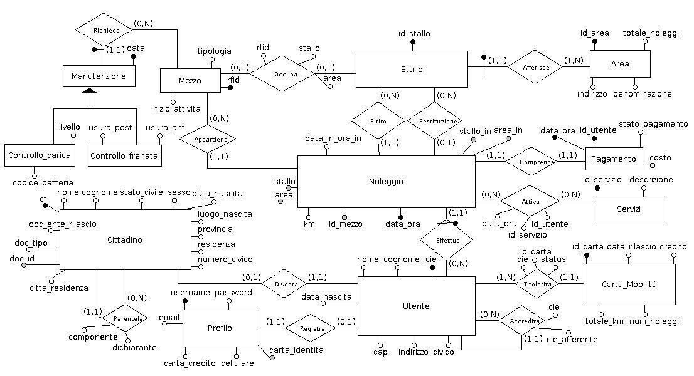

<html>

<head>
<meta http-equiv=Content-Type content="text/html; charset=windows-1252">
<meta name=Generator content="Microsoft Word 15 (filtered)">

</head>

<body lang=IT style='word-wrap:break-word'>

<b>Progetto di Base di Dati</b>

<b>Salvatore Allegra</b>

<b>Studio analitico per la creazione di
una Base di Dati</b>

<b> per il noleggio urbano distribuito
di veicoli a basso impatto ambientale.</b>

<b>Descrizione
e specifiche</b>

Si vuole realizzare il progetto
di una base di dati per la gestione di un sistema di noleggio di biciclette e
monopattini in una città finalizzato alla riduzione dell’impatto ambientale dei
mezzi privati sull’inquinamento atmosferico nei centri urbani, mettendo in atto
strategie per scoraggiare l’utilizzo da parte dei minori di minicar, di scooter
o altri mezzi a combustione interna sviluppando una sensibilità verso la
mobilità sostenibile.

Le biciclette possono essere
tradizionali oppure a pedalata assistita, i monopattini sono tutti elettrici.

I mezzi (circa 2500 biciclette di
cui 500 tradizionali e 500 monopattini) sono distribuiti in diverse aree della
città (circa 200). 

In ogni area ci sono diversi
stalli (in media 30) dove i mezzi possono essere noleggiati e riconsegnati.

I cittadini (circa 2000000)
possono creare un profilo presso un portale contestualmente otteranno una Carta
Mobilità oltre ad avere una serie di agevolazioni.

I Cittadini  che non intendono
effettuare una registrazione possono noleggiare un mezzo presso le aree di
noleggio, tutti gli utenti debbono essere in possesso di Carta di Identità
elettronica (circa 200000), in modo da potere riconoscere chi ha usufruito del
servizio e addebitargliene il costo in caso di mancato pagamento.

I pagamenti in caso di utente non
registrato sul portale possono essere effettuati tramite contante o carta di
credito presso gli appositi box attigui all’area di noleggio.

I cittadini che scelgono di
iscriversi al servizio di noleggio online oltre ad avere uno sconto variabile
sui noleggi, in funzione dei chilometri percorsi e possono ritirare una Carta
Mobilità prepagata dietro un pagamento una tantum, più il costo della ricarica.

L’utente con profilo potrà 
accedere tramite nome utente e password al suo profilo.

L’utente con profilo potrà
tramite la Carta Mobilità di avere sotto controllo i propri noleggi effettuati
e il numero dei chilometri percorsi e il credito residuo.

Si vuole dare all’utente che
registra un profilo la possibilità di richiedere una ulteriore Carta Mobilità
connessa a quella principale per ogni figlio all’interno del nucleo familiare,
in questo caso l’utente dovrà inserire gli estremi della carta di identità
elettronica di ogni altro componente previsto, quindi il sistema terrà  traccia
anche delle generalità degli eventuali utenti connessi a tutte le Carte
Mobilità acquistate dal Titolare del profilo.

Solo l’utente Titolare di un
profilo potrà verificare i dati delle Carte Mobilità attivate.

Si vuole tenere traccia di uno
storico di tutte le Carte acquistate dal Titolare comprese quelle disattivate.

Il prezzo del noleggio è orario.

Un mezzo può essere noleggiato in
un’area e restituito in un'altra.

Per ogni area si vuole conoscere
il numero noleggi che effettua giornalmente.

Ogni mezzo va in manutenzione
dopo un periodo di operatività di 3 mesi, se il mezzo è elettrico va in
manutenzione ogni 2 mesi di operatività per constatare lo stato di
deterioramento della batteria se questo è elettrico in questo caso deve essere
memorizzato il livello di deterioramento della batteria, se il mezzo non è
elettrico deve essere memorizzato lo stato di deterioramento dei freni.

<b>Analisi dei requisiti. Glossario dei termini</b>

<table class=TableGrid border=0 cellspacing=0 cellpadding=0 width=639
 style='width:479.3pt;margin-left:2.5pt;border-collapse:collapse'>
 <tr style='height:17.1pt'>
  <td width=91 valign=top style='width:68.2pt;border:solid black 1.0pt;
  padding:3.1pt 2.9pt 0cm 2.9pt;height:17.1pt'>
  
Termini

  </td>
  <td width=332 valign=top style='width:249.3pt;border:solid black 1.0pt;
  border-left:none;padding:3.1pt 2.9pt 0cm 2.9pt;height:17.1pt'>
  
Descrizione

  </td>
  <td width=79 valign=top style='width:59.4pt;border:solid black 1.0pt;
  border-left:none;padding:3.1pt 2.9pt 0cm 2.9pt;height:17.1pt'>
  
Sinonimi

  </td>
  <td width=137 valign=top style='width:102.4pt;border:solid black 1.0pt;
  border-left:none;padding:3.1pt 2.9pt 0cm 2.9pt;height:17.1pt'>
  
Altri termini collegati

  </td>
 </tr>
 <tr style='height:40.2pt'>
  <td width=91 valign=top style='width:68.2pt;border:solid black 1.0pt;
  border-top:none;padding:3.1pt 2.9pt 0cm 2.9pt;height:40.2pt'>
  
Bicicletta a pedalata assistita

  </td>
  <td width=332 valign=top style='width:249.3pt;border-top:none;border-left:
  none;border-bottom:solid black 1.0pt;border-right:solid black 1.0pt;
  padding:3.1pt 2.9pt 0cm 2.9pt;height:40.2pt'>
  
Le biciclette elettriche possono essere noleggiate e
  riconsegnati presso gli stalli. 

  </td>
  <td width=79 valign=top style='width:59.4pt;border-top:none;border-left:none;
  border-bottom:solid black 1.0pt;border-right:solid black 1.0pt;padding:3.1pt 2.9pt 0cm 2.9pt;
  height:40.2pt'>
  
Mezzo

  
Bici elettrica

  </td>
  <td width=137 valign=top style='width:102.4pt;border-top:none;border-left:
  none;border-bottom:solid black 1.0pt;border-right:solid black 1.0pt;
  padding:3.1pt 2.9pt 0cm 2.9pt;height:40.2pt'>
  
Noleggio

  </td>
 </tr>
 <tr style='height:28.6pt'>
  <td width=91 valign=top style='width:68.2pt;border:solid black 1.0pt;
  border-top:none;padding:3.1pt 2.9pt 0cm 2.9pt;height:28.6pt'>
  
Bicicletta tradizionale

  </td>
  <td width=332 valign=top style='width:249.3pt;border-top:none;border-left:
  none;border-bottom:solid black 1.0pt;border-right:solid black 1.0pt;
  padding:3.1pt 2.9pt 0cm 2.9pt;height:28.6pt'>
  
Le biciclette tradizionali possono essere noleggiati e
  riconsegnati presso gli stalli. 

  </td>
  <td width=79 valign=top style='width:59.4pt;border-top:none;border-left:none;
  border-bottom:solid black 1.0pt;border-right:solid black 1.0pt;padding:3.1pt 2.9pt 0cm 2.9pt;
  height:28.6pt'>
  
mezzo

  </td>
  <td width=137 valign=top style='width:102.4pt;border-top:none;border-left:
  none;border-bottom:solid black 1.0pt;border-right:solid black 1.0pt;
  padding:3.1pt 2.9pt 0cm 2.9pt;height:28.6pt'>
  
Noleggio

  </td>
 </tr>
 <tr style='height:40.2pt'>
  <td width=91 valign=top style='width:68.2pt;border:solid black 1.0pt;
  border-top:none;padding:3.1pt 2.9pt 0cm 2.9pt;height:40.2pt'>
  
Monopattino

  
elettrico

  </td>
  <td width=332 valign=top style='width:249.3pt;border-top:none;border-left:
  none;border-bottom:solid black 1.0pt;border-right:solid black 1.0pt;
  padding:3.1pt 2.9pt 0cm 2.9pt;height:40.2pt'>
  
I monopattino possono essere noleggiati e riconsegnati
  presso gli stalli. 

  </td>
  <td width=79 valign=top style='width:59.4pt;border-top:none;border-left:none;
  border-bottom:solid black 1.0pt;border-right:solid black 1.0pt;padding:3.1pt 2.9pt 0cm 2.9pt;
  height:40.2pt'>
  
mezzo

  </td>
  <td width=137 valign=top style='width:102.4pt;border-top:none;border-left:
  none;border-bottom:solid black 1.0pt;border-right:solid black 1.0pt;
  padding:3.1pt 2.9pt 0cm 2.9pt;height:40.2pt'>
  
Noleggio

  
Stallo

  
Manutenzione

  </td>
 </tr>
 <tr style='height:28.7pt'>
  <td width=91 valign=top style='width:68.2pt;border:solid black 1.0pt;
  border-top:none;padding:3.1pt 2.9pt 0cm 2.9pt;height:28.7pt'>
  
Mezzo

  </td>
  <td width=332 valign=top style='width:249.3pt;border-top:none;border-left:
  none;border-bottom:solid black 1.0pt;border-right:solid black 1.0pt;
  padding:3.1pt 2.9pt 0cm 2.9pt;height:28.7pt'>
  
Ovvero biciclette elettriche, biciclette tradizionali,
  monopattini elettrici

  </td>
  <td width=79 valign=top style='width:59.4pt;border-top:none;border-left:none;
  border-bottom:solid black 1.0pt;border-right:solid black 1.0pt;padding:3.1pt 2.9pt 0cm 2.9pt;
  height:28.7pt'>
  
Bicicletta

  
Monopattino

  </td>
  <td width=137 valign=top style='width:102.4pt;border-top:none;border-left:
  none;border-bottom:solid black 1.0pt;border-right:solid black 1.0pt;
  padding:3.1pt 2.9pt 0cm 2.9pt;height:28.7pt'>
  
Stallo

  
Noleggio

  </td>
 </tr>
 <tr style='height:28.6pt'>
  <td width=91 valign=top style='width:68.2pt;border:solid black 1.0pt;
  border-top:none;padding:3.1pt 2.9pt 0cm 2.9pt;height:28.6pt'>
  
Area

  </td>
  <td width=332 valign=top style='width:249.3pt;border-top:none;border-left:
  none;border-bottom:solid black 1.0pt;border-right:solid black 1.0pt;
  padding:3.1pt 2.9pt 0cm 2.9pt;height:28.6pt'>
  
L’area è la zona in cui ci sono diversi stalli.

  </td>
  <td width=79 valign=top style='width:59.4pt;border-top:none;border-left:none;
  border-bottom:solid black 1.0pt;border-right:solid black 1.0pt;padding:3.1pt 2.9pt 0cm 2.9pt;
  height:28.6pt'>
  
zona

  </td>
  <td width=137 valign=top style='width:102.4pt;border-top:none;border-left:
  none;border-bottom:solid black 1.0pt;border-right:solid black 1.0pt;
  padding:3.1pt 2.9pt 0cm 2.9pt;height:28.6pt'>
  
Stallo

  </td>
 </tr>
 <tr style='height:63.3pt'>
  <td width=91 valign=top style='width:68.2pt;border:solid black 1.0pt;
  border-top:none;padding:3.1pt 2.9pt 0cm 2.9pt;height:63.3pt'>
  
Stallo

  </td>
  <td width=332 valign=top style='width:249.3pt;border-top:none;border-left:
  none;border-bottom:solid black 1.0pt;border-right:solid black 1.0pt;
  padding:3.1pt 2.9pt 0cm 2.9pt;height:63.3pt'>
  
Gli stalli sono le varie postazioni all’interno della
  singola area dalla quale è possibile prelevare e consegnare una singola
  bicicletta o un monopattino

  </td>
  <td width=79 valign=top style='width:59.4pt;border-top:none;border-left:none;
  border-bottom:solid black 1.0pt;border-right:solid black 1.0pt;padding:3.1pt 2.9pt 0cm 2.9pt;
  height:63.3pt'>
  
posizione

  </td>
  <td width=137 valign=top style='width:102.4pt;border-top:none;border-left:
  none;border-bottom:solid black 1.0pt;border-right:solid black 1.0pt;
  padding:3.1pt 2.9pt 0cm 2.9pt;height:63.3pt'>
  
Area,

  
Bicicletta tradizionale,

  
Bicicletta elettricam

  
Monopattino,

  
Mezzo

  </td>
 </tr>
 <tr style='height:40.2pt'>
  <td width=91 valign=top style='width:68.2pt;border:solid black 1.0pt;
  border-top:none;padding:3.1pt 2.9pt 0cm 2.9pt;height:40.2pt'>
  
Cittadino

  </td>
  <td width=332 valign=top style='width:249.3pt;border-top:none;border-left:
  none;border-bottom:solid black 1.0pt;border-right:solid black 1.0pt;
  padding:3.1pt 2.9pt 0cm 2.9pt;height:40.2pt'>
  
I cittadini possono noleggiare biciclette o
  monopattini.

  </td>
  <td width=79 valign=top style='width:59.4pt;border-top:none;border-left:none;
  border-bottom:solid black 1.0pt;border-right:solid black 1.0pt;padding:3.1pt 2.9pt 0cm 2.9pt;
  height:40.2pt'>
  
persona

  </td>
  <td width=137 valign=top style='width:102.4pt;border-top:none;border-left:
  none;border-bottom:solid black 1.0pt;border-right:solid black 1.0pt;
  padding:3.1pt 2.9pt 0cm 2.9pt;height:40.2pt'>
  
Noleggio, Utente,

  </td>
 </tr>
 <tr style='height:40.2pt'>
  <td width=91 valign=top style='width:68.2pt;border:solid black 1.0pt;
  border-top:none;padding:3.1pt 2.9pt 0cm 2.9pt;height:40.2pt'>
  
Profilo

  </td>
  <td width=332 valign=top style='width:249.3pt;border-top:none;border-left:
  none;border-bottom:solid black 1.0pt;border-right:solid black 1.0pt;
  padding:3.1pt 2.9pt 0cm 2.9pt;height:40.2pt'>
  
Il profilo contiene la username e la password e il
  numero di carta di credito, il profilo è posseduto solo da chi si è
  registrato dal portale.

  </td>
  <td width=79 valign=top style='width:59.4pt;border-top:none;border-left:none;
  border-bottom:solid black 1.0pt;border-right:solid black 1.0pt;padding:3.1pt 2.9pt 0cm 2.9pt;
  height:40.2pt'>
  
&nbsp;

  </td>
  <td width=137 valign=top style='width:102.4pt;border-top:none;border-left:
  none;border-bottom:solid black 1.0pt;border-right:solid black 1.0pt;
  padding:3.1pt 2.9pt 0cm 2.9pt;height:40.2pt'>
  
Utente

  </td>
 </tr>
 <tr style='height:28.7pt'>
  <td width=91 valign=top style='width:68.2pt;border:solid black 1.0pt;
  border-top:none;padding:3.1pt 2.9pt 0cm 2.9pt;height:28.7pt'>
  
Titolare

  </td>
  <td width=332 valign=top style='width:249.3pt;border-top:none;border-left:
  none;border-bottom:solid black 1.0pt;border-right:solid black 1.0pt;
  padding:3.1pt 2.9pt 0cm 2.9pt;height:28.7pt'>
  
Un
  titolare è un utente registrato possessore di una singola Carta Mobilità.

  </td>
  <td width=79 valign=top style='width:59.4pt;border-top:none;border-left:none;
  border-bottom:solid black 1.0pt;border-right:solid black 1.0pt;padding:3.1pt 2.9pt 0cm 2.9pt;
  height:28.7pt'>
  
Utente

  </td>
  <td width=137 valign=top style='width:102.4pt;border-top:none;border-left:
  none;border-bottom:solid black 1.0pt;border-right:solid black 1.0pt;
  padding:3.1pt 2.9pt 0cm 2.9pt;height:28.7pt'>
  
Carta Mobilità

  </td>
 </tr>
 <tr style='height:51.7pt'>
  <td width=91 valign=top style='width:68.2pt;border:solid black 1.0pt;
  border-top:none;padding:3.1pt 2.9pt 0cm 2.9pt;height:51.7pt'>
  
Utente 

  </td>
  <td width=332 valign=top style='width:249.3pt;border-top:none;border-left:
  none;border-bottom:solid black 1.0pt;border-right:solid black 1.0pt;
  padding:3.1pt 2.9pt 0cm 2.9pt;height:51.7pt'>
  
L’utente è un utente registrato con un profilo oppure
  che è stato accreditato da un utente registrcon profilo, oppure può essere
  anche un cittadino che si accredita presso l’area di noleggio tramite carta
  di identità elettronica.

  </td>
  <td width=79 valign=top style='width:59.4pt;border-top:none;border-left:none;
  border-bottom:solid black 1.0pt;border-right:solid black 1.0pt;padding:3.1pt 2.9pt 0cm 2.9pt;
  height:51.7pt'>
  
Titolare

  </td>
  <td width=137 valign=top style='width:102.4pt;border-top:none;border-left:
  none;border-bottom:solid black 1.0pt;border-right:solid black 1.0pt;
  padding:3.1pt 2.9pt 0cm 2.9pt;height:51.7pt'>
  
Cittadino,

  
Profilo,

  
Carta Mobilità

  </td>
 </tr>
 <tr style='height:63.3pt'>
  <td width=91 valign=top style='width:68.2pt;border:solid black 1.0pt;
  border-top:none;padding:3.1pt 2.9pt 0cm 2.9pt;height:63.3pt'>
  
Carta Mobilità

  </td>
  <td width=332 valign=top style='width:249.3pt;border-top:none;border-left:
  none;border-bottom:solid black 1.0pt;border-right:solid black 1.0pt;
  padding:3.1pt 2.9pt 0cm 2.9pt;height:63.3pt'>
  
La
  Carta Mobilità permette di avere sotto controllo i noleggi effettuati, il
  numero dei chilometri percorsi e il credito residuo.

  
Solo
  un utente con profilo o un utente accreditato da un utente con profilo
  possiede una Carta Mobilità.

  </td>
  <td width=79 valign=top style='width:59.4pt;border-top:none;border-left:none;
  border-bottom:solid black 1.0pt;border-right:solid black 1.0pt;padding:3.1pt 2.9pt 0cm 2.9pt;
  height:63.3pt'>
  
Carta

  </td>
  <td width=137 valign=top style='width:102.4pt;border-top:none;border-left:
  none;border-bottom:solid black 1.0pt;border-right:solid black 1.0pt;
  padding:3.1pt 2.9pt 0cm 2.9pt;height:63.3pt'>
  
Titolare Utente

  </td>
 </tr>
 <tr style='height:40.2pt'>
  <td width=91 valign=top style='width:68.2pt;border:solid black 1.0pt;
  border-top:none;padding:3.1pt 2.9pt 0cm 2.9pt;height:40.2pt'>
  
Registrazione

  </td>
  <td width=332 valign=top style='width:249.3pt;border-top:none;border-left:
  none;border-bottom:solid black 1.0pt;border-right:solid black 1.0pt;
  padding:3.1pt 2.9pt 0cm 2.9pt;height:40.2pt'>
  
La registrazione è
  l’atto che compiono  i cittadini quando accedono al sistema di noleggio i
  propri dati sul sistema di noleggio tramite portale.

  </td>
  <td width=79 valign=top style='width:59.4pt;border-top:none;border-left:none;
  border-bottom:solid black 1.0pt;border-right:solid black 1.0pt;padding:3.1pt 2.9pt 0cm 2.9pt;
  height:40.2pt'>
  
&nbsp;

  </td>
  <td width=137 valign=top style='width:102.4pt;border-top:none;border-left:
  none;border-bottom:solid black 1.0pt;border-right:solid black 1.0pt;
  padding:3.1pt 2.9pt 0cm 2.9pt;height:40.2pt'>
  
Utente

  </td>
 </tr>
 <tr style='height:28.7pt'>
  <td width=91 valign=top style='width:68.2pt;border:solid black 1.0pt;
  border-top:none;padding:3.1pt 2.9pt 0cm 2.9pt;height:28.7pt'>
  
Manutenzione

  </td>
  <td width=332 valign=top style='width:249.3pt;border-top:none;border-left:
  none;border-bottom:solid black 1.0pt;border-right:solid black 1.0pt;
  padding:3.1pt 2.9pt 0cm 2.9pt;height:28.7pt'>
  
La manutenzione ordinaria è un controllo che viene
  fatto sulla bicicletta periodicamente

  </td>
  <td width=79 valign=top style='width:59.4pt;border-top:none;border-left:none;
  border-bottom:solid black 1.0pt;border-right:solid black 1.0pt;padding:3.1pt 2.9pt 0cm 2.9pt;
  height:28.7pt'>
  
controllo

  </td>
  <td width=137 valign=top style='width:102.4pt;border-top:none;border-left:
  none;border-bottom:solid black 1.0pt;border-right:solid black 1.0pt;
  padding:3.1pt 2.9pt 0cm 2.9pt;height:28.7pt'>
  
Bicicletta Officina

  </td>
 </tr>
 <tr style='height:51.7pt'>
  <td width=91 valign=top style='width:68.2pt;border:solid black 1.0pt;
  border-top:none;padding:3.1pt 2.9pt 0cm 2.9pt;height:51.7pt'>
  
Noleggio

  </td>
  <td width=332 valign=top style='width:249.3pt;border-top:none;border-left:
  none;border-bottom:solid black 1.0pt;border-right:solid black 1.0pt;
  padding:3.1pt 2.9pt 0cm 2.9pt;height:51.7pt'>
  
Il noleggio presuppone che il sistema tenga traccia
  dell’utente e inizia con l’atto di sganciare il mezzo dallo stallo e finisce
  con la riconsegna del mezzo presso un altro stallo.

  </td>
  <td width=79 valign=top style='width:59.4pt;border-top:none;border-left:none;
  border-bottom:solid black 1.0pt;border-right:solid black 1.0pt;padding:3.1pt 2.9pt 0cm 2.9pt;
  height:51.7pt'>
  
operazione

  </td>
  <td width=137 valign=top style='width:102.4pt;border-top:none;border-left:
  none;border-bottom:solid black 1.0pt;border-right:solid black 1.0pt;
  padding:3.1pt 2.9pt 0cm 2.9pt;height:51.7pt'>
  
Bicicletta stallo

  </td>
 </tr>
 <tr style='height:28.7pt'>
  <td width=91 valign=top style='width:68.2pt;border:solid black 1.0pt;
  border-top:none;padding:3.1pt 2.9pt 0cm 2.9pt;height:28.7pt'>
  
Restituzione

  </td>
  <td width=332 valign=top style='width:249.3pt;border-top:none;border-left:
  none;border-bottom:solid black 1.0pt;border-right:solid black 1.0pt;
  padding:3.1pt 2.9pt 0cm 2.9pt;height:28.7pt'>
  
La restituzione consiste nell’agganciare la bicicletta
  nell’apposito stallo, il noleggio finisce con la restituzione.

  </td>
  <td width=79 valign=top style='width:59.4pt;border-top:none;border-left:none;
  border-bottom:solid black 1.0pt;border-right:solid black 1.0pt;padding:3.1pt 2.9pt 0cm 2.9pt;
  height:28.7pt'>
  
operazione

  </td>
  <td width=137 valign=top style='width:102.4pt;border-top:none;border-left:
  none;border-bottom:solid black 1.0pt;border-right:solid black 1.0pt;
  padding:3.1pt 2.9pt 0cm 2.9pt;height:28.7pt'>
  
Bicicletta Stallo

  </td>
 </tr>
 <tr style='height:17.1pt'>
  <td width=91 valign=top style='width:68.2pt;border:solid black 1.0pt;
  border-top:none;padding:3.1pt 2.9pt 0cm 2.9pt;height:17.1pt'>
  
Servizio

  </td>
  <td width=332 valign=top style='width:249.3pt;border-top:none;border-left:
  none;border-bottom:solid black 1.0pt;border-right:solid black 1.0pt;
  padding:3.1pt 2.9pt 0cm 2.9pt;height:17.1pt'>
  
Un servizio è una parte accessoria opzionale di un
  noleggio.

  </td>
  <td width=79 valign=top style='width:59.4pt;border-top:none;border-left:none;
  border-bottom:solid black 1.0pt;border-right:solid black 1.0pt;padding:3.1pt 2.9pt 0cm 2.9pt;
  height:17.1pt'>
  
&nbsp;

  </td>
  <td width=137 valign=top style='width:102.4pt;border-top:none;border-left:
  none;border-bottom:solid black 1.0pt;border-right:solid black 1.0pt;
  padding:3.1pt 2.9pt 0cm 2.9pt;height:17.1pt'>
  
Noleggio

  </td>
 </tr>
 <tr style='height:40.2pt'>
  <td width=91 valign=top style='width:68.2pt;border:solid black 1.0pt;
  border-top:none;padding:3.1pt 2.9pt 0cm 2.9pt;height:40.2pt'>
  
Pagamento

  </td>
  <td width=332 valign=top style='width:249.3pt;border-top:none;border-left:
  none;border-bottom:solid black 1.0pt;border-right:solid black 1.0pt;
  padding:3.1pt 2.9pt 0cm 2.9pt;height:40.2pt'>
  
Il pagamento di un noleggio viene effettuato
  dall’Utente dopo la consegna del mezzo.

  </td>
  <td width=79 valign=top style='width:59.4pt;border-top:none;border-left:none;
  border-bottom:solid black 1.0pt;border-right:solid black 1.0pt;padding:3.1pt 2.9pt 0cm 2.9pt;
  height:40.2pt'>
  
tariffa

  </td>
  <td width=137 valign=top style='width:102.4pt;border-top:none;border-left:
  none;border-bottom:solid black 1.0pt;border-right:solid black 1.0pt;
  padding:3.1pt 2.9pt 0cm 2.9pt;height:40.2pt'>
  
Noleggio,

  
Cittadino

  
Utente

  </td>
 </tr>
</table>

<b>Raggruppiamo
i requisiti in insiemi omogenei</b>

<table class=TableGrid border=0 cellspacing=0 cellpadding=0 width=643
 style='width:481.9pt;margin-left:-.1pt;border-collapse:collapse'>
 <tr style='height:17.1pt'>
  <td width=643 valign=top style='width:481.9pt;border:solid black 1.0pt;
  padding:3.1pt 3.2pt 0cm 2.9pt;height:17.1pt'>
  
Dati di carattere generale:

  </td>
 </tr>
 <tr style='height:63.3pt'>
  <td width=643 valign=top style='width:481.9pt;border:solid black 1.0pt;
  border-top:none;padding:3.1pt 3.2pt 0cm 2.9pt;height:63.3pt'>
  
Si
  vuole realizzare il progetto di una base di dati per la gestione di un
  sistema di noleggio di biciclette e monopattini in una città finalizzato alla
  riduzione dell’impatto ambientale dei mezzi privati sull’inquinamento
  atmosferico nei centri urbani, mettendo in atto strategie per scoraggiare
  l’utilizzo da parte dei minori di minicar, di scooter o altri mezzi a
  combustione interna sviluppando una sensibilità verso la mobilità
  sostenibile.

  </td>
 </tr>
 <tr style='height:17.1pt'>
  <td width=643 valign=top style='width:481.9pt;border:solid black 1.0pt;
  border-top:none;padding:3.1pt 3.2pt 0cm 2.9pt;height:17.1pt'>
  
Dati sulle biciclette.

  </td>
 </tr>
 <tr style='height:74.8pt'>
  <td width=643 valign=top style='width:481.9pt;border:solid black 1.0pt;
  border-top:none;padding:3.1pt 3.2pt 0cm 2.9pt;height:74.8pt'>
  
Le biciclette possono essere tradizionali oppure a
  pedalata assistita,

  
Le biciclette (circa 2500 biciclettei cui 500
  tradizionali ) sono distribuite in diverse aree della città (circa 200). Ogni
  bicicletta ha un RFID che è letto in fase di noleggio o restituzione.

  
Ogni bicicletta va in manutenzione ogni 3 mesi.

  
Un mezzo può essere noleggiato in un’area e restituito
  in un'altra.

  </td>
 </tr>
 <tr style='height:17.1pt'>
  <td width=643 valign=top style='width:481.9pt;border:solid black 1.0pt;
  border-top:none;padding:3.1pt 3.2pt 0cm 2.9pt;height:17.1pt'>
  
Dati sui monopattini.

  </td>
 </tr>
 <tr style='height:63.3pt'>
  <td width=643 valign=top style='width:481.9pt;border:solid black 1.0pt;
  border-top:none;padding:3.1pt 3.2pt 0cm 2.9pt;height:63.3pt'>
  
I monopattini sono tutti elettrici (circa 500).

  
Ogni monopattino ha un RFID che è letto in fase di
  noleggio o restituzione.

  
Ogni bicicletta va in manutenzione ogni 2 mesi.

  
Un mezzo può essere noleggiato in un’area e restituito
  in un'altra.

  </td>
 </tr>
 <tr style='height:17.1pt'>
  <td width=643 valign=top style='width:481.9pt;border:solid black 1.0pt;
  border-top:none;padding:3.1pt 3.2pt 0cm 2.9pt;height:17.1pt'>
  
Dati sui mezzi

  </td>
 </tr>
 <tr style='height:51.8pt'>
  <td width=643 valign=top style='width:481.9pt;border:solid black 1.0pt;
  border-top:none;padding:3.1pt 3.2pt 0cm 2.9pt;height:51.8pt'>
  
I mezzi (circa 2500
  biciclette di cui 500 tradizionali e 500 monopattini) sono distribuiti in
  diverse aree della città (circa 200). 

  
Un mezzo può essere noleggiato in un’area e restituito
  in un'altra.

  </td>
 </tr>
 <tr style='height:17.1pt'>
  <td width=643 valign=top style='width:481.9pt;border:solid black 1.0pt;
  border-top:none;padding:3.1pt 3.2pt 0cm 2.9pt;height:17.1pt'>
  
Dati sulle aree

  </td>
 </tr>
 <tr style='height:28.7pt'>
  <td width=643 valign=top style='width:481.9pt;border:solid black 1.0pt;
  border-top:none;padding:3.1pt 3.2pt 0cm 2.9pt;height:28.7pt'>
  
In ogni area ci sono diversi stalli (in media 30) dove i mezzi possono
  essere noleggiati e riconsegnati. Per ogni area si vuole conoscere il numero
  noleggi che effettua giornalmente.

  </td>
 </tr>
 <tr style='height:17.1pt'>
  <td width=643 valign=top style='width:481.9pt;border:solid black 1.0pt;
  border-top:none;padding:3.1pt 3.2pt 0cm 2.9pt;height:17.1pt'>
  
Dati sugli stalli

  </td>
 </tr>
 <tr style='height:17.1pt'>
  <td width=643 valign=top style='width:481.9pt;border:solid black 1.0pt;
  border-top:none;padding:3.1pt 3.2pt 0cm 2.9pt;height:17.1pt'>
  
Ci sono diversi stalli (circa 30) per ogni area  dove
  possono essere noleggiate e riconsegnate le biciclette.

  </td>
 </tr>
</table>

 

<table class=TableGrid border=0 cellspacing=0 cellpadding=0 width=639
 style='width:479.3pt;margin-left:2.5pt;border-collapse:collapse'>
 <tr style='height:17.1pt'>
  <td width=639 valign=top style='width:479.3pt;border:solid black 1.0pt;
  padding:3.1pt 3.15pt 0cm 2.9pt;height:17.1pt'>
  
Dati sui cittadini

  </td>
 </tr>
 <tr style='height:97.9pt'>
  <td width=639 valign=top style='width:479.3pt;border:solid black 1.0pt;
  border-top:none;padding:3.1pt 3.15pt 0cm 2.9pt;height:97.9pt'>
  
I cittadini (circa 2000000)
  possono creare un profilo presso un portale contestualmente otteranno una
  Carta Mobilità oltre ad avere una serie di agevolazioni.

  
I cittadini  che non
  intendono effettuare una registrazione possono noleggiare un mezzo presso le
  aree di noleggio, tutti gli utenti debbono essere in possesso di Carta di
  Identità elettronica (circa 200000), in modo da potere riconoscere chi ha
  usufruito del servizio e addebitargliene il costo in caso di mancato
  pagamento.

  
I cittadini che scelgono di iscriversi al servizio di
  noleggio online oltre ad avere uno sconto variabile sui noleggi, in

  </td>
 </tr>
</table>

funzione dei chilometri percorsi e
possono ritirare una Carta Mobilità prepagata dietro un pagamento una tantum,
più il costo della ricarica.

<table class=TableGrid border=0 cellspacing=0 cellpadding=0 width=643
 style='width:481.9pt;margin-left:-.1pt;border-collapse:collapse'>
 <tr style='height:17.1pt'>
  <td width=643 valign=top style='width:481.9pt;border:solid black 1.0pt;
  padding:3.1pt 3.35pt 0cm 2.9pt;height:17.1pt'>
  
Dati sul Profilo

  </td>
 </tr>
 <tr style='height:17.1pt'>
  <td width=643 valign=top style='width:481.9pt;border:solid black 1.0pt;
  border-top:none;padding:3.1pt 3.35pt 0cm 2.9pt;height:17.1pt'>
  
L’utente registrato potrà  accedere tramite nome utente
  e password al suo profilo.

  </td>
 </tr>
 <tr style='height:17.1pt'>
  <td width=643 valign=top style='width:481.9pt;border:solid black 1.0pt;
  border-top:none;padding:3.1pt 3.35pt 0cm 2.9pt;height:17.1pt'>
  
Dati sui Pagamenti

  </td>
 </tr>
 <tr style='height:28.7pt'>
  <td width=643 valign=top style='width:481.9pt;border:solid black 1.0pt;
  border-top:none;padding:3.1pt 3.35pt 0cm 2.9pt;height:28.7pt'>
  
I
  pagamenti in caso di utente non registrato sul portale possono essere
  effettuati tramite contante o carta di credito presso gli appositi box
  attigui all’area di noleggio.

  </td>
 </tr>
 <tr style='height:17.1pt'>
  <td width=643 valign=top style='width:481.9pt;border:solid black 1.0pt;
  border-top:none;padding:3.1pt 3.35pt 0cm 2.9pt;height:17.1pt'>
  
Dati sull’Utente

  </td>
 </tr>
 <tr style='height:98.0pt'>
  <td width=643 valign=top style='width:481.9pt;border:solid black 1.0pt;
  border-top:none;padding:3.1pt 3.35pt 0cm 2.9pt;height:98.0pt'>
  
L’utente con profilo potrà  accedere tramite nome
  utente e password al suo profilo.

  
L’utente
  con profilo potrà tramite la Carta Mobilità di avere sotto controllo i propri
  noleggi effettuati e il numero dei chilometri percorsi e il credito residuo.

  
Si
  vuole dare all’utente che registra un profilo la possibilità di richiedere
  una ulteriore Carta Mobilità connessa a quella principale per ogni figlio
  all’interno del nucleo familiare, in questo caso l’utente dovrà inserire gli
  estremi della carta di identità elettronica di ogni altro componente
  previsto, quindi il sistema terrà  traccia anche delle generalità degli
  eventuali utenti connessi a tutte le Carte Mobilità acquistate dal Titolare
  del profilo.

  </td>
 </tr>
 <tr style='height:17.1pt'>
  <td width=643 valign=top style='width:481.9pt;border:solid black 1.0pt;
  border-top:none;padding:3.1pt 3.35pt 0cm 2.9pt;height:17.1pt'>
  
Dati sulla Carta Mobilità

  </td>
 </tr>
 <tr style='height:28.7pt'>
  <td width=643 valign=top style='width:481.9pt;border:solid black 1.0pt;
  border-top:none;padding:3.1pt 3.35pt 0cm 2.9pt;height:28.7pt'>
  
Solo l’utente Titolare di un profilo potrà verificare i
  dati delle Carte Mobilità attivate.

  
Si vuole tenere traccia di uno storico di tutte le
  Carte acquistate dal Titolare comprese quelle disattivate.

  </td>
 </tr>
 <tr style='height:17.1pt'>
  <td width=643 valign=top style='width:481.9pt;border:solid black 1.0pt;
  border-top:none;padding:3.1pt 3.35pt 0cm 2.9pt;height:17.1pt'>
  
Dati sul Noleggio

  </td>
 </tr>
 <tr style='height:17.1pt'>
  <td width=643 valign=top style='width:481.9pt;border:solid black 1.0pt;
  border-top:none;padding:3.1pt 3.35pt 0cm 2.9pt;height:17.1pt'>
  
Il prezzo del noleggio è orario.

  </td>
 </tr>
 <tr style='height:17.1pt'>
  <td width=643 valign=top style='width:481.9pt;border:solid black 1.0pt;
  border-top:none;padding:3.1pt 3.35pt 0cm 2.9pt;height:17.1pt'>
  
Dati sulla Manutenzione

  </td>
 </tr>
 <tr style='height:51.7pt'>
  <td width=643 valign=top style='width:481.9pt;border:solid black 1.0pt;
  border-top:none;padding:3.1pt 3.35pt 0cm 2.9pt;height:51.7pt'>
  
Ogni
  mezzo va in manutenzione dopo un periodo di operatività di 3 mesi, se il
  mezzo è elettrico va in manutenzione ogni 2 mesi di operatività per
  constatare lo stato di deterioramento della batteria se questo è elettrico in
  questo caso deve essere memorizzato il livello di deterioramento della
  batteria, se il mezzo non è elettrico deve essere memorizzato lo stato di
  deterioramento dei freni.

  </td>
 </tr>
</table>

I<b>ndividuare
i concetti più rilevanti e rappresentarli in uno schema scheletro.</b>

SCHEMA SCHELETRO I

<table class=TableGrid border=0 cellspacing=0 cellpadding=0 width=643
 style='width:481.9pt;margin-left:-.1pt;border-collapse:collapse'>
 <tr style='height:17.1pt'>
  <td width=643 valign=top style='width:481.9pt;border:solid black 1.0pt;
  padding:2.6pt 4.8pt 0cm 2.9pt;height:17.1pt'>
  
Schema Scheletro

  </td>
 </tr>
 <tr style='height:296.2pt'>
  <td width=643 valign=top style='width:481.9pt;border:solid black 1.0pt;
  border-top:none;padding:2.6pt 4.8pt 0cm 2.9pt;height:296.2pt'>
  

  </td>
 </tr>
</table>

Schema Intermedio 

<table class=TableGrid border=0 cellspacing=0 cellpadding=0 width=643
 style='width:481.9pt;margin-left:-.1pt;border-collapse:collapse'>
 <tr style='height:17.1pt'>
  <td width=643 valign=top style='width:481.9pt;border:solid black 1.0pt;
  padding:2.6pt 2.7pt 0cm 2.8pt;height:17.1pt'>
  
Schema Finale – con Cardinalità e Attributi.

  </td>
 </tr>
 <tr style='height:275.5pt'>
  <td width=643 valign=top style='width:481.9pt;border:solid black 1.0pt;
  border-top:none;padding:2.6pt 2.7pt 0cm 2.8pt;height:275.5pt'>
  

  </td>
 </tr>
</table>

<b>Dizionari
dei dati relativo alle Entità.</b>

<table class=TableGrid border=0 cellspacing=0 cellpadding=0 width=641
 style='width:480.6pt;margin-left:1.2pt;border-collapse:collapse'>
 <tr style='height:17.1pt'>
  <td width=159 valign=top style='width:119.3pt;border:solid black 1.0pt;
  padding:3.1pt 3.45pt 0cm 2.8pt;height:17.1pt'>
  
Termini

  </td>
  <td width=160 valign=top style='width:120.0pt;border:solid black 1.0pt;
  border-left:none;padding:3.1pt 3.45pt 0cm 2.8pt;height:17.1pt'>
  
Descrizione

  </td>
  <td width=161 valign=top style='width:120.7pt;border:solid black 1.0pt;
  border-left:none;padding:3.1pt 3.45pt 0cm 2.8pt;height:17.1pt'>
  
Attributi

  </td>
  <td width=161 valign=top style='width:120.6pt;border:solid black 1.0pt;
  border-left:none;padding:3.1pt 3.45pt 0cm 2.8pt;height:17.1pt'>
  
Identificatore

  </td>
 </tr>
 <tr style='height:51.7pt'>
  <td width=159 valign=top style='width:119.3pt;border:solid black 1.0pt;
  border-top:none;padding:3.1pt 3.45pt 0cm 2.8pt;height:51.7pt'>
  
Area

  </td>
  <td width=160 valign=top style='width:120.0pt;border-top:none;border-left:
  none;border-bottom:solid black 1.0pt;border-right:solid black 1.0pt;
  padding:3.1pt 3.45pt 0cm 2.8pt;height:51.7pt'>
  
Il luogo da che raggruppa gli stalli

  </td>
  <td width=161 valign=top style='width:120.7pt;border-top:none;border-left:
  none;border-bottom:solid black 1.0pt;border-right:solid black 1.0pt;
  padding:3.1pt 3.45pt 0cm 2.8pt;height:51.7pt'>
  
id_area totale_noleggi indirizzo denominazione

  </td>
  <td width=161 valign=top style='width:120.6pt;border-top:none;border-left:
  none;border-bottom:solid black 1.0pt;border-right:solid black 1.0pt;
  padding:3.1pt 3.45pt 0cm 2.8pt;height:51.7pt'>
  
id_area

  </td>
 </tr>
 <tr style='height:51.8pt'>
  <td width=159 valign=top style='width:119.3pt;border:solid black 1.0pt;
  border-top:none;padding:3.1pt 3.45pt 0cm 2.8pt;height:51.8pt'>
  
Stallo

  </td>
  <td width=160 valign=top style='width:120.0pt;border-top:none;border-left:
  none;border-bottom:solid black 1.0pt;border-right:solid black 1.0pt;
  padding:3.1pt 3.45pt 0cm 2.8pt;height:51.8pt'>
  
La posizione da dove parte un noleggio e dove finisce il

  
noleggio, lo può contenere un mezzo

  </td>
  <td width=161 valign=top style='width:120.7pt;border-top:none;border-left:
  none;border-bottom:solid black 1.0pt;border-right:solid black 1.0pt;
  padding:3.1pt 3.45pt 0cm 2.8pt;height:51.8pt'>
  
id_stallo id_area

  </td>
  <td width=161 valign=top style='width:120.6pt;border-top:none;border-left:
  none;border-bottom:solid black 1.0pt;border-right:solid black 1.0pt;
  padding:3.1pt 3.45pt 0cm 2.8pt;height:51.8pt'>
  
Area,

  
Bicicletta

  </td>
 </tr>
 <tr style='height:51.7pt'>
  <td width=159 valign=top style='width:119.3pt;border:solid black 1.0pt;
  border-top:none;padding:3.1pt 3.45pt 0cm 2.8pt;height:51.7pt'>
  
Mezzo

  </td>
  <td width=160 valign=top style='width:120.0pt;border-top:none;border-left:
  none;border-bottom:solid black 1.0pt;border-right:solid black 1.0pt;
  padding:3.1pt 3.45pt 0cm 2.8pt;height:51.7pt'>
  
Il mezzo che si intende noleggiare, bicicletta,
  bicicletta elettrica, monopattino.

  </td>
  <td width=161 valign=top style='width:120.7pt;border-top:none;border-left:
  none;border-bottom:solid black 1.0pt;border-right:solid black 1.0pt;
  padding:3.1pt 3.45pt 0cm 2.8pt;height:51.7pt'>
  
rfid tipologia inizio_attivita

  </td>
  <td width=161 valign=top style='width:120.6pt;border-top:none;border-left:
  none;border-bottom:solid black 1.0pt;border-right:solid black 1.0pt;
  padding:3.1pt 3.45pt 0cm 2.8pt;height:51.7pt'>
  
rfid

  </td>
 </tr>
 <tr style='height:28.7pt'>
  <td width=159 valign=top style='width:119.3pt;border:solid black 1.0pt;
  border-top:none;padding:3.1pt 3.45pt 0cm 2.8pt;height:28.7pt'>
  
Manutenzione

  </td>
  <td width=160 valign=top style='width:120.0pt;border-top:none;border-left:
  none;border-bottom:solid black 1.0pt;border-right:solid black 1.0pt;
  padding:3.1pt 3.45pt 0cm 2.8pt;height:28.7pt'>
  
L’operazione periodica di controllo sui mezzi

  </td>
  <td width=161 valign=top style='width:120.7pt;border-top:none;border-left:
  none;border-bottom:solid black 1.0pt;border-right:solid black 1.0pt;
  padding:3.1pt 3.45pt 0cm 2.8pt;height:28.7pt'>
  
rfid data

  </td>
  <td width=161 valign=top style='width:120.6pt;border-top:none;border-left:
  none;border-bottom:solid black 1.0pt;border-right:solid black 1.0pt;
  padding:3.1pt 3.45pt 0cm 2.8pt;height:28.7pt'>
  
(rfid,data)

  </td>
 </tr>
 <tr style='height:51.7pt'>
  <td width=159 valign=top style='width:119.3pt;border:solid black 1.0pt;
  border-top:none;padding:3.1pt 3.45pt 0cm 2.8pt;height:51.7pt'>
  
Controllo_carica

  </td>
  <td width=160 valign=top style='width:120.0pt;border-top:none;border-left:
  none;border-bottom:solid black 1.0pt;border-right:solid black 1.0pt;
  padding:3.1pt 3.45pt 0cm 2.8pt;height:51.7pt'>
  
Relativa esclusivamente ai mezzi elettrici

  </td>
  <td width=161 valign=top style='width:120.7pt;border-top:none;border-left:
  none;border-bottom:solid black 1.0pt;border-right:solid black 1.0pt;
  padding:3.1pt 3.45pt 0cm 2.8pt;height:51.7pt'>
  
rfid data

  
codice_batteria livello

  </td>
  <td width=161 valign=top style='width:120.6pt;border-top:none;border-left:
  none;border-bottom:solid black 1.0pt;border-right:solid black 1.0pt;
  padding:3.1pt 3.45pt 0cm 2.8pt;height:51.7pt'>
  
(rfid,data)

  </td>
 </tr>
 <tr style='height:51.8pt'>
  <td width=159 valign=top style='width:119.3pt;border:solid black 1.0pt;
  border-top:none;padding:3.1pt 3.45pt 0cm 2.8pt;height:51.8pt'>
  
Controllo_frenata

  </td>
  <td width=160 valign=top style='width:120.0pt;border-top:none;border-left:
  none;border-bottom:solid black 1.0pt;border-right:solid black 1.0pt;
  padding:3.1pt 3.45pt 0cm 2.8pt;height:51.8pt'>
  
Relativa esclusivamente alle biciclette tradizionali

  </td>
  <td width=161 valign=top style='width:120.7pt;border-top:none;border-left:
  none;border-bottom:solid black 1.0pt;border-right:solid black 1.0pt;
  padding:3.1pt 3.45pt 0cm 2.8pt;height:51.8pt'>
  
rfid data usura_ant usura_post

  </td>
  <td width=161 valign=top style='width:120.6pt;border-top:none;border-left:
  none;border-bottom:solid black 1.0pt;border-right:solid black 1.0pt;
  padding:3.1pt 3.45pt 0cm 2.8pt;height:51.8pt'>
  
(rfid,data)

  </td>
 </tr>
 <tr style='height:201.9pt'>
  <td width=159 valign=top style='width:119.3pt;border:solid black 1.0pt;
  border-top:none;padding:3.1pt 3.45pt 0cm 2.8pt;height:201.9pt'>
  
Cittadino

  </td>
  <td width=160 valign=top style='width:120.0pt;border-top:none;border-left:
  none;border-bottom:solid black 1.0pt;border-right:solid black 1.0pt;
  padding:3.1pt 3.45pt 0cm 2.8pt;height:201.9pt'>
  
Colui il quale è potenzialmente un Utente.

  
La tabella contenente i
  dati dei Cittadini non necessariamente deve essere integrata nel database,
  potrebbe essere una tabella raggiungibile dall’esterno di un ipotetico 
  database di un anagrafe cittadino.

  </td>
  <td width=161 valign=top style='width:120.7pt;border-top:none;border-left:
  none;border-bottom:solid black 1.0pt;border-right:solid black 1.0pt;
  padding:3.1pt 3.45pt 0cm 2.8pt;height:201.9pt'>
  
cf

  
nome cognome

  
stato_civile sesso data_nascita` luogo_nascita provincia
  residenza numero_civico citta_residenza doc_tipo doc_id

  
doc_comune

  
doc_ente_rilascio doc_rilascio doc_scadenza

  </td>
  <td width=161 valign=top style='width:120.6pt;border-top:none;border-left:
  none;border-bottom:solid black 1.0pt;border-right:solid black 1.0pt;
  padding:3.1pt 3.45pt 0cm 2.8pt;height:201.9pt'>
  
cf

  </td>
 </tr>
 <tr style='height:97.9pt'>
  <td width=159 valign=top style='width:119.3pt;border:solid black 1.0pt;
  border-top:none;padding:3.1pt 3.45pt 0cm 2.8pt;height:97.9pt'>
  
Utente

  </td>
  <td width=160 valign=top style='width:120.0pt;border-top:none;border-left:
  none;border-bottom:solid black 1.0pt;border-right:solid black 1.0pt;
  padding:3.1pt 3.45pt 0cm 2.8pt;height:97.9pt'>
  
Colui il quale interagisce col sistema sia questo con
  un profilo, accreditato da un utente con profilo o semplicemente un utente
  che noleggia un mezzo senza avere mai avuto accesso al portale

  </td>
  <td width=161 valign=top style='width:120.7pt;border-top:none;border-left:
  none;border-bottom:solid black 1.0pt;border-right:solid black 1.0pt;
  padding:3.1pt 3.45pt 0cm 2.8pt;height:97.9pt'>
  
cie

  
nome cognome

  
data_nascita cap indirizzo civico

  </td>
  <td width=161 valign=top style='width:120.6pt;border-top:none;border-left:
  none;border-bottom:solid black 1.0pt;border-right:solid black 1.0pt;
  padding:3.1pt 3.45pt 0cm 2.8pt;height:97.9pt'>
  
cie

  </td>
 </tr>
 <tr style='height:74.9pt'>
  <td width=159 valign=top style='width:119.3pt;border:solid black 1.0pt;
  border-top:none;padding:3.1pt 3.45pt 0cm 2.8pt;height:74.9pt'>
  
Profilo

  </td>
  <td width=160 valign=top style='width:120.0pt;border-top:none;border-left:
  none;border-bottom:solid black 1.0pt;border-right:solid black 1.0pt;
  padding:3.1pt 3.45pt 0cm 2.8pt;height:74.9pt'>
  
Conserva i dati relativi all’acceso di un utente
  titolare di un profilo quali username e password e il numero di carta di
  credito.

  </td>
  <td width=161 valign=top style='width:120.7pt;border-top:none;border-left:
  none;border-bottom:solid black 1.0pt;border-right:solid black 1.0pt;
  padding:3.1pt 3.45pt 0cm 2.8pt;height:74.9pt'>
  
username password carta_credito email cellulare carta_identita

  </td>
  <td width=161 valign=top style='width:120.6pt;border-top:none;border-left:
  none;border-bottom:solid black 1.0pt;border-right:solid black 1.0pt;
  padding:3.1pt 3.45pt 0cm 2.8pt;height:74.9pt'>
  
username

  </td>
 </tr>
 <tr style='height:63.3pt'>
  <td width=159 valign=top style='width:119.3pt;border:solid black 1.0pt;
  border-top:none;padding:3.1pt 3.45pt 0cm 2.8pt;height:63.3pt'>
  
Cartamobilita

  </td>
  <td width=160 valign=top style='width:120.0pt;border-top:none;border-left:
  none;border-bottom:solid black 1.0pt;border-right:solid black 1.0pt;
  padding:3.1pt 3.45pt 0cm 2.8pt;height:63.3pt'>
  
Mantiene uno storico dei chilometri percorsi, e del 

  
numero dei noleggi effettuati dall’utente e il credito
  residuo. 

  </td>
  <td width=161 valign=top style='width:120.7pt;border-top:none;border-left:
  none;border-bottom:solid black 1.0pt;border-right:solid black 1.0pt;
  padding:3.1pt 3.45pt 0cm 2.8pt;height:63.3pt'>
  
id_carta data_rilascio

  
credito num_noleggi totale_km

  </td>
  <td width=161 valign=top style='width:120.6pt;border-top:none;border-left:
  none;border-bottom:solid black 1.0pt;border-right:solid black 1.0pt;
  padding:3.1pt 3.45pt 0cm 2.8pt;height:63.3pt'>
  
id_carta

  </td>
 </tr>
 <tr style='height:109.5pt'>
  <td width=159 valign=top style='width:119.3pt;border:solid black 1.0pt;
  border-top:none;padding:3.1pt 3.45pt 0cm 2.8pt;height:109.5pt'>
  
Noleggio

  </td>
  <td width=160 valign=top style='width:120.0pt;border-top:none;border-left:
  none;border-bottom:solid black 1.0pt;border-right:solid black 1.0pt;
  padding:3.1pt 3.45pt 0cm 2.8pt;height:109.5pt'>
  
L’atto di prendere una bicicletta, il noleggio parte
  una volta che la bicicletta è stata recuperata dallo stallo.

  </td>
  <td width=161 valign=top style='width:120.7pt;border-top:none;border-left:
  none;border-bottom:solid black 1.0pt;border-right:solid black 1.0pt;
  padding:3.1pt 3.45pt 0cm 2.8pt;height:109.5pt'>
  
data_ora stallo area data_in_ora_in stallo_in area_in

  
km

  
id_utente id_mezzo

  </td>
  <td width=161 valign=top style='width:120.6pt;border-top:none;border-left:
  none;border-bottom:solid black 1.0pt;border-right:solid black 1.0pt;
  padding:3.1pt 3.45pt 0cm 2.8pt;height:109.5pt'>
  
(data_ora,id_utente)

  </td>
 </tr>
 <tr style='height:51.8pt'>
  <td width=159 valign=top style='width:119.3pt;border:solid black 1.0pt;
  border-top:none;padding:3.1pt 3.45pt 0cm 2.8pt;height:51.8pt'>
  
Pagamento

  </td>
  <td width=160 valign=top style='width:120.0pt;border-top:none;border-left:
  none;border-bottom:solid black 1.0pt;border-right:solid black 1.0pt;
  padding:3.1pt 3.45pt 0cm 2.8pt;height:51.8pt'>
  
Il pagamento si crea una volta che è finito il noleggio
  e si perfeziona una volta saldato.

  </td>
  <td width=161 valign=top style='width:120.7pt;border-top:none;border-left:
  none;border-bottom:solid black 1.0pt;border-right:solid black 1.0pt;
  padding:3.1pt 3.45pt 0cm 2.8pt;height:51.8pt'>
  
data_ora id_utente costo stato_pagamento

  </td>
  <td width=161 valign=top style='width:120.6pt;border-top:none;border-left:
  none;border-bottom:solid black 1.0pt;border-right:solid black 1.0pt;
  padding:3.1pt 3.45pt 0cm 2.8pt;height:51.8pt'>
  
(data_ora,id_utente)

  </td>
 </tr>
 <tr style='height:40.2pt'>
  <td width=159 valign=top style='width:119.3pt;border:solid black 1.0pt;
  border-top:none;padding:3.1pt 3.45pt 0cm 2.8pt;height:40.2pt'>
  
Servizi

  </td>
  <td width=160 valign=top style='width:120.0pt;border-top:none;border-left:
  none;border-bottom:solid black 1.0pt;border-right:solid black 1.0pt;
  padding:3.1pt 3.45pt 0cm 2.8pt;height:40.2pt'>
  
Sono delle opzioni che si possono aggiungere al
  noleggio

  </td>
  <td width=161 valign=top style='width:120.7pt;border-top:none;border-left:
  none;border-bottom:solid black 1.0pt;border-right:solid black 1.0pt;
  padding:3.1pt 3.45pt 0cm 2.8pt;height:40.2pt'>
  
id_servizio descrizione

  </td>
  <td width=161 valign=top style='width:120.6pt;border-top:none;border-left:
  none;border-bottom:solid black 1.0pt;border-right:solid black 1.0pt;
  padding:3.1pt 3.45pt 0cm 2.8pt;height:40.2pt'>
  
id_servizio

  </td>
 </tr>
</table>

<b>Dizionari
dei dati relativo alle Relazioni.</b>

<table class=TableGrid border=0 cellspacing=0 cellpadding=0 width=643
 style='width:481.9pt;margin-left:-.1pt;border-collapse:collapse'>
 <tr style='height:17.1pt'>
  <td width=125 valign=top style='width:93.7pt;border:solid black 1.0pt;
  padding:3.1pt 4.15pt 0cm 2.9pt;height:17.1pt'>
  
Termini

  </td>
  <td width=136 valign=top style='width:101.9pt;border:solid black 1.0pt;
  border-left:none;padding:3.1pt 4.15pt 0cm 2.9pt;height:17.1pt'>
  
Entità in relazione

  </td>
  <td width=117 valign=top style='width:87.5pt;border:solid black 1.0pt;
  border-left:none;padding:3.1pt 4.15pt 0cm 2.9pt;height:17.1pt'>
  
Attributi

  </td>
  <td width=265 valign=top style='width:198.8pt;border:solid black 1.0pt;
  border-left:none;padding:3.1pt 4.15pt 0cm 2.9pt;height:17.1pt'>
  
Descrizione

  </td>
 </tr>
 <tr style='height:28.7pt'>
  <td width=125 valign=top style='width:93.7pt;border:solid black 1.0pt;
  border-top:none;padding:3.1pt 4.15pt 0cm 2.9pt;height:28.7pt'>
  
Accredita

  </td>
  <td width=136 valign=top style='width:101.9pt;border-top:none;border-left:
  none;border-bottom:solid black 1.0pt;border-right:solid black 1.0pt;
  padding:3.1pt 4.15pt 0cm 2.9pt;height:28.7pt'>
  
Utente su Utente

  </td>
  <td width=117 valign=top style='width:87.5pt;border-top:none;border-left:
  none;border-bottom:solid black 1.0pt;border-right:solid black 1.0pt;
  padding:3.1pt 4.15pt 0cm 2.9pt;height:28.7pt'>
  
cie cie_afferente

  </td>
  <td width=265 valign=top style='width:198.8pt;border-top:none;border-left:
  none;border-bottom:solid black 1.0pt;border-right:solid black 1.0pt;
  padding:3.1pt 4.15pt 0cm 2.9pt;height:28.7pt'>
  
Un utente Accredita un altro Utente che afferisce al
  proprio profilo

  </td>
 </tr>
 <tr style='height:40.2pt'>
  <td width=125 valign=top style='width:93.7pt;border:solid black 1.0pt;
  border-top:none;padding:3.1pt 4.15pt 0cm 2.9pt;height:40.2pt'>
  
Attiva

  </td>
  <td width=136 valign=top style='width:101.9pt;border-top:none;border-left:
  none;border-bottom:solid black 1.0pt;border-right:solid black 1.0pt;
  padding:3.1pt 4.15pt 0cm 2.9pt;height:40.2pt'>
  
Noleggio Servizi

  </td>
  <td width=117 valign=top style='width:87.5pt;border-top:none;border-left:
  none;border-bottom:solid black 1.0pt;border-right:solid black 1.0pt;
  padding:3.1pt 4.15pt 0cm 2.9pt;height:40.2pt'>
  
data_ora id_utente id_servizio

  </td>
  <td width=265 valign=top style='width:198.8pt;border-top:none;border-left:
  none;border-bottom:solid black 1.0pt;border-right:solid black 1.0pt;
  padding:3.1pt 4.15pt 0cm 2.9pt;height:40.2pt'>
  
Un Noleggio può attivare un Servizio

  </td>
 </tr>
 <tr style='height:40.2pt'>
  <td width=125 valign=top style='width:93.7pt;border:solid black 1.0pt;
  border-top:none;padding:3.1pt 4.15pt 0cm 2.9pt;height:40.2pt'>
  
Occupa

  </td>
  <td width=136 valign=top style='width:101.9pt;border-top:none;border-left:
  none;border-bottom:solid black 1.0pt;border-right:solid black 1.0pt;
  padding:3.1pt 4.15pt 0cm 2.9pt;height:40.2pt'>
  
Mezzo

  
Stallo

  </td>
  <td width=117 valign=top style='width:87.5pt;border-top:none;border-left:
  none;border-bottom:solid black 1.0pt;border-right:solid black 1.0pt;
  padding:3.1pt 4.15pt 0cm 2.9pt;height:40.2pt'>
  
rfid stallo area

  </td>
  <td width=265 valign=top style='width:198.8pt;border-top:none;border-left:
  none;border-bottom:solid black 1.0pt;border-right:solid black 1.0pt;
  padding:3.1pt 4.15pt 0cm 2.9pt;height:40.2pt'>
  
Un Mezzo Occupa uno Stallo

  </td>
 </tr>
 <tr style='height:40.2pt'>
  <td width=125 valign=top style='width:93.7pt;border:solid black 1.0pt;
  border-top:none;padding:3.1pt 4.15pt 0cm 2.9pt;height:40.2pt'>
  
Titolarita

  </td>
  <td width=136 valign=top style='width:101.9pt;border-top:none;border-left:
  none;border-bottom:solid black 1.0pt;border-right:solid black 1.0pt;
  padding:3.1pt 4.15pt 0cm 2.9pt;height:40.2pt'>
  
Utente

  
Cartamobilita

  </td>
  <td width=117 valign=top style='width:87.5pt;border-top:none;border-left:
  none;border-bottom:solid black 1.0pt;border-right:solid black 1.0pt;
  padding:3.1pt 4.15pt 0cm 2.9pt;height:40.2pt'>
  
cie id_carta status_carta

  </td>
  <td width=265 valign=top style='width:198.8pt;border-top:none;border-left:
  none;border-bottom:solid black 1.0pt;border-right:solid black 1.0pt;
  padding:3.1pt 4.15pt 0cm 2.9pt;height:40.2pt'>
  
Un Utente è Titolare di una o più Carte mobilità

  </td>
 </tr>
 <tr style='height:63.3pt'>
  <td width=125 valign=top style='width:93.7pt;border:solid black 1.0pt;
  border-top:none;padding:3.1pt 4.15pt 0cm 2.9pt;height:63.3pt'>
  
Parentela

  
E’ relativa all’Entità
  Cittadino esterna al database del sistema di noleggio.

  </td>
  <td width=136 valign=top style='width:101.9pt;border-top:none;border-left:
  none;border-bottom:solid black 1.0pt;border-right:solid black 1.0pt;
  padding:3.1pt 4.15pt 0cm 2.9pt;height:63.3pt'>
  
Cittadino su Cittadino

  </td>
  <td width=117 valign=top style='width:87.5pt;border-top:none;border-left:
  none;border-bottom:solid black 1.0pt;border-right:solid black 1.0pt;
  padding:3.1pt 4.15pt 0cm 2.9pt;height:63.3pt'>
  
dichiarante componente

  </td>
  <td width=265 valign=top style='width:198.8pt;border-top:none;border-left:
  none;border-bottom:solid black 1.0pt;border-right:solid black 1.0pt;
  padding:3.1pt 4.15pt 0cm 2.9pt;height:63.3pt'>
  
Un Cittadino dichiara di avere un certo componente in
  quanto figlio nel suo nucleo familiare.

  </td>
 </tr>
</table>

<b>Specifichiamo
le Cardinalità.</b>

&nbsp;

<table class=TableGrid border=0 cellspacing=0 cellpadding=0 width=643
 style='width:482.2pt;margin-left:-.1pt;border-collapse:collapse'>
 <tr style='height:17.1pt'>
  <td width=109 valign=top style='width:82.0pt;border:solid black 1.0pt;
  padding:3.1pt 3.0pt 0cm 2.8pt;height:17.1pt'>
  
Concetto

  </td>
  <td width=114 valign=top style='width:85.2pt;border:solid black 1.0pt;
  border-left:none;padding:3.1pt 3.0pt 0cm 2.8pt;height:17.1pt'>
  
Tipo

  </td>
  <td width=420 valign=top style='width:315.0pt;border:solid black 1.0pt;
  border-left:none;padding:3.1pt 3.0pt 0cm 2.8pt;height:17.1pt'>
  
&nbsp;

  </td>
 </tr>
 <tr style='height:40.2pt'>
  <td width=109 valign=top style='width:82.0pt;border:solid black 1.0pt;
  border-top:none;padding:3.1pt 3.0pt 0cm 2.8pt;height:40.2pt'>
  
Effettua

  </td>
  <td width=114 valign=top style='width:85.2pt;border-top:none;border-left:
  none;border-bottom:solid black 1.0pt;border-right:solid black 1.0pt;
  padding:3.1pt 3.0pt 0cm 2.8pt;height:40.2pt'>
  
Relazione

  </td>
  <td width=420 valign=top style='width:315.0pt;border-top:none;border-left:
  none;border-bottom:solid black 1.0pt;border-right:solid black 1.0pt;
  padding:3.1pt 3.0pt 0cm 2.8pt;height:40.2pt'>
  
La relazione EFFETTUA  tra UTENTE e NOLEGGIO è (0,n), un
  UTENTE può non effettuare noleggi ma può effettuarne nel tempo più di uno.

  
Al contrario è (1,1) un singolo NOLEGGIO riguarda un
  solo UTENTE.

  </td>
 </tr>
 <tr style='height:63.3pt'>
  <td width=109 valign=top style='width:82.0pt;border:solid black 1.0pt;
  border-top:none;padding:3.1pt 3.0pt 0cm 2.8pt;height:63.3pt'>
  
Appartiene

  </td>
  <td width=114 valign=top style='width:85.2pt;border-top:none;border-left:
  none;border-bottom:solid black 1.0pt;border-right:solid black 1.0pt;
  padding:3.1pt 3.0pt 0cm 2.8pt;height:63.3pt'>
  
Relazione

  </td>
  <td width=420 valign=top style='width:315.0pt;border-top:none;border-left:
  none;border-bottom:solid black 1.0pt;border-right:solid black 1.0pt;
  padding:3.1pt 3.0pt 0cm 2.8pt;height:63.3pt'>
  
La relazione APPARTIENE  tra NOLEGGIO e MEZZO è (1,1), in quanto un
  NOLEGGIO vincola a se la relativa BICICLETTA, non può esserci un noleggio
  senza bicicletta.

  
Al contrario è (0,n) un singolo MEZZO può essere legato
  a più noleggi nel corso del tempo ma anche a nessuno.

  </td>
 </tr>
 <tr style='height:74.9pt'>
  <td width=109 valign=top style='width:82.0pt;border:solid black 1.0pt;
  border-top:none;padding:3.1pt 3.0pt 0cm 2.8pt;height:74.9pt'>
  
Occupa

  </td>
  <td width=114 valign=top style='width:85.2pt;border-top:none;border-left:
  none;border-bottom:solid black 1.0pt;border-right:solid black 1.0pt;
  padding:3.1pt 3.0pt 0cm 2.8pt;height:74.9pt'>
  
Relazione

  </td>
  <td width=420 valign=top style='width:315.0pt;border-top:none;border-left:
  none;border-bottom:solid black 1.0pt;border-right:solid black 1.0pt;
  padding:3.1pt 3.0pt 0cm 2.8pt;height:74.9pt'>
  
La relazione OCCUPA tra BICICLETTA e STALLO è (0,1), in
  quanto un mezzo può non occupare uno stallo se il mezzo è stato noleggiato o
  se semplicemente non c’è mai stata una bicicletta nello stallo oppure non può
  esserci più di una bicicletta nello stallo.

  
Al contrario la cardinalità è (0,1), può esserci uno
  stallo che non è occupato da  una bicicletta ma al massimo può esserci una
  bicicletta nello stallo.

  </td>
 </tr>
 <tr style='height:51.7pt'>
  <td width=109 valign=top style='width:82.0pt;border:solid black 1.0pt;
  border-top:none;padding:3.1pt 3.0pt 0cm 2.8pt;height:51.7pt'>
  
Appartiene

  </td>
  <td width=114 valign=top style='width:85.2pt;border-top:none;border-left:
  none;border-bottom:solid black 1.0pt;border-right:solid black 1.0pt;
  padding:3.1pt 3.0pt 0cm 2.8pt;height:51.7pt'>
  
Relazione

  </td>
  <td width=420 valign=top style='width:315.0pt;border-top:none;border-left:
  none;border-bottom:solid black 1.0pt;border-right:solid black 1.0pt;
  padding:3.1pt 3.0pt 0cm 2.8pt;height:51.7pt'>
  
La relazione APPARTIENE tra STALLO e AREA è di (1,1) in
  quanto uno stallo non può stare in più aree.

  
Al contrario un AREA può avere più stalli e la
  relazione è di (1,n), naturalmente non può esistere un’area senza almeno uno
  stallo.

  </td>
 </tr>
 <tr style='height:63.3pt'>
  <td width=109 valign=top style='width:82.0pt;border:solid black 1.0pt;
  border-top:none;padding:3.1pt 3.0pt 0cm 2.8pt;height:63.3pt'>
  
Ritiro

  </td>
  <td width=114 valign=top style='width:85.2pt;border-top:none;border-left:
  none;border-bottom:solid black 1.0pt;border-right:solid black 1.0pt;
  padding:3.1pt 3.0pt 0cm 2.8pt;height:63.3pt'>
  
Relazione

  </td>
  <td width=420 valign=top style='width:315.0pt;border-top:none;border-left:
  none;border-bottom:solid black 1.0pt;border-right:solid black 1.0pt;
  padding:3.1pt 3.0pt 0cm 2.8pt;height:63.3pt'>
  
La relazione RITIRO tra NOLEGGIO e STALLO è di tipo (1,1) in quanto il
  singolo noleggio è relativo a un singolo stallo di una singola area. Al
  contrario la relazione tra STALLO e NOLEGGIO è di (0,n), in una STALLO può
  non avvenire alcun noleggio o possono aver avuto luogo più noleggi.

  </td>
 </tr>
 <tr style='height:98.0pt'>
  <td width=109 valign=top style='width:82.0pt;border:solid black 1.0pt;
  border-top:none;padding:3.1pt 3.0pt 0cm 2.8pt;height:98.0pt'>
  
Restituzione

  </td>
  <td width=114 valign=top style='width:85.2pt;border-top:none;border-left:
  none;border-bottom:solid black 1.0pt;border-right:solid black 1.0pt;
  padding:3.1pt 3.0pt 0cm 2.8pt;height:98.0pt'>
  
Relazione

  </td>
  <td width=420 valign=top style='width:315.0pt;border-top:none;border-left:
  none;border-bottom:solid black 1.0pt;border-right:solid black 1.0pt;
  padding:3.1pt 3.0pt 0cm 2.8pt;height:98.0pt'>
  
Per la relazione RESTITUZIONE tra NOLEGGIO e STALLO è di
  tipo (0,1) in quanto il noleggio potrebbe non essere stato completato con la
  consegna della bicicletta inoltre al massimo la bicicletta può essere
  consegnata in un solo STALLO di una singola area.

  
Al contrario per la relazione RESTITUZIONE tra STALLO e
  NOLEGGIO vale la cardinalità (0,n) in quanto in uno stallo può non esserci
  alcuna stata alcuna consegna oppure possono essere avvenute più consegne
  differenti nel corso del tempo dovute a differenti noleggi.

  </td>
 </tr>
 <tr style='height:51.7pt'>
  <td width=109 valign=top style='width:82.0pt;border:solid black 1.0pt;
  border-top:none;padding:3.1pt 3.0pt 0cm 2.8pt;height:51.7pt'>
  
Comprende

  </td>
  <td width=114 valign=top style='width:85.2pt;border-top:none;border-left:
  none;border-bottom:solid black 1.0pt;border-right:solid black 1.0pt;
  padding:3.1pt 3.0pt 0cm 2.8pt;height:51.7pt'>
  
Relazione 

  </td>
  <td width=420 valign=top style='width:315.0pt;border-top:none;border-left:
  none;border-bottom:solid black 1.0pt;border-right:solid black 1.0pt;
  padding:3.1pt 3.0pt 0cm 2.8pt;height:51.7pt'>
  
La relazione COMPRENDE tra PAGAMENTO e NOLEGGIO è (1,1)
  ad un pagamento corrisponde a un noleggio.

  
Al contrario è sempre di (1,1) non possiamo avere più
  pagamenti per il medesimo NOLEGGIO.

  </td>
 </tr>
 <tr style='height:51.8pt'>
  <td width=109 valign=top style='width:82.0pt;border:solid black 1.0pt;
  border-top:none;padding:3.1pt 3.0pt 0cm 2.8pt;height:51.8pt'>
  
Richiede

  </td>
  <td width=114 valign=top style='width:85.2pt;border-top:none;border-left:
  none;border-bottom:solid black 1.0pt;border-right:solid black 1.0pt;
  padding:3.1pt 3.0pt 0cm 2.8pt;height:51.8pt'>
  
Relazione

  </td>
  <td width=420 valign=top style='width:315.0pt;border-top:none;border-left:
  none;border-bottom:solid black 1.0pt;border-right:solid black 1.0pt;
  padding:3.1pt 3.0pt 0cm 2.8pt;height:51.8pt'>
  
La relazione RICHIEDE tra MANUTENZIONE e MEZZO è di (1,1)
  ad ogni manutenzione corrisponde un mezzo.

  
Al contrario ad ogni MEZZO può corrispondere più di un
  controllo ma anche nessuno quindi al relazione è di (0,n)

  </td>
 </tr>
 <tr style='height:40.2pt'>
  <td width=109 valign=top style='width:82.0pt;border:solid black 1.0pt;
  border-top:none;padding:3.1pt 3.0pt 0cm 2.8pt;height:40.2pt'>
  
Registra

  </td>
  <td width=114 valign=top style='width:85.2pt;border-top:none;border-left:
  none;border-bottom:solid black 1.0pt;border-right:solid black 1.0pt;
  padding:3.1pt 3.0pt 0cm 2.8pt;height:40.2pt'>
  
Relazione

  </td>
  <td width=420 valign=top style='width:315.0pt;border-top:none;border-left:
  none;border-bottom:solid black 1.0pt;border-right:solid black 1.0pt;
  padding:3.1pt 3.0pt 0cm 2.8pt;height:40.2pt'>
  
La relazione REGISTRA tra UTENTE e PROFILO è di (0,1)
  un utente ha la massimo un solo profilo, al contrario ad ogni PROFILO deve
  corrispondere un solo UTENTE.

  </td>
 </tr>
 <tr style='height:40.2pt'>
  <td width=109 valign=top style='width:82.0pt;border:solid black 1.0pt;
  border-top:none;padding:3.1pt 3.0pt 0cm 2.8pt;height:40.2pt'>
  
Titolarita

  </td>
  <td width=114 valign=top style='width:85.2pt;border-top:none;border-left:
  none;border-bottom:solid black 1.0pt;border-right:solid black 1.0pt;
  padding:3.1pt 3.0pt 0cm 2.8pt;height:40.2pt'>
  
Relazione

  </td>
  <td width=420 valign=top style='width:315.0pt;border-top:none;border-left:
  none;border-bottom:solid black 1.0pt;border-right:solid black 1.0pt;
  padding:3.1pt 3.0pt 0cm 2.8pt;height:40.2pt'>
  
La 
  relazione TITOLARITA tra UTENTE e CARTAMOBILITA è di (0,n) in 

  
quanto un utente può aver posseduto altre carte disattivate al
  contrario è di (1,1) una carta appartiene ad un solo utente.

  </td>
 </tr>
 <tr style='height:40.2pt'>
  <td width=109 valign=top style='width:82.0pt;border:solid black 1.0pt;
  border-top:none;padding:3.1pt 3.0pt 0cm 2.8pt;height:40.2pt'>
  
Accredita

  </td>
  <td width=114 valign=top style='width:85.2pt;border-top:none;border-left:
  none;border-bottom:solid black 1.0pt;border-right:solid black 1.0pt;
  padding:3.1pt 3.0pt 0cm 2.8pt;height:40.2pt'>
  
Relazione

  </td>
  <td width=420 valign=top style='width:315.0pt;border-top:none;border-left:
  none;border-bottom:solid black 1.0pt;border-right:solid black 1.0pt;
  padding:3.1pt 3.0pt 0cm 2.8pt;height:40.2pt'>
  
La  relazione ACCREDITA  è auto-referenziante un UTENTE
  di tipo (0,n) perché un utente può acrreditare uno o più utenti ma un utente
  è accreditato accreditato solo da un altro utente (1,1).

  </td>
 </tr>
</table>

<b>Descriviamo
le operazioni previste del sistema di Noleggio e relativo carico.</b>

<table class=TableGrid border=0 cellspacing=0 cellpadding=0 width=643
 style='width:481.9pt;margin-left:-.1pt;border-collapse:collapse'>
 <tr style='height:17.1pt'>
  <td width=79 valign=top style='width:59.4pt;border:solid black 1.0pt;
  padding:3.2pt 5.75pt 0cm 2.8pt;height:17.1pt'>
  
Operazione

  </td>
  <td width=431 valign=top style='width:323.1pt;border:solid black 1.0pt;
  border-left:none;padding:3.2pt 5.75pt 0cm 2.8pt;height:17.1pt'>
  
Descrizione

  </td>
  <td width=46 valign=top style='width:34.4pt;border:solid black 1.0pt;
  border-left:none;padding:3.2pt 5.75pt 0cm 2.8pt;height:17.1pt'>
  
Tipo

  </td>
  <td width=87 valign=top style='width:65.0pt;border:solid black 1.0pt;
  border-left:none;padding:3.2pt 5.75pt 0cm 2.8pt;height:17.1pt'>
  
Frequenza

  </td>
 </tr>
 <tr style='height:17.1pt'>
  <td width=79 valign=top style='width:59.4pt;border:solid black 1.0pt;
  border-top:none;padding:3.2pt 5.75pt 0cm 2.8pt;height:17.1pt'>
  
O1

  </td>
  <td width=431 valign=top style='width:323.1pt;border-top:none;border-left:
  none;border-bottom:solid black 1.0pt;border-right:solid black 1.0pt;
  padding:3.2pt 5.75pt 0cm 2.8pt;height:17.1pt'>
  
Inserisci un nuovo Utente

  </td>
  <td width=46 valign=top style='width:34.4pt;border-top:none;border-left:none;
  border-bottom:solid black 1.0pt;border-right:solid black 1.0pt;padding:3.2pt 5.75pt 0cm 2.8pt;
  height:17.1pt'>
  
I

  </td>
  <td width=87 valign=top style='width:65.0pt;border-top:none;border-left:none;
  border-bottom:solid black 1.0pt;border-right:solid black 1.0pt;padding:3.2pt 5.75pt 0cm 2.8pt;
  height:17.1pt'>
  
10/giorno

  </td>
 </tr>
 <tr style='height:17.1pt'>
  <td width=79 valign=top style='width:59.4pt;border:solid black 1.0pt;
  border-top:none;padding:3.2pt 5.75pt 0cm 2.8pt;height:17.1pt'>
  
O2

  </td>
  <td width=431 valign=top style='width:323.1pt;border-top:none;border-left:
  none;border-bottom:solid black 1.0pt;border-right:solid black 1.0pt;
  padding:3.2pt 5.75pt 0cm 2.8pt;height:17.1pt'>
  
Inserisci un nuovo Utente con profilo

  </td>
  <td width=46 valign=top style='width:34.4pt;border-top:none;border-left:none;
  border-bottom:solid black 1.0pt;border-right:solid black 1.0pt;padding:3.2pt 5.75pt 0cm 2.8pt;
  height:17.1pt'>
  
I

  </td>
  <td width=87 valign=top style='width:65.0pt;border-top:none;border-left:none;
  border-bottom:solid black 1.0pt;border-right:solid black 1.0pt;padding:3.2pt 5.75pt 0cm 2.8pt;
  height:17.1pt'>
  
20/giorno

  </td>
 </tr>
 <tr style='height:17.1pt'>
  <td width=79 valign=top style='width:59.4pt;border:solid black 1.0pt;
  border-top:none;padding:3.2pt 5.75pt 0cm 2.8pt;height:17.1pt'>
  
O3

  </td>
  <td width=431 valign=top style='width:323.1pt;border-top:none;border-left:
  none;border-bottom:solid black 1.0pt;border-right:solid black 1.0pt;
  padding:3.2pt 5.75pt 0cm 2.8pt;height:17.1pt'>
  
Inserisci un nuovo Utente accreditato

  </td>
  <td width=46 valign=top style='width:34.4pt;border-top:none;border-left:none;
  border-bottom:solid black 1.0pt;border-right:solid black 1.0pt;padding:3.2pt 5.75pt 0cm 2.8pt;
  height:17.1pt'>
  
I

  </td>
  <td width=87 valign=top style='width:65.0pt;border-top:none;border-left:none;
  border-bottom:solid black 1.0pt;border-right:solid black 1.0pt;padding:3.2pt 5.75pt 0cm 2.8pt;
  height:17.1pt'>
  
4/giorno

  </td>
 </tr>
 <tr style='height:17.1pt'>
  <td width=79 valign=top style='width:59.4pt;border:solid black 1.0pt;
  border-top:none;padding:3.2pt 5.75pt 0cm 2.8pt;height:17.1pt'>
  
O4

  </td>
  <td width=431 valign=top style='width:323.1pt;border-top:none;border-left:
  none;border-bottom:solid black 1.0pt;border-right:solid black 1.0pt;
  padding:3.2pt 5.75pt 0cm 2.8pt;height:17.1pt'>
  
Effettua un Noleggio

  </td>
  <td width=46 valign=top style='width:34.4pt;border-top:none;border-left:none;
  border-bottom:solid black 1.0pt;border-right:solid black 1.0pt;padding:3.2pt 5.75pt 0cm 2.8pt;
  height:17.1pt'>
  
I

  </td>
  <td width=87 valign=top style='width:65.0pt;border-top:none;border-left:none;
  border-bottom:solid black 1.0pt;border-right:solid black 1.0pt;padding:3.2pt 5.75pt 0cm 2.8pt;
  height:17.1pt'>
  
40/giorno

  </td>
 </tr>
 <tr style='height:17.1pt'>
  <td width=79 valign=top style='width:59.4pt;border:solid black 1.0pt;
  border-top:none;padding:3.2pt 5.75pt 0cm 2.8pt;height:17.1pt'>
  
O5

  </td>
  <td width=431 valign=top style='width:323.1pt;border-top:none;border-left:
  none;border-bottom:solid black 1.0pt;border-right:solid black 1.0pt;
  padding:3.2pt 5.75pt 0cm 2.8pt;height:17.1pt'>
  
Effettua un Pagamento

  </td>
  <td width=46 valign=top style='width:34.4pt;border-top:none;border-left:none;
  border-bottom:solid black 1.0pt;border-right:solid black 1.0pt;padding:3.2pt 5.75pt 0cm 2.8pt;
  height:17.1pt'>
  
I

  </td>
  <td width=87 valign=top style='width:65.0pt;border-top:none;border-left:none;
  border-bottom:solid black 1.0pt;border-right:solid black 1.0pt;padding:3.2pt 5.75pt 0cm 2.8pt;
  height:17.1pt'>
  
40/giorno

  </td>
 </tr>
 <tr style='height:17.1pt'>
  <td width=79 valign=top style='width:59.4pt;border:solid black 1.0pt;
  border-top:none;padding:3.2pt 5.75pt 0cm 2.8pt;height:17.1pt'>
  
O6

  </td>
  <td width=431 valign=top style='width:323.1pt;border-top:none;border-left:
  none;border-bottom:solid black 1.0pt;border-right:solid black 1.0pt;
  padding:3.2pt 5.75pt 0cm 2.8pt;height:17.1pt'>
  
Controlla il numero di noleggi per zona

  </td>
  <td width=46 valign=top style='width:34.4pt;border-top:none;border-left:none;
  border-bottom:solid black 1.0pt;border-right:solid black 1.0pt;padding:3.2pt 5.75pt 0cm 2.8pt;
  height:17.1pt'>
  
B

  </td>
  <td width=87 valign=top style='width:65.0pt;border-top:none;border-left:none;
  border-bottom:solid black 1.0pt;border-right:solid black 1.0pt;padding:3.2pt 5.75pt 0cm 2.8pt;
  height:17.1pt'>
  
1/giorno

  </td>
 </tr>
 <tr style='height:17.1pt'>
  <td width=79 valign=top style='width:59.4pt;border:solid black 1.0pt;
  border-top:none;padding:3.2pt 5.75pt 0cm 2.8pt;height:17.1pt'>
  
O7

  </td>
  <td width=431 valign=top style='width:323.1pt;border-top:none;border-left:
  none;border-bottom:solid black 1.0pt;border-right:solid black 1.0pt;
  padding:3.2pt 5.75pt 0cm 2.8pt;height:17.1pt'>
  
Manda un mezzo in manutenzione

  </td>
  <td width=46 valign=top style='width:34.4pt;border-top:none;border-left:none;
  border-bottom:solid black 1.0pt;border-right:solid black 1.0pt;padding:3.2pt 5.75pt 0cm 2.8pt;
  height:17.1pt'>
  
B

  </td>
  <td width=87 valign=top style='width:65.0pt;border-top:none;border-left:none;
  border-bottom:solid black 1.0pt;border-right:solid black 1.0pt;padding:3.2pt 5.75pt 0cm 2.8pt;
  height:17.1pt'>
  
10/mese

  </td>
 </tr>
</table>

<b>Tavola
dei Volumi</b>

<table class=TableGrid border=0 cellspacing=0 cellpadding=0 width=643
 style='width:481.9pt;margin-left:-.1pt;border-collapse:collapse'>
 <tr style='height:17.1pt'>
  <td width=161 valign=top style='width:120.4pt;border:solid black 1.0pt;
  padding:3.2pt 5.75pt 0cm 2.9pt;height:17.1pt'>
  
Concetto

  </td>
  <td width=161 valign=top style='width:120.5pt;border:solid black 1.0pt;
  border-left:none;padding:3.2pt 5.75pt 0cm 2.9pt;height:17.1pt'>
  
Tipologia

  </td>
  <td width=321 valign=top style='width:241.0pt;border:solid black 1.0pt;
  border-left:none;padding:3.2pt 5.75pt 0cm 2.9pt;height:17.1pt'>
  
Volume

  </td>
 </tr>
 <tr style='height:17.1pt'>
  <td width=161 valign=top style='width:120.4pt;border:solid black 1.0pt;
  border-top:none;padding:3.2pt 5.75pt 0cm 2.9pt;height:17.1pt'>
  
Area

  </td>
  <td width=161 valign=top style='width:120.5pt;border-top:none;border-left:
  none;border-bottom:solid black 1.0pt;border-right:solid black 1.0pt;
  padding:3.2pt 5.75pt 0cm 2.9pt;height:17.1pt'>
  
Entità

  </td>
  <td width=321 valign=top style='width:241.0pt;border-top:none;border-left:
  none;border-bottom:solid black 1.0pt;border-right:solid black 1.0pt;
  padding:3.2pt 5.75pt 0cm 2.9pt;height:17.1pt'>
  
200

  </td>
 </tr>
 <tr style='height:17.1pt'>
  <td width=161 valign=top style='width:120.4pt;border:solid black 1.0pt;
  border-top:none;padding:3.2pt 5.75pt 0cm 2.9pt;height:17.1pt'>
  
Stallo

  </td>
  <td width=161 valign=top style='width:120.5pt;border-top:none;border-left:
  none;border-bottom:solid black 1.0pt;border-right:solid black 1.0pt;
  padding:3.2pt 5.75pt 0cm 2.9pt;height:17.1pt'>
  
Entità

  </td>
  <td width=321 valign=top style='width:241.0pt;border-top:none;border-left:
  none;border-bottom:solid black 1.0pt;border-right:solid black 1.0pt;
  padding:3.2pt 5.75pt 0cm 2.9pt;height:17.1pt'>
  
6000 = (30 Stalli)*(200 Aree)

  </td>
 </tr>
 <tr style='height:17.1pt'>
  <td width=161 valign=top style='width:120.4pt;border:solid black 1.0pt;
  border-top:none;padding:3.2pt 5.75pt 0cm 2.9pt;height:17.1pt'>
  
Mezzo

  </td>
  <td width=161 valign=top style='width:120.5pt;border-top:none;border-left:
  none;border-bottom:solid black 1.0pt;border-right:solid black 1.0pt;
  padding:3.2pt 5.75pt 0cm 2.9pt;height:17.1pt'>
  
Entità

  </td>
  <td width=321 valign=top style='width:241.0pt;border-top:none;border-left:
  none;border-bottom:solid black 1.0pt;border-right:solid black 1.0pt;
  padding:3.2pt 5.75pt 0cm 2.9pt;height:17.1pt'>
  
3000=(2500 elettrici e 500 tradizionali)

  </td>
 </tr>
 <tr style='height:17.1pt'>
  <td width=161 valign=top style='width:120.4pt;border:solid black 1.0pt;
  border-top:none;padding:3.2pt 5.75pt 0cm 2.9pt;height:17.1pt'>
  
Manutenzione

  </td>
  <td width=161 valign=top style='width:120.5pt;border-top:none;border-left:
  none;border-bottom:solid black 1.0pt;border-right:solid black 1.0pt;
  padding:3.2pt 5.75pt 0cm 2.9pt;height:17.1pt'>
  
Entità

  </td>
  <td width=321 valign=top style='width:241.0pt;border-top:none;border-left:
  none;border-bottom:solid black 1.0pt;border-right:solid black 1.0pt;
  padding:3.2pt 5.75pt 0cm 2.9pt;height:17.1pt'>
  
3000

  </td>
 </tr>
 <tr style='height:17.1pt'>
  <td width=161 valign=top style='width:120.4pt;border:solid black 1.0pt;
  border-top:none;padding:3.2pt 5.75pt 0cm 2.9pt;height:17.1pt'>
  
Controllo_carica

  </td>
  <td width=161 valign=top style='width:120.5pt;border-top:none;border-left:
  none;border-bottom:solid black 1.0pt;border-right:solid black 1.0pt;
  padding:3.2pt 5.75pt 0cm 2.9pt;height:17.1pt'>
  
Entità

  </td>
  <td width=321 valign=top style='width:241.0pt;border-top:none;border-left:
  none;border-bottom:solid black 1.0pt;border-right:solid black 1.0pt;
  padding:3.2pt 5.75pt 0cm 2.9pt;height:17.1pt'>
  
2500

  </td>
 </tr>
 <tr style='height:17.1pt'>
  <td width=161 valign=top style='width:120.4pt;border:solid black 1.0pt;
  border-top:none;padding:3.2pt 5.75pt 0cm 2.9pt;height:17.1pt'>
  
Controllo_frenata

  </td>
  <td width=161 valign=top style='width:120.5pt;border-top:none;border-left:
  none;border-bottom:solid black 1.0pt;border-right:solid black 1.0pt;
  padding:3.2pt 5.75pt 0cm 2.9pt;height:17.1pt'>
  
Entità

  </td>
  <td width=321 valign=top style='width:241.0pt;border-top:none;border-left:
  none;border-bottom:solid black 1.0pt;border-right:solid black 1.0pt;
  padding:3.2pt 5.75pt 0cm 2.9pt;height:17.1pt'>
  
500

  </td>
 </tr>
 <tr style='height:17.1pt'>
  <td width=161 valign=top style='width:120.4pt;border:solid black 1.0pt;
  border-top:none;padding:3.2pt 5.75pt 0cm 2.9pt;height:17.1pt'>
  
Cittadino

  </td>
  <td width=161 valign=top style='width:120.5pt;border-top:none;border-left:
  none;border-bottom:solid black 1.0pt;border-right:solid black 1.0pt;
  padding:3.2pt 5.75pt 0cm 2.9pt;height:17.1pt'>
  
Entità

  </td>
  <td width=321 valign=top style='width:241.0pt;border-top:none;border-left:
  none;border-bottom:solid black 1.0pt;border-right:solid black 1.0pt;
  padding:3.2pt 5.75pt 0cm 2.9pt;height:17.1pt'>
  
2milioni

  </td>
 </tr>
 <tr style='height:17.1pt'>
  <td width=161 valign=top style='width:120.4pt;border:solid black 1.0pt;
  border-top:none;padding:3.2pt 5.75pt 0cm 2.9pt;height:17.1pt'>
  
Utente

  </td>
  <td width=161 valign=top style='width:120.5pt;border-top:none;border-left:
  none;border-bottom:solid black 1.0pt;border-right:solid black 1.0pt;
  padding:3.2pt 5.75pt 0cm 2.9pt;height:17.1pt'>
  
Entità

  </td>
  <td width=321 valign=top style='width:241.0pt;border-top:none;border-left:
  none;border-bottom:solid black 1.0pt;border-right:solid black 1.0pt;
  padding:3.2pt 5.75pt 0cm 2.9pt;height:17.1pt'>
  
200000 = (10 % dei 2milioni)

  </td>
 </tr>
 <tr style='height:17.1pt'>
  <td width=161 valign=top style='width:120.4pt;border:solid black 1.0pt;
  border-top:none;padding:3.2pt 5.75pt 0cm 2.9pt;height:17.1pt'>
  
Profilo

  </td>
  <td width=161 valign=top style='width:120.5pt;border-top:none;border-left:
  none;border-bottom:solid black 1.0pt;border-right:solid black 1.0pt;
  padding:3.2pt 5.75pt 0cm 2.9pt;height:17.1pt'>
  
Entità

  </td>
  <td width=321 valign=top style='width:241.0pt;border-top:none;border-left:
  none;border-bottom:solid black 1.0pt;border-right:solid black 1.0pt;
  padding:3.2pt 5.75pt 0cm 2.9pt;height:17.1pt'>
  
200000

  </td>
 </tr>
 <tr style='height:17.1pt'>
  <td width=161 valign=top style='width:120.4pt;border:solid black 1.0pt;
  border-top:none;padding:3.2pt 5.75pt 0cm 2.9pt;height:17.1pt'>
  
Cartamobilita

  </td>
  <td width=161 valign=top style='width:120.5pt;border-top:none;border-left:
  none;border-bottom:solid black 1.0pt;border-right:solid black 1.0pt;
  padding:3.2pt 5.75pt 0cm 2.9pt;height:17.1pt'>
  
Entità

  </td>
  <td width=321 valign=top style='width:241.0pt;border-top:none;border-left:
  none;border-bottom:solid black 1.0pt;border-right:solid black 1.0pt;
  padding:3.2pt 5.75pt 0cm 2.9pt;height:17.1pt'>
  
200000

  </td>
 </tr>
 <tr style='height:40.2pt'>
  <td width=161 valign=top style='width:120.4pt;border:solid black 1.0pt;
  border-top:none;padding:3.2pt 5.75pt 0cm 2.9pt;height:40.2pt'>
  
Noleggio

  </td>
  <td width=161 valign=top style='width:120.5pt;border-top:none;border-left:
  none;border-bottom:solid black 1.0pt;border-right:solid black 1.0pt;
  padding:3.2pt 5.75pt 0cm 2.9pt;height:40.2pt'>
  
Entità

  </td>
  <td width=321 valign=top style='width:241.0pt;border-top:none;border-left:
  none;border-bottom:solid black 1.0pt;border-right:solid black 1.0pt;
  padding:3.2pt 5.75pt 0cm 2.9pt;height:40.2pt'>
  
10milioni dopo un anno

  
(ipotizzando che tutti i possibili utenti possano fare
  almeno un noleggio a settimana per circa 50 settimane)

  </td>
 </tr>
 <tr style='height:17.1pt'>
  <td width=161 valign=top style='width:120.4pt;border:solid black 1.0pt;
  border-top:none;padding:3.2pt 5.75pt 0cm 2.9pt;height:17.1pt'>
  
Pagamento

  </td>
  <td width=161 valign=top style='width:120.5pt;border-top:none;border-left:
  none;border-bottom:solid black 1.0pt;border-right:solid black 1.0pt;
  padding:3.2pt 5.75pt 0cm 2.9pt;height:17.1pt'>
  
Entità

  </td>
  <td width=321 valign=top style='width:241.0pt;border-top:none;border-left:
  none;border-bottom:solid black 1.0pt;border-right:solid black 1.0pt;
  padding:3.2pt 5.75pt 0cm 2.9pt;height:17.1pt'>
  
10milioni

  </td>
 </tr>
 <tr style='height:17.1pt'>
  <td width=161 valign=top style='width:120.4pt;border:solid black 1.0pt;
  border-top:none;padding:3.2pt 5.75pt 0cm 2.9pt;height:17.1pt'>
  
Servizi

  </td>
  <td width=161 valign=top style='width:120.5pt;border-top:none;border-left:
  none;border-bottom:solid black 1.0pt;border-right:solid black 1.0pt;
  padding:3.2pt 5.75pt 0cm 2.9pt;height:17.1pt'>
  
Entità

  </td>
  <td width=321 valign=top style='width:241.0pt;border-top:none;border-left:
  none;border-bottom:solid black 1.0pt;border-right:solid black 1.0pt;
  padding:3.2pt 5.75pt 0cm 2.9pt;height:17.1pt'>
  
3

  </td>
 </tr>
 <tr style='height:17.1pt'>
  <td width=161 valign=top style='width:120.4pt;border:solid black 1.0pt;
  border-top:none;padding:3.2pt 5.75pt 0cm 2.9pt;height:17.1pt'>
  
Accredita

  </td>
  <td width=161 valign=top style='width:120.5pt;border-top:none;border-left:
  none;border-bottom:solid black 1.0pt;border-right:solid black 1.0pt;
  padding:3.2pt 5.75pt 0cm 2.9pt;height:17.1pt'>
  
Relazione

  </td>
  <td width=321 valign=top style='width:241.0pt;border-top:none;border-left:
  none;border-bottom:solid black 1.0pt;border-right:solid black 1.0pt;
  padding:3.2pt 5.75pt 0cm 2.9pt;height:17.1pt'>
  
50000

  </td>
 </tr>
 <tr style='height:17.1pt'>
  <td width=161 valign=top style='width:120.4pt;border:solid black 1.0pt;
  border-top:none;padding:3.2pt 5.75pt 0cm 2.9pt;height:17.1pt'>
  
Attiva

  </td>
  <td width=161 valign=top style='width:120.5pt;border-top:none;border-left:
  none;border-bottom:solid black 1.0pt;border-right:solid black 1.0pt;
  padding:3.2pt 5.75pt 0cm 2.9pt;height:17.1pt'>
  
Relazione

  </td>
  <td width=321 valign=top style='width:241.0pt;border-top:none;border-left:
  none;border-bottom:solid black 1.0pt;border-right:solid black 1.0pt;
  padding:3.2pt 5.75pt 0cm 2.9pt;height:17.1pt'>
  
3

  </td>
 </tr>
 <tr style='height:17.1pt'>
  <td width=161 valign=top style='width:120.4pt;border:solid black 1.0pt;
  border-top:none;padding:3.2pt 5.75pt 0cm 2.9pt;height:17.1pt'>
  
Occupa

  </td>
  <td width=161 valign=top style='width:120.5pt;border-top:none;border-left:
  none;border-bottom:solid black 1.0pt;border-right:solid black 1.0pt;
  padding:3.2pt 5.75pt 0cm 2.9pt;height:17.1pt'>
  
Relazione

  </td>
  <td width=321 valign=top style='width:241.0pt;border-top:none;border-left:
  none;border-bottom:solid black 1.0pt;border-right:solid black 1.0pt;
  padding:3.2pt 5.75pt 0cm 2.9pt;height:17.1pt'>
  
3000

  </td>
 </tr>
 <tr style='height:17.1pt'>
  <td width=161 valign=top style='width:120.4pt;border:solid black 1.0pt;
  border-top:none;padding:3.2pt 5.75pt 0cm 2.9pt;height:17.1pt'>
  
Titolarita

  </td>
  <td width=161 valign=top style='width:120.5pt;border-top:none;border-left:
  none;border-bottom:solid black 1.0pt;border-right:solid black 1.0pt;
  padding:3.2pt 5.75pt 0cm 2.9pt;height:17.1pt'>
  
Relazione

  </td>
  <td width=321 valign=top style='width:241.0pt;border-top:none;border-left:
  none;border-bottom:solid black 1.0pt;border-right:solid black 1.0pt;
  padding:3.2pt 5.75pt 0cm 2.9pt;height:17.1pt'>
  
50000

  </td>
 </tr>
</table>

<b> </b>

<b>Analisi delle ridondanze</b>

Esaminiamo l’operazione O6 (Controlla i noleggi per zona)
con ridondanza e senza ridondanza.

L'attributo “totale_noleggi” di
Area è ridondante può essere calcolato  può essere calcolato facendo una
selezione dell’attributo “area” da  Noleggio.

(SELECT COUNT(Noleggio.area) FROM Noleggio
WHERE Noleggio.area=Area.id_area).

Valutiamo il costo della
ridondanza

Per mantenere l'attributo “totale_noleggi” dell'entità
Area, assumendo che richieda 4 byte, abbiamo bisogno di 4*200 byte per area che
equivale a 800 byte

Con ridondanza avremo

<table class=TableGrid border=0 cellspacing=0 cellpadding=0 width=643
 style='width:481.9pt;margin-left:-.1pt;border-collapse:collapse'>
 <tr style='height:17.1pt'>
  <td width=196 valign=top style='width:146.9pt;border:solid black 1.0pt;
  padding:3.2pt 5.75pt 0cm 2.9pt;height:17.1pt'>
  
<b>Concetto</b>

  </td>
  <td width=147 valign=top style='width:110.6pt;border:solid black 1.0pt;
  border-left:none;padding:3.2pt 5.75pt 0cm 2.9pt;height:17.1pt'>
  
<b>E/R</b>

  </td>
  <td width=139 valign=top style='width:103.9pt;border:solid black 1.0pt;
  border-left:none;padding:3.2pt 5.75pt 0cm 2.9pt;height:17.1pt'>
  
<b>Accessi</b>

  </td>
  <td width=161 valign=top style='width:120.5pt;border:solid black 1.0pt;
  border-left:none;padding:3.2pt 5.75pt 0cm 2.9pt;height:17.1pt'>
  
<b>Tipo</b>

  </td>
 </tr>
 <tr style='height:17.1pt'>
  <td width=196 valign=top style='width:146.9pt;border:solid black 1.0pt;
  border-top:none;padding:3.2pt 5.75pt 0cm 2.9pt;height:17.1pt'>
  
Area

  </td>
  <td width=147 valign=top style='width:110.6pt;border-top:none;border-left:
  none;border-bottom:solid black 1.0pt;border-right:solid black 1.0pt;
  padding:3.2pt 5.75pt 0cm 2.9pt;height:17.1pt'>
  
E

  </td>
  <td width=139 valign=top style='width:103.9pt;border-top:none;border-left:
  none;border-bottom:solid black 1.0pt;border-right:solid black 1.0pt;
  padding:3.2pt 5.75pt 0cm 2.9pt;height:17.1pt'>
  
1

  </td>
  <td width=161 valign=top style='width:120.5pt;border-top:none;border-left:
  none;border-bottom:solid black 1.0pt;border-right:solid black 1.0pt;
  padding:3.2pt 5.75pt 0cm 2.9pt;height:17.1pt'>
  
L

  </td>
 </tr>
 <tr style='height:17.1pt'>
  <td width=196 valign=top style='width:146.9pt;border:solid black 1.0pt;
  border-top:none;padding:3.2pt 5.75pt 0cm 2.9pt;height:17.1pt'>
  
Area

  </td>
  <td width=147 valign=top style='width:110.6pt;border-top:none;border-left:
  none;border-bottom:solid black 1.0pt;border-right:solid black 1.0pt;
  padding:3.2pt 5.75pt 0cm 2.9pt;height:17.1pt'>
  
E

  </td>
  <td width=139 valign=top style='width:103.9pt;border-top:none;border-left:
  none;border-bottom:solid black 1.0pt;border-right:solid black 1.0pt;
  padding:3.2pt 5.75pt 0cm 2.9pt;height:17.1pt'>
  
1

  </td>
  <td width=161 valign=top style='width:120.5pt;border-top:none;border-left:
  none;border-bottom:solid black 1.0pt;border-right:solid black 1.0pt;
  padding:3.2pt 5.75pt 0cm 2.9pt;height:17.1pt'>
  
S

  </td>
 </tr>
</table>

Il costo dell’operazione O6 è di
un accesso in lettura implica 1 lettura

Il costo dell'operazione O7 in presenza di ridondanza,
assumendo che 1 scrittura valga quanto 2 letture, è (40*(1L+1S))=40*3=120
letture

<b>Senza
ridondanza avremo</b>

L’ operazione interessata la  O6 che viene eseguita una
volta al giorno deve accedere in lettura alla tabella Noleggio e fare una
ricerca sull’attributo “area” relativamente all’area di cui si vuole sapere il
numero di noleggi.

<table class=TableGrid border=0 cellspacing=0 cellpadding=0 width=643
 style='width:481.9pt;margin-left:-.1pt;border-collapse:collapse'>
 <tr style='height:17.1pt'>
  <td width=196 valign=top style='width:146.9pt;border:solid black 1.0pt;
  padding:3.2pt 5.75pt 0cm 2.9pt;height:17.1pt'>
  
<b>Concetto</b>

  </td>
  <td width=147 valign=top style='width:110.6pt;border:solid black 1.0pt;
  border-left:none;padding:3.2pt 5.75pt 0cm 2.9pt;height:17.1pt'>
  
<b>E/R</b>

  </td>
  <td width=139 valign=top style='width:103.9pt;border:solid black 1.0pt;
  border-left:none;padding:3.2pt 5.75pt 0cm 2.9pt;height:17.1pt'>
  
<b>Accessi</b>

  </td>
  <td width=161 valign=top style='width:120.5pt;border:solid black 1.0pt;
  border-left:none;padding:3.2pt 5.75pt 0cm 2.9pt;height:17.1pt'>
  
<b>Tipo</b>

  </td>
 </tr>
 <tr style='height:17.1pt'>
  <td width=196 valign=top style='width:146.9pt;border:solid black 1.0pt;
  border-top:none;padding:3.2pt 5.75pt 0cm 2.9pt;height:17.1pt'>
  
Noleggio

  </td>
  <td width=147 valign=top style='width:110.6pt;border-top:none;border-left:
  none;border-bottom:solid black 1.0pt;border-right:solid black 1.0pt;
  padding:3.2pt 5.75pt 0cm 2.9pt;height:17.1pt'>
  
E

  </td>
  <td width=139 valign=top style='width:103.9pt;border-top:none;border-left:
  none;border-bottom:solid black 1.0pt;border-right:solid black 1.0pt;
  padding:3.2pt 5.75pt 0cm 2.9pt;height:17.1pt'>
  
1

  </td>
  <td width=161 valign=top style='width:120.5pt;border-top:none;border-left:
  none;border-bottom:solid black 1.0pt;border-right:solid black 1.0pt;
  padding:3.2pt 5.75pt 0cm 2.9pt;height:17.1pt'>
  
L

  </td>
 </tr>
</table>

1Lx200=200 letture il tutto si deve moltiplicare per la
mole di noleggi nella tabella noleggio il che risulta certamente più oneroso di
120 letture.

Quindi manteniamo la ridondanza dell’attributo
“totale_noleggi” nella tabella Area.

<b>Traduzione Entità-Relazioni.</b>

AREA(<b>id_area</b>,
totale_noleggi, indirizzo, denominazione)

STALLO(<b>id_stallo,<u>id_area</u></b>)

MEZZO(<b>rfid</b>,
tipologia, inizio_attivita)

MANUTENZIONE(<b><u>rfid</u>,
data</b>)

CONTROLLO_CARICA(<b><u>rfid,
data</u>,</b> codice_batteria, livello)

CONTROLLO_FRENATA(<b><u>rfid,
data</u></b> usura_ant, usura_post)

UTENTE(<b><u>cie</u></b>,
nome, cognome, data_nascita, cap, indirizzo, civico)

PROFILO(<b>username</b>,
password, carta_credito, email, cellulare, <u>carta_identita</u>)

CARTAMOBILITA(<b>id_carta</b>,
data_rilascio, credito, num_noleggi, totale_km)

NOLEGGIO(<b>data_ora,
<u>id_utente</u>, </b><u> stallo , area,</u> data_in_ora_in, <u>stallo_in,
area_in</u>, km, <u>id_mezzo</u>)

PAGAMENTO(<b><u>data_ora,
id_utente</u></b>, costo, stato_pagamento)

SERVIZI(<b>id_servizio</b>,
descrizione)

ACCREDITA(<b><u>cie</u>, <u>cie_afferente</u></b>)

ATTIVA(<b><u>data_ora, id_utente</u>,
<u>id_servizio</u></b>)

OCCUPA(<b><u>rfid</u>, <u>stallo,
area</u></b>)

TITOLARITA(<b><u>cie</u>,
<u>id_carta</u></b>, status_carta)

CITTADINO(<b>cf</b>,
nome, cognome, stato_civile, sesso, data_nascita, luogo_nascita, provincia,
residenza, numero_civico,           citta_residenza, doc_tipo, <u>doc id</u>,
doc_comune, doc_ente_rilascio, doc_rilascio, doc_scadenza)

PARENTELA(<b><u>dichiarante</u>, <u>componente</u></b>)

<b>Creazione del database in SQL.</b>

CREATE TABLE
`Accredita` (

  `cie`
varchar(11) NOT NULL,

 
`cie_afferente` varchar(11) NOT NULL

);

CREATE TABLE
`Area` (

  `id_area`
int(11) NOT NULL,

  `totale_noleggi`
int(11) DEFAULT NULL,

  `denominazione` varchar(40) NOT
NULL,

  `indirizzo` varchar(40) NOT
NULL

) ;

CREATE TABLE `Attiva` (

  `data_ora` datetime NOT NULL,

  `id_utente` varchar(11) NOT
NULL,   `id_servizio` int(11) NOT NULL) ;

CREATE TABLE `Cartamobilita` (

  `id_carta`
varchar(11) NOT NULL,

  `data_rilascio`
date NOT NULL,

  `credito` float NOT NULL,

  `num_noleggi`
int(11) NOT NULL,

  `totale_km`
int(11) NOT NULL

) ;

CREATE TABLE
`Cittadino` (

  `cf`
varchar(16) NOT NULL,

  `nome`
varchar(20) NOT NULL,

  `cognome`
varchar(20) NOT NULL,

  `stato_civile`
set('Celibe','Sposato','Nubile','Sposata') NOT NULL,

  `sesso`
set('M','F') NOT NULL,

  `data_nascita`
date NOT NULL,

  `luogo_nascita` varchar(20) NOT
NULL,

  `provincia` varchar(20) NOT NULL,  
`residenza` varchar(40) NOT NULL,

  `numero_civico`
varchar(5) NOT NULL,

  `Citta_residenza` varchar(20) NOT
NULL,

  `doc_tipo`
set('CIE','CI') NOT NULL,

  `doc_id`
varchar(11) NOT NULL,

  `doc_comune`
varchar(20) NOT NULL,

  `doc_ente_rilascio`
varchar(20) NOT NULL,

  `doc_rilascio`
date NOT NULL,

  `doc_scadenza`
date NOT NULL

) ;

CREATE TABLE
`Controllo_carica` (

  `rfid` int(11)
NOT NULL,

  `data` date
NOT NULL,

 
`codice_batteria` varchar(11) NOT NULL,

  `livello`
int(11) NOT NULL

) ;

CREATE TABLE
`Controllo_frenata` (

  `rfid` int(11)
NOT NULL,

  `data` date
NOT NULL,

  `usura_ant`
int(11) NOT NULL,

  `usura_post`
int(11) NOT NULL

) ;

CREATE TABLE
`Manutenzione` (

  `rfid` int(11)
NOT NULL,

  `data` date
NOT NULL

) ;

CREATE TABLE
`Mezzo` (

  `rfid` int(11)
NOT NULL,

  `tipologia`
varchar(30) NOT NULL,

  `inizio_attivita`
date NOT NULL

) ;

CREATE TABLE `Noleggio` (

  `data_ora` datetime NOT NULL,

  `stallo`
int(11) NOT NULL,

  `area` int(11)
NOT NULL,

  `data_in_ora_in`
datetime DEFAULT NULL,

  `stallo_in`
int(11) DEFAULT NULL,

  `area_in`
int(11) DEFAULT NULL,

  `km` int(11)
DEFAULT NULL,

  `id_utente`
varchar(11) NOT NULL,

  `id_mezzo`
int(11) NOT NULL) ;

CREATE TABLE `Occupa` (   `rfid`
int(11) NOT NULL,

  `stallo`
int(11) NOT NULL,

  `area` int(11)
NOT NULL

) ;

CREATE TABLE `Pagamento` (

  `data_ora` datetime NOT NULL,

  `id_utente` varchar(11)
NOT NULL,

  `costo` float
DEFAULT NULL,

 
`stato_pagamento` set('pagato','richiesto') NOT NULL

) ;

CREATE TABLE
`Parentela` (

  `dichiarante`
varchar(20) NOT NULL,

  `componente`
varchar(20) NOT NULL

) ;

CREATE TABLE
`Profilo` (

  `username` varchar(64) NOT NULL,  
`password` varchar(64) NOT NULL,

  `carta_credito`
varchar(16) NOT NULL,

  `email`
varchar(100) NOT NULL,

  `cellulare`
varchar(14) NOT NULL,

  `carta_identita`
varchar(11) NOT NULL

);

CREATE TABLE
`Servizi` (

  `id_servizio`
int(11) NOT NULL,

  `descrizione`
varchar(20) NOT NULL

) ;

CREATE TABLE
`Stallo` (

  `id_stallo`
int(11) NOT NULL,

  `id_area`
int(11) NOT NULL

) ;

CREATE TABLE
`Titolarita` (

  `cie`
varchar(11) NOT NULL,

  `id_carta`
varchar(11) NOT NULL,

  `status_carta`
set('attiva','bloccata') NOT NULL

) ;

CREATE TABLE
`Utente` (

  `cie`
varchar(11) NOT NULL,

  `nome`
varchar(20) NOT NULL,

  `cognome`
varchar(20) NOT NULL,

  `data_nascita`
date NOT NULL,

  `cap`
varchar(6) NOT NULL,

  `indirizzo`
varchar(40) NOT NULL,

  `civico`
varchar(5) NOT NULL

) ;

ALTER TABLE
`Accredita`

  ADD PRIMARY
KEY (`cie`,`cie_afferente`),

  ADD KEY `cie_afferente`
(`cie_afferente`);

ALTER TABLE
`Area`

  ADD PRIMARY KEY (`id_area`);

ALTER TABLE `Attiva`

  ADD PRIMARY KEY
(`data_ora`,`id_utente`,`id_servizio`),

  ADD KEY `id_servizio`
(`id_servizio`);

ALTER TABLE
`Cartamobilita`

  ADD PRIMARY KEY (`id_carta`);

ALTER TABLE
`Cittadino`

  ADD PRIMARY
KEY (`cf`),

  ADD UNIQUE KEY `doc_id` (`doc_id`);

ALTER TABLE
`Controllo_carica`

  ADD PRIMARY KEY (`rfid`,`data`);

ALTER TABLE
`Controllo_frenata`

  ADD PRIMARY KEY (`rfid`,`data`);

ALTER TABLE
`Manutenzione`

  ADD PRIMARY KEY (`rfid`,`data`);

ALTER TABLE
`Mezzo`

  ADD PRIMARY
KEY (`rfid`);

ALTER TABLE
`Noleggio`

  ADD PRIMARY
KEY (`data_ora`,`id_utente`),

  ADD KEY
`stallo` (`stallo`,`area`),

  ADD KEY
`stallo_in` (`stallo_in`,`area_in`),

  ADD KEY
`id_utente` (`id_utente`),

  ADD KEY
`stallo_in_2` (`stallo_in`),

  ADD KEY `Noleggio_ibfk_1`
(`id_mezzo`),

  ADD KEY `data_in_ora_in` (`data_in_ora_in`);

ALTER TABLE
`Occupa`

  ADD PRIMARY
KEY (`rfid`,`stallo`,`area`),

  ADD UNIQUE KEY
`stallo` (`stallo`,`area`),

  ADD UNIQUE KEY `rfid` (`rfid`),  
ADD KEY `area` (`area`);

ALTER TABLE `Pagamento`

  ADD PRIMARY KEY (`data_ora`,`id_utente`);

ALTER TABLE `Parentela`

  ADD PRIMARY KEY
(`dichiarante`,`componente`),

  ADD KEY `dichiarante`
(`dichiarante`,`componente`),

  ADD KEY `figlio_7` (`componente`);

ALTER TABLE `Profilo`

  ADD PRIMARY KEY (`username`),

  ADD KEY `Profilo_ibfk_1` (`carta_identita`);

ALTER TABLE `Servizi`

  ADD PRIMARY KEY (`id_servizio`);

ALTER TABLE `Stallo`

  ADD PRIMARY
KEY (`id_stallo`,`id_area`),

  ADD KEY `id_area` (`id_area`);

ALTER TABLE `Titolarita`

  ADD PRIMARY
KEY (`cie`,`id_carta`),

  ADD KEY `id_carta` (`id_carta`);

ALTER TABLE
`Utente`

  ADD PRIMARY KEY (`cie`);

ALTER TABLE
`Accredita`

  ADD CONSTRAINT
`Accredita_ibfk_1` FOREIGN KEY (`cie`) REFERENCES `Utente` (`cie`),

  ADD CONSTRAINT `Accredita_ibfk_2`
FOREIGN KEY (`cie_afferente`) REFERENCES `Utente` (`cie`); ALTER TABLE `Attiva`

  ADD CONSTRAINT `Attiva_ibfk_1` FOREIGN KEY
(`id_servizio`) REFERENCES `Servizi` (`id_servizio`),   ADD CONSTRAINT
`Attiva_ibfk_2` FOREIGN KEY (`data_ora`,`id_utente`) REFERENCES `Noleggio`
(`data_ora`, `id_utente`);

ALTER TABLE
`Controllo_carica`

  ADD CONSTRAINT
`Controllo_carica_ibfk_1` FOREIGN KEY (`rfid`,`data`) REFERENCES `Manutenzione`

(`rfid`, `data`);

ALTER TABLE
`Controllo_frenata`

  ADD CONSTRAINT
`Controllo_frenata_ibfk_1` FOREIGN KEY (`rfid`,`data`) REFERENCES
`Manutenzione` 

(`rfid`, `data`);

ALTER TABLE `Manutenzione`

  ADD CONSTRAINT `Manutenzione_ibfk_1`
FOREIGN KEY (`rfid`) REFERENCES `Mezzo` (`rfid`);

ALTER TABLE
`Noleggio`

  ADD CONSTRAINT
`Noleggio_ibfk_1` FOREIGN KEY (`id_mezzo`) REFERENCES `Mezzo` (`rfid`),

  ADD CONSTRAINT
`Noleggio_ibfk_3` FOREIGN KEY (`stallo`,`area`) REFERENCES `Stallo`
(`id_stallo`, `id_area`),

  ADD CONSTRAINT
`Noleggio_ibfk_4` FOREIGN KEY (`id_utente`) REFERENCES `Utente` (`cie`),

  ADD CONSTRAINT `Noleggio_ibfk_5` FOREIGN
KEY (`stallo_in`,`area_in`) REFERENCES `Stallo` (`id_stallo`, `id_area`);

ALTER TABLE
`Occupa`

  ADD CONSTRAINT
`Occupa_ibfk_1` FOREIGN KEY (`stallo`,`area`) REFERENCES `Stallo` (`id_stallo`,
`id_area`),

  ADD CONSTRAINT `Occupa_ibfk_2` FOREIGN
KEY (`rfid`) REFERENCES `Mezzo` (`rfid`);

ALTER TABLE
`Pagamento`

  ADD CONSTRAINT
`Pagamento_ibfk_1` FOREIGN KEY (`data_ora`,`id_utente`) REFERENCES `Noleggio` 

(`data_ora`, `id_utente`);

ALTER TABLE
`Parentela`

  ADD CONSTRAINT
`Parentela_ibfk_1` FOREIGN KEY (`dichiarante`) REFERENCES `Cittadino`
(`doc_id`),

  ADD CONSTRAINT `Parentela_ibfk_2`
FOREIGN KEY (`componente`) REFERENCES `Cittadino` (`doc_id`);

ALTER TABLE
`Profilo`

  ADD CONSTRAINT `Profilo_ibfk_1` FOREIGN
KEY (`carta_identita`) REFERENCES `Utente` (`cie`);

ALTER TABLE
`Stallo`

  ADD CONSTRAINT `Stallo_ibfk_1` FOREIGN
KEY (`id_area`) REFERENCES `Area` (`id_area`);

ALTER TABLE
`Titolarita`

  ADD CONSTRAINT `Titolarita_ibfk_1`
FOREIGN KEY (`id_carta`) REFERENCES `Cartamobilita` (`id_carta`),   ADD
CONSTRAINT `Titolarita_ibfk_2` FOREIGN KEY (`cie`) REFERENCES `Utente` (`cie`);

ALTER TABLE
`Utente`

  ADD CONSTRAINT
`Utente_ibfk_1` FOREIGN KEY (`cie`) REFERENCES `Cittadino` (`doc_id`); 

<table class=TableGrid border=0 cellspacing=0 cellpadding=0 width=643
 style='width:481.9pt;margin-left:-.1pt;border-collapse:collapse'>
 <tr style='height:17.1pt'>
  <td width=643 valign=top style='width:481.9pt;border:solid black 1.0pt;
  padding:2.7pt 2.9pt 0cm 2.8pt;height:17.1pt'>
  
Grafico delle Relazioni

  </td>
 </tr>
 <tr style='height:279.5pt'>
  <td width=643 valign=top style='width:481.9pt;border:solid black 1.0pt;
  border-top:none;padding:2.7pt 2.9pt 0cm 2.8pt;height:279.5pt'>
  

  </td>
 </tr>
</table>

<b>Trigger
implementati.</b>

 Trigger relativi a Noleggio.

<table class=TableGrid border=0 cellspacing=0 cellpadding=0 width=643
 style='width:481.9pt;margin-left:-.1pt;border-collapse:collapse'>
 <tr style='height:40.2pt'>
  <td width=643 valign=top style='width:481.9pt;border:solid black 1.0pt;
  padding:3.1pt 5.75pt 0cm 2.9pt;height:40.2pt'>
  
Incrementa il numero di
  chilometri totali all’interno della Carta Mobilità quando viene riconsegnata
  una bici solo se l’utente è un utente registrato

  </td>
 </tr>
 <tr style='height:51.8pt'>
  <td width=643 valign=top style='width:481.9pt;border:solid black 1.0pt;
  border-top:none;padding:3.1pt 5.75pt 0cm 2.9pt;height:51.8pt'>
  

  </td>
 </tr>
 <tr style='height:213.4pt'>
  <td width=643 valign=top style='width:481.9pt;border:solid black 1.0pt;
  border-top:none;padding:3.1pt 5.75pt 0cm 2.9pt;height:213.4pt'>
  
DELIMITER $$

  
CREATE TRIGGER `CARTAMOBILITA_INCREMENTO_KM`
  AFTER UPDATE ON `Noleggio` FOR EACH ROW BEGIN

  
DECLARE presente varchar(20);

  
DECLARE IDU varchar(20); 

  
SELECT Titolarita.cie into presente FROM Titolarita
  WHERE

  
Titolarita.cie=new.id_utente;

  
IF presente!='NULL' THEN

  
    SELECT Titolarita.id_carta into IDU from Titolarita
  WHERE Titolarita.cie=old.id_utente AND Titolarita.status_carta='attiva';

  
                             UPDATE Cartamobilita

  
SET Cartamobilita.totale_km=Cartamobilita.totale_km+new.km

  
WHERE Cartamobilita.id_carta=IDU;

  
            END IF;

  
                END

  
$$

  
DELIMITER ;

  </td>
 </tr>
</table>

&nbsp;

<table class=TableGrid border=0 cellspacing=0 cellpadding=0 width=643
 style='width:481.9pt;margin-left:-.1pt;border-collapse:collapse'>
 <tr style='height:17.1pt'>
  <td width=643 valign=top style='width:481.9pt;border:solid black 1.0pt;
  padding:2.6pt 5.75pt 0cm 2.9pt;height:17.1pt'>
  
Incrementa il numero di
  noleggi totali per ogni area una volta inserito un nuovo noleggio

  </td>
 </tr>
 <tr style='height:51.2pt'>
  <td width=643 valign=top style='width:481.9pt;border:solid black 1.0pt;
  border-top:none;padding:2.6pt 5.75pt 0cm 2.9pt;height:51.2pt'>
  

  </td>
 </tr>
 <tr style='height:74.9pt'>
  <td width=643 valign=top style='width:481.9pt;border:solid black 1.0pt;
  border-top:none;padding:2.6pt 5.75pt 0cm 2.9pt;height:74.9pt'>
  
DELIMITER $$

  
CREATE TRIGGER `AREA_INC` AFTER INSERT
  ON `Noleggio` FOR EACH ROW UPDATE Area

  
SET Area.totale_noleggi=Area.totale_noleggi+1

  
WHERE id_area=NEW.area

  
$$

  
DELIMITER ;

  </td>
 </tr>
 <tr style='height:17.1pt'>
  <td width=643 valign=top style='width:481.9pt;border:solid black 1.0pt;
  border-top:none;padding:2.6pt 5.75pt 0cm 2.9pt;height:17.1pt'>
  
Crea un nuovo record
  all’interno della tabella Pagamento alla consegna del mezzo presso lo stallo
  come da UPDATE 

  </td>
 </tr>
 <tr style='height:51.8pt'>
  <td width=643 valign=top style='width:481.9pt;border:solid black 1.0pt;
  border-top:none;padding:2.6pt 5.75pt 0cm 2.9pt;height:51.8pt'>
  

  </td>
 </tr>
 <tr style='height:190.3pt'>
  <td width=643 valign=top style='width:481.9pt;border:solid black 1.0pt;
  border-top:none;padding:2.6pt 5.75pt 0cm 2.9pt;height:190.3pt'>
  
DELIMITER $$

  
CREATE TRIGGER `PAGAMENTO_up_consegna_noleggio` AFTER
  UPDATE ON `Noleggio` FOR EACH ROW BEGIN

  
DECLARE differenza INT DEFAULT 0;

  
DECLARE presente varchar(20);

  
SET
  differenza=TIMESTAMPDIFF(HOUR,old.data_ora,new.data_in_ora_in);

  
SELECT Titolarita.cie into presente FROM Titolarita
  WHERE

  
Titolarita.cie=new.id_utente;

  
IF presente!='NULL' THEN

  
INSERT INTO Pagamento VALUES
  (old.data_ora,old.id_utente,differenza-(new.km*0.1),&quot;richiesto&quot;);

  
ELSE

  
INSERT INTO Pagamento VALUES
  (old.data_ora,old.id_utente,differenza,&quot;richiesto&quot;); END IF;

  
END

  
$$

  
DELIMITER ;

  </td>
 </tr>
 <tr style='height:28.6pt'>
  <td width=643 valign=top style='width:481.9pt;border:solid black 1.0pt;
  border-top:none;padding:2.6pt 5.75pt 0cm 2.9pt;height:28.6pt'>
  
Aggiorna  il totale dei
  noleggi dell’utente qualora questi fosse un utente registrato dopo
  l’inserimento di un nuovo noleggio (O4):

  </td>
 </tr>
 <tr style='height:62.8pt'>
  <td width=643 valign=top style='width:481.9pt;border:solid black 1.0pt;
  border-top:none;padding:2.6pt 5.75pt 0cm 2.9pt;height:62.8pt'>
  

  </td>
 </tr>
 <tr style='height:167.3pt'>
  <td width=643 valign=top style='width:481.9pt;border:solid black 1.0pt;
  border-top:none;padding:2.6pt 5.75pt 0cm 2.9pt;height:167.3pt'>
  
DELIMITER $$

  
CREATE TRIGGER `UTENTE_AGGIORNAMENTO_NOLEGGI` AFTER
  INSERT ON `Noleggio` FOR EACH ROW BEGIN

  
DECLARE presente varchar(20);

  
DECLARE IDU varchar(20); 

  
SELECT Titolarita.cie into presente FROM Titolarita
  WHERE

  
Titolarita.cie=new.id_utente;

  
IF presente!='NULL' THEN

  
        SELECT Titolarita.id_carta into IDU from
  Titolarita WHERE Titolarita.cie=new.id_utente AND
  Titolarita.status_carta='attiva';

  
                                                       
     UPDATE Cartamobilita

  
SET
  Cartamobilita.num_noleggi=Cartamobilita.num_noleggi+1

  
WHERE Cartamobilita.id_carta=IDU;

  </td>
 </tr>
</table>

            END IF;

                END

$$

DELIMITER ;

<table class=TableGrid border=0 cellspacing=0 cellpadding=0 width=643
 style='width:481.9pt;margin-left:-.1pt;border-collapse:collapse'>
 <tr style='height:17.1pt'>
  <td width=643 valign=top style='width:481.9pt;border:solid black 1.0pt;
  padding:3.1pt 5.75pt 2.95pt 2.9pt;height:17.1pt'>
  
Libera una bici da uno stallo 

  </td>
 </tr>
 <tr style='height:86.4pt'>
  <td width=643 valign=bottom style='width:481.9pt;border:solid black 1.0pt;
  border-top:none;padding:3.1pt 5.75pt 2.95pt 2.9pt;height:86.4pt'>
  
DELIMITER $$

  
CREATE TRIGGER `STALLO_SBLOCCA_BICI`
  AFTER INSERT ON `Noleggio` FOR EACH ROW DELETE FROM Occupa

  
WHERE rfid=New.id_mezzo

  
$$

  
DELIMITER ;

  </td>
 </tr>
 <tr style='height:17.1pt'>
  <td width=643 valign=top style='width:481.9pt;border:solid black 1.0pt;
  border-top:none;padding:3.1pt 5.75pt 2.95pt 2.9pt;height:17.1pt'>
  
inserisce una bici in uno
  stallo alla consegna

  </td>
 </tr>
 <tr style='height:63.3pt'>
  <td width=643 valign=top style='width:481.9pt;border:solid black 1.0pt;
  border-top:none;padding:3.1pt 5.75pt 2.95pt 2.9pt;height:63.3pt'>
  
DELIMITER $$

  
CREATE TRIGGER `STALLO_BLOCCA_BICI` AFTER UPDATE ON
  `Noleggio` FOR EACH ROW INSERT INTO Occupa VALUES
  (old.id_mezzo,new.stallo_in,new.area_in) $$

  
DELIMITER ;

  </td>
 </tr>
</table>

Trigger relativi a Pagamento

<table class=TableGrid border=0 cellspacing=0 cellpadding=0 width=643
 style='width:481.9pt;margin-left:-.1pt;border-collapse:collapse'>
 <tr style='height:40.2pt'>
  <td width=643 valign=top style='width:481.9pt;border:solid black 1.0pt;
  padding:3.1pt 3.9pt 0cm 2.9pt;height:40.2pt'>
  
Dopo aver pagato se l’utente
  possiede la Carta Mobilità e se il costo residuo della carta è maggiore o
  uguale alla tariffa richiesta allora decrementa il valore del credito residuo
  nella Carta. (O5)

  </td>
 </tr>
 <tr style='height:51.7pt'>
  <td width=643 valign=top style='width:481.9pt;border:solid black 1.0pt;
  border-top:none;padding:3.1pt 3.9pt 0cm 2.9pt;height:51.7pt'>
  

  </td>
 </tr>
 <tr style='height:259.7pt'>
  <td width=643 valign=top style='width:481.9pt;border:solid black 1.0pt;
  border-top:none;padding:3.1pt 3.9pt 0cm 2.9pt;height:259.7pt'>
  
DELIMITER $$

  
CREATE TRIGGER `PAGAMENTO_EFFETTUATO`
  AFTER UPDATE ON `Pagamento` FOR EACH ROW BEGIN

  
    DECLARE ICS FLOAT;

  
    DECLARE IDU varchar(20);

  
    DECLARE presente varchar(20);

  
SELECT Titolarita.cie into presente
  FROM Titolarita WHERE

  
Titolarita.cie=new.id_utente;

  
IF presente!='NULL' THEN

  
 SELECT Titolarita.id_carta into IDU
  from Titolarita WHERE Titolarita.cie=old.id_utente AND
  Titolarita.status_carta='attiva';

  
    SELECT Cartamobilita.credito into ICS
  from Cartamobilita WHERE Cartamobilita.id_carta=IDU; IF (ICS &gt; new.costo)

  
    THEN

  
                             UPDATE
  Cartamobilita

  
SET Cartamobilita.credito=Cartamobilita.credito-new.costo
  WHERE Cartamobilita.id_carta=IDU;     END IF;

  
    END IF;

  
            END

  
$$

  
DELIMITER ;

  </td>
 </tr>
</table>

&nbsp;

</body>

</html>
